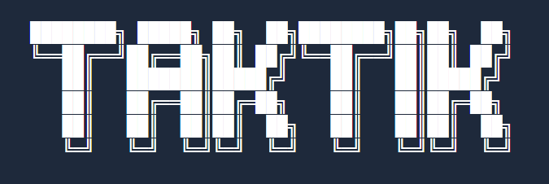

<div align="center">
  
  
  <h1>🚀 Instagram Bot & TikTok Automation Tool</h1>
  
  <p><strong>Free & Open Source Social Media Growth Bot</strong></p>
  
  [](https://github.com/masterFuf/taktik-bot/stargazers)
  [](https://github.com/masterFuf/taktik-bot/network/members)
  [](https://www.gnu.org/licenses/gpl-3.0)
  [](https://www.python.org/downloads/)
  [](https://discord.gg/bb7MuMmpKS)
  
  <br/>
  
  <a href="https://taktik-bot.com/">🌐 Website</a> •
  <a href="https://taktik-bot.com/en/docs">📚 Documentation</a> •
  <a href="https://discord.gg/bb7MuMmpKS">💬 Discord</a> •
  <a href="./README.fr.md">🇫🇷 Français</a>
</div>

---

<div align="center">
  
  ### 🎉 **NEW: TAKTIK Desktop App is Now Available!**
  
  
  
  <br/><br/>
  
  **🎁 Limited Beta Offer - Free Starter Plan Until January 15th, 2025!**
  
  Get lifetime access to the Starter plan with all features including AI capabilities.
  
  <a href="https://taktik-bot.com/fr/auth/trial">🚀 **Claim Your Free Starter License** →</a>
  
  <br/><br/>
  
</div>

---

## 🎯 What is TAKTIK Bot?

**TAKTIK** is a powerful **Instagram automation bot** and **TikTok bot** designed for organic social media growth. Automate your Instagram likes, follows, comments, and story views with human-like behavior to grow your audience safely.

> 🆓 **100% Free & Open Source** - No hidden fees, no subscriptions required for core features

### 🔥 Perfect for:
- **Instagram Growth** - Automate engagement to grow followers organically
- **TikTok Marketing** - Boost your TikTok presence (coming soon)
- **Social Media Managers** - Manage multiple accounts efficiently
- **Influencers** - Scale your engagement without manual work
- **Small Businesses** - Grow your brand on Instagram & TikTok

---

## ✨ Key Features

| Feature | Description |
|---------|-------------|
| 🤖 **Instagram Auto Like** | Automatically like posts from targeted users, hashtags, or locations |
| 👥 **Instagram Auto Follow** | Smart follow/unfollow with customizable filters and limits |
| 💬 **Instagram Auto Comment** | Post personalized comments with spin syntax support |
| 👁️ **Instagram Story Viewer** | Automatically view stories to increase visibility |
| 📩 **DM Automation** | Read and send DMs with AI-powered responses (Desktop app) |
| ❄️ **Cold DM** | Send automated DMs to targeted users with personalized messages |
| 🤖 **DM Auto Reply** | Automatically respond to incoming DMs with AI assistance |
| 📱 **Screen Mirroring** | Real-time device screen mirroring in desktop app |
| 🎨 **AI Content Generation** | Generate posts, captions, and images with AI |
| 🎯 **Advanced Targeting** | Filter by followers, posts, account type, engagement rate |
| 🧠 **Human-like Behavior** | Random delays, natural patterns, anti-detection system |
| 📸 **Media Capture** | Intercept and save Instagram stories, reels, and posts |
| 🔓 **SSL Bypass** | Frida-based certificate pinning bypass for traffic analysis |
| 📊 **Analytics Dashboard** | Track growth, engagement rates, and session statistics |
| 🔒 **Safe & Undetectable** | Respects Instagram limits, randomized actions |

---

## 🛠️ Automation Workflows

### 1. 👥 Follower Targeting
Target followers of competitor accounts or influencers in your niche.
```
✅ Scrape followers from any public Instagram account
✅ Filter by follower count, post count, account type
✅ Automatic like, follow, comment, story view
```

### 2. #️⃣ Hashtag Targeting
Engage with posts from specific hashtags relevant to your niche.
```
✅ Target trending or niche-specific hashtags
✅ Engage with recent or top posts
✅ Perfect for content discovery and niche marketing
```

### 3. 🔗 Post URL Targeting
Interact with users who liked a specific viral post.
```
✅ Target highly engaged audiences
✅ Perfect for competitor analysis
✅ Reach users interested in similar content
```

### 4. 📩 DM Management (Desktop App)
Read and respond to Instagram DMs with AI assistance.
```
✅ Read all conversations with full message history
✅ AI-powered response generation (Claude, GPT-4, Gemini)
✅ Bulk send responses with human-like typing
✅ Emoji and special character support
✅ Cold DM campaigns to targeted users
✅ Automatic DM replies with customizable triggers
```

### 5. 📸 Media Capture (Advanced)
Intercept Instagram media using mitmproxy + Frida.
```
✅ Capture stories, reels, and posts CDN URLs
✅ SSL certificate pinning bypass
✅ Real-time media interception
```

---

## 🚀 Quick Start

### Prerequisites
- **Python 3.10+**
- **Android device** or **Android emulator** (LDPlayer, BlueStacks, NoxPlayer)
- **ADB** (Android Debug Bridge)
- **Instagram app** installed on device

### Installation

```bash
# Clone the repository
git clone https://github.com/masterFuf/taktik-bot.git
cd taktik-bot

# Install dependencies
pip install -r requirements.txt

# Launch TAKTIK Bot
python -m taktik
```

### 📱 Supported Emulators
- ✅ LDPlayer (Recommended)
- ✅ BlueStacks
- ✅ NoxPlayer
- ✅ MEmu
- ✅ Real Android devices via USB

---

## 📚 Documentation

Full documentation available at **[taktik-bot.com/en/docs](https://taktik-bot.com/en/docs)**

- 📖 [Getting Started Guide](https://taktik-bot.com/en/docs/getting-started)
- ⚙️ [Configuration Options](https://taktik-bot.com/en/docs/configuration)
- 🔧 [Workflow Setup](https://taktik-bot.com/en/docs/workflows)
- 🎯 [Targeting Strategies](https://taktik-bot.com/en/docs/targeting)
- 🐛 [Troubleshooting](https://taktik-bot.com/en/docs/troubleshooting)

---

## 🆚 Why Choose TAKTIK?

| Feature | TAKTIK | Other Bots |
|---------|--------|------------|
| 💰 Price | **Free & Open Source** | $20-100/month |
| 🔒 Safety | Human-like behavior | Often detected |
| 🎯 Targeting | Advanced filters | Basic only |
| 📊 Analytics | Built-in dashboard | Limited |
| 🛠️ Customization | Fully customizable | Locked features |
| 💬 Support | Active Discord community | Email only |

---

## 🤝 Community & Support

- 💬 **[Discord Server](https://discord.gg/bb7MuMmpKS)** - Get help, share tips, report bugs
- 🐛 **[GitHub Issues](https://github.com/masterFuf/taktik-bot/issues)** - Report bugs or request features
- ⭐ **Star this repo** if you find it useful!

---

## 🔑 Keywords

`instagram bot` `instagram automation` `instagram auto like` `instagram auto follow` `instagram growth` `tiktok bot` `tiktok automation` `social media bot` `instagram scraper` `instagram marketing` `free instagram bot` `open source instagram bot` `instagram engagement` `instagram followers` `grow instagram` `instagram tool` `social media automation` `instagram api` `python instagram bot`

---

## 📄 License

This project is licensed under **GNU General Public License v3.0** - See [LICENSE](LICENSE) for details.

**Free to use, modify, and distribute** - Contributions welcome!

---

## ⚠️ Disclaimer

**For educational and research purposes only.** 

This software is provided as-is. Users must comply with Instagram's and TikTok's Terms of Service. The developers are not responsible for any account restrictions or bans. Use responsibly and at your own risk.

---

<div align="center">
  
  **⭐ Star this repo to support the project! ⭐**
  
  <br/>
  
  Made with ❤️ by <a href="https://github.com/masterFuf">masterFuf</a>
  
  <br/>
  
  <a href="https://taktik-bot.com">🌐 taktik-bot.com</a>
  
</div>
