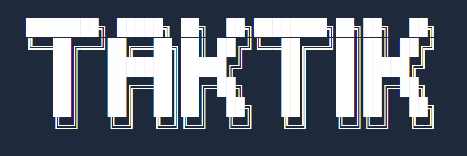

<div align="center">
  
  
  <h1>Instagram & TikTok Automation Platform</h1>
  
  <p><strong>Instagram & TikTok automation via real Android devices. Likes, follows, DMs, scraping, hashtag & location targeting. Built with Python, uiautomator2 & ADB.</strong></p>
  
  [](https://github.com/masterFuf/taktik-bot/stargazers)
  [](https://github.com/masterFuf/taktik-bot/network/members)
  [](https://www.gnu.org/licenses/gpl-3.0)
  [](https://www.python.org/downloads/)
  [](https://discord.com/invite/6tTBRTMhBj)
  
  <br/>
  
  <a href="https://taktik-bot.com/">🌐 Website</a> •
  <a href="https://taktik-bot.com/en/docs">📚 Documentation</a> •
  <a href="https://www.youtube.com/@taktik-bot">🎥 YouTube</a> •
  <a href="https://discord.com/invite/6tTBRTMhBj">💬 Discord</a> •
  <a href="./README.fr.md">🇫🇷 Français</a>
</div>

---

<div align="center">
  
  [](https://www.youtube.com/watch?v=mFh0iv3Hzck)

  **🎁 14-Day Free Trial — All Features Included**

  <a href="https://taktik-bot.com/en/auth/signin">✨ **Start Your Free Trial** →</a>
  
  <br/><br/>
  
</div>

---

## 🎯 What is TAKTIK?

**TAKTIK** is a comprehensive **social media automation platform** for Instagram and TikTok. It combines a powerful Python automation engine with a premium Desktop application featuring AI-powered tools, real-time analytics, and an intuitive interface.

> 🐍 **Open Source Core** — The Python automation engine is open source under GPLv3
>
> 🖥️ **Premium Desktop App** — Full-featured application with GUI, AI tools, and multi-account management
>
> 🤖 **AI-Powered** — Generate content, captions, DM responses, and more with integrated AI

### Perfect for:
- **Content Creators** — Automate engagement and grow your audience organically
- **Social Media Managers** — Manage multiple accounts efficiently from one dashboard
- **Agencies** — Scale operations with up to 50 devices and advanced workflows
- **Small Businesses** — Build your brand presence without manual work
- **Marketers** — Target specific audiences with precision scraping and outreach

---

## ✨ Features Overview

### 📸 Instagram

#### Content Publishing
| Feature | Description |
|---------|-------------|
| 📷 **Posts & Carousels** | Publish single images or multi-image carousels (manual or AI mode) |
| 🎬 **Reels** | Upload and publish Reels (manual or AI mode) |
| 📖 **Stories** | Post Stories to your account (manual or AI mode) |
| 🎨 **AI Image Generation** | Create images with AI: text-to-image or image-to-image (via fal.ai) |
| ✍️ **AI Caption & Hashtags** | Auto-generate descriptions and relevant hashtags for your content |

#### Direct Messages
| Feature | Description |
|---------|-------------|
| � **DM Responses** | Read and reply to incoming DMs (manual or AI mode) |
| ❄️ **Cold DM / Outreach** | Send prospecting messages to targeted users (manual or AI mode) |

#### Automation Workflows
| Feature | Description |
|---------|-------------|
| 🎯 **Target Followers/Following** | Interact with followers or following of specific accounts |
| #️⃣ **Hashtag Workflow** | Engage with posts from targeted hashtags |
| 🔗 **Post URL Workflow** | Interact with users who liked a specific post |
| 🏠 **Feed Workflow** | Interact with posts in your home feed |
| 👥 **Unfollow Workflow** | Maintenance workflow with customizable parameters |

#### Scraping Workflows
| Feature | Description |
|---------|-------------|
| 👥 **Target Scraping** | Scrape followers or following from any account |
| #️⃣ **Hashtag Scraping** | Extract users from hashtag posts |
| 🔗 **Post URL Scraping** | Scrape likers from specific posts |
| � **Export** | Export to CSV or XLSX (Desktop app) |

#### Discovery & Qualification (Desktop App)
| Feature | Description |
|---------|-------------|
| 🔍 **Discovery Workflow** | Mix multiple scraping sources to find relevant profiles in your niche |
| 🧠 **AI Qualification** | Score and qualify discovered profiles with AI to identify best prospects |
| � **Target Search** | Search all discovered profiles with filters (username, bio, follower count, etc.) |

---

### 🎵 TikTok (Beta)

#### Content Publishing
| Feature | Description |
|---------|-------------|
| 📷 **Posts** | Publish posts to TikTok |

#### Automation Workflows
| Feature | Description |
|---------|-------------|
| � **For You Workflow** | Interact with videos on the For You page |
| 🎯 **Target Followers** | Interact with followers of specific accounts |
| #️⃣ **Hashtag Workflow** | Engage with content from targeted hashtags |
| � **Unfollow Workflow** | Maintenance workflow for unfollowing |

#### Direct Messages
| Feature | Description |
|---------|-------------|
| � **DM Responses** | Read and reply to DMs (manual or AI mode) |
| ❄️ **Cold DM / Outreach** | Send prospecting messages (manual or AI mode) |

#### Scraping Workflows
| Feature | Description |
|---------|-------------|
| � **Target Scraping** | Scrape followers from target accounts |
| #️⃣ **Hashtag Scraping** | Extract users from hashtag content |
| � **Export** | Export to CSV or XLSX with scraping history (Desktop app) |

> ⚠️ TikTok features are currently in **beta** and under active development.

---

### 🖥️ Desktop App Exclusive Features

| Feature | Description |
|---------|-------------|
| 📱 **Screen Mirroring** | Real-time device display in the app |
| �️ **Scheduler** | Create automation patterns linked to devices with visual workflow builder |
| 🎛️ **Scheduler Control Center** | Manage all active schedulers from one place |
| 🤖 **AI Scheduler Generation** | Generate scheduler configurations from natural language prompts |
| 📊 **Analytics Dashboard** | Detailed interaction stats by day/week/month/year for Instagram & TikTok |
| 📈 **Session Analytics** | View session history with interaction counts and details |
| 📜 **Scraping History** | Access all scraping sessions with CSV/XLSX export |
| 🔍 **Discovery & AI Qualification** | Find and score leads with AI analysis |
| 🔎 **Target Search** | Query discovered profiles with advanced filters |
| 🌍 **Multi-language** | Interface available in 10+ languages |

---

## 🚀 Quick Start

### Option 1: Desktop Application (Recommended)

The easiest way to use TAKTIK is through the Desktop application:

1. **Sign up** at [taktik-bot.com](https://taktik-bot.com/en/auth/signin)
2. **Download** the Desktop app for Windows
3. **Connect** your Android device or emulator via ADB
4. **Start automating** with the visual interface

### Option 2: Python CLI (Advanced)

For developers who prefer command-line usage:

```bash
# Clone the repository
git clone https://github.com/masterFuf/taktik-bot.git
cd taktik-bot

# Install dependencies
pip install -r requirements.txt

# Launch TAKTIK Bot
python -m taktik
```

> ⚠️ The CLI is primarily maintained for the Desktop app integration. Some features may require updates for standalone use.

### Requirements

- **Android 10+** device or emulator
- **ADB** (Android Debug Bridge) installed
- **Instagram/TikTok app** installed on the device (see recommended versions below)
- **Python 3.10+** (for CLI usage)

### ⚠️ Recommended App Versions

For optimal compatibility and functionality, use these specific app versions:

| App | Recommended Version | Language |
|-----|---------------------|----------|
| **Instagram** | `410.0.0.53.71` | English (required) |
| **TikTok** | `43.1.4` | English (required) |

> 💡 **Important:** Both Instagram and TikTok must be set to **English** for all features to work correctly. These versions have been fully tested and verified.

### Compatible Devices

TAKTIK works with any Android device or emulator running Android 10 or higher:

- ✅ **Real Android devices** (recommended for best results)
- ✅ **LDPlayer**
- ✅ **BlueStacks**
- ✅ **NoxPlayer**
- ✅ **MEmu**
- ✅ Any other Android emulator

> 💡 **Pro tip:** Real devices provide the most authentic behavior and lowest detection risk.

---

## 💰 Pricing

TAKTIK uses a simple, flexible pricing model with **degressive rates** — the more devices you add, the less you pay per device:

| Devices | Price/month | Per device |
|---------|-------------|------------|
| 1 | **$29** | $29 |
| 10 | **$119** | $11.90 |
| 20 | **$199** | $9.95 |
| 30 | **$269** | $8.97 |
| 40 | **$329** | $8.23 |
| 50 | **$379** | $7.58 |
| 50+ | [Contact us](https://taktik-bot.com/en/contact) | Custom |

<details>
<summary><strong>📊 Degressive pricing breakdown</strong></summary>

| Range | Additional cost per device |
|-------|---------------------------|
| 1 device (base) | $29 |
| 2-10 devices | +$10/device |
| 11-20 devices | +$8/device |
| 21-30 devices | +$7/device |
| 31-40 devices | +$6/device |
| 41-50 devices | +$5/device |

</details>

**All plans include:**
- ✅ All Instagram & TikTok automation features
- ✅ AI-powered tools (image generation, captions, DM responses)
- ✅ Analytics dashboard & session history
- ✅ Scheduler with AI generation
- ✅ Multi-account management
- ✅ Discord community support
- ✅ **14-day free trial**

> 💡 Use the [price calculator](https://taktik-bot.com/en/pricing) on our website to see exact pricing for your needs.

---

## 📚 Documentation

Full documentation available at **[taktik-bot.com/en/docs](https://taktik-bot.com/en/docs)**

- 📖 Getting Started Guide
- ⚙️ Configuration Options
- 🔧 Workflow Setup
- 🎯 Targeting Strategies
- 🐛 Troubleshooting

---

## 🤝 Community & Support

Join our active community for help, tips, and feature requests:

- 💬 **[Discord Server](https://discord.com/invite/6tTBRTMhBj)** — Get help and share tips
- 🐛 **[GitHub Issues](https://github.com/masterFuf/taktik-bot/issues)** — Report bugs or request features
- 📧 **[Contact Form](https://taktik-bot.com/en/contact)** — Business inquiries

---

## 🔑 Keywords

`instagram bot` `instagram automation` `tiktok bot` `tiktok automation` `social media automation` `instagram growth` `instagram scraper` `instagram dm bot` `cold dm` `instagram marketing` `ai content generation` `social media manager` `instagram followers` `engagement bot` `python instagram bot` `open source bot`

---

## 📄 License

This project is licensed under **GNU General Public License v3.0** — See [LICENSE](LICENSE) for details.

The Python automation engine is open source. The Desktop application is a commercial product with a free trial.

---

## ⚠️ Disclaimer

**For educational and research purposes only.**

This software is provided as-is. Users must comply with Instagram's and TikTok's Terms of Service. The developers are not responsible for any account restrictions or bans. Use responsibly and at your own risk.

---

<div align="center">
  
  **⭐ Star this repo to support the project! ⭐**
  
  <br/>
  
  Made with ❤️ by <a href="https://github.com/masterFuf">masterFuf</a>
  
  <br/>
  
  <a href="https://taktik-bot.com">🌐 taktik-bot.com</a> • <a href="https://discord.com/invite/6tTBRTMhBj">💬 Discord</a>
  
</div>
