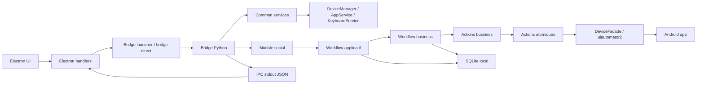
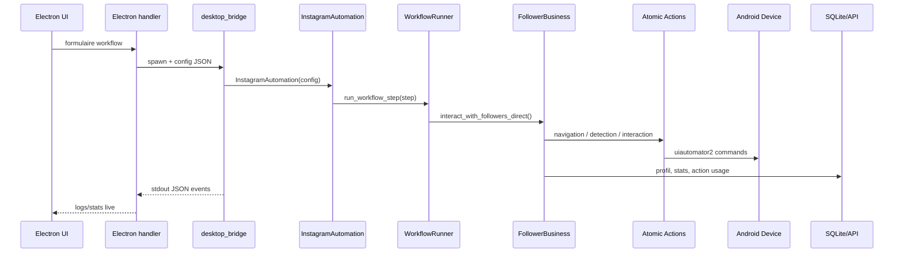
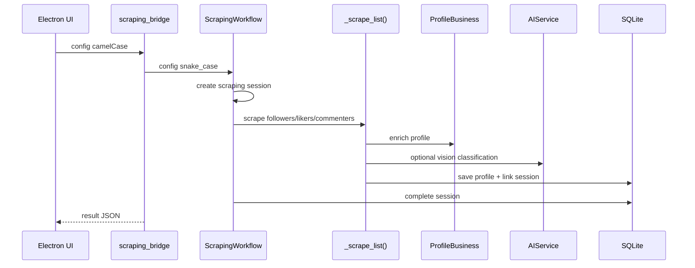
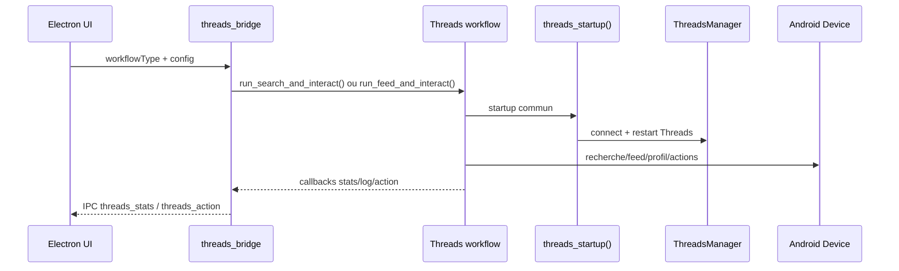
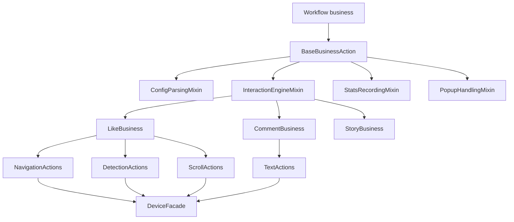
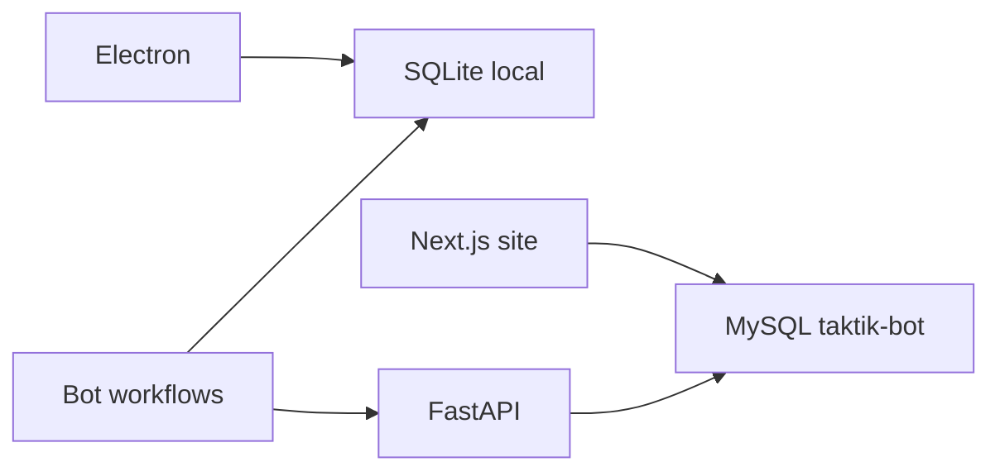

# Carte d'interaction de l'application

Cette page sert de carte mentale pour comprendre comment TAKTIK Bot relie l'interface Electron, les bridges Python, les modules sociaux, les workflows, les actions atomiques, l'IPC et la base locale.

## Vue globale



## Les grandes couches

| Couche | Emplacement | Role |
|---|---|---|
| Frontend desktop | `front/` | Interface, formulaires de config, rendu live des events |
| Handlers Electron | `front/electron/handlers/` | Cree les configs JSON, spawn les bridges, parse stdout |
| Bridges Python | `bot/bridges/` | Entrypoints executables appeles par Electron |
| Common services | `bot/bridges/common/` | Bootstrap, IPC, connexion device, lancement app, clavier, reseau |
| Module social | `bot/taktik/core/social_media/<platform>/` | Code metier par plateforme |
| Workflows applicatifs | `.../<platform>/workflows/` | Orchestration de session ou tache autonome |
| Actions business | `.../<platform>/actions/business/` | Logique metier reutilisable |
| Actions atomiques | `.../<platform>/actions/atomic/` | Clics, navigation, detection, scroll, texte |
| UI selectors | `.../<platform>/ui/` | Resource-ids, XPath, textes localises, extractors |
| Base locale | `bot/taktik/core/database/local/` | Profils, sessions, scraping, stats, smart comments |
| API distante | `taktik-api/` | Auth, licences, devices, mises à jour |

## Chemin d'une session Instagram classique



## Chemin d'un scraping Instagram



## Chemin d'un workflow Threads



## Bridges et modules

| Plateforme | Bridges | Module principal | Documentation |
|---|---|---|---|
| Instagram | `desktop_bridge`, `scraping_bridge`, `smart_comment_bridge`, `dm_bridge`, `account_bridge`, `cold_dm_bridge`, `taktik_agent_bridge`, `persona_analysis_bridge`, `publish_bridge` | `taktik/core/social_media/instagram/` | [Instagram](../modules/instagram/overview.md), [Bridges Instagram](../bridges/instagram.md) |
| TikTok | `tiktok_bridge`, `tiktok_unfollow_bridge`, `dm_outreach_bridge`, `tiktok_scraping_bridge`, `tiktok_account_bridge`, `tiktok_publish_bridge` | `taktik/core/social_media/tiktok/` | [TikTok](../modules/tiktok/overview.md), [Bridges TikTok](../bridges/tiktok.md) |
| Threads | `threads_bridge` | `taktik/core/social_media/threads/` | [Threads](../modules/threads/overview.md), [Bridges Threads](../bridges/threads.md) |
| YouTube | `youtube_account_bridge`, `youtube_upload_bridge`, `youtube_action_test_bridge` | `taktik/core/social_media/youtube/` | [YouTube](../modules/youtube/overview.md), [Bridges YouTube](../bridges/youtube.md) |
| Gmail | `gmail_account_bridge` | `taktik/core/app/email/` + bridges Gmail | [Gmail](../modules/gmail/overview.md), [Bridges Gmail](../bridges/gmail.md) |

## Types de workflows

Le mot "workflow" est utilise a plusieurs niveaux. C'est volontaire, mais il faut distinguer les scopes.

| Type | Exemple | Role |
|---|---|---|
| Workflow applicatif | `ScrapingWorkflow`, `PostScrapingWorkflow`, `ContentWorkflow` | Une tache complete lancee par bridge/CLI |
| Workflow runner | `InstagramAutomation.run_workflow()` + `WorkflowRunner` | Boucle de session et dispatch de steps |
| Workflow business | `FollowerBusiness`, `HashtagBusiness`, `FeedBusiness` | Logique metier reutilisable par plusieurs entrees |
| Workflow de bridge | `threads_bridge` dispatcher | Adaptation config Electron vers dataclass Python |

## Relation actions atomiques / business



Actions atomiques = operations UI unitaires : ouvrir un onglet, cliquer un bouton, extraire un compteur, scroller une liste, taper du texte.

Actions business = composition de plusieurs actions atomiques avec décisions, retries, filtres, stats et limites locales de session.

Workflows = orchestration d'une strategie complete : followers, hashtag, scraping, qualification, DM, publication.

## IPC stdout JSON

Les bridges communiquent avec Electron via stdout JSON.

| Type d'event | Producteur | Usage frontend |
|---|---|---|
| `status` | Tous bridges | Etat global : connecting, running, completed, error |
| `log` | Tous bridges | Console live |
| `stats` / platform stats | Workflows | Cartes de progression |
| `profile_captured` | Scraping | Profil capture en temps reel |
| `ai_profile_analyzing` / `ai_profile_analyzed` | AIService | Panneau agent IA |
| `threads_stats` | Threads bridge | Stats workflow Threads |
| `sync_step` / `sync_complete` | Instagram sync | Avancement followers/following |
| `account_result` | Account bridges | Resultat login/register/logout |

## Bases de donnees et API



| Stockage | Proprietaire | Contenu |
|---|---|---|
| SQLite local | App desktop + bot | Profils scrapes, sessions, interactions, smart comments, settings |
| FastAPI | `taktik-api/` | Auth desktop, licences, devices, updates |
| MySQL `taktik-bot` | Site Next.js | Users, licences, plans, paiements, support, blog |

## Comment lire le code

Pour comprendre un workflow de bout en bout :

1. partir du handler Electron qui spawn le bridge ;
2. lire le bridge Python pour voir le mapping config ;
3. lire le workflow applicatif ou business appele ;
4. suivre les actions business ;
5. descendre dans les actions atomiques ;
6. verifier les selecteurs UI utilises ;
7. regarder les saves SQLite et events IPC.

Exemple Instagram scraping :

```text
front/electron/handlers/... -> scraping_bridge -> bridges/instagram/scraping/scraping.py
  -> workflows/scraping/scraping_workflow.py
  -> workflows/scraping/list_scraping.py
  -> actions/business/management/profile/
  -> ui/selectors/ + ui/extractors.py
  -> database/local/service.py
```

Exemple Threads feed :

```text
front/electron/handlers/... -> threads_bridge -> bridges/threads/workflows/dispatcher.py
  -> workflows/feed_and_interact.py
  -> workflows/_common.py
  -> core/manager.py
  -> ui/__init__.py
```

## Pages a consulter

| Besoin | Page |
|---|---|
| Comprendre le module Instagram | [Vue d'ensemble Instagram](../modules/instagram/overview.md) |
| Comprendre les actions Instagram | [Infrastructure & Actions Atomiques](../modules/instagram/atomic-actions.md) |
| Comprendre les workflows metier Instagram | [Actions Business](../modules/instagram/business-actions.md) |
| Comprendre le scraping Instagram | [Scraping & qualification](../modules/instagram/scraping-workflows.md) |
| Comprendre les bridges | [Architecture des Bridges](../bridges/architecture.md) |
| Comprendre Threads | [Module Threads](../modules/threads/overview.md) |
| Voir les manques docs | [Audit documentation Instagram](../modules/instagram/documentation-audit.md) |
