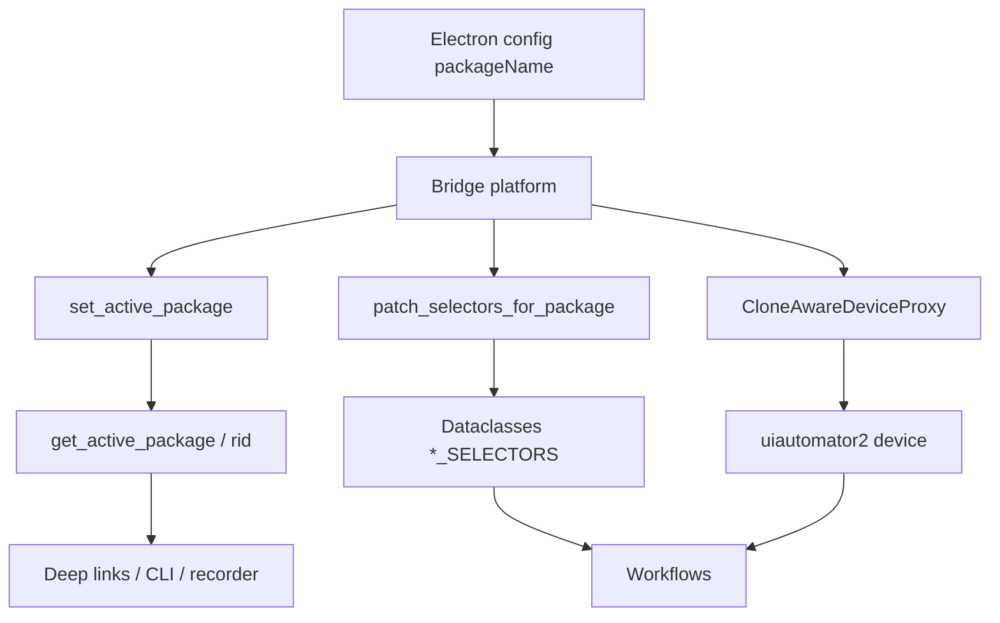
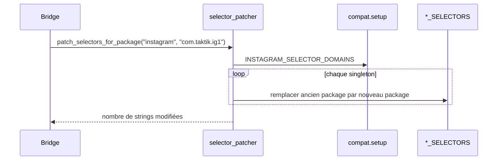
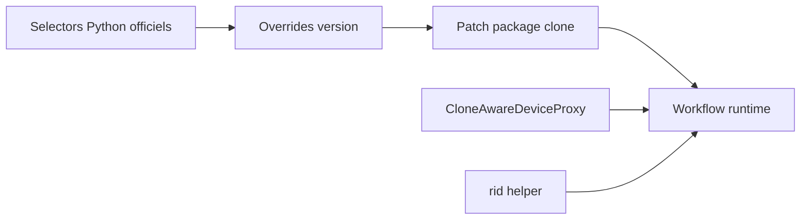

# Support APK clonées

TAKTIK peut piloter l'app officielle Instagram/TikTok ou des APK clonées, par exemple `com.taktik.ig1`, `com.instagram.androie`, `com.instagram.android.c1`. Le problème principal: beaucoup de sélecteurs Android contiennent le package dans leur `resource-id`.

Exemple:

```text
com.instagram.android:id/action_bar_title
```

Sur une APK clonée, ce préfixe peut devenir:

```text
com.taktik.ig1:id/action_bar_title
```

Le système clone-aware évite de dupliquer les workflows pour chaque package.

## Vue d'ensemble



## Emplacement

```text
taktik/core/clone/
├── __init__.py             # API publique + package actif global
├── detector.py             # scan_clones()
├── selector_patcher.py     # patch_selectors_for_package()
└── proxy.py                # CloneAwareDeviceProxy, rewrite_selector()
```

## API publique

| API | Rôle |
|---|---|
| `scan_clones(device_id, platform, detect_versions=False)` | Liste les instances originales et clonées installées. |
| `CloneInfo` | Dataclass `{package, is_original, clone_suffix, label, version}`. |
| `set_active_package(pkg)` | Enregistre globalement le package utilisé par le workflow courant. |
| `get_active_package()` | Lit le package actif, utilisé par deep links/helpers. |
| `patch_selectors_for_package(platform, target_package)` | Remplace les préfixes package dans les dataclasses selectors. |
| `CloneAwareDeviceProxy` | Wrapper uiautomator2 qui réécrit `resourceId` et XPath au runtime. |
| `rid(value, target_package=None)` | Helper ponctuel pour réécrire une string hors bridge. |
| `rewrite_selector(value, target_package)` | Variante explicite de `rid()`. |

## Détection des clones

`detector.py` utilise:

```bash
adb -s <device_id> shell pm list packages
```

Puis il filtre les packages par préfixe.

| Plateforme | Package officiel | Préfixe clones |
|---|---|---|
| Instagram | `com.instagram.android` | `com.instagram.andro` |
| TikTok | `com.zhiliaoapp.musically` | `com.zhiliaoapp.musical` |

Si `detect_versions=True`, `scan_clones()` lance aussi `dumpsys package <pkg>` pour remplir `CloneInfo.version`.

## Trois mécanismes complémentaires

| Mécanisme | Fichier | Couvre |
|---|---|---|
| Patch dataclasses | `selector_patcher.py` | Tous les champs `str` et `list[str]` des singletons selectors. |
| Device proxy | `proxy.py` | `device(resourceId=...)`, `device.xpath(...)`, `UiObject.child/sibling/...`. |
| Helper `rid()` | `__init__.py` + `proxy.py` | Code hors bridge, CLI, recorder, strings ponctuelles. |

## Patch des dataclasses

`patch_selectors_for_package(platform, target_package)` parcourt les domaines déclarés dans `compat.setup`.



Ce patch est un no-op si `target_package` est le package officiel.

## `CloneAwareDeviceProxy`

`CloneAwareDeviceProxy` wrappe le device uiautomator2 pour réécrire au moment de l'appel.

Il intercepte:

| Appel | Réécriture |
|---|---|
| `device(resourceId="com.instagram.android:id/foo")` | `resourceId` remplacé. |
| `device.xpath('//*[@resource-id="com.instagram.android:id/foo"]')` | chaîne XPath remplacée. |
| `obj.child(resourceId=...)` | réécriture transitive via `_UiObjectProxy`. |
| `obj.sibling/left/right/up/down(...)` | même logique. |

Tout le reste est forwardé au device brut: `press`, `swipe`, `dump_hierarchy`, `screenshot`, `info`, etc.

## Instagram bridge

`bridges/instagram/base.py` installe le proxy dans `_after_connect()`.

Il synchronise trois références:

| Référence | Pourquoi |
|---|---|
| `self.device` | Usage direct dans le bridge. |
| `device_manager.device` | Les workflows récupèrent souvent le device via le manager. |
| `self._connection._device` | Cache interne de `ConnectionService`. |

`desktop_bridge` fait aussi l'ordre complet:

1. enregistrer `automation.package_name`;
2. `set_active_package(...)`;
3. détecter la version app;
4. `apply_version_overrides("instagram", detected_version)`;
5. `patch_selectors_for_package("instagram", packageName)`;
6. lancer le workflow.

L'ordre version puis clone est important: les YAML de compat contiennent les packages officiels, puis le patch clone les remplace.

## TikTok bridges

TikTok utilise surtout le patch des dataclasses.

| Bridge | Comportement |
|---|---|
| `tiktok_account_bridge` | Résout le package actif, appelle `set_active_package()` et `patch_selectors_for_package("tiktok", resolved_package)`. |
| `tiktok_publish_bridge` | Si `packageName` est fourni, patch selectors TikTok avant upload. |

## Helper `rid()`

`rid()` est utilisé quand le code ne passe pas par le device proxy ou quand une string doit être résolue avant usage.

```python
from taktik.core.clone import rid

device(resourceId=rid("com.instagram.android:id/header_title"))
device.xpath(rid('//*[@resource-id="com.instagram.android:id/foo"]'))
```

Tant que le package actif est officiel, `rid()` retourne la string inchangée.

## Front Electron

La majorité des handlers passent par les bridges Python et transmettent `packageName` ou `--package`.

| Handler | Mode | État clone-aware |
|---|---|---|
| Instagram bot automation | Bridge Python | `packageName` dans config. |
| Instagram DM | Bridge Python | `--package` optionnel. |
| Instagram smart-comment/cold-DM | Bridge Python | `packageName` transmis. |
| TikTok upload/account | Bridge Python | `packageName` transmis. |
| Instagram upload publish | ADB direct TypeScript | Helper local `rid(deviceId, value)` dans `instagram-upload.ts`. |

Le handler direct `front/electron/handlers/instagram/publish/instagram-upload.ts` maintient:

```ts
const activePackageByDevice = new Map<string, string>()
```

Puis wrappe ses `resourceId` avec:

```ts
rid(deviceId, 'com.instagram.android:id/next_button_textview')
```

## Relation avec compat



Compat répond à la question: "Quel champ selector est correct pour cette version d'app?"

Clone répond à la question: "Quel préfixe package faut-il utiliser sur ce device?"

## Bonnes pratiques

| Situation | Recommandation |
|---|---|
| Nouveau selector dans `ui/selectors` | Préférer `contains(@resource-id, "id_name")` si possible. |
| Selector exact requis | Garder le package officiel; le patch clone le remplacera. |
| Code workflow | Importer depuis les dataclasses, éviter les XPath inline. |
| Code hors bridge | Utiliser `rid()` ou `rewrite_selector()`. |
| YAML compat | Toujours écrire avec le package officiel. |
| Front ADB direct | Utiliser un helper TypeScript équivalent à `rid()`. |

## Debug

| Symptôme | Vérification |
|---|---|
| Le workflow ouvre l'app officielle au lieu du clone | `packageName` transmis depuis Electron, `AppService(package_override=...)`. |
| Les resource-id ne matchent pas sur clone | `patch_selectors_for_package()` appelé après `apply_version_overrides()`. |
| Deep link Instagram ouvre le mauvais package | Utilisation de `get_active_package()` dans le helper de navigation. |
| Un XPath inline casse sur clone | Déplacer dans `ui/selectors` ou wrapper avec `rid()`. |
| TikTok clone non patché | Vérifier `tiktok_account_bridge` ou `tiktok_publish_bridge`. |

## Non-régressions attendues

- Package officiel: aucun changement de comportement, les helpers sont no-op.
- YAML compat: reste indépendant des clones.
- Device proxy: forwarde les appels non liés aux selectors.
- `rid()`: no-op tant que `set_active_package()` n'a pas changé le package actif.
