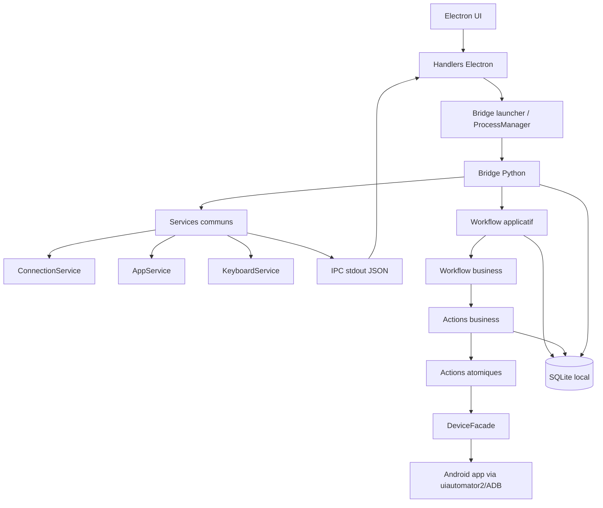
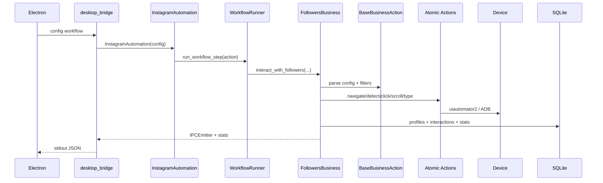
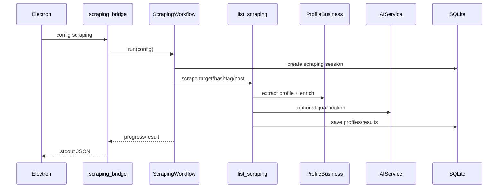

# Architecture en couches

Cette page explique comment lire le bot de haut en bas. L'idée centrale: Electron ne pilote pas directement Instagram ou TikTok. Il lance des bridges Python, qui orchestrent des workflows, qui composent des actions métier, qui appellent des actions atomiques, qui parlent enfin au device Android.

## Vue globale



## Les couches

| Couche | Emplacement | Responsabilité |
|---|---|---|
| 1. Electron handlers | `front/electron/handlers/` | Prépare la config, lance les bridges, parse stdout JSON. |
| 2. Bridges Python | `bot/bridges/` | Entrées exécutables, IPC, connexion device, lifecycle app. |
| 3. Services communs | `bot/bridges/common/` | Bootstrap, IPC, connection, app manager, clavier, DB, réseau. |
| 4. Workflows applicatifs | `bot/taktik/core/social_media/*/workflows/` | Tâches complètes: scraping, publish, signup, DM, post scraping. L'ancien workflow Instagram Discovery dédié est retiré. |
| 5. Workflows business | `.../actions/business/workflows/` | Stratégies d'interaction: followers, hashtag, feed, unfollow. |
| 6. Actions business | `.../actions/business/actions/`, `management/` | Like/comment/story, filtering, profile extraction, content navigation. |
| 7. Actions atomiques | `.../actions/atomic/` | Navigation, detection, click, scroll, text, popup. |
| 8. UI layer | `.../ui/` | Selectors, language optimization, extractors, detectors, watchdog. |
| 9. Device/data | `core/shared/`, `core/device/`, `core/database/` | uiautomator2, ADB, SQLite, repositories. |

## Couche 1 — Electron handlers

Les handlers Electron sont côté `front/`. Ils sont responsables de l'adaptation UI → bridge.

Ils font généralement:

1. récupérer la config du renderer;
2. normaliser les options;
3. créer un fichier config temporaire ou des arguments;
4. lancer un bridge via `ProcessManager` ou le launcher;
5. écouter stdout/stderr;
6. convertir les événements JSON en événements UI.

Les handlers peuvent aussi exécuter de l'ADB direct pour certaines fonctions device, comme le battery spoofing ou certaines parties de publication Instagram.

## Couche 2 — Bridges Python

Les bridges sont des scripts Python spawnés par Electron. Ils partagent le protocole stdout JSON.

| Famille | Exemples |
|---|---|
| Instagram | `desktop_bridge`, `scraping_bridge`, `smart_comment_bridge`, `dm_bridge`, `account_bridge`, `publish_bridge` |
| TikTok | `tiktok_bridge`, `tiktok_scraping_bridge`, `tiktok_publish_bridge`, `tiktok_account_bridge`, `tiktok_unfollow_bridge`, `dm_outreach_bridge` |
| Threads | `threads_bridge` |
| YouTube | `youtube_upload_bridge`, `youtube_account_bridge`, `youtube_action_test_bridge` |
| Gmail | `gmail_account_bridge` |
| Compat | `compat_bridge`, `selector_test_bridge`, `workflow_test_bridge`, `action_test_bridge`, `action_session_bridge`, `tiktok_action_test_bridge` |

Un bridge ne devrait pas contenir toute la logique métier. Il doit surtout connecter le front à un workflow ou à un service.

## Couche 3 — Services communs

```text
bridges/common/
├── bootstrap.py
├── ipc.py
├── bridge_base.py
├── connection.py
├── app_manager.py
├── keyboard.py
├── ai_service.py
├── database.py
├── network.py
├── signal_handler.py
└── utils.py
```

| Service | Rôle |
|---|---|
| `bootstrap.py` | Prépare l'environnement Python, path, UTF-8, logs. |
| `ipc.py` | Émet les événements JSON vers stdout. |
| `bridge_base.py` | Base de bridge réutilisable: config, connect, cleanup. |
| `connection.py` | Connexion uiautomator2/ADB, santé ATX. |
| `app_manager.py` | Start/stop/restart app, package override clone-aware. |
| `keyboard.py` | Saisie via Taktik Keyboard/ADB. |
| `ai_service.py` | OpenRouter/OpenAI-compatible service pour commentaires, qualification, vision. |
| `database.py` | Accès SQLite côté bridges. |
| `network.py` | Checks réseau et IP. |
| `signal_handler.py` | Arrêt propre sur signal. |

## Couche 4 — Workflows applicatifs

Les workflows applicatifs sont des tâches complètes, souvent appelées directement par un bridge.

| Plateforme | Emplacement | Exemples |
|---|---|---|
| Instagram | `instagram/workflows/` | scraping, cold DM legacy, post scraping, management login/signup/logout. La découverte de profils passe par scraping avancé, Target Search et qualification IA, pas par un dossier `workflows/discovery/`. |
| TikTok | `tiktok/workflows/` | signup/logout, login stub `not_implemented`, publish upload. |
| Threads | `threads/workflows/` | feed and interact, search and interact. |
| YouTube | `youtube/workflows/publish/` | upload video/short. |
| Gmail | `email/gmail/` | compte Google, scan comptes, lecture OTP. |

Un workflow applicatif peut utiliser des actions business, des actions atomiques, des repositories ou des services communs selon son scope.

## Couche 5 — Workflows business

Instagram et TikTok ont aussi une couche `actions/business/workflows/`, plus proche de l'automatisation sociale.

### Instagram

```text
instagram/actions/business/workflows/
├── followers/
├── hashtag/
├── post_url/
├── feed/
├── notifications/
├── unfollow/
├── messaging/
└── common/
```

Ces classes héritent de `BaseBusinessAction` et composent les actions like/comment/story/profile/filtering.

### TikTok

```text
tiktok/actions/business/workflows/
├── _internal/
├── for_you/
├── search/
├── followers/
├── scraping/
├── dm/
└── unfollow/
```

TikTok sépare les bases communes dans `_internal`: lifecycle, pauses, stats, popup handler, décision like/follow/favorite.

## Couche 6 — Actions business

Les actions business composent plusieurs opérations UI avec des règles métier.

| Module | Responsabilité |
|---|---|
| `LikeBusiness` | Like de posts/reels/carousels, navigation dans contenu. |
| `CommentBusiness` | Choix du texte, saisie, publication, fermeture popup. |
| `StoryBusiness` | Watch/like stories. |
| `ProfileBusiness` | Extraction profil, image, IPC, persistance. |
| `FilteringBusiness` | Filtrage private/verified/business/stats/bio/history. |
| `ContentBusiness` | Navigation contenu, posts, hashtag, feed. |
| `ConfigBusiness` | Defaults et parsing de config. |

Cette couche sait ce qu'est une interaction utile. Les actions atomiques, elles, savent seulement cliquer, détecter, scroller ou taper.

## Couche 7 — Actions atomiques

Actions unitaires sur l'interface Android.

| Domaine | Instagram | TikTok |
|---|---|---|
| Navigation | tabs, deep links, search | home/inbox/profile/search |
| Detection | écran, profil, listes, post, rate limit | For You, inbox, vidéo, follow/like state |
| Interaction/click | like, follow, comment, story | like/follow/favorite/comment/share |
| Scroll | listes, feed, contexte | vidéo suivante, profil, listes |
| Text/DM | keyboard, comments, input | DMs, search input |
| Popup | popups business/base | popup actions + detector |

Les actions atomiques lisent les selectors centralisés dans `ui/selectors`.

## Couche 8 — UI layer

La couche UI contient les éléments qui décrivent l'app Android sans décider de la stratégie métier.

| Élément | Rôle |
|---|---|
| `selectors/` | Dataclasses de XPath/resource-id/textes par domaine. |
| `language.py` | Détection langue et pruning des selectors EN/FR quand disponible. |
| `extractors.py` | Extraction de données depuis XML/UI dumps. |
| `detectors/` | Détecteurs spécialisés: page problématique, fin de scroll. |
| `watchdog.py` | Surveillance workflow/recovery Instagram. |

Compatibilité version et clones s'appliquent surtout à cette couche:

- `compat` patche les selectors selon la version app;
- `clone` patche ou réécrit les packages dans les resource-id;
- les workflows continuent de lire les mêmes singletons.

## Couche 9 — Device et data

### Device

| Module | Rôle |
|---|---|
| `core/device/device.py` | DeviceManager historique. |
| `core/shared/device/manager.py` | Gestion device partagée. |
| `core/shared/device/facade.py` | Facade générique. |
| `instagram/actions/core/device/facade.py` | Facade Instagram. |
| `tiktok/actions/core/device_facade.py` | Facade TikTok. |
| `core/shared/device/wait.py` | `wait_for_any`, `try_tap`. |
| `core/shared/device/permissions.py` | PermissionHandler Android. |
| `core/shared/input/taktik_keyboard.py` | Saisie via clavier ADB. |

### Data

| Module | Rôle |
|---|---|
| `database/local/schema.py` | Schéma SQLite Python. |
| `database/local/migrations.py` | Migrations locales. |
| `database/local/service.py` | Service SQLite. |
| `database/repositories/` | Repositories Instagram/TikTok/Gmail. |

## Flux Instagram business



## Flux scraping haut niveau



## Règles de lecture du code

Quand tu veux comprendre un comportement:

1. pars du handler Electron ou du bridge;
2. identifie le workflow appelé;
3. regarde si c'est un workflow applicatif ou business;
4. descends dans les actions business;
5. descends dans les actions atomiques;
6. vérifie les selectors;
7. vérifie les événements IPC et les écritures SQLite.

Exemple:

```text
front/electron/handlers/.../bot.ts
  -> bot/bridges/instagram/automation/desktop.py (`desktop_bridge`)
  -> instagram/workflows/core/automation.py
  -> instagram/workflows/core/workflow_runner.py
  -> instagram/actions/business/workflows/followers/
  -> instagram/actions/business/actions/
  -> instagram/actions/atomic/
  -> instagram/ui/selectors/
```

## Pages liées

| Sujet | Page |
|---|---|
| Carte globale | [Carte d'interaction](application-map.md) |
| Bridges | [Architecture des Bridges](../bridges/architecture.md) |
| IPC | [Protocole IPC](../bridges/ipc-protocol.md) |
| Instagram actions | [Infrastructure & Actions Atomiques](../modules/instagram/atomic-actions.md) |
| Instagram business | [Actions Business](../modules/instagram/business-actions.md) |
| TikTok module | [Vue d'ensemble TikTok](../modules/tiktok/overview.md) |
| Compatibilité selectors | [Versioned Selectors](../compat/versioned-selectors.md) |
| APK clonées | [Support APK clonées](clone-package-support.md) |
