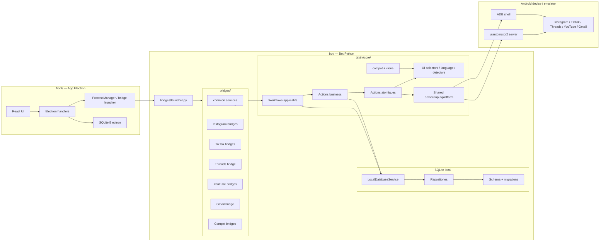
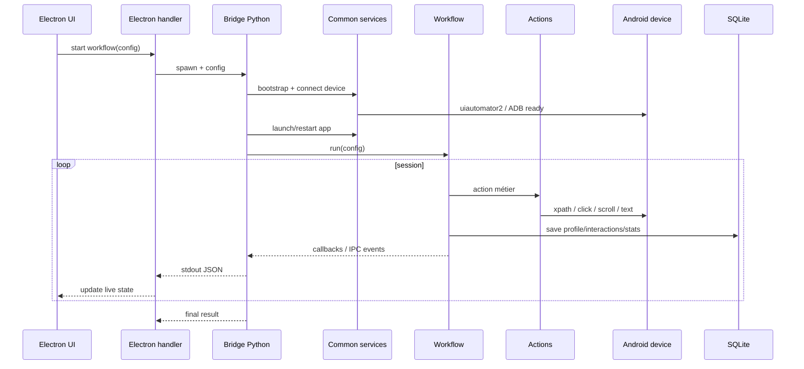

# Architecture — Vue d'ensemble

TAKTIK Bot est le moteur Python de l'application desktop. Il reçoit des ordres d'Electron, pilote des apps Android avec uiautomator2/ADB, écrit les données d'automatisation dans SQLite local, et renvoie l'état de session au front via stdout JSON.

Cette page donne la carte générale. Pour la lecture détaillée des couches, voir [Architecture en couches](layers.md).

## Diagramme global

## Les grands rôles

| Zone | Rôle |
|---|---|
| Electron UI | Formulaires, live panels, stats, debug, device management. |
| Electron handlers | Adaptation UI vers bridge, spawn process, parsing stdout. |
| Bridges Python | Entrées exécutables par workflow ou famille de workflows. |
| Common services | Connexion device, lancement app, IPC, clavier, AI, DB. |
| Modules sociaux | Logique Instagram, TikTok, Threads, YouTube, Gmail. |
| Compat/Clone | Sélecteurs versionnés, APK clonées, tests de compatibilité. |
| SQLite local | Profils, interactions, sessions, scraping, DMs, settings. Les anciennes tables de campagne Discovery ne font plus partie du schéma neuf. |
| Android | Apps réelles pilotées par uiautomator2 et ADB. |

## Flux d'une session

## Plateformes couvertes

| Plateforme | Module domaine | Bridges | Docs |
|---|---|---|---|
| Instagram | `taktik/core/social_media/instagram/` | automation, scraping, smart comment, DM, account, agent, post scraping | [Instagram](../modules/instagram/overview.md) |
| TikTok | `taktik/core/social_media/tiktok/` | for you, search, followers, scraping, DMs, publish, account, unfollow | [TikTok](../modules/tiktok/overview.md) |
| Threads | `taktik/core/social_media/threads/` | `threads_bridge` | [Threads](../modules/threads/overview.md) |
| YouTube | `taktik/core/social_media/youtube/` | upload, account, action test | [YouTube](../modules/youtube/overview.md) |
| Gmail | `taktik/core/app/email/gmail/` | account/OTP bridge | [Gmail](../modules/gmail/overview.md) |

## Concepts clés

| Concept | Description |
|---|---|
| Bridge | Process Python isolé appelé par Electron. |
| Workflow applicatif | Tâche complète: scraping, upload, signup, OTP, post scraping. |
| Workflow business | Stratégie d'interaction sociale: followers, hashtag, feed, unfollow. |
| Action business | Logique métier composée: like posts, comment, extract profile, filter. |
| Action atomique | Opération UI unitaire: click, scroll, detect, type, navigate. |
| Selector singleton | Dataclass importée partout, patchable en mémoire. |
| IPC event | Ligne JSON envoyée par stdout au front. |
| Repository | Accès SQLite isolé par domaine. |

## Règles architecturales

- Les bridges adaptent et orchestrent, mais ne doivent pas devenir des classes métier géantes.
- Les workflows contiennent la stratégie, pas les XPath inline.
- Les sélecteurs vivent dans `ui/selectors/` et sont patchables par compat/clone.
- Les écritures SQLite passent par services/repositories quand ils existent.
- Les workflows de domaine ne doivent pas dépendre directement du transport IPC quand une injection de callbacks suffit.
- Le code partagé doit aller dans `bridges/common/` ou `taktik/core/shared/`, pas être copié entre plateformes.

## Pages liées

| Besoin | Page |
|---|---|
| Couches détaillées | [Architecture en couches](layers.md) |
| Carte mentale end-to-end | [Carte d'interaction](application-map.md) |
| IPC bridge | [Communication IPC](bridges-ipc.md) |
| Séquences | [Diagrammes de séquence](sequence-diagrams.md) |
| Patterns | [Design Patterns](design-patterns.md) |
| Refactor partagé | [Refactor 2025](refactor-2025.md) |
| SQLite | [Vue d'ensemble SQLite](../database/overview.md) |
