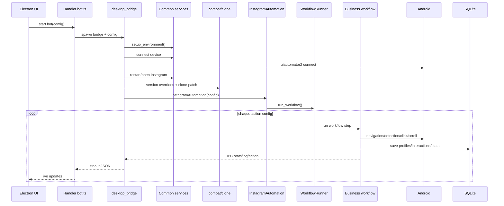
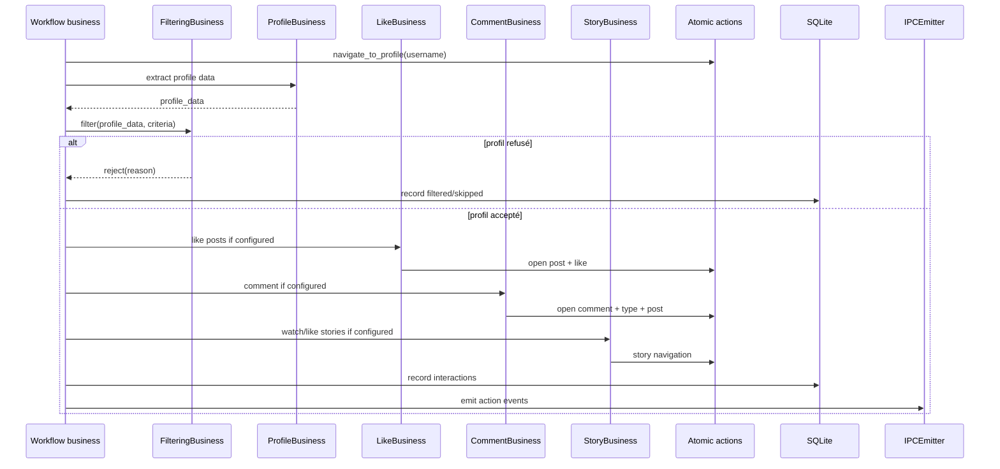
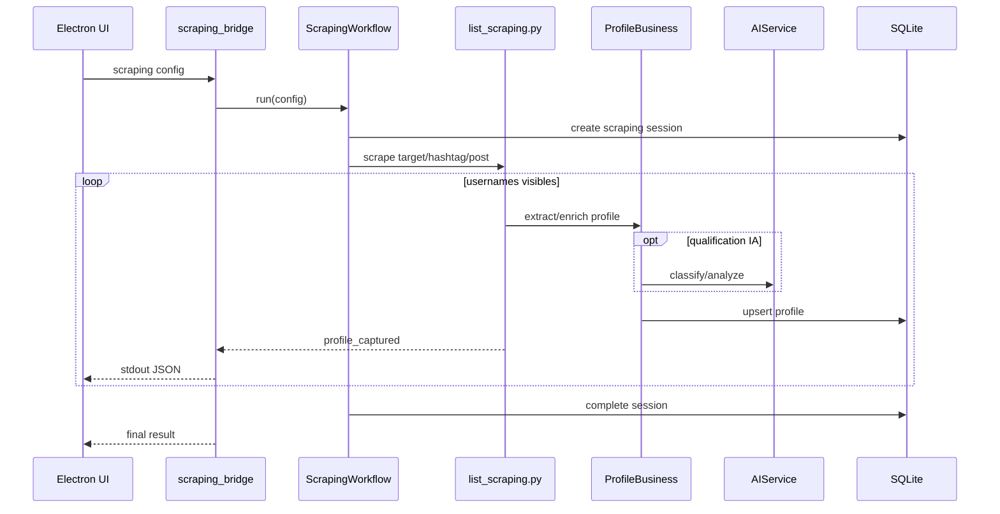
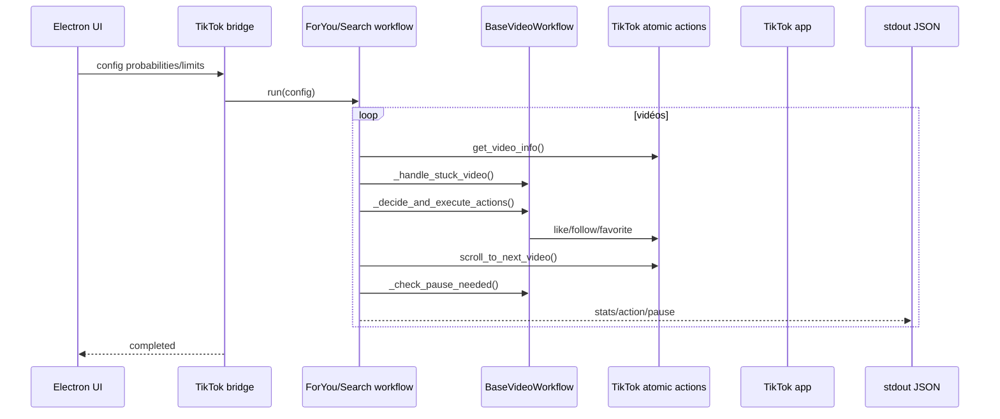
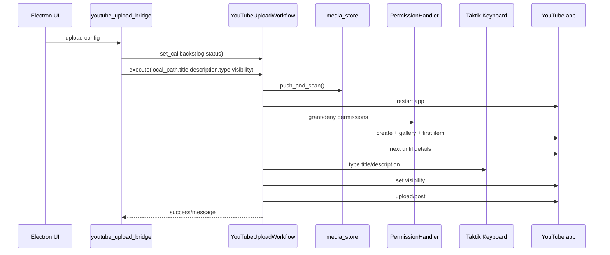
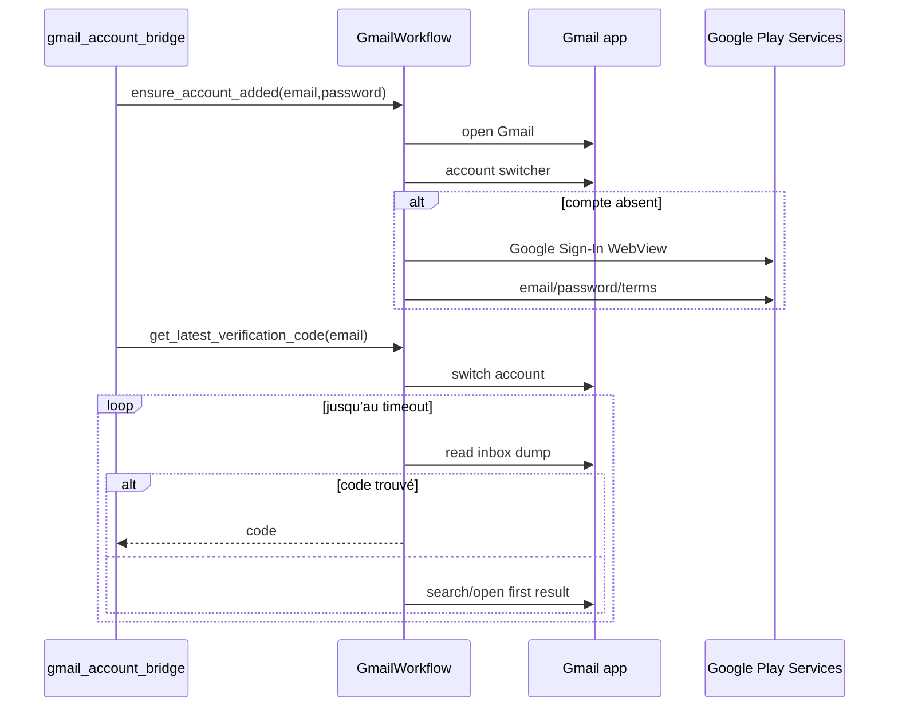
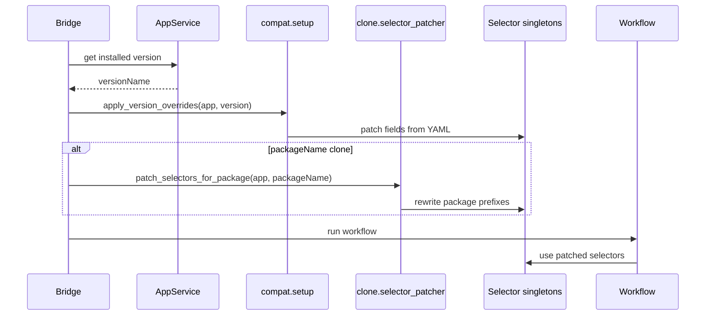
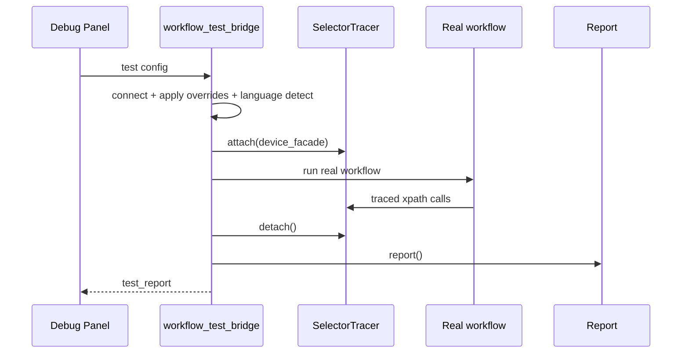

# Diagrammes de séquence

Cette page regroupe les séquences qui expliquent les grands flux du bot. Les diagrammes sont volontairement orientés architecture: ils montrent qui appelle qui, et où passent la config, les événements, le device et la base.

## Session Instagram classique

## Interaction avec un profil

## Scraping Instagram

## TikTok For You / Search

## YouTube upload

## Gmail OTP

## Versioned selectors + clones

## Workflow compat test

