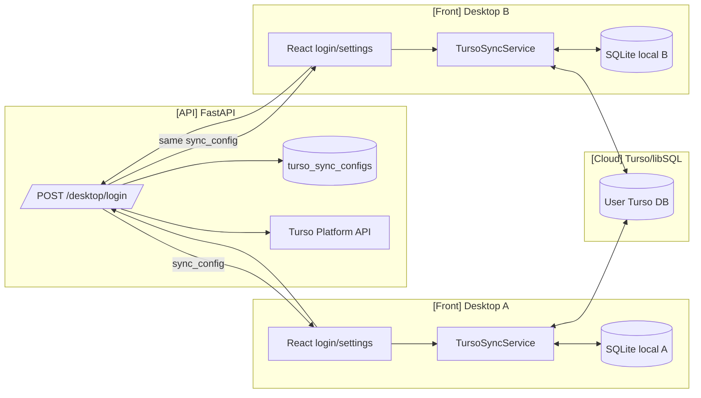
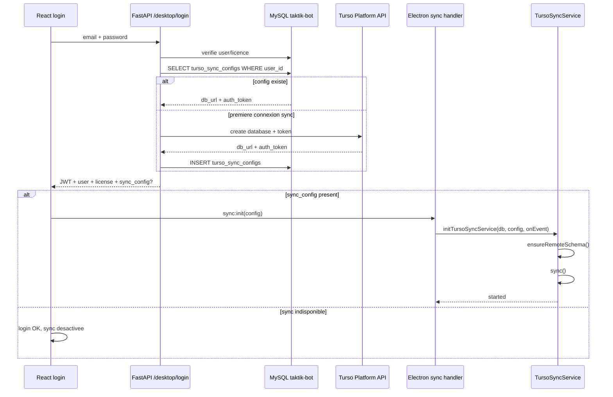
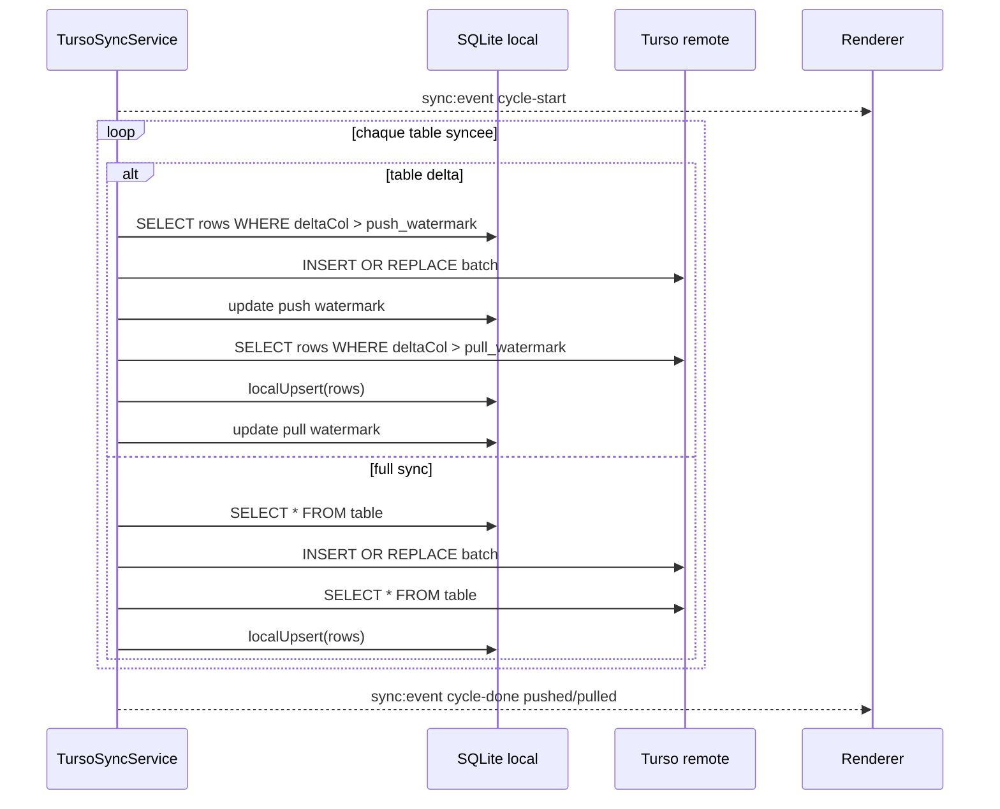

# Sync Cross-Device

> **Perimetre : `[Transversal]`**
> Cette page documente la synchronisation cross-device entre plusieurs installations desktop TAKTIK. Elle traverse l'API distante, Electron main, le renderer React, SQLite local et Turso/libSQL.

La sync cross-device permet a plusieurs PCs connectes au meme compte de partager une partie des donnees locales sans revenir au vieux stockage centralise des workflows. SQLite reste la base locale principale ; Turso sert de hub cloud.

> Important : les quotas cites ici sont des limites techniques de sync/libSQL, pas des quotas d'actions utilisateur.

## Vue d'ensemble

## Fichiers principaux

| Fichier | Perimetre | Role |
|---|---|---|
| `taktik-api/app/routers/desktop.py` | `[API]` | Retourne `sync_config` au login desktop. |
| `taktik-api/app/utils/turso.py` | `[API]` | Cree/recupere une base Turso par utilisateur et genere un token DB. |
| `front/src/lib/api/index.ts` | `[Front]` | Lance `window.electronAPI.sync.init(sync_config)` apres login. |
| `front/electron/handlers/common/sync/index.ts` | `[Front]` | Handlers IPC `sync:init`, `sync:status`, `sync:now`, `sync:stop`, `sync:diagnostics`. |
| `front/electron/preload/app/sync.ts` | `[Front]` | API renderer `window.electronAPI.sync.*`. |
| `front/electron/sync/runtime/TursoSyncService.ts` | `[Front]` | Orchestre le cycle push/pull SQLite local <-> Turso via Hrana HTTP v2 et delegue schema, mapping, diagnostics et execution par table aux modules `sync/{schema,mapping,diagnostics,remote,runtime}`. |
| `front/electron/database/migrations.ts` | `[Front]` | Ajoute `sync_id`, `_sync_state` et migrations liees. |
| `front/src/app/hooks/useTursoSyncNotifier.ts` | `[Front]` | Ecoute `sync:event`, maintient l'etat UI et affiche les toasts. |
| `front/src/features/app/settings/page/sections/TursoSyncDiagnosticsCard.tsx` | `[Front]` | Diagnostic table par table + bouton full sync. |
| `front/electron/services/shared/media/profile-images/profile-image-service.ts` | `[Front]` | Rehydrate images/screenshot depuis SQLite vers disque apres pull. |

## Provisioning au login

Si la provision Turso echoue cote API, le login reste possible : `sync_config` peut etre `null`.

## Surface IPC

`front/electron/preload/app/sync.ts` expose :

| Methode renderer | Canal IPC | Retour |
|---|---|---|
| `window.electronAPI.sync.init(config)` | `sync:init` | `{ success, error? }` |
| `window.electronAPI.sync.status()` | `sync:status` | `{ isRunning, lastSyncAt, lastError, syncCount }` |
| `window.electronAPI.sync.now()` | `sync:now` | `{ success, status?, error? }` |
| `window.electronAPI.sync.stop()` | `sync:stop` | `{ success }` |
| `window.electronAPI.sync.diagnostics()` | `sync:diagnostics` | `{ success, diagnostics?, error? }` |
| `window.electronAPI.sync.onEvent(cb)` | `sync:event` | cleanup listener |

Evenements temps reel :

| Event | Payload | Usage UI |
|---|---|---|
| `cycle-start` | `{ type: 'cycle-start' }` | Afficher sync en cours. |
| `cycle-done` | `{ type, pushed, pulled }` | Mettre a jour compteurs, toaster si donnees deplacees. |
| `error` | `{ type, message }` | Afficher erreur et sortir de l'etat loading. |

## Cycle de synchronisation

`TursoSyncService.start()` :

1. cree le schema distant si necessaire ;
2. lance un premier cycle ;
3. demarre un intervalle periodique de 5 minutes.

Si le desktop detecte un premier bootstrap, le full bootstrap peut maintenant faire beaucoup plus de passes par table (`FULL_SYNC_MAX_PASSES_PER_TABLE`) afin d'eviter qu'une grosse table reste bloquee a un plafond trop bas.

## Strategie d'identifiants

Les IDs SQLite auto-incrementes sont locaux. Deux desktops peuvent creer `id = 1` pour des lignes differentes. La sync n'utilise donc jamais ces IDs comme cle globale.

| Strategie | Tables | Cle globale | Resolution |
|---|---|---|---|
| Cle naturelle | profils, comptes, posts, images | `username`, `instagram_post_id`, `filename` | upsert |
| `sync_id` | interactions, DMs, filtrage, schedules, sessions | `sync_id` aleatoire 128-bit | append-only ou upsert selon table |
| Cle composite | stats journalieres | `(account_id, date)` | upsert |

## Tables synchronisees

| Table | Delta | Cle locale ignoree | Cle de conflit | Mode |
|---|---|---|---|---|
| `instagram_profiles` | `updated_at` | `profile_id` | `username` | upsert |
| `tiktok_profiles` | `updated_at` | `profile_id` | `username` | upsert |
| `instagram_accounts` | full sync | `account_id` | `username` | upsert |
| `tiktok_accounts` | full sync | `account_id` | `username` | upsert |
| `instagram_posts` | `updated_at` | `post_id` | `instagram_post_id` | upsert |
| `interaction_history` | `interaction_time` | `id` | `sync_id` | append-only |
| `tiktok_interaction_history` | `interaction_time` | `id` | `sync_id` | append-only |
| `sent_dms` | `sent_at` | `id` | `sync_id` | append-only |
| `filtered_profiles` | `filtered_at` | `id` | `sync_id` | append-only |
| `daily_stats` | `date` | `id` | `(account_id, date)` | upsert |
| `tiktok_daily_stats` | `date` | `id` | `(account_id, date)` | upsert |
| `workflow_schedules` | `updated_at` | `schedule_id` | `sync_id` | upsert |
| `sessions` | `updated_at` | `session_id` | `sync_id` | upsert |
| `tiktok_sessions` | `updated_at` | `session_id` | `sync_id` | upsert |
| `scraping_sessions` | full sync style merge | `scraping_id` | `sync_id` | upsert |
| `profile_images` | `updated_at` | `id` | `username` | upsert |
| `ai_screenshots` | `updated_at` | `id` | `filename` | upsert |

## Tables qui restent surtout locales

Tout n'a pas vocation a etre fusionne entre machines. Restent encore principalement locales ou traitees avec prudence :

| Famille | Exemples |
|---|---|
| Etat runtime machine | groupes UI temporaires, etats React locaux |
| Tables volumineuses ou derivables | certains caches et artefacts non critiques |
| Donnees de device strictement locales | etats qui ne doivent pas sortir du poste courant |

La liste exacte evolue avec les besoins de sync ; le diagnostic table par table est la meilleure source operationnelle.

## Watermarks

L'avancement est stocke dans `_sync_state`.

| Colonne | Usage |
|---|---|
| `table_name` | Table syncee. |
| `key` | Type de watermark : `push_updated_at`, `pull_updated_at`, etc. |
| `watermark` | Derniere valeur traitee. |
| `updated_at` | Date de mise a jour du watermark. |

Pour les colonnes delta nullable, le service pousse une premiere fois les lignes `NULL`, puis marque un watermark `push_<delta>_nulls` pour ne pas les renvoyer a chaque cycle.

## Pull local et rehydratation des media

Apres un `cycle-done` avec `pulled > 0`, le handler Electron peut relancer :

| Fonction | Effet |
|---|---|
| `hydrateProfileImages(db)` | Recree les fichiers d'images profil depuis `profile_images`. |
| `hydrateAiScreenshots(db)` | Recree les screenshots IA depuis `ai_screenshots`. |

Cela couvre le cas d'un nouveau PC qui recoit les donnees SQLite mais pas encore les fichiers lourds sur disque.

## Diagnostics operationnels

Le point d'entree le plus utile cote UI est maintenant `TursoSyncDiagnosticsCard`, affiche dans `Settings > Database`.

Le diagnostic expose, table par table :

| Champ | Role |
|---|---|
| `localRows` / `remoteRows` | Volume local vs Turso. |
| `rowDelta` | Ecart de cardinalite. |
| `missingLocalColumns` / `missingRemoteColumns` | Schema drift potentiel. |
| `pullWatermark` / `pushWatermark` | Vision de l'avancement sync. |
| `heavyPayload` | Table lourde type images base64. |
| `status` | `ok`, `ahead`, `behind`, `schema-drift`, `local-missing`, `remote-missing`, `error`, `skipped`. |

Le bouton `Full sync` :

- relance un cycle plus aggressif ;
- supporte les grosses tables bien au-dela des anciens petits plafonds ;
- sert surtout a remettre un second PC a niveau ou a diagnostiquer une sync incomplete.

## Etat UI

`useTursoSyncNotifier()` :

1. lit l'etat initial via `sync.status()` ;
2. ecoute `sync:event` ;
3. maintient `isSyncing`, `lastSyncAt`, `lastPushed`, `lastPulled`, `lastError`, `syncCount` ;
4. affiche un toast seulement si `pushed > 0` ou `pulled > 0`.

Les deux surfaces UI utiles sont :

| Zone | Usage |
|---|---|
| `StorageSettings` | Etat global, bouton de sync manuelle, messages de confort. |
| `DatabaseSettings` | Diagnostic fin table par table et full sync. |

## Front vs API vs DB

| Element | Proprietaire | Responsabilite |
|---|---|---|
| Provision DB Turso | `[API]` | Creer/recuperer la base utilisateur et son token. |
| `sync_config` | `[API] -> [Front]` | Donner au desktop l'URL et le token DB. |
| `TursoSyncService` | `[Front]` Electron main | Pousser/tirer les donnees entre SQLite local et Turso. |
| `syncAPI` preload | `[Front]` | Surface securisee pour init/status/now/stop/diagnostics/events. |
| `useTursoSyncNotifier` | `[Front]` | Etat UI et notifications. |
| `_sync_state` | `[Front]` SQLite local | Watermarks locaux. |
| Turso remote schema | `[Transversal]` | Tables cloud sans PK auto-incrementee locale. |

## Points de vigilance

| Sujet | Risque |
|---|---|
| FK locales | Les lignes pullees peuvent referencer des IDs locaux differents. Le service desactive temporairement les FK pendant `localUpsert`. |
| Cles composites stats | `(account_id, date)` reste lie aux IDs locaux ; a surveiller si plusieurs machines ont des mappings comptes differents. |
| Tables lourdes | `profile_images` et `ai_screenshots` peuvent grossir vite ; garder batch size et taille DB sous surveillance. |
| `sync_id` absent | Une table append-only ajoutee a la sync doit avoir une migration `sync_id` + index unique. |
| Reset sync | Supprimer `_sync_state` force une resync complete au prochain cycle. |
| API indisponible | Login doit rester possible meme si Turso n'est pas provisionne. |

## Liens associes

| Page | Pourquoi |
|---|---|
| [`[Front] Managers, Sync & Updater`](../desktop/electron-managers-sync-updater.md) | Vue Electron main des managers et du service sync. |
| [`[Front] Auth, Licence & Device Access`](../desktop/auth-license-flow.md) | `sync_config` recu au login. |
| [`[Front] Analytics & settings`](../desktop/settings-analytics.md) | Carte diagnostics et settings de sync. |
| [`Schema SQLite`](../database/schema.md) | Tables locales, `sync_id`, `_sync_state`. |
