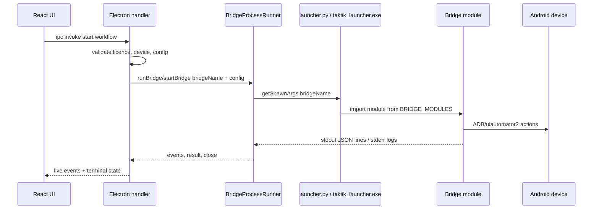

# Architecture des bridges

Les bridges sont la frontiere d'execution entre Electron et le bot Python. Un
handler Electron lance un sous-processus Python, lui transmet une configuration
JSON, le bridge pilote le device Android, puis renvoie des evenements JSON lines
vers Electron.

Cette page est verifiee contre :

- `bot/bridges/bridges.manifest.json`
- `bot/bridges/launcher.py::BRIDGE_MODULES`
- `front/electron/utils/paths.ts::PLATFORM_BRIDGES`
- `front/electron/services/shared/bridge/process/BridgeProcessRunner.ts`

## Mode dev et production

Le contrat stable est le **nom de bridge launcher** (`desktop_bridge`,
`tiktok_bridge`, etc.), pas un ancien fichier plat `*_bridge.py`.

| Mode | Commande | Exemple |
|---|---|---|
| Developpement | `python bot/bridges/launcher.py <bridge_name> <config>` | `python bot/bridges/launcher.py desktop_bridge .config_device.json` |
| Production | `resources/python/taktik_launcher.exe <bridge_name> <config>` | `taktik_launcher.exe desktop_bridge .config_device.json` |

Electron passe par `getSpawnArgs()` puis par `BridgeProcessRunner`. Les handlers
ne doivent pas reconstruire eux-memes `spawn()` + parsing stdout/stderr pour un
bridge Python.

## Registry actif

| Plateforme | Bridge name | Module Python actuel |
|---|---|---|
| Instagram | `desktop_bridge` | `bridges.instagram.automation.desktop` |
| Instagram | `dm_bridge` | `bridges.instagram.engagement.dm` |
| Instagram | `scraping_bridge` | `bridges.instagram.scraping.scraping` |
| Instagram | `cold_dm_bridge` | `bridges.instagram.engagement.cold_dm` |
| Instagram | `smart_comment_bridge` | `bridges.instagram.engagement.smart_comment` |
| Instagram | `account_bridge` | `bridges.instagram.account.account` |
| Instagram | `taktik_agent_bridge` | `bridges.instagram.agent.taktik_agent` |
| Instagram | `persona_analysis_bridge` | `bridges.instagram.analysis.persona` |
| Instagram | `publish_bridge` | `bridges.instagram.publish.publish` |
| TikTok | `tiktok_bridge` | `bridges.tiktok.workflows.dispatcher` |
| TikTok | `tiktok_unfollow_bridge` | `bridges.tiktok.automation.unfollow` |
| TikTok | `dm_outreach_bridge` | `bridges.tiktok.engagement.dm_outreach` |
| TikTok | `tiktok_scraping_bridge` | `bridges.tiktok.scraping.scraping` |
| TikTok | `tiktok_account_bridge` | `bridges.tiktok.account.account` |
| TikTok | `tiktok_publish_bridge` | `bridges.tiktok.publish.publish` |
| Threads | `threads_bridge` | `bridges.threads.workflows.dispatcher` |
| Gmail | `gmail_account_bridge` | `bridges.gmail.account.account` |
| YouTube | `youtube_account_bridge` | `bridges.youtube.account.account` |
| YouTube | `youtube_upload_bridge` | `bridges.youtube.publish.upload` |
| YouTube | `youtube_action_test_bridge` | `bridges.youtube.diagnostics.action_test` |
| Compat | `compat_bridge` | `bridges.compat.diagnostics.entrypoints.compat` |
| Compat | `selector_test_bridge` | `bridges.compat.diagnostics.entrypoints.selector_test` |
| Compat | `workflow_test_bridge` | `bridges.compat.diagnostics.entrypoints.workflow_test` |
| Compat | `action_test_bridge` | `bridges.compat.diagnostics.entrypoints.action_test` |
| Compat | `action_session_bridge` | `bridges.compat.diagnostics.entrypoints.action_session` |
| Compat | `tiktok_action_test_bridge` | `bridges.compat.diagnostics.entrypoints.tiktok_action_test` |

## Structure actuelle

```text
bot/bridges/
  launcher.py
  bridges.manifest.json
  common/
    runtime/
    device/
    input/
    parsing/
    persistence/
  compat/diagnostics/
    entrypoints/
    runtime/
    actions/
  instagram/
    account/
    agent/
    analysis/
    automation/
    diagnostics/
    engagement/
    publish/
    runtime/
    scraping/
  tiktok/
    account/
    automation/
    engagement/
    publish/
    runtime/
    scraping/
    workflows/
  threads/workflows/
  gmail/account/
  youtube/
    account/
    diagnostics/
    publish/
    workflows/
```

## Cycle de lancement



## Contrats

| Zone | Regle |
|---|---|
| Bridge name | Le nom launcher est le contrat entre Electron, `paths.ts`, `launcher.py` et le manifest. |
| Module Python | Le module actuel doit rester dans `bridges.manifest.json` et `BRIDGE_MODULES`. |
| stdout | Les messages machine doivent rester en JSON lines. |
| stderr | Les logs humains doivent passer par stderr/loguru pour ne pas casser les bridges JSON. |
| Stop/cleanup | Les bridges longs doivent respecter le contrat stop/session et passer par le runner commun cote Electron. |
| Ajout de bridge | Modifier manifest, `launcher.py`, `paths.ts`, docs, puis lancer `python bot/scripts/check_bridge_manifest.py`. |

## Checks

```powershell
python bot/scripts/check_bridge_manifest.py
python bot/scripts/audit_bridge_handler_usage.py
```

Le deuxieme check doit confirmer que les handlers de bridge ne font pas de
`getSpawnArgs()` / `spawn()` direct quand `BridgeProcessRunner` doit etre utilise.
