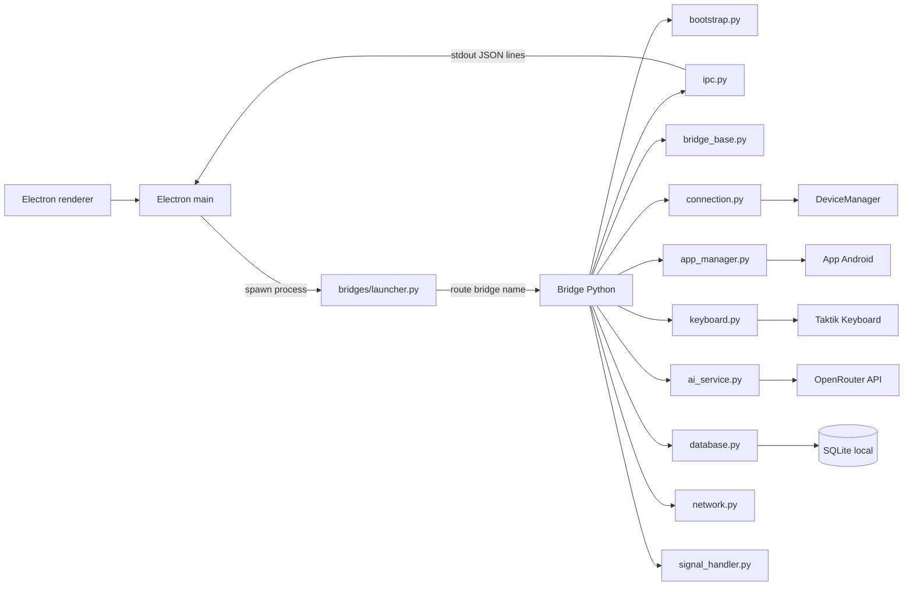
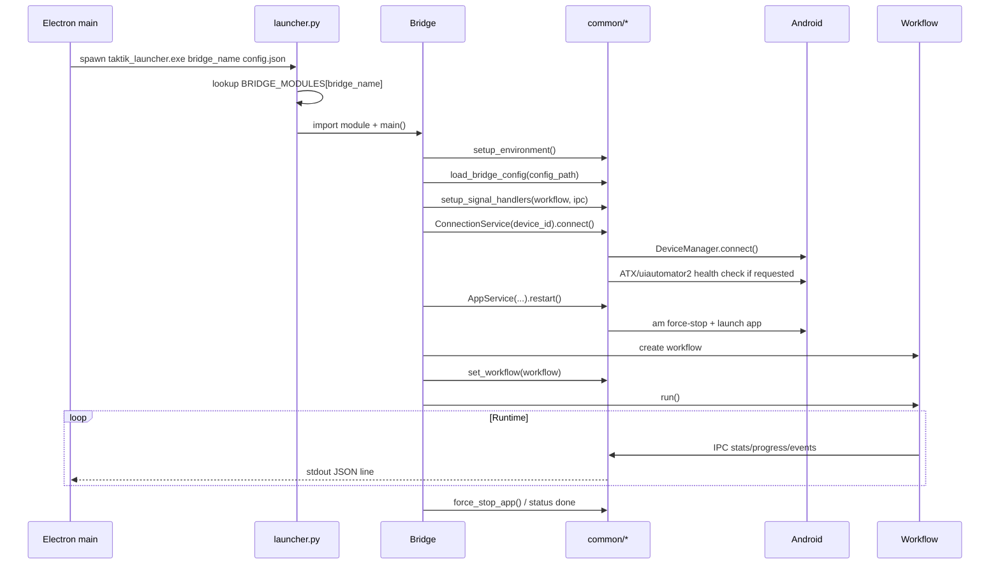
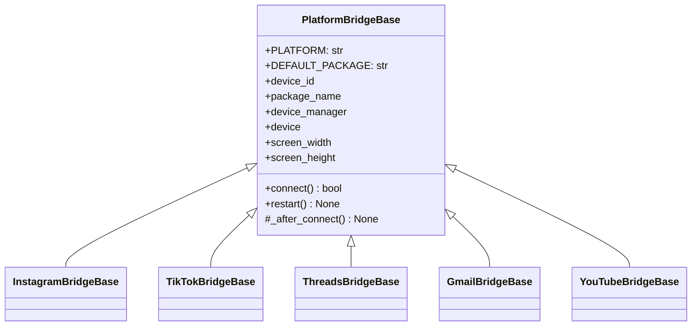
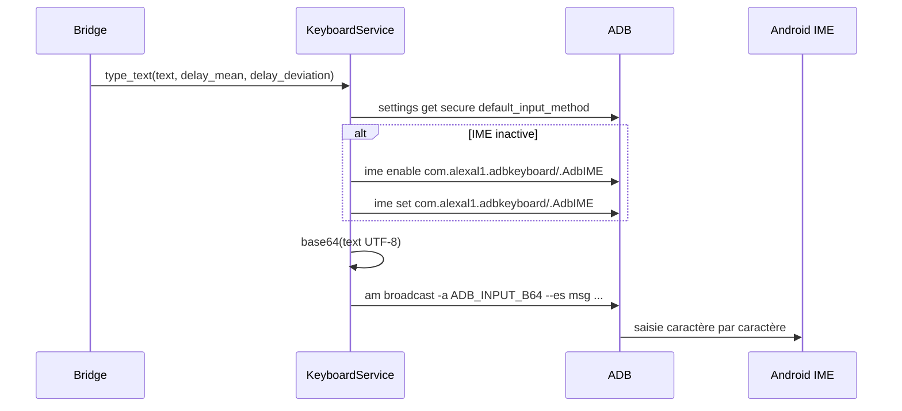
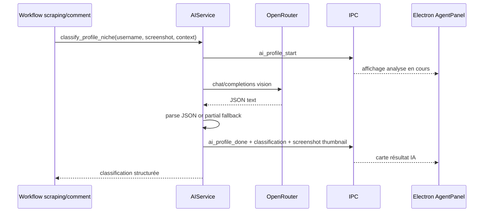

# Services communs des bridges

Cette page documente `bot/bridges/common/`, la couche partagée utilisée par les bridges Instagram, TikTok, Threads, Gmail, YouTube et les bridges de compatibilité.

Elle n'est pas une simple boîte à helpers : c'est le socle d'exécution des processus Python lancés par Electron. Elle standardise l'encodage, les logs, l'IPC JSON, la connexion Android, le cycle de vie des apps mobiles, la saisie texte, les appels IA, l'accès SQLite local et l'arrêt propre.

## Vue d'ensemble



## Inventaire

| Fichier | Rôle | Utilisé par |
|---|---|---|
| `bootstrap.py` | Prépare l'environnement Python du bridge : UTF-8, Loguru, `sys.path`. | Tous les bridges lancés en sous-processus |
| `ipc.py` | Canal stdout JSON line vers Electron, avec helpers par domaine. | Instagram, TikTok, Threads, workflows IA |
| `bridge_base.py` | Base commune de bridge, singleton IPC, wrappers IPC, `PlatformBridgeBase`, `run_bridge_main()`. | `instagram/base.py`, `tiktok/base.py`, `threads/base.py`, `gmail/base.py`, `youtube/base.py` |
| `connection.py` | Connexion Android via `DeviceManager`, cache écran, santé ATX/uiautomator2. | Bridges device-based |
| `app_manager.py` | Launch, stop, restart et détection package des apps mobiles. | Instagram, TikTok, Threads, Gmail, YouTube |
| `keyboard.py` | Saisie texte Unicode via Taktik Keyboard / ADB Keyboard. | DM Instagram, Cold DM, Smart Comment |
| `ai_service.py` | Client OpenRouter direct depuis le bridge Python. | Scraping Instagram, Desktop workflow, Smart Comment / agent |
| `database.py` | Facade compat vers `taktik.core.database` pour chemin SQLite, repository factory et dedup `sent_dms`. | Cold DM Instagram, TikTok DM outreach, scraping TikTok |
| `network.py` | Reset IP via mobile data ou airplane mode. | Instagram desktop, TikTok main bridge |
| `signal_handler.py` | Arrêt gracieux via `SIGTERM`, `SIGINT`, `SIGBREAK` Windows. | Bridges longs avec workflow `.stop()` |
| `utils.py` | Helpers transverses, actuellement `parse_count()`. | Smart Comment, extracteurs ponctuels |
| `__init__.py` | Exporte les services principaux. | Imports courts `from bridges.common import ...` |

## Cycle De Vie Commun



## `bootstrap.py`

`setup_environment(log_level="DEBUG")` doit être appelé tôt, avant que le bridge importe le reste de l'application.

Il fait trois choses :

| Étape | Détail |
|---|---|
| UTF-8 Windows | Remplace `sys.stdout` et `sys.stderr` par des wrappers UTF-8 avec `errors="replace"` et `line_buffering=True`. |
| Loguru | Supprime les handlers existants et écrit les logs sur `stderr`, jamais sur `stdout`. |
| Python path | Ajoute `bot/` à `sys.path` pour permettre `import taktik` et `import bridges`. |

`setup_environment()` est idempotent : un flag `_initialized` empêche une double configuration.

### Pourquoi c'est critique

Electron parse `stdout` comme un flux d'événements JSON. Les logs doivent rester sur `stderr`, sinon un log texte peut casser le parser IPC côté Electron.

## `ipc.py`

`IPC` est le canal de sortie structuré Python -> Electron.

Contrairement à un `print()` simple, `IPC` duplique le file descriptor original `stdout` avec `os.dup(1)`. Même si Loguru ou le bootstrap remplacent `sys.stdout`, les événements IPC continuent d'être écrits sur le vrai stdout du process parent.

### Format réel

Les messages sont des lignes JSON encodées en UTF-8 :

```json
{"type":"status","status":"running","message":"Workflow started"}
```

Le payload n'est pas toujours sous une clé `data`. Les helpers écrivent généralement les champs au niveau racine :

```json
{"type":"progress","current":5,"total":100,"action":"scraping"}
{"type":"error","error":"Device disconnected","error_code":"DEVICE_DISCONNECTED"}
```

### Helpers génériques

| Méthode | Type IPC | Champs |
|---|---|---|
| `send(msg_type, **kwargs)` | libre | `type` + champs fournis |
| `status(status, message="")` | `status` | `status`, `message` |
| `error(error, error_code=None)` | `error` | `error`, `error_code?` |
| `progress(current, total, action="")` | `progress` | `current`, `total`, `action` |
| `log(level, message)` | `log` | `level`, `message` |
| `stats(**stats)` | `stats` | `stats` |

### Helpers Instagram

| Méthode | Type IPC | Utilisation |
|---|---|---|
| `instagram_stats(...)` | `instagram_stats` | Compteurs interaction Instagram complets. |
| `instagram_action(action, username, details=None)` | `instagram_action` | Action en cours ou réalisée : like, follow, filter, etc. |
| `follow_event(username, success=True, profile_data=None)` | `follow_event` | Activité temps réel follow. |
| `like_event(username, likes_count=1, profile_data=None)` | `like_event` | Activité temps réel like. |
| `unfollow_event(username, success=True)` | `unfollow_event` | Résultat unfollow. |
| `profile_visit(username, followers=None, is_private=False)` | `instagram_profile_visit` | Profil visité en automation. |
| `scraping_profile_visit(...)` | `scraping_profile_visit` | Profil vu pendant scraping, avant analyse IA. |
| `scraping_dq_progress(username, count, max_count)` | `scraping_dq_progress` | Progression du deep qualify. |
| `post_skipped(author, reason, hashtag=None)` | `post_skipped` | Post ignoré par un workflow. |
| `current_post(...)` | `current_post` | Métadonnées du post en cours. |
| `session_start(session_id, **kwargs)` | `session_start` | Début de session locale. |

### Helpers TikTok

| Méthode | Type IPC | Utilisation |
|---|---|---|
| `tiktok_stats(...)` | `stats` | Compteurs TikTok : watched, liked, followed, favorited, skipped, errors. |
| `video_info(...)` | `video_info` | Vidéo TikTok courante. |
| `action(action, target="")` | `action` | Action générique. |
| `pause(duration)` | `pause` | Pause affichée côté UI. |

### Helpers Threads

| Méthode | Type IPC | Utilisation |
|---|---|---|
| `threads_stats(...)` | `threads_stats` | Compteurs Threads. |
| `threads_action(action, username, details=None)` | `threads_action` | Action Threads. |
| `threads_profile_visit(username, followers=None, is_private=False)` | `threads_profile_visit` | Visite profil Threads. |

### Helpers DM

| Méthode | Type IPC | Utilisation |
|---|---|---|
| `dm_conversation(conversation)` | `dm_conversation` | Conversation lue ou extraite. |
| `dm_progress(current, total, name)` | `dm_progress` | Avancement lecture/envoi DM. |
| `dm_stats(stats)` | `dm_stats` | Stats workflow DM. |
| `dm_sent(conversation, success, error=None)` | `dm_sent` | Résultat d'envoi DM. |

### Helpers IA et AgentPanel

Ces événements alimentent notamment les panneaux d'agent et d'analyse IA dans l'app Electron.

| Méthode | Type IPC | Moment |
|---|---|---|
| `ai_profile_analyzing(...)` | `ai_profile_start` | Début classification profil. |
| `ai_profile_analyzed(...)` | `ai_profile_done` | Résultat classification profil. |
| `ai_screenshot_analyzing(...)` | `ai_screenshot_start` | Début analyse screenshot/post. |
| `ai_screenshot_analyzed(...)` | `ai_screenshot_done` | Résultat analyse screenshot/post. |
| `ai_comment_generating(...)` | `ai_comment_start` | Début génération commentaire. |
| `ai_comment_ready(...)` | `ai_comment_done` | Commentaire IA prêt. |
| `agent_decision(...)` | `agent_decision` | Décision du Taktik Agent. |
| `agent_status(...)` | `agent_status` | Statut de session agent. |
| `strategy_switch(...)` | `strategy_switch` | Changement de stratégie feed/hashtag. |
| `ai_error(error, username=None)` | `ai_error` | Erreur IA non fatale ou fatale selon contexte. |

## `bridge_base.py`

`bridge_base.py` est le point de consolidation des anciens `base.py` propres à chaque plateforme.

Il expose :

| Élément | Rôle |
|---|---|
| `_ipc` | Singleton `IPC()` partagé. |
| `send_message()` | Wrapper générique vers `_ipc.send()`. |
| `send_status()` | Wrapper status. |
| `send_error()` | Wrapper error. |
| `send_log()` | Wrapper log. |
| `send_progress()` | Wrapper progress. |
| `get_workflow()` / `set_workflow()` | Référence globale utilisée par le signal handler. |
| `PlatformBridgeBase` | Base pour bridges Android avec connexion device + app lifecycle. |
| `load_bridge_config()` | Lecture JSON config en `utf-8-sig`, fallback `utf-8`. |
| `run_bridge_main()` | Entrypoint universel pour bridges à config JSON + `.run()`. |

### `PlatformBridgeBase`

Les bases de plateformes héritent de cette classe :



Le `connect()` commun :

1. crée `ConnectionService(device_id)`,
2. connecte le device,
3. expose `device_manager`, `device`, `screen_width`, `screen_height`,
4. crée `AppService(connection, platform=PLATFORM, package_override=...)`,
5. appelle `_after_connect()` pour les plateformes qui doivent injecter une logique spécifique.

### `run_bridge_main()`

Le helper standardise les bridges dont le `main()` lit un fichier JSON puis lance `.run()` :

```python
if __name__ == "__main__":
    run_bridge_main(MyBridge, usage="my_bridge <config_path>")
```

Il gère :

| Étape | Comportement |
|---|---|
| Arguments | Erreur IPC si le path config manque. |
| JSON config | Lecture via `load_bridge_config()`. |
| Instanciation | `bridge_factory(config)`. |
| Exécution | `sys.exit(int(bridge.run()))`. |
| Crash | `send_error("Bridge crashed: ...")` + log exception. |

## `connection.py`

`ConnectionService` est la source unique pour ouvrir une connexion Android dans un bridge.

```mermaid
flowchart TD
    A[ConnectionService.connect] --> B[Import DeviceManager]
    B --> C[DeviceManager(device_id)]
    C --> D[DeviceManager.connect()]
    D --> E{device présent ?}
    E -->|non| F[return False]
    E -->|oui| G[cache displayWidth/displayHeight]
    G --> H[_connected = True]
```

### API

| Méthode/propriété | Rôle |
|---|---|
| `connect()` | Ouvre la connexion via `DeviceManager`. Safe à rappeler si déjà connecté. |
| `disconnect()` | Appelle `DeviceManager.disconnect()` puis nettoie l'état local. |
| `check_atx_health(repair=True, max_retries=3)` | Vérifie uiautomator2 / ATX et tente une réparation via `DeviceManager` si demandé. |
| `device` | Objet uiautomator2 connecté. |
| `device_manager` | Instance `DeviceManager` brute. |
| `screen_size` | Tuple `(width, height)`. |
| `is_connected` | Booléen de connexion logique. |

### Pourquoi cette couche existe

Avant la factorisation, certains bridges créaient plusieurs `DeviceManager` pour le même device. Cela provoquait des états incohérents entre lancement app, actions UI et health checks. `ConnectionService` donne un point de partage unique.

## `app_manager.py`

`AppService` pilote le cycle de vie d'une app Android.

### Plateformes connues

| Plateforme | Package par défaut | Activity |
|---|---|---|
| `instagram` | `com.instagram.android` | `com.instagram.mainactivity.InstagramMainActivity` |
| `tiktok` | `com.zhiliaoapp.musically` | `com.ss.android.ugc.aweme.splash.SplashActivity` |
| `threads` | `com.instagram.barcelona` | `com.instagram.barcelona.mainactivity.BarcelonaMainActivity` |
| `gmail` | `com.google.android.gm` | `com.google.android.gm.ui.MailActivityGmail` |
| `youtube` | `com.google.android.youtube` | `com.google.android.youtube.app.honeycomb.Shell$HomeActivity` |

### Alternatives TikTok

TikTok peut être installé sous plusieurs packages :

| Package | Cas |
|---|---|
| `com.zhiliaoapp.musically` | Défaut |
| `com.ss.android.ugc.trill` | Variante globale/régionale |
| `com.ss.android.ugc.aweme` | Variante Chine / Douyin |

Si aucun `package_override` n'est fourni, `AppService` tente de détecter automatiquement un package TikTok installé.

### Clones d'app

Si `package_override` est fourni :

- `AppService` utilise ce package à la place du package par défaut.
- Pour les packages `com.taktik.*`, l'activity explicite est supprimée (`activity=None`) car les clones ne partagent pas forcément le nom d'activity interne.
- Pour certains clones type NomixCloner, l'activity d'origine peut rester utilisable.

### API

| Méthode | Rôle |
|---|---|
| `is_installed()` | Vérifie l'installation via `DeviceManager.is_app_installed()`. |
| `launch()` | Lance l'app via `DeviceManager.launch_app(package, activity)` puis attend `launch_wait`. |
| `stop()` | Force-stop via `DeviceManager.stop_app(package)` puis attend `stop_wait`. |
| `restart()` | `stop()` puis `launch()`. |
| `is_running()` | Compare `device.app_current()["package"]` avec le package cible. |
| `get_installed_version()` | Lit `versionName=` via `adb shell dumpsys package`. |
| `force_stop_app(device_id, platform)` | Fonction standalone, utilisable même sans connexion uiautomator2 active. |

## `keyboard.py`

`KeyboardService` centralise la saisie texte via Taktik Keyboard / ADB Keyboard.

Cette approche est utilisée pour les DMs et les commentaires car elle supporte mieux :

- les accents,
- les caractères Unicode,
- les emojis,
- les textes longs,
- les délais de frappe pseudo-humains.

### Flux



### API

| Méthode | Rôle |
|---|---|
| `ensure_active()` | Vérifie et active `com.alexal1.adbkeyboard/.AdbIME`. |
| `type_text(text, delay_mean=80, delay_deviation=30)` | Encode en base64 et envoie le broadcast `ADB_INPUT_B64`. |

## `ai_service.py`

`AIService` est un client OpenRouter léger utilisé directement dans le process Python. Il évite un aller-retour Electron -> API IA pendant une automation en cours.

### Configuration

| Constante/champ | Valeur par défaut |
|---|---|
| `OPENROUTER_API_URL` | `https://openrouter.ai/api/v1/chat/completions` |
| `DEFAULT_TEXT_MODEL` | `anthropic/claude-3.5-haiku` |
| `DEFAULT_VISION_MODEL` | `google/gemini-2.5-flash` |

Le bridge reçoit la clé OpenRouter dans la config de session, généralement sous `ai.openrouterApiKey`, puis instancie :

```python
ai = AIService(api_key=api_key, ipc=_ipc, vision_model=vision_model)
```

### Appels bas niveau

| Méthode | Rôle |
|---|---|
| `_call_openrouter(model, messages, temperature, max_tokens)` | POST chat completions, retourne `success`, `text`, `usage`, `cost_usd`, `model`, `provider`. |
| `_image_to_base64_url(image_path)` | Convertit PNG/JPG/JPEG en data URL pour vision model. |
| `_image_to_thumbnail_url(image_path, max_size=400)` | Crée une miniature JPEG pour IPC UI. |
| `_extract_avatar_thumbnail(image_path, size=64)` | Crop approximatif avatar Instagram depuis une capture profil. |
| `_extract_partial_classification(text)` | Fallback regex si le JSON IA est tronqué ou malformé. |

### Opérations haut niveau

| Méthode | Usage principal | Sortie |
|---|---|---|
| `text_completion(system_prompt, user_prompt, ...)` | Complétion texte simple. | `{success, text, model, usage, cost_usd}` |
| `vision_completion(system_prompt, user_prompt, image_path, ...)` | Analyse image + prompt. | `{success, text, model, usage, cost_usd}` |
| `classify_profile_niche(username, screenshot_path, profile_context=None, response_language="en")` | Scraping / deep qualify : niche, sous-niche, résumé, ville, profession. | `{success, classification, model, provider, cost_usd, duration_ms}` |
| `classify_profile(username, screenshot_path, account_username=None)` | Scoring profil pour automation : niche, relevance, quality, engagement. | `{success, classification, ...}` |
| `analyze_post(screenshot_path, username=None)` | Description visuelle d'un post Instagram. | `{success, description, ...}` |
| `generate_smart_comment(post_description, username, niche="general", language="auto")` | Commentaire court contextualisé. | `{success, comment, ...}` |

### Taxonomie IA

`AIService` contient deux taxonomies contrôlées qui doivent rester alignées avec le front :

| Liste | Rôle |
|---|---|
| `NICHE_CATEGORIES` | Catégories principales : `lifestyle`, `travel`, `fitness_sport`, `food_cooking`, etc. |
| `SUB_NICHES` | Sous-niches contrôlées : `Adventure & Backpacking`, `Programming & Development`, `Stock Market & Investing`, etc. |

Le prompt force le modèle à choisir dans ces listes pour éviter l'explosion de catégories libres en base.

### Événements IPC IA



## `database.py`

Cette couche est une facade de compatibilite cote bridge. L'ownership SQLite vit dans `taktik/core/database/**`.

### Chemin SQLite local

`get_db_path()` retourne le chemin selon l'OS :

| OS | Chemin |
|---|---|
| Windows | `%APPDATA%/taktik-desktop/taktik-data.db` |
| macOS | `~/Library/Application Support/taktik-desktop/taktik-data.db` |
| Linux | `~/.config/taktik-desktop/taktik-data.db` |

### Repository factory

`get_repository(repo_class)` :

1. résout le chemin SQLite local,
2. vérifie que la DB existe,
3. ouvre une connexion `sqlite3.connect(db_path)`,
4. retourne `repo_class(conn)`.

Ce helper est re-exporte depuis `taktik.core.database.repositories.get_repository`. Il est utilise notamment par des bridges TikTok qui veulent acceder aux repositories locaux sans dupliquer la resolution de chemin.

### `SentDMService`

`SentDMService` evite d'envoyer plusieurs fois un DM au meme destinataire. Le service est maintenant porte par `taktik.core.database.messaging` et le SQL par `taktik.core.database.repositories.messaging.SentDMRepository`.

| Méthode | Rôle |
|---|---|
| `check_already_sent(account_id, recipient, platform="instagram")` | Cherche `sent_dms` avec `(account_id, recipient_username, platform)`. |
| `record(account_id, recipient, message, success, error_message=None, session_id=None, platform="instagram")` | Crée la table si besoin et enregistre le résultat. |

La table creee cote Python par le repository contient :

```sql
CREATE TABLE IF NOT EXISTS sent_dms (
    id INTEGER PRIMARY KEY AUTOINCREMENT,
    account_id INTEGER NOT NULL,
    recipient_username TEXT NOT NULL,
    message_hash TEXT,
    sent_at TEXT DEFAULT (datetime('now')),
    success INTEGER DEFAULT 1,
    error_message TEXT,
    session_id TEXT,
    platform TEXT DEFAULT 'instagram',
    UNIQUE(account_id, recipient_username, platform)
)
```

Le message complet n'est pas stocké ici : seul `message_hash` est persisté.

## `network.py`

`network.py` permet de demander une nouvelle IP mobile sans root.

### API

| Fonction | Rôle |
|---|---|
| `get_device_external_ip(device_id)` | Lit l'IP publique via `curl` puis `wget` depuis le device. |
| `reset_mobile_data(device_id, wait_seconds=5.0)` | `svc data disable`, attente, puis `svc data enable`. |
| `reset_airplane_mode(device_id, wait_seconds=5.0)` | `cmd connectivity airplane-mode enable/disable`. |
| `perform_network_reset(device_id, method="data", ipc=None)` | Dispatcher haut niveau avec événements IPC. |

### Flux IPC

`perform_network_reset()` peut envoyer :

- `status("resetting_network", "Getting current IP...")`,
- `status("resetting_network", "Resetting network (...) for new IP...")`,
- `log("info" | "warning", "...")`,
- `network_reset_complete` avec `old_ip`, `new_ip`, `method`, `success`.

## `signal_handler.py`

Le signal handler évite de tuer brutalement une automation longue.

### Fonctions

| Fonction | Rôle |
|---|---|
| `setup_signal_handlers(workflow=None, ipc=None)` | Enregistre `SIGTERM`, `SIGINT` et `SIGBREAK` Windows. |
| `update_workflow(workflow)` | Met à jour la référence globale après création tardive du workflow. |
| `_handle_signal(signum, frame)` | Envoie status `stopping`, appelle `workflow.stop()` si disponible, puis `sys.exit(0)`. |

### Cas typique

```python
setup_signal_handlers(ipc=_ipc)
workflow = MyWorkflow(...)
update_workflow(workflow)
workflow.run()
```

## `utils.py`

`parse_count(text)` convertit les compteurs sociaux en entier :

| Entrée | Sortie |
|---|---:|
| `18.5K` | `18500` |
| `1.2M` | `1200000` |
| `3B` | `3000000000` |
| `424` | `424` |
| entrée invalide | `0` |

Le helper supprime les virgules et espaces, puis applique les suffixes `K`, `M`, `B`.

## `launcher.py`

Même s'il est dans `bot/bridges/` et non dans `common/`, le launcher fait partie de l'infrastructure commune.

Il permet de packager un seul exécutable PyInstaller au lieu d'un exécutable par bridge.

```bash
taktik_launcher.exe <bridge_name> [bridge_args...]
```

### Bridges routés

| Famille | Bridge name | Module |
|---|---|---|
| Instagram | `desktop_bridge` | `bridges.instagram.automation.desktop` |
| Instagram | `dm_bridge` | `bridges.instagram.engagement.dm` |
| Instagram | `scraping_bridge` | `bridges.instagram.scraping.scraping` |
| Instagram | `cold_dm_bridge` | `bridges.instagram.engagement.cold_dm` |
| Instagram | `smart_comment_bridge` | `bridges.instagram.engagement.smart_comment` |
| Instagram | `account_bridge` | `bridges.instagram.account.account` |
| Instagram | `taktik_agent_bridge` | `bridges.instagram.agent.taktik_agent` |
| Instagram | `persona_analysis_bridge` | `bridges.instagram.analysis.persona` |
| Instagram | `publish_bridge` | `bridges.instagram.publish.publish` |
| TikTok | `tiktok_bridge` | `bridges.tiktok.workflows.dispatcher` |
| TikTok | `tiktok_unfollow_bridge` | `bridges.tiktok.automation.unfollow` |
| TikTok | `dm_outreach_bridge` | `bridges.tiktok.engagement.dm_outreach` |
| TikTok | `tiktok_scraping_bridge` | `bridges.tiktok.scraping.scraping` |
| TikTok | `tiktok_account_bridge` | `bridges.tiktok.account.account` |
| TikTok | `tiktok_publish_bridge` | `bridges.tiktok.publish.publish` |
| Threads | `threads_bridge` | `bridges.threads.workflows.dispatcher` |
| Gmail | `gmail_account_bridge` | `bridges.gmail.account.account` |
| YouTube | `youtube_account_bridge` | `bridges.youtube.account.account` |
| YouTube | `youtube_upload_bridge` | `bridges.youtube.publish.upload` |
| YouTube | `youtube_action_test_bridge` | `bridges.youtube.diagnostics.action_test` |
| Compat | `compat_bridge` | `bridges.compat.diagnostics.entrypoints.compat` |
| Compat | `selector_test_bridge` | `bridges.compat.diagnostics.entrypoints.selector_test` |
| Compat | `workflow_test_bridge` | `bridges.compat.diagnostics.entrypoints.workflow_test` |
| Compat | `action_test_bridge` | `bridges.compat.diagnostics.entrypoints.action_test` |
| Compat | `action_session_bridge` | `bridges.compat.diagnostics.entrypoints.action_session` |
| Compat | `tiktok_action_test_bridge` | `bridges.compat.diagnostics.entrypoints.tiktok_action_test` |

### Routage

```mermaid
flowchart TD
    A[taktik_launcher.exe desktop_bridge config.json] --> B{bridge_name connu ?}
    B -->|non| C[stdout error JSON + exit 1]
    B -->|oui| D[sys.argv = sys.argv[1:]]
    D --> E[importlib.import_module(module_path)]
    E --> F[module.main()]
```

## Dépendances croisées

| Service common | Dépendance interne | Remarque |
|---|---|---|
| `ConnectionService` | `taktik.core.social_media.instagram.actions.core.device.DeviceManager` | Le DeviceManager historique est dans le module Instagram mais sert maintenant de primitive commune Android. |
| `AppService` | `ConnectionService.device_manager` | Ne crée pas sa propre connexion. |
| `KeyboardService` | ADB CLI + Taktik Keyboard | Ne dépend pas de uiautomator2. |
| `AIService` | OpenRouter + PIL optionnel | PIL sert aux miniatures IPC ; fallback possible. |
| `SentDMService` | `taktik.core.database.repositories.messaging` | Cree `sent_dms` si necessaire, via le repository DB. |
| `network.py` | `taktik.core.shared.input.taktik_keyboard.run_adb_shell` | Utilise un helper partagé pour exécuter ADB shell. |

## Checklist De Debug

| Symptôme | Vérifier |
|---|---|
| Electron ne reçoit plus d'événements | Le bridge écrit-il des logs sur `stdout` au lieu de `stderr` ? Utiliser `IPC.send()` plutôt que `print()`. |
| Caractères accentués cassés | `setup_environment()` est-il appelé au démarrage du bridge ? Le fichier est-il lu en UTF-8/UTF-8-SIG ? |
| Device connecté mais actions instables | `ConnectionService.check_atx_health(repair=True)` et serveur ATX/uiautomator2. |
| App clone ne se lance pas | Vérifier `package_override`, et si le package commence par `com.taktik.`, éviter l'activity explicite. |
| Texte DM/commentaire tronqué | Vérifier Taktik Keyboard actif avec `KeyboardService.ensure_active()`. |
| DM envoyé deux fois | Vérifier la table `sent_dms` et le `platform` passé à `SentDMService`. |
| AgentPanel IA vide | Vérifier que `AIService` reçoit bien `ipc=_ipc` et que les événements `ai_*` sortent sur stdout. |
| Reset IP sans effet | Tester `method="airplane"` si `svc data` ne force pas un renouvellement chez l'opérateur. |
