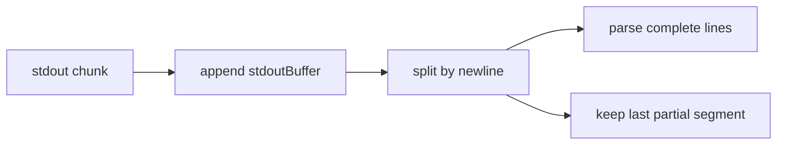

# Protocole IPC des bridges

Le protocole IPC relie les sous-processus Python à Electron. Il repose sur une règle simple : chaque événement Python -> Electron est une ligne JSON complète écrite sur `stdout`.

Les logs humains, stack traces et messages Loguru doivent rester sur `stderr`.

## Canaux

| Direction | Canal | Usage |
|---|---|---|
| Electron -> Python | Arguments process + fichier JSON temporaire | Configuration initiale du bridge. |
| Electron -> Python | Signal process / kill tree | Arrêt manuel ou nettoyage. |
| Python -> Electron | `stdout` JSON lines | Événements structurés : status, stats, progress, profils, IA, erreurs. |
| Python -> Electron | `stderr` texte | Logs Loguru, debug, crash context. |
| Electron -> Renderer | IPC Electron (`bot:message`, `bot:stderr`, etc.) | Diffusion vers React. |

## Format Python -> Electron

Le format réel est :

```json
{"type":"<message_type>","field":"value"}
```

Chaque message doit tenir sur une ligne terminée par `\n`.

Exemples :

```json
{"type":"status","status":"running","message":"Workflow started"}
{"type":"progress","current":12,"total":100,"action":"scraping"}
{"type":"error","error":"Device disconnected","error_code":"DEVICE_DISCONNECTED"}
```

Attention : les messages ne sont pas uniformément enveloppés dans `data`. Certains types ont une clé `stats`, `video`, `conversation` ou des champs directement au niveau racine.

## Buffering Côté Electron

Les pipes OS peuvent couper un gros message en plusieurs chunks, surtout avec des screenshots base64.

Electron accumule donc les chunks stdout dans un buffer, découpe sur `\n`, puis parse uniquement les lignes complètes :



## Configuration Initiale

La plupart des bridges reçoivent un chemin de config :

```bash
python bot/bridges/launcher.py desktop_bridge C:\...\taktik-data\.config_device.json
```

En production :

```bash
taktik_launcher.exe desktop_bridge C:\...\taktik-data\.config_device.json
```

Le fichier JSON est écrit par Electron en UTF-8. Côté Python, `load_bridge_config()` lit en `utf-8-sig` puis fallback `utf-8` pour tolérer un BOM Windows.

## Messages Génériques

| Type | Exemple | Consommation |
|---|---|---|
| `status` | `{"type":"status","status":"connecting","message":"Connecting..."}` | Live panel, état session. |
| `error` | `{"type":"error","error":"...","error_code":"..."}` | UI erreur, crash data. |
| `progress` | `{"type":"progress","current":5,"total":20,"action":"followers"}` | Progress bars. |
| `log` | `{"type":"log","level":"info","message":"..."}` | Console debug. |
| `stats` | `{"type":"stats","stats":{...}}` ou legacy fields directs | Compteurs génériques/TikTok. |
| `session_start` | `{"type":"session_start","session_id":123}` | Capture session DB pour stop manuel. |

## Messages Instagram

| Type | Champs principaux | Rôle |
|---|---|---|
| `instagram_stats` | `stats.profiles_visited`, `likes`, `follows`, `comments`, `stories_watched`, `errors` | Stats automation Instagram. |
| `instagram_action` | `action`, `username`, `details?` | Action réalisée ou en cours. |
| `instagram_profile_visit` | `username`, `followers`, `is_private` | Profil visité pendant automation. |
| `follow_event` | `username`, `success`, `profile_data?` | Événement follow temps réel. |
| `like_event` | `username`, `likes_count`, `profile_data?` | Événement like temps réel. |
| `unfollow_event` | `username`, `success` | Résultat unfollow. |
| `profile_captured` | `username`, `full_name`, `biography`, counts, `profile_pic_url?` | Profil complet capturé. |
| `profile_skipped` | `username`, `reason` | Profil ignoré par déduplication/filtrage. |
| `scraping_profile_visit` | `username`, `biography`, counts, business/private fields | Profil vu avant deep qualify/IA. |
| `scraping_dq_progress` | `username`, `count`, `max_count` | Progression collecte following. |
| `current_post` | `author`, `likes_count`, `comments_count`, `caption`, `hashtag` | Post courant dans feed/hashtag/agent. |
| `post_skipped` | `author`, `reason`, `hashtag?` | Post ignoré. |

### `profile_captured` Et Images

Si `profile_pic_url` contient une data URL base64 :

1. Electron extrait le base64.
2. Electron remplace le champ par une URL légère `taktik-img://<username>.jpg`.
3. L'image est sauvegardée en async.
4. La DB locale est mise à jour avec le chemin image.
5. Le message allégé est envoyé au renderer.

## Messages IA

| Type | Produit par | Rôle |
|---|---|---|
| `ai_profile_start` | `AIService.ai_profile_analyzing()` | Affiche l'analyse profil en cours. |
| `ai_profile_done` | `AIService.ai_profile_analyzed()` | Résultat classification profil. |
| `ai_screenshot_start` | `AIService.ai_screenshot_analyzing()` | Début analyse post/screenshot. |
| `ai_screenshot_done` | `AIService.ai_screenshot_analyzed()` | Description post/screenshot. |
| `ai_comment_start` | `AIService.ai_comment_generating()` | Début génération commentaire. |
| `ai_comment_done` | `AIService.ai_comment_ready()` | Commentaire généré. |
| `ai_error` | `AIService.ai_error()` | Erreur IA. |
| `agent_decision` | Taktik Agent | Décision autonome : like, skip, comment, follow. |
| `agent_status` | Taktik Agent | Statut agent. |
| `strategy_switch` | Taktik Agent | Changement feed/hashtag ou stratégie. |

### Persistance IA Côté Electron

Quand Electron reçoit `ai_profile_done` :

- il accumule le coût IA dans les stats de session,
- il met à jour la classification dans `instagram_profiles`,
- il sauvegarde éventuellement le screenshot IA,
- il retire le base64 avant diffusion renderer pour limiter la mémoire IPC.

Quand Electron reçoit `ai_screenshot_done` avec screenshot :

- il sauvegarde l'image,
- il ajoute une ligne dans `ai_post_screenshots`,
- il retire le base64 avant diffusion.

## Messages TikTok

| Type | Champs principaux | Rôle |
|---|---|---|
| `stats` | `stats.videos_watched`, `videos_liked`, `users_followed`, etc. | Stats TikTok. |
| `video_info` | `video.author`, `description`, `like_count`, `hashtags`, `sound` | Vidéo courante. |
| `action` | `action`, `target` | Action générique. |
| `pause` | `duration` | Pause visible. |

## Messages Threads

| Type | Champs principaux | Rôle |
|---|---|---|
| `threads_stats` | `stats.profiles_visited`, `likes`, `follows`, `reposts`, `replies` | Stats Threads. |
| `threads_action` | `action`, `username`, `details?` | Action Threads. |
| `threads_profile_visit` | `username`, `followers`, `is_private` | Profil Threads visité. |

## Messages DM

| Type | Champs principaux | Rôle |
|---|---|---|
| `dm_conversation` | `conversation` | Conversation lue. |
| `dm_progress` | `current`, `total`, `name` | Progression lecture/envoi. |
| `dm_stats` | `stats` | Stats workflow DM. |
| `dm_sent` | `conversation`, `success`, `error?` | Résultat envoi. |

## Messages Compatibilité Et Debug

| Type | Utilisé par | Rôle |
|---|---|---|
| `registry_data` | `compat_bridge` | Registry selecteurs/actions. |
| `actions_list` | `compat_bridge` | Liste actions disponibles. |
| `selector_result` / evenements proches | `selector_test_bridge` | Resultats de test selecteurs. |
| `step` | `workflow_test_bridge` | Etape de test en cours. |
| `workflow_step` | `workflow_test_bridge` | Etape workflow simulee/reelle. |
| `action_event` | `workflow_test_bridge` | Action tracee pendant test. |
| `test_report` | `workflow_test_bridge` | Rapport final. |

## Messages Réseau

| Type | Champs | Rôle |
|---|---|---|
| `network_reset_complete` | `old_ip`, `new_ip`, `method`, `success` | Fin de reset IP mobile/airplane mode. |

`perform_network_reset()` envoie aussi des `status` et `log` pendant la séquence.

## Arrêt

L'arrêt manuel ne passe généralement pas par un message stdin `stop`. Côté Electron :

1. l'utilisateur déclenche `bot:stop-session`,
2. Electron retrouve le process via `ProcessManager`,
3. il marque la session SQLite comme `STOPPED` si un `session_id` a été reçu,
4. il tue l'arbre de processus avec `killProcessTree()`,
5. il libère le scheduler,
6. il envoie `bot:session-ended`.

Les bridges longs peuvent installer `setup_signal_handlers()` pour capter `SIGTERM`/`SIGINT` et appeler `workflow.stop()`.

## Codes D'erreur Courants

| Code | Source probable | Signification |
|---|---|---|
| `DEVICE_DISCONNECTED` | Bridge ou handler | Device ADB/uiautomator2 inaccessible. |
| `CONFIG_ERROR` | Compat/test bridges | Config JSON illisible. |
| `MISSING_CONFIG` | Compat/test bridges | Aucun fichier config fourni. |
| `MISSING_DEVICE` | Compat/test bridges | `device_id` absent. |
| `APP_NOT_INSTALLED` | Test workflow | App cible absente. |
| `APP_LAUNCH_FAILED` | Test workflow / bridge | App impossible à lancer. |
| `PROCESS_SPAWN_FAILED` | Electron | Le process n'a pas pu être lancé. |
| `PROCESS_CRASHED` | Electron synthetic | Process terminé non-zéro sans message IPC utile. |
| `PYTHON_IMPORT_ERROR` | Electron synthetic | Crash contenant `ImportError` ou `ModuleNotFoundError`. |
| `PROCESS_TIMEOUT` | Electron synthetic | Crash associé à un timeout. |
| `PROCESS_PERMISSION_ERROR` | Electron synthetic | Crash associé à une permission. |
| `PROCESS_INSTANT_DEATH` | Electron synthetic | Process mort très vite sans stderr. |

## Règles D'ajout D'un Nouveau Message

1. Émettre via `IPC.send()` ou un helper, jamais via `print()`.
2. Garder une seule ligne JSON par événement.
3. Éviter les gros base64 vers le renderer ; si nécessaire, Electron doit sauvegarder puis remplacer par une URL locale.
4. Ajouter le type dans la documentation de cette page.
5. Vérifier le handler Electron qui parse le stdout du bridge concerné.
6. Prévoir un champ stable (`type`, `status`, `error_code`, `username`, `target_username`) si le front doit filtrer l'événement.
