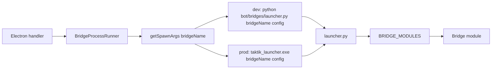

# Bridge Launcher et packaging

Le launcher permet de livrer un seul executable Python en production :
`taktik_launcher.exe`. Electron lance toujours un process par bridge, mais le
premier argument indique quel module Python importer.

Sources verifiees :

- `bot/bridges/launcher.py`
- `bot/bridges/bridges.manifest.json`
- `front/electron/utils/paths.ts`
- `front/scripts/build/build-all.ps1`

## Contrat d'execution

Le contrat stable est le **bridge name**.

```powershell
taktik_launcher.exe desktop_bridge C:\path\config.json
taktik_launcher.exe tiktok_bridge C:\path\config.json
taktik_launcher.exe youtube_upload_bridge C:\path\config.json
```

En developpement, Electron passe aussi par `bot/bridges/launcher.py` :

```powershell
python bot/bridges/launcher.py desktop_bridge .config_device.json
```

Ne pas documenter ou recreer l'ancien mode
`python bot/bridges/<platform>/<bridge>.py <config>` : les bridges ont ete
reorganises en modules domaines et les anciens fichiers plats `*_bridge.py`
n'existent plus comme chemins canoniques.

## Flux Electron



`BridgeProcessRunner` centralise la resolution dev/prod, le parsing stdout JSON
lines, stderr, timeout, close et cleanup. Les handlers de bridge ne doivent pas
dupliquer ce cycle.

## Registries a garder alignes

| Source | Role |
|---|---|
| `bot/bridges/bridges.manifest.json` | Manifest lisible de la cartographie bridge -> module. |
| `bot/bridges/launcher.py::BRIDGE_MODULES` | Mapping runtime utilise par `launcher.py` et `taktik_launcher.exe`. |
| `front/electron/utils/paths.ts::PLATFORM_BRIDGES` | Liste des bridge names autorises cote Electron. |

Check obligatoire apres ajout, renommage ou suppression :

```powershell
python bot/scripts/check_bridge_manifest.py
```

Sortie attendue :

```text
Bridge manifest OK (24 bridges)
```

## Build production

Le build compile `bot/bridges/launcher.py` avec PyInstaller puis copie
`dist/taktik-bot/taktik_launcher.exe` vers `front/python`.

```powershell
cd front
yarn build:python
```

Le binaire embarque les modules declares dans `BRIDGE_MODULES`. Si un bridge
n'est pas dans le mapping, `taktik_launcher.exe` renvoie une erreur JSON
`Unknown bridge`.

## Ajouter un bridge

1. Creer le module Python dans le domaine correct (`instagram/engagement`,
   `tiktok/publish`, `compat/diagnostics/entrypoints`, etc.).
2. Ajouter le bridge name dans `bot/bridges/bridges.manifest.json`.
3. Ajouter le meme bridge name et le module dans `bot/bridges/launcher.py`.
4. Ajouter le bridge name dans `front/electron/utils/paths.ts`.
5. Utiliser `BridgeProcessRunner` cote handler Electron.
6. Documenter le workflow et le mapping.
7. Lancer `python bot/scripts/check_bridge_manifest.py`.
8. Lancer les checks front/bot pertinents.

## Erreurs typiques

| Erreur | Cause probable |
|---|---|
| `Unknown bridge` | Bridge name absent de `BRIDGE_MODULES`. |
| `ModuleNotFoundError` | Module Python de `BRIDGE_MODULES` deplace sans mise a jour du launcher. |
| Fonctionne en dev mais pas en prod | `paths.ts`, manifest et launcher desynchronises. |
| Logs JSON casses | Le bridge ecrit du texte non JSON sur stdout au lieu de stderr. |

## Pages liees

| Page | Sujet |
|---|---|
| [Architecture des bridges](architecture.md) | Registry actif et cycle bridge. |
| [Protocole IPC](ipc-protocol.md) | JSON lines stdout/stderr. |
| [Services communs](common-services.md) | Services partages `bridges/common`. |
| [Checks et non-regression](../refactor/refactor-readiness.md) | Checks a lancer selon le chantier. |
