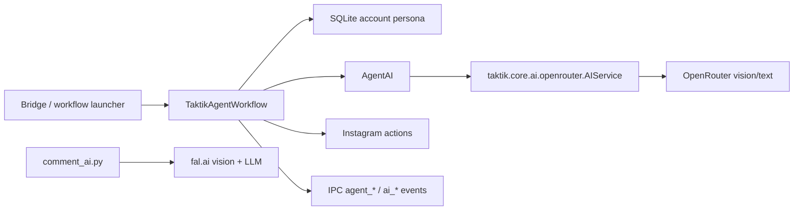
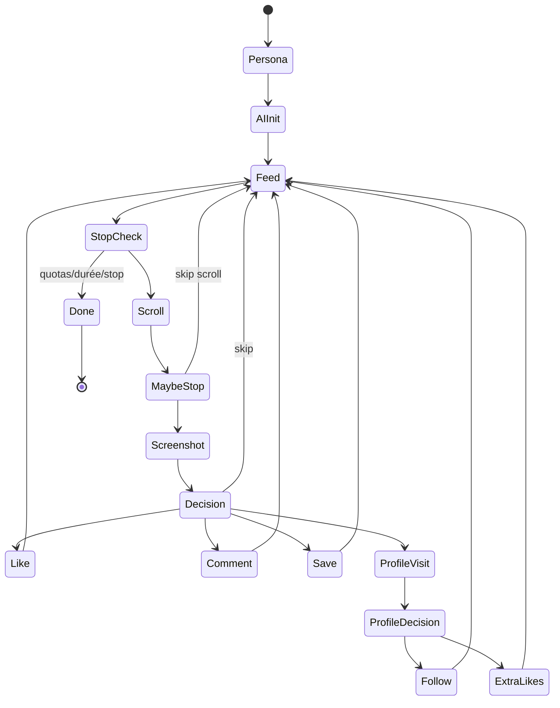
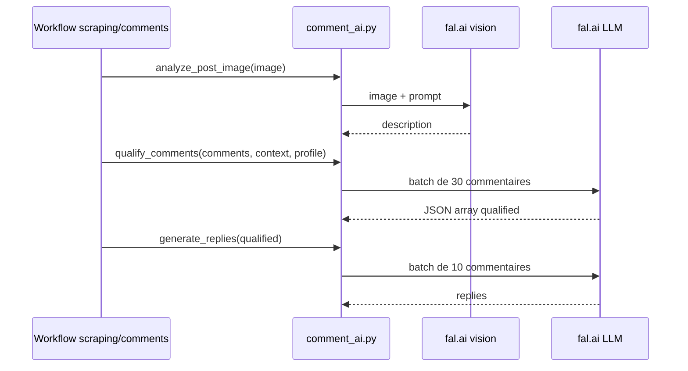

# Core Bot — Agent autonome et IA

> **Périmètre : `[Bot]`**
> Cette page couvre `bot/taktik/core/agent/` et `bot/taktik/core/ai/`. Elle décrit la logique IA côté Python ; les clés OpenRouter/fal.ai et l'affichage UI sont documentés côté desktop/settings.

Le core IA contient deux familles :

| Dossier | Rôle |
|---|---|
| `agent/kernel/` | Contrats, contexte, registre, executor et runtime de plan. |
| `agent/io/` | Manifest workflows et payloads JSON-safe plan/events. |
| `agent/decision/` | Décisions IA locales à une action. |
| `agent/scenarios/` | Scénarios legacy, dont l'autopilot Instagram-first. |
| `ai/` | Fonctions IA réutilisables pour qualification de commentaires et génération de réponses. |

> Evolution cible : la page [Taktik Agent autonome](taktik-agent-autonomous-orchestration.md) decrit le refactor prevu pour transformer l'agent actuel en orchestrateur multi-workflows avec memoire chronologique, planner, policy et narration temps reel.

## Carte



## Arborescence

```text
taktik/core/
├── agent/
│   ├── kernel/
│   ├── io/
│   ├── decision/
│   │   └── agent_ai.py
│   └── scenarios/
│       └── instagram_feed_autopilot.py
└── ai/
    └── comment_ai.py
```

## `AgentAI`

Fichier : `agent/decision/agent_ai.py`.

`AgentAI` est le cerveau décisionnel du Taktik Agent. Il prend des screenshots, une persona et retourne une décision JSON normalisée.

### Décision Feed

Méthode : `decide_feed_action(screenshot_path, persona_block, author_username="unknown")`.

| Champ retourné | Rôle |
|---|---|
| `action` | `skip`, `like`, `like_comment` ou `like_save`. |
| `visit_profile` | Indique si l'agent doit visiter le profil auteur. |
| `comment` | Commentaire naturel si `like_comment`. |
| `reason` | Justification courte. |
| `cost_usd` | Coût retourné par le service IA. |
| `model` | Modèle utilisé. |

Règles du prompt :

| Action | Cible comportementale |
|---|---|
| `skip` | Majoritaire, environ 52 %. |
| `like` | Contenu pertinent, environ 35 %. |
| `like_comment` | Commentaire utile, environ 8 %. |
| `like_save` | Contenu à sauvegarder, environ 5 %. |

### Décision Profil

Méthode : `decide_profile_follow(screenshot_path, persona_block, profile_username="unknown")`.

| Champ retourné | Rôle |
|---|---|
| `follow` | Follow ou skip. |
| `extra_likes` | `0`, `1` ou `2` posts supplémentaires à liker. |
| `reason` | Justification. |
| `cost_usd`, `model` | Métadonnées IA. |

La méthode force `extra_likes` entre `0` et `2` et fallback en skip si l'appel IA ou le parsing JSON échoue.

## Events IA

Quand `ipc` est fourni, `AgentAI` émet :

| Event | Moment |
|---|---|
| `ai_screenshot_analyzing` | Avant analyse d'un post. |
| `ai_screenshot_analyzed` | Après analyse feed. |
| `agent_decision` | Décision finale feed. |
| `ai_profile_analyzing` | Avant analyse profil. |
| `ai_profile_analyzed` | Après analyse profil. |

## `TaktikAgentWorkflow`

Fichier : `agent/scenarios/instagram_feed_autopilot.py`.

Workflow autonome, actuellement Instagram-first.

### Flux



### Initialisation

| Étape | Détail |
|---|---|
| Persona | Va sur le profil du compte bot via actions Instagram, extrait username/bio, charge le contexte SQLite. |
| `UserProfile` | Construit un bloc prompt avec niche, objectif, service, audience, ton, contexte. |
| IA | Initialise un provider injecte depuis le bridge, actuellement `taktik.core.ai.openrouter.AIService`, avec `openrouter_api_key` ou `OPENROUTER_API_KEY`. |
| Hashtags | Génère un pool de hashtags exploratoires après initialisation IA. |
| Feed | Navigue vers le home feed Instagram. |

### Config Et Quotas

| Clé config | Défaut | Rôle |
|---|---:|---|
| `max_likes` | `80` | Limite likes. |
| `max_comments` | `15` | Limite commentaires. |
| `max_follows` | `20` | Limite follows. |
| `max_profile_visits` | `40` | Limite visites profil. |
| `max_posts_seen` | `150` | Limite posts parcourus. |
| `session_duration_min` | `25` | Durée max session. |
| `openrouter_api_key` | env fallback | Clé IA. |
| `vision_model` | service default | Modèle vision optionnel. |

Statistiques :

| Stat | Rôle |
|---|---|
| `likes`, `comments`, `follows` | Actions réalisées. |
| `profile_visits` | Profils visités. |
| `posts_seen`, `posts_stopped` | Navigation feed. |
| `session_cost_usd` | Coût IA cumulé. |

### Stratégie

| Mécanisme | Valeur |
|---|---|
| `POST_STOP_RATE` | `80`, probabilité de s'arrêter sur un post. |
| `CONSECUTIVE_SKIP_THRESHOLD` | `7`, déclenche exploration hashtag. |
| `HASHTAG_POSTS_PER_BURST` | `5`, nombre de posts hashtag par burst. |
| Délais actions | Like `1.5-3.5s`, comment `3-6s`, follow `2-4s`, scroll `1-2.5s`. |

## `comment_ai.py`

Fichier : `ai/comment_ai.py`.

Module IA context-aware pour qualification de commentaires et génération de réponses.

### `UserProfile`

Dataclass source de vérité pour les prompts IA.

| Champ | Rôle |
|---|---|
| `username`, `bio`, `platform` | Identité. |
| `niche` | Domaine du compte. |
| `objective` | Objectif business. |
| `services` | Produits/services proposés. |
| `target_audience` | Audience cible. |
| `personality` | Ton/personnalité. |
| `custom_context` | Contexte libre. |

`to_prompt_block()` transforme cette dataclass en bloc prompt lisible par le LLM.

### Fonctions IA

| Fonction | Modèle/service | Rôle |
|---|---|---|
| `analyze_post_image(api_key, image_path)` | `fal-ai/llava-next` | Décrit l'image d'un post. |
| `qualify_comments(api_key, comments, post_context, user_profile, custom_criteria)` | `fal-ai/any-llm/router` | Marque les commentaires pertinents. |
| `generate_replies(api_key, qualified_comments, post_context, user_profile, custom_instructions)` | `fal-ai/any-llm/router` | Génère des réponses naturelles dans la langue du commentaire. |

### Pipeline Commentaires



## Limites Connues

| Sujet | État |
|---|---|
| Agent autonome | Instagram-first, même si le commentaire indique une ambition multi-plateforme. |
| Dépendance IA | `TaktikAgentWorkflow` utilise `AIService` OpenRouter ; `comment_ai.py` utilise fal.ai. |
| JSON strict | Les prompts demandent du JSON pur ; un fallback extrait le premier objet/tableau JSON si le modèle ajoute du texte. |
| Coûts | L'agent remonte les coûts du service IA, mais le suivi global dépend du bridge/UI consommateur. |

## Règle De Maintenance

1. Toute nouvelle décision IA doit retourner un schéma JSON explicite.
2. Les prompts doivent rester proches du workflow qui les consomme.
3. Les events IA doivent être documentés dans le protocole IPC si exposés au Front.
4. Les règles de quotas doivent être visibles dans la doc dès qu'elles changent.
