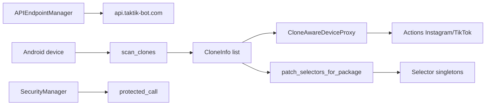
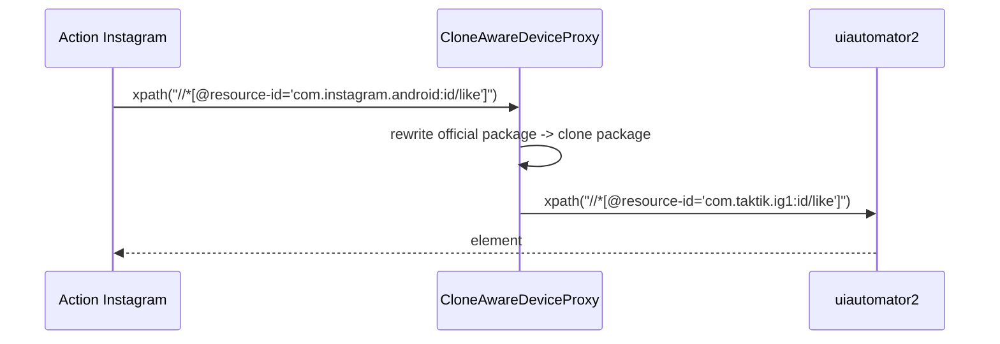

# Core Bot — Config, clones et sécurité

> **Périmètre : `[Bot]`**
> Cette page couvre `bot/taktik/core/app/config/`, `bot/taktik/core/clone/` et `bot/taktik/core/app/security/`. Ces modules sont transversaux : ils ne sont pas propres à une seule plateforme.

## Vue D'ensemble



## Arborescence

```text
taktik/core/
├── app/
│   ├── config/
│   │   └── runtime/
│   │       └── api_endpoints.py
│   └── security/
│       └── protection/
│           └── runtime.py
├── clone/
│   ├── detection/
│   │   └── detector.py
│   ├── device/
│   │   └── proxy.py
│   ├── packages/
│   │   └── package_map.py
│   └── selectors/
│       └── patcher.py
```

## Config API

Fichier : `app/config/runtime/api_endpoints.py`.

`APIEndpointManager` résout l'URL de l'API TAKTIK.

### Résolution

| Priorité | Source |
|---|---|
| 1 | Variable d'environnement `TAKTIK_API_URL`. |
| 2 | Fichier `~/.taktik/api_config.json`. |
| 3 | Endpoint officiel encodé : `https://api.taktik-bot.com`. |

### API

| Élément | Rôle |
|---|---|
| `get_api_url()` | Retourne l'URL active sans slash final. |
| `set_api_url(url)` | Sauvegarde dans `~/.taktik/api_config.json`. |
| `_test_endpoint(url)` | Teste `GET /health`. |
| `_rotate_endpoints()` | Rotation journalière de la liste officielle. |

Le module expose un singleton `api_endpoint_manager`.

## Support APK Clonées

Le package `clone/` gère les apps Instagram/TikTok clonées : packages modifiés, resource IDs réécrits, selectors patchés.

### `scan_clones()`

Fichier : `clone/detection/detector.py`.

| Élément | Détail |
|---|---|
| Plateformes | `instagram`, `tiktok`. |
| Commande | `adb -s <device> shell pm list packages`. |
| Détection Instagram | Préfixe `com.instagram.andro`. |
| Détection TikTok | Préfixe `com.zhiliaoapp.musical`. |
| Versions | Option `detect_versions=True` via `dumpsys package`. |

`CloneInfo` :

| Champ | Rôle |
|---|---|
| `package` | Package complet. |
| `is_original` | Original ou clone. |
| `clone_suffix` | Différence lisible. |
| `label` | Label UI. |
| `version` | Version optionnelle. |

### Proxy Device Clone-Aware

Fichier : `clone/device/proxy.py`.

`CloneAwareDeviceProxy` enveloppe un device uiautomator2 et réécrit à la volée :

| Zone | Exemple |
|---|---|
| `device(resourceId=...)` | `com.instagram.android:id/x` -> `com.taktik.ig1:id/x`. |
| `device.xpath(...)` | XPath contenant le package officiel. |
| UiObject chain | `.child()`, `.sibling()`, `.left()`, `.right()`, etc. |



### Selector Patcher

Fichier : `clone/selectors/patcher.py`.

`patch_selectors_for_package(platform, target_package)` modifie les singletons de selectors en place.

| Étape | Détail |
|---|---|
| Import domaines | Depuis `taktik.core.compat.selectors.setup`. |
| Parcours dataclass | Chaque champ `str` ou `List[str]`. |
| Remplacement | Package original -> package clone. |
| Retour | Nombre de strings modifiées. |

Utilisé notamment par les bridges account/publish quand `packageName` pointe vers une variante non officielle.

## Sécurité

Fichier : `app/security/protection/runtime.py`.

`SecurityManager` contient une couche d'obfuscation/protection historique.

| Élément | Rôle |
|---|---|
| `verify_integrity()` | Compare un hash calculé à l'initialisation. |
| `obfuscated_api_call()` | Décode un nom de fonction puis route l'appel. |
| `protected_call()` | Fonction module-level exposée. |
| `fake_local_check()`, `decoy_database_init()`, `misleading_api_bypass()` | Fonctions leurres/legacy. |

Points importants :

| Sujet | État |
|---|---|
| `_check_profile_with_api()` | Stub `pass`. |
| `_record_with_api()` | Stub `pass`. |
| Usage réel | À vérifier avant de considérer ce module critique. |
| Documentation | Le module est documenté comme legacy/protection, pas comme source de vérité métier. |

## Relations Avec Les Pages Existantes

| Sujet | Page liée |
|---|---|
| Architecture clones | [Support APK clonées](../architecture/clone-package-support.md) |
| Compat selectors | [Versioned Selectors](../compat/versioned-selectors.md) |
| Overrides YAML | [Overrides YAML](../compat/yaml-overrides.md) |
| Proxies anti-détection | [Gestion des proxys](../security/proxies.md) |

## Règle De Maintenance

1. Toute nouvelle plateforme clonable doit être ajoutée dans `clone/packages/package_map.py` (`ORIGINAL_PACKAGES`, `PACKAGE_VARIANTS`, `CLONE_PREFIXES`).
2. Un bridge qui lance un clone doit patcher les selectors avant de créer les actions/workflows.
3. Ne pas ajouter de resource-id clone spécifique dans les selectors : utiliser le patcher/proxy.
4. Les endpoints API doivent rester configurables via `TAKTIK_API_URL` pour dev/staging.
