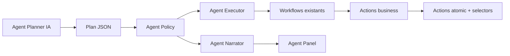
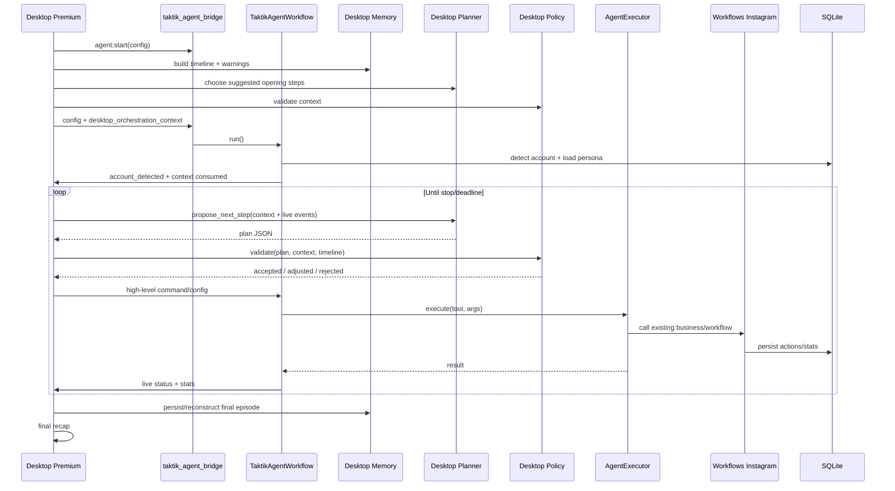

# [Transversal] Taktik Agent autonome - orchestration premium

## Role

Cette page decrit la cible technique pour transformer Taktik Agent en agent autonome transversal.

> **Etat courant verifie** : cette page est une architecture cible partiellement
> implementee, pas une description de feature totalement livree. Aujourd'hui,
> le code expose une V1 Instagram-first (`TaktikAgentWorkflow`) avec contexte
> desktop injecte, decisions IA feed/profil et burst hashtag. Les briques
> `AgentExecutor`, `AgentPolicy` desktop et `AgentPlanner` desktop restent a
> extraire/implementer.

L'objectif n'est pas d'ajouter un workflow de plus. L'objectif est de faire de Taktik Agent le cerveau premium qui pilote plusieurs workflows existants, choisit l'ordre des actions, explique ses choix a l'utilisateur et adapte sa journee a l'historique reel du compte.

## Frontiere open-source / premium

Le bot Python reste open-source. Il doit donc contenir les primitives reutilisables : actions atomiques, workflows executables, IA de decision locale a une action, instrumentation et emissions IPC.

L'orchestration complete de Taktik Agent est une valeur premium de l'application desktop. Elle doit rester cote Electron/React :

| Couche | Projet | Responsabilite |
|---|---|---|
| Orchestration premium | `front/electron/services/app/agent/` | Memoire chronologique, anti-patterns, choix de prochain outil, contexte injecte au bridge. |
| UX premium | `front/src/features/platforms/instagram/workflows/agent/` + Agent Panel | Controles, narration, affichage decisions, garde-fous. |
| Bridge | `front/electron/handlers/instagram/agent/taktikAgent.ts` | Licence, preparation du contexte premium, lancement du bridge Python. |
| Execution open-source | `bot/taktik/core/agent/scenarios/instagram_feed_autopilot.py` | Consommer le contexte desktop, executer feed/hashtag/actions, renvoyer stats/events. |
| Primitives open-source | `bot/taktik/core/social_media/instagram/` | Navigation, selectors, actions business, workflows reutilisables. |

Regle importante : le bot ne doit pas reconstruire seul toute la memoire, ne doit pas contenir le planner premium complet, et ne doit pas devenir le produit SaaS a lui seul.

Fichiers actuels concernes :

| Fichier | Role actuel |
|---|---|
| `bot/taktik/core/agent/scenarios/instagram_feed_autopilot.py` | Workflow autonome Instagram-first, principalement feed + burst hashtag. |
| `bot/taktik/core/agent/decision/agent_ai.py` | Decisions IA vision pour posts feed et profils. |
| `bot/bridges/instagram/agent/taktik_agent.py` (`taktik_agent_bridge`) | Bridge Python lance par Electron pour Taktik Agent. |
| `front/src/features/platforms/instagram/workflows/agent/TaktikAgent.tsx` | Page front de lancement du workflow agent. |
| `front/src/features/workspace/agent/components/AgentPanel.tsx` | Panneau conversationnel qui affiche l'activite IA. |

## Vision produit

Taktik Agent doit agir comme un assistant operationnel :

1. detecter le compte Instagram courant ;
2. charger la persona et les objectifs du compte ;
3. relire l'historique recent dans l'ordre chronologique ;
4. expliquer a l'utilisateur ce qui s'est passe lors de la derniere session utile ;
5. proposer ou demarrer un plan de session varie ;
6. executer des actions haut niveau avec les workflows existants ;
7. commenter en temps reel ce qu'il fait et pourquoi ;
8. terminer par un recap lisible et exploitable.

Exemple attendu cote Agent Panel :

```text
Bonjour Kevin. Je pilote @taktik_r2d2 aujourd'hui.

Hier, on a commence par 8 minutes de feed, puis on a regarde 5 stories,
ensuite on a teste deux hashtags autour de l'automatisation Instagram.
Les meilleurs signaux sont venus des profils UGC et restaurants locaux.

Aujourd'hui je vais eviter de repartir exactement sur le meme ordre.
Je commence doucement par quelques stories d'amis, puis je lirai les DM,
avant de passer sur une petite exploration hashtag.
```

## Principe cle

L'IA ne doit pas piloter directement les taps Android.

Elle choisit des intentions haut niveau. Le code execute ensuite des outils controles, testes et limites.



## Architecture cible

```text
taktik/core/agent/
+-- kernel/
|   +-- contracts.py
|   +-- context.py
|   +-- registry.py
|   +-- executor.py
|   +-- runtime.py
+-- io/
|   +-- manifest.py
|   +-- plan.py
|   +-- events.py
+-- decision/
|   +-- agent_ai.py
+-- scenarios/
    +-- instagram_feed_autopilot.py
```

### `AgentContext`

Objet en memoire pour la session courante.

| Champ | Role |
|---|---|
| `platform` | `instagram` au depart, extensible plus tard. |
| `account_username` | Compte automatise. |
| `account_id` | ID SQLite si connu. |
| `persona_block` | Persona issue du profil compte. |
| `session_started_at` | Timestamp debut. |
| `live_stats` | Stats de session en cours. |
| `recent_timeline` | Chronologie des dernieres sessions utiles. |
| `available_targets` | Cibles candidates issues de Target Search / profile_following / historiques. |
| `last_tool` | Dernier outil execute. |
| `last_error` | Derniere erreur exploitable. |

### Memoire premium desktop

La memoire ne doit pas etre un simple resume agrege, mais elle doit etre construite cote desktop.

Elle doit reconstruire une timeline ordonnee de ce qui s'est passe, car l'ordre des actions est essentiel pour eviter des routines trop previsibles.

Sources probables :

| Source SQLite | Donnees utiles |
|---|---|
| `sessions` / `scraping_sessions` | Debut/fin, workflow, compte, statut, duree. |
| `interaction_history` | Actions realisees, profils cibles, timestamps, statut. |
| `instagram_profiles` | Profils visites/scrapes, niche, score IA, image, bio. |
| `profile_following` | Graphe social collecte par Deep Qualify. |
| `sent_dms` / tables DM | Historique de conversations ou messages envoyes. |
| `ai_screenshots` / `ai_post_screenshots` | Contexte visuel si exploitable. |

### Format timeline

La memoire doit produire des episodes normalises.

```json
{
  "episode_id": "2026-05-24T08:31:20Z-feed-001",
  "started_at": "2026-05-24T08:31:20Z",
  "ended_at": "2026-05-24T08:39:45Z",
  "platform": "instagram",
  "account_username": "taktik_r2d2",
  "workflow_type": "feed",
  "tool": "browse_feed",
  "intent": "warmup_and_engage",
  "targets": ["marinadescond", "adjo.therese"],
  "actions": [
    {
      "at": "2026-05-24T08:33:10Z",
      "type": "story_view",
      "target": "marinadescond",
      "result": "ok"
    },
    {
      "at": "2026-05-24T08:35:02Z",
      "type": "like",
      "target": "adjo.therese",
      "result": "ok"
    }
  ],
  "outcome": {
    "likes": 1,
    "comments": 0,
    "follows": 0,
    "dm_replies": 0,
    "profiles_qualified": 0,
    "errors": 0
  },
  "notes": "Feed warmup, no hashtag exploration.",
  "risk_tags": ["same_start_as_previous_day"]
}
```

### Memoire utile au planner

Le planner doit recevoir une version courte mais ordonnee.

```text
RECENT TIMELINE
- 2026-05-24 08:31 -> 08:39: feed warmup
  sequence: profile_detected -> feed_scroll -> story_view x5 -> like x1
  targets: @marinadescond, @adjo.therese
  outcome: low engagement, no errors

- 2026-05-24 08:40 -> 08:54: hashtag exploration
  sequence: hashtag #ugc -> post_view x6 -> like x2 -> profile_visit x1
  outcome: good relevance, one profile followed

PATTERN WARNINGS
- The last two sessions both started with feed.
- Avoid starting with hashtag #ugc again today.
- DM inbox was not checked in the last 3 sessions.
```

## Agent Planner

Le planner choisit la prochaine etape a partir du contexte.

Il doit retourner du JSON strict.

```json
{
  "say": "Je vais commencer par lire les DM, on ne les a pas verifies depuis plusieurs sessions.",
  "tool": "read_dm_inbox",
  "args": {
    "max_conversations": 10,
    "generate_replies": true,
    "send_automatically": false
  },
  "reason": "La timeline montre que les DM n'ont pas ete traites recemment.",
  "expected_duration_sec": 180,
  "risk_level": "low"
}
```

### Outils autorises

| Tool | Workflow/code reutilise | Role |
|---|---|---|
| `view_feed_stories` | `StoryBusiness.view_feed_stories()` | Regarder/reagir aux stories d'amis depuis le feed. |
| `browse_feed` | `FeedBusiness.interact_with_feed()` ou sous-actions feed | Scroller, liker, commenter, visiter profils. |
| `explore_hashtag` | Navigation hashtag + logique Taktik Agent existante | Explorer un hashtag choisi par IA ou par historique. |
| `target_search_pick` | Target Search SQLite/Electron a exposer cote Bot si necessaire | Choisir une cible pertinente existante. |
| `visit_profile` | `NavigationActions`, `ProfileBusiness` | Visiter et qualifier un profil. |
| `deep_qualify_profile` | `workflows/scraping/deep_qualify.py` | Collecter following sample et enrichir graphe. |
| `read_dm_inbox` | Workflow DM responses | Lire conversations et classifier reponse possible. |
| `reply_dm` | Workflow DM responses | Envoyer ou proposer une reponse. |
| `smart_comment` | Smart Comment workflow | Generer/commenter sur contenu pertinent. |
| `cooldown_pause` | HumanBehavior | Pause assumee entre blocs. |
| `session_summary` | Desktop orchestration + live stats bot | Recap final. |

## Agent Policy premium

`AgentPolicy` filtre les plans avant execution. Cette brique doit vivre cote desktop.

Objectif : garder un comportement varie, raisonnable et compatible avec les limites de compte.

| Regle | Exemple |
|---|---|
| Pas de repetition de sequence | Ne pas faire `feed -> hashtag -> feed` tous les jours dans le meme ordre. |
| Cooldown par workflow | Eviter deux blocs hashtag consecutifs si le premier vient de finir. |
| Cooldown par cible | Eviter de revisiter le meme profil trop souvent. |
| Mix intensite faible/forte | Alterner actions passives (stories/feed read) et actions engageantes (like/follow/comment). |
| Stop sur erreurs | Si navigation ou selector casse, basculer vers une etape plus sure ou terminer. |
| Quotas session | Respecter les limites locales de la session et l'etat reel des stats. |
| Respect DM | Ne jamais envoyer automatiquement sans config explicite. |
| Duree globale | Garder une limite de session et des pauses. |

### Anti-repetition

La politique doit comparer le plan propose avec la timeline recente.

Exemples de signaux :

| Signal | Decision possible |
|---|---|
| Meme premier workflow que la veille | Choisir un autre demarrage si possible. |
| Meme hashtag utilise dans les dernieres sessions | Decaler vers un hashtag voisin ou target search. |
| Trop de likes recents sans actions passives | Ajouter stories/feed read/cooldown. |
| Trop de follows dans les dernieres sessions | Privilegier commentaire, DM ou qualification. |
| DMs jamais lus recemment | Inserer un bloc inbox. |

## Agent Narrator premium

Le narrateur transforme l'etat technique en messages utiles pour l'utilisateur. Cette brique doit vivre cote desktop / Agent Panel.

Il ne doit pas inventer des actions. Il parle a partir :

- du plan accepte ;
- des events d'execution ;
- des stats live ;
- des erreurs remontees ;
- de la memoire reelle.

Types de messages :

| Moment | Exemple |
|---|---|
| Greeting | "Bonjour, je reprends le compte @x. Je relis la derniere session." |
| Recap memoire | "Hier, on a termine par un bloc hashtag puis une visite profil." |
| Plan | "Je vais eviter de recommencer par hashtag aujourd'hui." |
| Action en cours | "Je regarde quelques stories d'amis, c'est une entree en session douce." |
| Decision IA | "Ce post est pertinent pour la niche, je le like mais je ne commente pas." |
| Changement de strategie | "Le feed donne peu de signaux, je passe sur une cible issue de Target Search." |
| Erreur | "La page ne repond pas comme prevu, je reviens au feed avant de continuer." |
| Recap final | "Session terminee : 6 stories, 4 likes, 1 DM propose, aucun follow." |

## Sequence cible



## Stockage historique

Deux options existent.

### Option A - reconstruire depuis les tables existantes

Avantages :

- aucun schema nouveau au depart ;
- faible risque ;
- compatible avec les donnees existantes.

Limites :

- certains evenements n'ont pas le meme niveau de detail ;
- les transitions de strategie ne sont pas toujours persistantes ;
- il faut parser plusieurs tables.

### Option B - ajouter une table `agent_timeline_events`

Table dediee pour l'agent.

```sql
CREATE TABLE agent_timeline_events (
  event_id INTEGER PRIMARY KEY AUTOINCREMENT,
  session_id INTEGER,
  platform TEXT NOT NULL,
  account_username TEXT,
  event_type TEXT NOT NULL,
  workflow_type TEXT,
  tool_name TEXT,
  target_username TEXT,
  message TEXT,
  payload_json TEXT,
  created_at TEXT DEFAULT CURRENT_TIMESTAMP
);
```

Avantages :

- ordre exact conserve ;
- facile a rejouer dans l'Agent Panel ;
- tres utile pour les futurs refactors et analyses.

Limites :

- migration Python + Electron ;
- documentation DB a maintenir ;
- risque de doublon si mal synchronise avec `interaction_history`.

### Recommandation

Commencer par Option A pour refactor sans migration.

Ajouter Option B ensuite, quand l'orchestrateur fonctionne et que les events a conserver sont stabilises.

## Integration Target Search

L'agent doit pouvoir exploiter les cibles deja connues.

Sources candidates :

| Source | Usage agent |
|---|---|
| Target Search | Choisir une cible pertinente selon score, niche, derniere interaction. |
| `profile_following` | Trouver des profils connectes a une cible qualifiee. |
| `instagram_profiles` | Reprendre des profils deja enrichis mais non encore contactes. |
| `interaction_history` | Eviter les profils deja trop sollicites. |

Strategie possible :

1. demander a la memoire desktop une shortlist ;
2. filtrer les profils recemment contactes ;
3. choisir une cible selon persona + score + fraicheur ;
4. visiter/qualifier/interagir avec prudence ;
5. persister le resultat.

## Premier refactor conseille

Ne pas commencer par une grosse IA omnisciente.

Etape 1 : refactor mecanique sans changer le comportement visible.

| Etape | Changement |
|---|---|
| 1 | Garder `AgentContext` cote bot comme contexte runtime minimal. |
| 2 | Construire `AgentOrchestrationContextService` cote Electron. |
| 3 | Injecter `desktop_orchestration_context` dans la config bridge. |
| 4 | Extraire ensuite des commandes haut niveau pilotables depuis Electron. |
| 5 | Ajouter `view_feed_stories` comme premier outil autonome. |
| 6 | Ajouter `AgentPolicy` et `AgentPlanner` cote desktop. |
| 7 | Brancher DM / Smart Comment / Target Search depuis le planner desktop. |

### Etat implementation

| Brique | Etat | Fichiers |
|---|---|---|
| `AgentContext` bot | Implante V1 minimal | `bot/taktik/core/agent/kernel/context.py` |
| `AgentOrchestrationContextService` desktop | Implante V1 | `front/electron/services/app/agent/orchestration/AgentOrchestrationContextService.ts` |
| Injection bridge | Implante V1 | `front/electron/handlers/instagram/agent/taktikAgent.ts` |
| Consommation contexte bot | Implante V1 | `bot/taktik/core/agent/scenarios/instagram_feed_autopilot.py` |
| `AgentExecutor` | A faire | Extraction prochaine etape |
| `AgentPolicy` desktop | A faire | Anti-repetition executable premium |
| `AgentPlanner` desktop | A faire | Rule-based puis IA JSON premium |

La V1 actuelle ne change pas encore la logique feed/hashtag existante. Elle prepare le contexte premium cote desktop, l'injecte dans le bridge, puis le bot le consomme sans embarquer la logique complete.

## Planner rule-based avant planner IA

Avant de confier le plan a un LLM, un planner deterministe peut deja produire de bons comportements.

Exemple :

```text
if last_session_started_with == "feed":
    start_with = "read_dm_inbox" or "view_feed_stories"
elif dm_not_checked_for >= 3 sessions:
    start_with = "read_dm_inbox"
elif target_search_has_fresh_profiles:
    start_with = "target_search_pick"
else:
    start_with = "browse_feed"
```

Cette couche donne un fallback fiable si l'IA echoue.

## Points de vigilance

| Sujet | Risque | Garde-fou |
|---|---|---|
| Fichier monolithique | `scenarios/instagram_feed_autopilot.py` devient ingérable | Extraire les commandes haut niveau vers des handlers enregistres dans `kernel/registry.py`. |
| IA trop libre | Actions non supportees ou dangereuses | JSON schema + whitelist tools. |
| Patterns repetes | Meme sequence quotidienne | Timeline ordonnee + policy anti-repetition. |
| Double comptage stats | Agent + workflow incrementent chacun | Centraliser resultats d'outil. |
| DMs | Envoi automatique sensible | Mode suggestion par defaut, auto-send explicite. |
| DB | Nouvelle table trop tot | Reconstruire d'abord depuis l'existant. |
| Front | Agent Panel duplique les pages workflows | Agent Panel = narration/decisions, pages = controles/detail. |

## Definition de "termine" pour la V1

La V1 autonome est terminee quand :

1. l'agent charge une timeline ordonnee des dernieres sessions ;
2. il explique le recap precedent dans l'Agent Panel ;
3. il choisit un ordre de blocs different selon l'historique ;
4. il execute au moins 3 outils haut niveau : stories feed, feed browse, hashtag explore ;
5. il conserve les stop/duree/limites locales ;
6. il produit un recap final ;
7. le comportement existant feed/hashtag reste fonctionnel.

## Documentation a maintenir avec l'implementation

Quand cette architecture sera codee, mettre a jour :

| Page | Changement attendu |
|---|---|
| `core/agent-ai.md` | Remplacer "workflow feed/hashtag" par architecture orchestrateur. |
| `bridges/instagram.md` | Documenter les nouveaux events agent si ajoutes. |
| `bridges/ipc-protocol.md` | Lister `agent_plan`, `agent_tool_started`, `agent_tool_completed` si crees. |
| `database/schema.md` | Ajouter `agent_timeline_events` si Option B retenue. |
| `desktop/agent-panel.md` | Distinguer narration agent, decisions IA et controles utilisateur. |
| `taktik-docs/marketing/feature-overview.md` | Decrire Taktik Agent comme assistant autonome transversal. |
