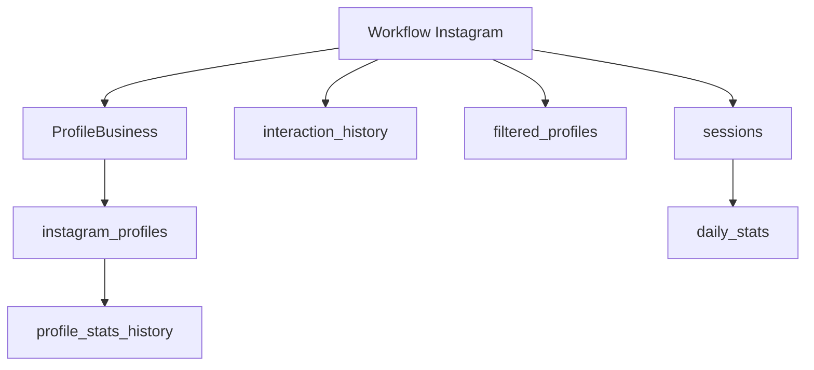
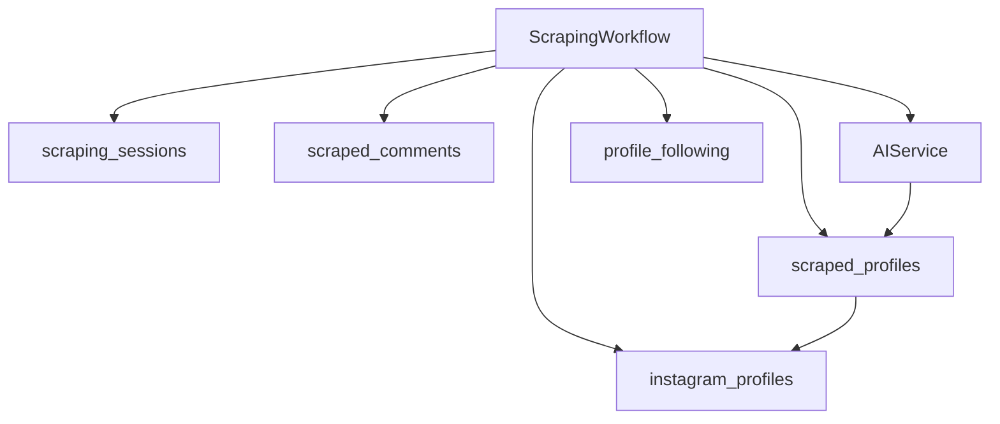
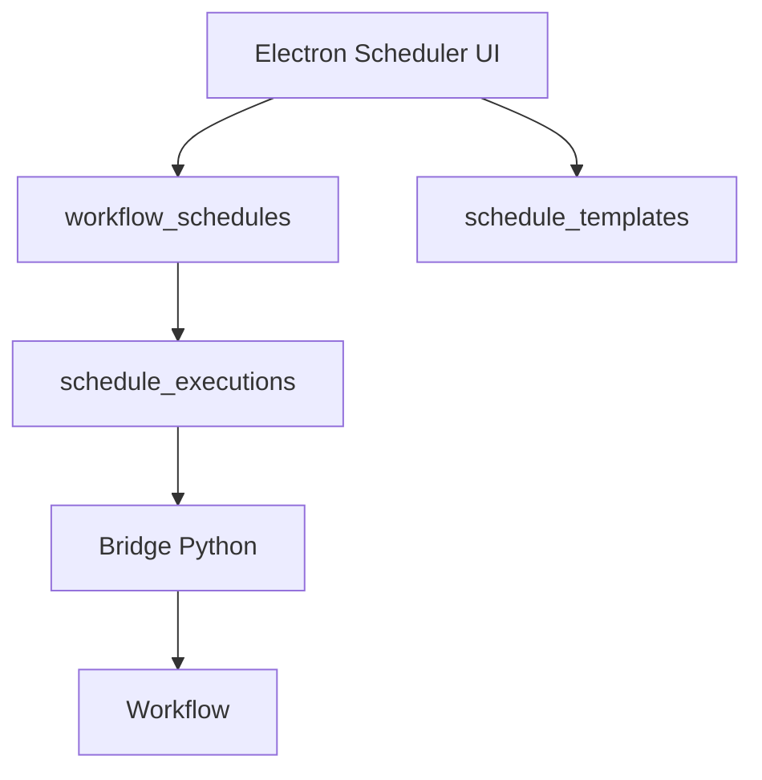

# Base SQLite - Vue d'ensemble

La base SQLite locale est le socle de persistance de TAKTIK Desktop.

Elle est partagee entre :

- Electron, via `better-sqlite3` ;
- Python, via `sqlite3` natif ;
- les workflows Instagram/TikTok/Gmail ;
- les repositories locaux ;
- certains panneaux UI qui lisent l'historique, les profils, les sessions et les resultats IA.

Pour la reference exhaustive de chaque table et colonne, voir [Schema SQLite complet](schema.md).

## Emplacement et mode

```text
%APPDATA%/taktik-desktop/taktik-data.db
```

| Reglage | Valeur |
|---|---|
| Journal | WAL |
| Foreign keys | `PRAGMA foreign_keys=ON` |
| Acces Electron | Synchrone, `better-sqlite3` |
| Acces Python | `sqlite3`, services/repositories locaux |

## Sources du schema

Le schema doit rester synchronise entre Python et Electron.

| Cote | Fichier | Role |
|---|---|---|
| Python | `bot/taktik/core/database/local/schema.py` | Tables de base |
| Python | `bot/taktik/core/database/local/migrations.py` | Colonnes/tables ajoutees apres release |
| Electron | `front/electron/database/schema.sql` | Schema SQL charge en priorite |
| Electron | `front/electron/database/schema.ts` | Fallback inline si `schema.sql` est absent |
| Electron | `front/electron/database/migrations.ts` | Migrations desktop |

## Domaines de tables

| Domaine | Tables principales |
|---|---|
| Instagram comptes/profils | `instagram_accounts`, `instagram_profiles`, `profile_stats_history` |
| Instagram interactions | `interaction_history`, `filtered_profiles`, `sessions`, `daily_stats` |
| Instagram scraping | `scraping_sessions`, `scraped_profiles`, `scraped_comments` |
| Instagram social graph | `profile_following` |
| Instagram sync | `following_sync`, `followers_sync` |
| Instagram smart comments | `smart_comment_sessions`, `smart_comment_replies` |
| DMs | `sent_dms` |
| TikTok | `tiktok_accounts`, `tiktok_profiles`, `tiktok_sessions`, `tiktok_scraped_profiles`, etc. |
| Gmail | `gmail_accounts` |
| Scheduler | `workflow_schedules`, `schedule_templates`, `schedule_executions` |
| UI/App | `tutorial_progress`, `device_groups` |
| IA/images | `ai_post_screenshots`, `ai_screenshots`, `profile_images` |
| Sync cross-device | `_sync_state` |

## Flux Instagram profil



## Flux scraping



## Flux scheduler



## Ownership

| Table | Ecrit principalement par | Lu principalement par |
|---|---|---|
| `instagram_profiles` | Python workflows, Electron imports | Electron UI, Python filters |
| `scraping_sessions` | Python scraping | Electron history |
| `scraped_profiles` | Python scraping + qualification IA | Electron scraping history, Target Search, scheduler |
| `profile_following` | Python deep qualify | Electron Target Search detail sheet |
| `smart_comment_sessions` | Electron smart comment flow | Electron UI |
| `sent_dms` | Electron/Python DM flows | DM dedup |
| `workflow_schedules` | Electron scheduler | Electron scheduler runtime |
| `_sync_state` | Electron sync layer | Electron sync layer |

## Repositories

Les repositories documentes dans [Repositories](repositories.md) encapsulent les acces les plus frequents.

Regle pratique :

- si un workflow Python manipule des profils/sessions, chercher d'abord dans `bot/taktik/core/database/local/` ;
- si une vue Electron affiche de l'historique ou des panneaux UI, chercher dans `front/electron/database/` ;
- si une table existe dans Python et Electron, verifier les deux schemas avant modification.

## Avant de modifier le schema

1. Modifier la definition Python si le bot ecrit la donnee.
2. Modifier la definition Electron si l'UI lit/ecrit la donnee.
3. Ajouter une migration des deux cotes si la table existe deja en production.
4. Mettre a jour [Schema SQLite complet](schema.md).
5. Mettre a jour les repositories et types TypeScript si necessaire.

## Pages liees

| Page | Role |
|---|---|
| [Schema SQLite complet](schema.md) | Reference exhaustive tables/colonnes/index/FK |
| [Repositories](repositories.md) | Organisation des acces DB |
| [Modeles de donnees](models.md) | Modeles Python/TypeScript utiles |
| [Scraping & qualification](../modules/instagram/scraping-workflows.md) | Workflows qui remplissent les tables de scraping et de qualification |
| [Carte d'interaction](../architecture/application-map.md) | Vue globale app/bridges/workflows/DB |
