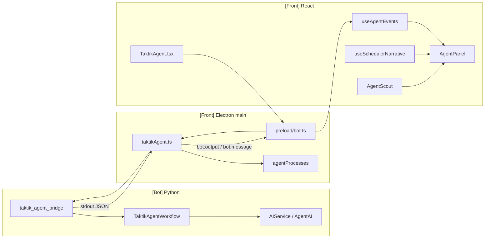
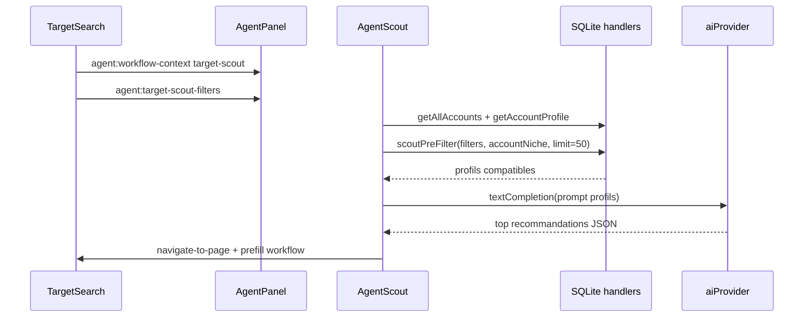

# Agent Panel

> **Perimetre : `[Front]` avec liens `[Transversal]`**
> Cette page documente le panneau Agent de l'application desktop. Il ne correspond pas a un seul workflow : c'est un panneau global qui agrege les evenements IA, les decisions du Taktik Agent, le scraping avec Deep qualify, Target Scout et la narration du Scheduler.

## Role

`AgentPanel` est le flux temps reel de l'application. Il sert a montrer ce que "pense" ou fait l'IA pendant :

- le Taktik Agent Instagram autonome ;
- les workflows Instagram avec IA ;
- le scraping enrichi et Deep qualify ;
- Target Search / AI Target Scout ;
- la creation de scheduler par IA ;
- les executions scheduler, notamment les uploads TikTok/YouTube/Instagram.

Il est volontairement global : plusieurs pages peuvent lui envoyer du contexte via des events DOM, pendant que les bridges Python l'alimentent via `bot:output`.

## Fichiers concernes

| Couche | Fichier | Role |
|---|---|---|
| Panel UI | `front/src/features/workspace/agent/components/AgentPanel.tsx` | Affichage principal, cartes, scheduler view, modales, Target Scout. |
| Types | `front/src/features/workspace/agent/types.ts` | `AgentEvent`, event types, scheduler narrative, scout types. |
| Events hook | `front/src/features/workspace/agent/hooks/useAgentEvents.ts` | Parse `bot:output`, stocke les events par device, gere les events DOM. |
| Scheduler hook | `front/src/features/workspace/agent/hooks/useSchedulerNarrative.ts` | Convertit les events scheduler en narration lisible. |
| Dispatch helper | `front/src/features/workspace/agent/services/dispatch.ts` | API DOM pour pousser des events depuis n'importe quel composant Front. |
| Target Scout | `front/src/features/workspace/agent/modes/AgentScout.tsx` | Sous-mode IA qui prefiltre et classe les profils Target Search. |
| Page Agent | `front/src/features/platforms/instagram/workflows/agent/TaktikAgent.tsx` | Formulaire de lancement du Taktik Agent. |
| Handler Electron | `front/electron/handlers/instagram/agent/taktikAgent.ts` | `agent:start`, `agent:stop`, `agent:status`. |
| Preload | `front/electron/preload/platforms/instagram/bot.ts` | Expose `startAgentSession`, `stopAgentSession`, `onBotOutput`, etc. |
| Bridge Python | `bot/bridges/instagram/agent/taktik_agent.py` (`taktik_agent_bridge`) | Lance `TaktikAgentWorkflow`. |
| Bot core | `bot/taktik/core/agent/*` | Decisions IA et workflow autonome. |

## Vue d'ensemble



## Lancement du Taktik Agent

La page `TaktikAgent.tsx` construit une config et appelle :

```ts
window.electronAPI.startAgentSession({
  deviceId,
  packageName,
  openrouter_api_key,
  session_duration_min,
  max_likes,
  max_comments,
  max_follows,
  max_profile_visits,
  skip_reels
})
```

Le preload route vers `agent:start`.

### Handler `agent:start`

`front/electron/handlers/instagram/agent/taktikAgent.ts` :

1. sanitize `deviceId` ;
2. verifie la licence via `licenseService.verifyDeviceAction(deviceId, 'bot_session')` ;
3. refuse si un agent tourne deja pour ce device ;
4. choisit le bridge :
   - dev : `python bot/bridges/launcher.py taktik_agent_bridge <config>`;
   - package : `taktik_agent_bridge.exe <config>`;
5. enrichit la config avec `getPreferredVisionModel()` ;
6. ecrit `.agent_config_<device>.json` ;
7. spawn le process ;
8. stocke le process dans `agentProcesses` ;
9. diffuse `bot:workflow-started` avec `workflowType: 'taktik_agent'`.

### Stop

`agent:stop` combine plusieurs strategies :

| Etape | Detail |
|---|---|
| Graceful | Ecrit `{"command":"stop"}` dans stdin. |
| Kill process | `proc.kill('SIGKILL')`. |
| Kill tree | `killProcessTreeSync(pid, 'Agent')`. |
| Force-stop app | `adb shell am force-stop <packageName>`. |
| Cleanup | Retire le process de `agentProcesses` et oublie le package clone. |

## Events entrants

`useAgentEvents` ecoute `window.electronAPI.onBotOutput`, donc le flux brut `bot:output`. Il parse chaque ligne JSON emise par les bridges.

### Events Bot / bridge

| Message stdout JSON | Carte Agent | Usage |
|---|---|---|
| `profile_captured` | complete `profile_qualifying` | Detecte le compte actif ou complete une visite profil. |
| `profile_skipped` | `profile_skipped` | Affiche les skips de dedup DB. |
| `scraping_profile_visit` | `profile_qualifying` | Demarre une carte de qualification profil pendant scraping. |
| `scraping_dq_progress` | update `profile_qualifying` | Affiche le compteur Deep qualify following. |
| `post_url_found` | `post_url_found` | Montre l'URL source dedup pour hashtag/post likers. |
| `strategy_switch` | `strategy_switch` | Feed -> hashtag ou hashtag -> feed. |
| `agent_decision` | `feed_decision` | Decision IA : skip, like, like_comment, like_save. |
| `ai_*` | cartes IA standard | Commentaires, image, screenshot, profil, texte, erreurs. |

### Mapping `ai_*`

| Types Bot | Event Agent |
|---|---|
| `ai_comment_generating`, `ai_comment_start` | `comment_generating` |
| `ai_comment_ready`, `ai_comment_done` | `comment_ready` |
| `ai_image_generating`, `ai_image_start` | `image_generating` |
| `ai_image_ready`, `ai_image_done` | `image_ready` |
| `ai_screenshot_analyzing`, `ai_screenshot_start` | `screenshot_analyzing` |
| `ai_screenshot_analyzed`, `ai_screenshot_done` | `screenshot_analyzed` |
| `ai_profile_analyzing`, `ai_profile_start` | `profile_analyzing` |
| `ai_profile_analyzed`, `ai_profile_done` | `profile_analyzed` |
| `ai_text_generating`, `ai_text_start` | `text_generating` |
| `ai_text_ready`, `ai_text_done` | `text_ready` |
| `ai_thinking` | `thinking` |
| `ai_error` | `error` |

Quand une completion arrive, le hook tente de mettre a jour la carte `in_progress` correspondante avant de creer une nouvelle carte.

## Events DOM internes

Le panel sert aussi de bus UI local. Plusieurs pages React envoient des `CustomEvent`.

| Event DOM | Emetteur | Consommateur | Role |
|---|---|---|---|
| `agent:add-event` | `dispatchAgentEvent()` | `useAgentEvents` | Ajoute une carte custom. |
| `agent:update-event` | `dispatchAgentEventUpdate()` | `useAgentEvents` | Met a jour une carte par id. |
| `agent:complete-event` | retour `emitAgentStart()` | `useAgentEvents` | Complete une carte avec id temporaire. |
| `agent:session-stopped` | pages workflows | `useAgentEvents` | Annule les cartes `in_progress` du device. |
| `agent:active-account` | DM / Bot output | `AgentPanel` | Met a jour le compte actif affiche. |
| `agent:workflow-context` | Scraping, Target Search, Scheduler page | `AgentPanel` | Change le mode vide / Target Scout / Scheduler builder. |
| `agent:target-scout-filters` | Target Search | `AgentScout` | Passe les filtres actifs de recherche cible. |
| `agent:scheduler-generated` | `SchedulerBuilderPanel` | Scheduler page | Retourne nodes/edges generes par IA. |

## Stockage par device

`useAgentEvents` garde un `Map<deviceId, AgentEvent[]>`.

| Comportement | Detail |
|---|---|
| Historique max | 50 events par device. |
| Changement de device | Affiche uniquement les events du device courant. |
| Session terminee | Les cards `in_progress` deviennent `cancelled`. |
| Stop manuel | `agent:session-stopped` annule immediatement les cards du device. |

Ce choix evite que les events d'un emulateur polluent le panneau d'un autre.

## Scheduler narrative

`useSchedulerNarrative` ecoute les events `window.electronAPI.scheduler.*` et les transforme en lignes lisibles dans le panel.

| Event scheduler | Narrative |
|---|---|
| `onExecutionStarted` | Reset device + "c'est l'heure". |
| `onExecutionProgress` | Nouvelle action/node demarree. |
| `onDelayStarted` | Pause avec countdown. |
| `onDelayEnded` | Reprise. |
| `onExecutionCompleted` | Termine, stoppe ou echoue. |
| `onNodeCompleted` | Node succes/echec. |
| `tiktokUpload.onStatus` | Etapes upload TikTok si node upload actif. |
| `youtubeUpload.onOutput` | Etapes upload YouTube si node upload actif. |

Le hook suit aussi `activeUploadNodeRef` pour ne pas afficher les events upload hors contexte scheduler.

## Target Scout

`AgentScout` est un sous-mode ouvert via Target Search :

```ts
window.dispatchEvent(new CustomEvent('agent:workflow-context', {
  detail: { type: 'target-scout' }
}))
window.dispatchEvent(new CustomEvent('agent:target-scout-filters', {
  detail: filters
}))
```

Pipeline :



| Etape | Detail |
|---|---|
| Compte a promouvoir | Charge `db.getAllAccounts()` puis `db.getAccountProfile(account_id)`. |
| Prefiltre SQL | `scoutPreFilter()` limite a environ 50 profils compatibles. |
| Analyse IA | `aiProvider.textCompletion()` classe les profils et recommande action. |
| Sortie | `follow`, `dm` ou `comment`, score `/10`, raison, `re_engage`. |
| Envoi workflow | Navigue vers `workflow-target` et emet `prefill-instagram-targets`. |

## Donnees affichees

### `AgentEvent`

| Champ | Usage |
|---|---|
| `type`, `status`, `timestamp`, `deviceId` | Identite de la carte. |
| `prompt`, `result`, `error` | Texte IA ou erreur. |
| `imageUrl`, `screenshotUrl`, `avatarUrl` | Apercus image/screenshot/profil. |
| `model`, `provider`, `durationMs`, `costUsd` | Metadonnees IA. |
| `targetUsername`, `workflowType` | Contexte metier. |
| `classification` | Resultat de classification profil. |
| `feedAction`, `visitProfile`, `comment` | Decision du Taktik Agent. |
| `scrapingStep`, `followingCount`, `followingMax` | Progression Deep qualify. |

### `SchedulerNarrativeEntry`

| Champ | Usage |
|---|---|
| `type`, `message`, `timestamp` | Ligne de narration. |
| `nodeLabel`, `nodeType`, `step`, `totalSteps` | Contexte du node. |
| `delayMs`, `delayEndTime` | Countdown live. |
| `scheduleId`, `executionId` | Trace DB/runtime. |

## Persistance

Le panel lui-meme ne persiste pas ses cartes. Il consomme :

| Donnee | Source persistante |
|---|---|
| Compte bot actif / profil business | `instagram_accounts` via `db.getAccountProfile()`. |
| Target Scout candidats | `instagram_profiles`, `interaction_history`, classifications IA. |
| Deep qualify | `profile_following` alimente ailleurs la fiche Target Search. |
| Scheduler | `workflow_schedules`, `schedule_executions`. |
| Agent Python | Stats/decisions surtout via events stdout, pas stockage panel dedie. |

## Points de vigilance

| Sujet | Risque |
|---|---|
| Parsing `bot:output` | Seules les lignes JSON completes sont interpretees. Les logs texte sont ignores par `useAgentEvents`. |
| Events multi-device | Toujours inclure `deviceId`, sinon l'event est ignore ou mal route. |
| Completion IA | Si un type `ai_*` nouveau est ajoute cote Bot, mettre a jour `mapBotMessageToEventType()`. |
| Stop session | Emettre `agent:session-stopped` cote UI pour annuler les cards avant la fermeture process. |
| Scheduler upload | Les events upload ne s'affichent que si un node upload est actif. |
| Target Scout | `scoutPreFilter` doit rester un prefiltre SQL pour limiter le cout IA. |
| OpenRouter key | `NoApiKeyState` valide et sauvegarde la cle via `aiProvider`. |

## Liens utiles

- [Agent & IA Bot](../core/agent-ai.md)
- [Platform Bridge Handlers](platform-bridge-handlers.md)
- [Preload API](preload-api.md)
- [Scheduler & Sessions](../workflows/sessions.md)
- [Target Search Instagram](target-search.md)
