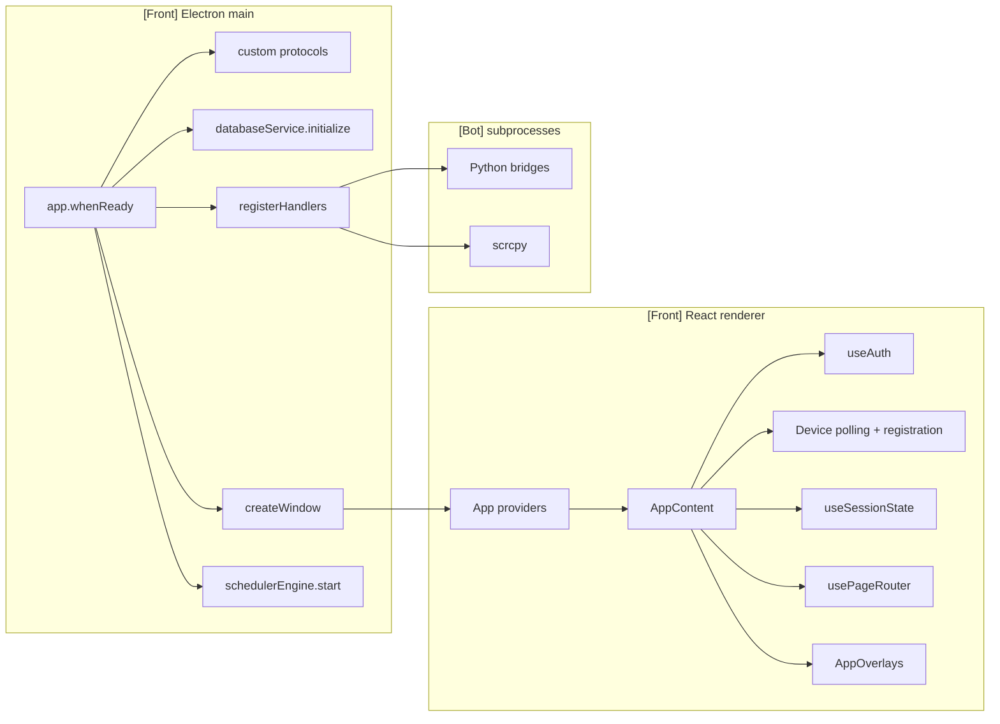
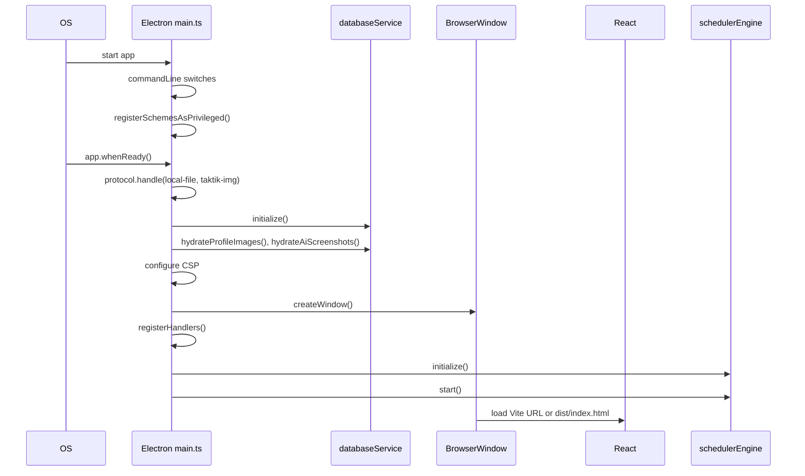
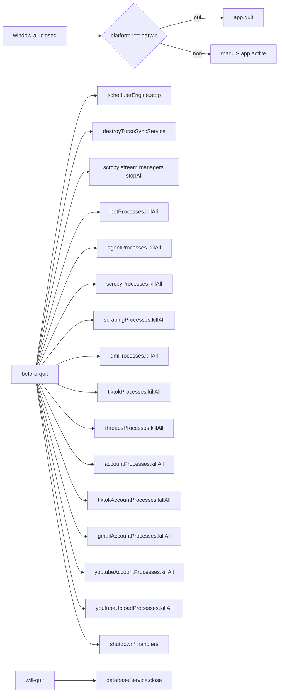
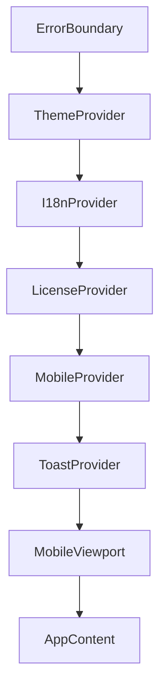
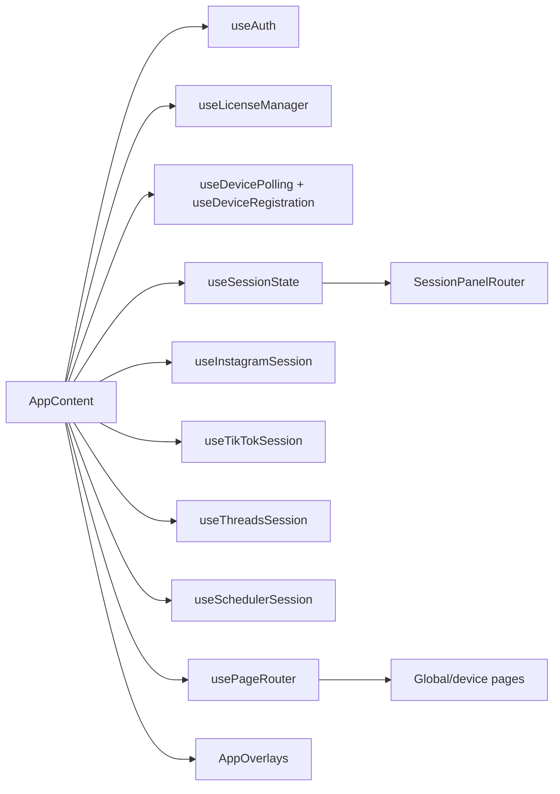

# App Lifecycle

> **Périmètre : `[Front]`**
> Cette page documente le cycle de vie de l'application desktop Electron/React dans `front/`. Elle ne décrit pas l'exécution interne des bridges Python, sauf quand Electron les lance ou les arrête.

Le lifecycle desktop commence dans `front/electron/main.ts`, expose une surface sécurisée via `preload`, puis rend l'application React à travers `App.tsx` et `AppContent.tsx`.

## Vue d'ensemble

## Fichiers principaux

| Fichier | Rôle |
|---|---|
| `front/electron/main.ts` | Point d'entrée Electron main : fenêtre, CSP, protocoles, handlers, DB, scheduler, cleanup. |
| `front/electron/preload/index.ts` et `front/electron/preload/**` | Surface `window.electronAPI` disponible dans React avec `contextIsolation`. |
| `front/src/app/App.tsx` | Providers globaux : thème, i18n, licence, mobile, toast, error boundary. |
| `front/src/app/AppContent.tsx` | Orchestration centrale renderer : auth, devices, sessions, routing, overlays, events globaux. |
| `front/src/app/routing/PageRouter.tsx` | Résolution des pages globales et device-specific. |
| `front/src/app/routing/SessionPanelRouter.tsx` | Résolution des panneaux live de session. |
| `front/src/app/hooks/useGlobalAppEvents.ts` | Événements DOM globaux : agent, mirror, cloner, réseau. |
| `front/src/app/hooks/useDesktopRecordCommands.ts` | Commandes de recording desktop envoyées via preload. |
| `front/src/app/layout/overlays/AppOverlays.tsx` | Modales/panneaux globaux : debug, mirror, agent, licence, tutoriels, sélection devices. Voir [Agent Panel](agent-panel.md). |

## Démarrage Electron

### Sécurité au démarrage

| Élément | Implémentation | But |
|---|---|---|
| `nodeIntegration: false` | `BrowserWindow.webPreferences` | Empêcher l'accès Node direct dans React. |
| `contextIsolation: true` | `BrowserWindow.webPreferences` | Isoler preload et renderer. |
| `webviewTag: false` | `BrowserWindow.webPreferences` | Éviter l'injection de webviews non contrôlées. |
| CSP | `session.defaultSession.webRequest.onHeadersReceived` | Restreindre scripts, images, médias, connexions. |
| `local-file://` | Protocole custom avec allowlist | Servir les médias locaux sans exposer tout le disque. |
| `taktik-img://` | Protocole custom avec `basename` | Servir images profil et screenshots IA depuis AppData. |

`local-file://` accepte uniquement :

| Répertoire autorisé | Usage |
|---|---|
| `app.getPath('userData')` | Données générées par l'app. |
| `Documents/taktik-desktop` | Workspace utilisateur prévu. |
| `app.getPath('temp')` | Fichiers temporaires. |

## Fenêtre principale

`createWindow()` crée une fenêtre desktop sans frame native :

| Propriété | Valeur |
|---|---|
| Taille initiale | `1920x1080` |
| Taille minimale | `1280x800` |
| Frame | `false` |
| Titlebar | `hidden` |
| Background | `#0a0a0f` |
| Preload | `preload.js` |
| Titre après ready | `TAKTIK Bot` |

En développement, la fenêtre charge `process.env.VITE_DEV_SERVER_URL` et ouvre les DevTools. En production, elle charge `dist/index.html`.

La fenêtre est enregistrée dans `windowManager`, ce qui permet aux handlers d'envoyer des événements au renderer sans se passer `mainWindow` partout.

## Process managers

`main.ts` instancie plusieurs `ProcessManager`, chacun responsable d'une famille de subprocess.

| Manager | Usage |
|---|---|
| `botProcesses` | Workflows Instagram classiques. |
| `agentProcesses` | Taktik Agent. |
| `scrcpyProcesses` | Process de mirroring. |
| `scrapingProcesses` | Scraping Instagram. |
| `dmProcesses` | DM / cold DM. |
| `tiktokProcesses` | Workflows TikTok. |
| `threadsProcesses` | Workflows Threads. |
| `accountProcesses` | Outils compte Instagram. |
| `tiktokAccountProcesses` | Outils compte TikTok. |
| `gmailAccountProcesses` | Outils compte Gmail. |
| `youtubeAccountProcesses` | Outils compte YouTube. |
| `youtubeUploadProcesses` | Upload YouTube. |

Ces managers sont passés aux handlers qui doivent lancer, suivre ou tuer des process.

## Enregistrement des handlers

`registerHandlers()` expose les canaux IPC main/preload utilisés par le renderer.

| Famille | Handler |
|---|---|
| Fenêtre | `window:minimize`, `window:maximize`, `window:close` |
| Shell | `shell:open-external` |
| ADB/device | `registerAdbHandlers`, `registerDeviceSetupHandlers` |
| Bot Instagram | `registerBotHandlers`, `registerTaktikAgentHandlers`, `registerPersonaAnalysisHandlers`, `registerScrapingHandlers`, `registerDMHandlers`, `registerColdDmHandlers`, `registerTargetSearchHandlers`, `registerInstagramUploadHandlers`, `registerAccountHandlers`, `registerSmartCommentHandlers` |
| TikTok | `registerTikTokHandlers`, `registerTikTokUploadHandlers`, `registerTikTokAccountHandlers` |
| Threads | `registerThreadsHandlers` |
| Gmail/YouTube | `registerGmailAccountHandlers`, `registerYouTubeAccountHandlers`, `registerYouTubeUploadHandlers` |
| IA/contenu | `registerAIHandlers`, `registerAIContentHandlers`, `registerAIProviderHandlers` |
| Media | `registerMediaCaptureHandlers`, `registerRecorderHandlers`, `registerTTSHandlers`, `registerTypeWriterHandlers` |
| Systeme | `registerSystemHandlers`, `registerSecurityHandlers` |
| Scrcpy/mirror | `registerScrcpyHandlers`, `registerMirrorDebugHandlers` |
| DB/config/storage | `registerDatabaseHandlers`, `registerConfigHandlers`, `registerStorageHandlers` |
| Licence | `registerLicenseHandlers` |
| Scheduler/planner | `registerSchedulerHandlers`, `registerContentPlannerHandlers` |
| Compat/debug/sync | `registerDebugHandlers`, `registerCompatHandlers`, `registerSyncHandlers` |

En production, les handlers auto-updater réels sont enregistrés. En développement, des stubs évitent les erreurs renderer sur les canaux updater.

## Nettoyage à la fermeture

Le cleanup principal ne part plus de `window-all-closed` mais de `before-quit` via `beginAppShutdownCleanup()`. `window-all-closed` ne decide que s'il faut appeler `app.quit()` hors macOS ; `will-quit` ferme ensuite la base SQLite.

## Providers React

`App.tsx` encapsule toute l'interface :

| Provider | Responsabilité |
|---|---|
| `ErrorBoundary` | Capturer les erreurs React au niveau app. |
| `ThemeProvider` | Thème desktop. |
| `I18nProvider` | Traductions. |
| `LicenseProvider` | Contexte licence. |
| `MobileProvider` | Mode mobile/desktop et état navigation mobile. |
| `ToastProvider` | Notifications UI. |
| `MobileViewport` | Contraintes d'affichage mobile/recording. |

## AppContent

`AppContent` est le chef d'orchestre du renderer. Il assemble l'état utilisateur, les devices, les sessions, le scheduler, les overlays et le routeur.

### États globaux UI

| État | Usage |
|---|---|
| `isDebugOpen` | Panneau debug/tools. |
| `isMirrorOpen` | Miroir appareil. |
| `isClonerOpen` | Modale de clonage APK. |
| `isAgentOpen` | Panneau agent. |
| `schedulerInitialScheduleId` | Ouvrir le canvas scheduler sur un schedule précis. |

### Hooks clés

| Hook | Rôle |
|---|---|
| `useAuth` | Session utilisateur, login/logout, welcome, navigation post-auth. |
| `useLicenseManager` | Blocage licence, limites, sélection devices autorisés. |
| `useAdbInstall` | État installation ADB et action d'installation. |
| `useDevicePolling` | Liste des appareils connectés et overlay no-device. |
| `useDeviceRegistration` | Filtrage des devices selon licence/enregistrement. |
| `useSessionState` | État live multi-device. |
| `useInstagramSession` | Abonnements events live Instagram. |
| `useTikTokSession` | Abonnements events live TikTok. |
| `useThreadsSession` | Abonnements events Threads. |
| `useSchedulerSession` | Abonnements scheduler et ouverture automatique du canvas. |
| `useUploadTracking` | État global des uploads. |
| `useTutorialManager` | Tutoriels/welcome. |
| `useDesktopRecordCommands` | Commandes du recorder desktop. |
| `useTursoSyncNotifier` | Notifications de synchronisation. |

## États de rendu

`AppContent` a trois grands états de rendu :

| Condition | Écran |
|---|---|
| `isLoggedIn === null` | Loader `TaktikLoader`. |
| `!isLoggedIn` | `LoginScreen` avec `Titlebar` desktop. |
| utilisateur connecté | Layout principal avec sidebars, contenu, sessions live et overlays. |

Dans le layout principal :

| Zone | Composant |
|---|---|
| Barre fenêtre | `Titlebar` sur desktop. |
| Sidebar globale | `MainSidebar`. |
| Sidebar device | `DeviceSidebar` ou `MobileDeviceSidebar`. |
| Bandeau sessions actives | `ActiveSessionsBanner`. |
| Contenu courant | `usePageRouter()` ou `NoDeviceConnectedPage`. |
| Session live sélectionnée | `SessionPanelRouter`. |
| Overlays | `AppOverlays`. |

## Routage des pages

`usePageRouter()` sépare deux familles :

1. pages globales, pilotées par `globalPage` ;
2. pages liées à un appareil, pilotées par `devicePage` et `selectedDeviceId`.

### Pages globales

| `globalPage` | Page |
|---|---|
| `analytics` | `AnalyticsPage` |
| `sessions` | `SessionsPage` |
| `live-center` | `LiveCenterPage` |
| `network` | `NetworkPoolsPage` |
| `devices-management` | `DevicesManagementPage` |
| `settings` | `SettingsPage` |
| `video-recorder` | `VideoRecorderPage` |
| `video-editor` | `VideoEditorPage` |
| `cloner` | `ClonerPage` admin, sinon analytics |
| `scheduler-create` | `GlobalSchedulerCreatePage` |
| `scheduler-control` | `SchedulerControlPage` |
| `content-planner` | `ContentPlannerPage` |
| `test` | `CartographyLabPage` admin, sinon analytics |

### Pages device

Les pages device couvrent :

| Famille | Exemples |
|---|---|
| Device | info, applications, mirror. |
| Instagram publication | upload post, reel, story. |
| Instagram engagement | DM responses, cold DM, smart comment. |
| Instagram automation | target, hashtag, post likers, feed, agent, place, notifications, unfollow. |
| Instagram data | scraping, history, target search, qualification IA, account tools. |
| TikTok | upload, workflows, DM, scraping, target search, account tools. |
| Threads | target, feed. |
| Gmail | account, login, register, logout. |
| YouTube | account, login, logout, upload. |
| Debug admin | laboratoire global `test` / Cartography Lab ; les anciennes pages action tester par plateforme sont supprimees. |

Les familles de workflows utilisent `CategoryTabSwitcher` pour garder une navigation par onglets cohérente.

## Événements globaux

`useGlobalAppEvents()` écoute des `CustomEvent` DOM.

| Événement | Effet |
|---|---|
| `open-agent-panel` | Ouvre le panneau agent. |
| `open-mirror-panel` | Ouvre le miroir. |
| `open-cloner-modal` | Ouvre la modale de clonage. |
| `network-reset-complete` | Affiche un toast indiquant succès/échec et rotation IP. |

`useDesktopRecordCommands()` écoute `window.electronAPI.recorder.onDesktopCommand()` quand le mode desktop record est actif.

| Commande | Effet |
|---|---|
| `show-intro` | Affiche l'intro vidéo avec le nom du workflow. |
| `show-outro` | Affiche l'outro. |
| `nav-step` | Dispatch `desktop-nav-step`. |
| `set-params` | Dispatch `mobile-record:set-params`. |
| `click-start` | Dispatch `mobile-record:click-start`. |
| `scroll-page` | Scroll le viewport principal. |
| `open-mirror` | Ouvre le miroir. |

## Sessions, scheduler et navigation

Quand le scheduler démarre une session, `AppContent` :

1. sélectionne le device concerné ;
2. ferme une page globale éventuelle ;
3. navigue vers `devicePage = 'scheduler'` ;
4. mémorise `schedulerInitialScheduleId` ;
5. ouvre le miroir ;
6. réouvre la sidebar device ;
7. ouvre le panneau agent.

Les sessions non planifiées replient automatiquement la sidebar device pour donner plus d'espace au panneau live.

## Front vs Bot

| Élément | Périmètre | Responsabilité |
|---|---|---|
| `main.ts` | `[Front]` | Process Electron, fenêtre, IPC, DB locale, scheduler Node. |
| `preload` | `[Front]` | API sécurisée exposée au renderer. |
| `AppContent` | `[Front]` | Orchestration UI et navigation. |
| `ProcessManager` | `[Front]` | Lifecycle des subprocess lancés depuis Electron. |
| Bridges Python | `[Bot]` | Automatisation Android réelle. |
| SQLite local | `[Transversal]` | Données lues/écrites par Electron et certains bridges. |
| API licence | `[Transversal]` | Auth/licence/device access depuis le desktop vers l'API distante. |

## Points de vigilance

| Sujet | Risque |
|---|---|
| `AppContent` très central | Beaucoup de hooks y convergent ; documenter chaque nouveau hook global. |
| Cleanup process | Vérifier que tout nouveau `ProcessManager` est tué à la fermeture si nécessaire. |
| CSP | Ajouter explicitement les domaines nécessaires quand une nouvelle intégration réseau arrive. |
| Protocoles custom | Ne jamais élargir `local-file://` sans allowlist stricte. |
| `PageRouter` | Toute nouvelle page doit être ajoutée au type de page, au routeur et souvent aux tabs. |
| Events DOM | Les événements custom doivent rester nommés et documentés pour éviter les dépendances invisibles. |

## Liens associés

| Page | Pourquoi |
|---|---|
| [`[Front] Vue d'ensemble Electron`](overview.md) | Vue générale du desktop. |
| [`[Front] Preload API`](preload-api.md) | API renderer/main exposée par `window.electronAPI`. |
| [`[Front] Handlers IPC Electron`](ipc-handlers.md) | Détail des familles de handlers. |
| [`[Front] Auth, Licence & Device Access`](auth-license-flow.md) | Auth utilisateur, licence, enregistrement devices. |
| [`[Front] Sessions UI`](sessions-ui.md) | État live et historique sessions côté React. |
| [`[Transversal] Bridge Launcher & Packaging`](../bridges/launcher.md) | Lancement et packaging des bridges Python. |
