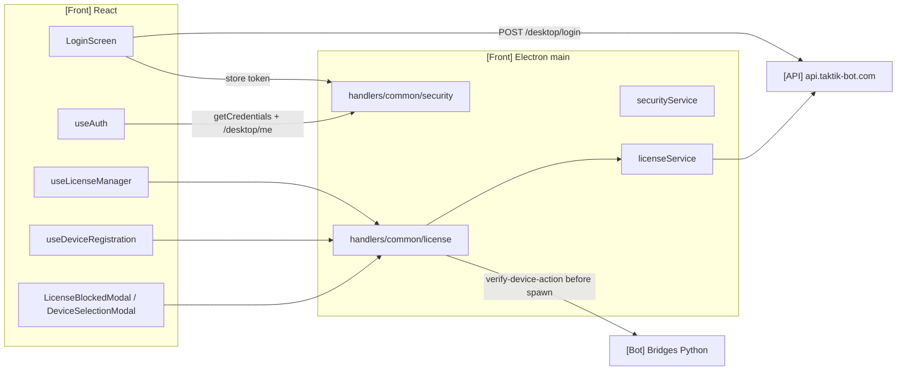
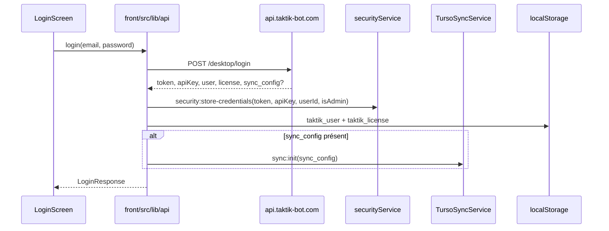
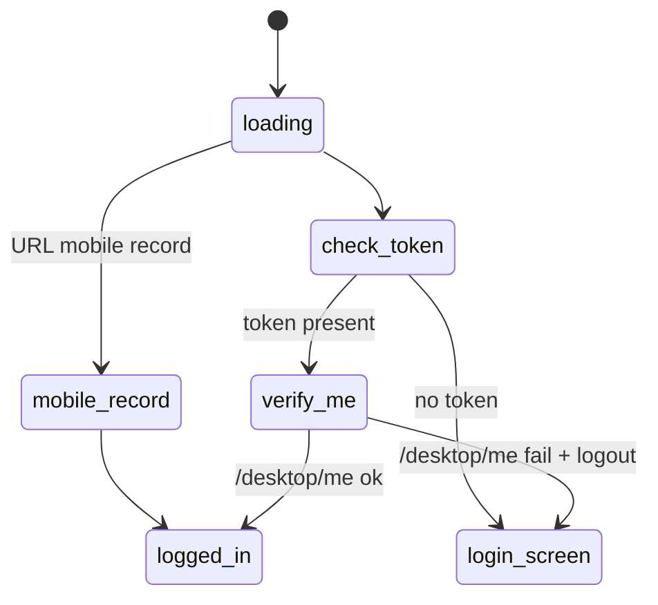
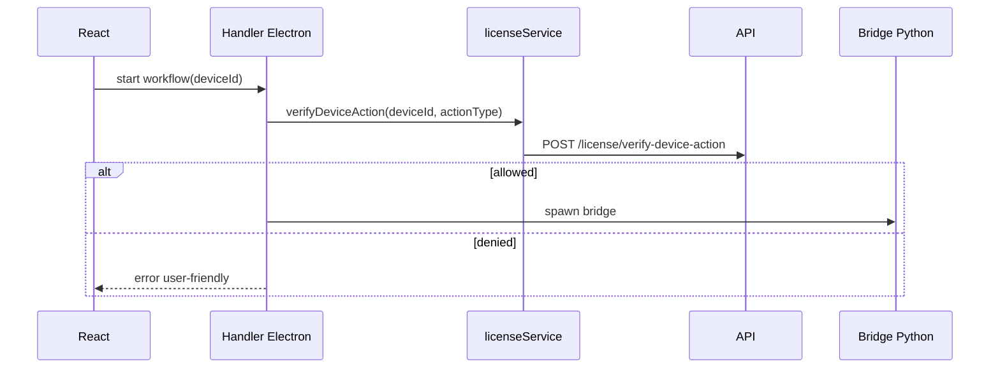

# Auth, Licence & Device Access

> **Périmètre : `[Front]`**
> Cette page documente l'authentification de l'application desktop Electron/React et la vérification licence via l'API distante. Elle ne concerne pas l'auth Instagram/TikTok/Gmail sur Android, qui est documentée dans les modules Bot.

L'app desktop utilise un JWT obtenu auprès de `https://api.taktik-bot.com`, le stocke dans le secure storage Electron, vérifie les limites de licence, enregistre le PC et les devices Android, puis bloque les automatisations si le serveur refuse l'accès.

## Vue d'ensemble



## Fichiers principaux

| Zone | Fichier | Rôle |
|---|---|---|
| API client React | `front/src/lib/api/index.ts` | Login, `/desktop/me`, logout, crash reports, init sync. |
| Hook auth | `front/src/app/hooks/auth/useAuth.ts` | État `isLoggedIn`, auto-check au démarrage, logout, mode recording. |
| Hook licence | `front/src/app/hooks/license/useLicenseManager.ts` | Charge limites, bloque l'accès, recheck périodique, reset logout. |
| Device registration | `front/src/app/hooks/device/useDeviceRegistration.ts` | Enregistre ou filtre les devices selon la limite licence. |
| Overlays | `front/src/app/layout/overlays/AppOverlays.tsx` | Affiche blocage licence et sélection des devices autorisés. |
| Preload | `front/electron/preload/app/license.ts` | Expose `window.electronAPI.license` et `security`. |
| Handlers licence | `front/electron/handlers/common/license/license.ts` | IPC main pour limites, register, verify action. |
| Service licence | `front/electron/services/app/license/runtime/license-service.ts` | Appels API licence et cache. |
| Service sécurité | `front/electron/services/app/security/credentials/security-service.ts` | `safeStorage`, token, admin check, validation chemins/deviceId. |

## Login desktop



### Données stockées

| Donnée | Emplacement | Sensibilité |
|---|---|---|
| JWT `token` | `safeStorage` via `secure-credentials.enc` | sensible |
| `apiKey` | `safeStorage` | sensible |
| `userId`, `isAdmin` | `safeStorage` | semi-sensible |
| `taktik_user` | `localStorage` | affichage |
| `taktik_license` | `localStorage` | affichage |
| password login | non persisté | jamais stocké brut |

`storeLoginCredentials(email, password)` ne stocke pas le password. Il mémorise seulement l'e-mail et le flag `rememberCredentials`.

## Check auth au démarrage

`useAuth()` applique cette logique :

1. Si l'app est en mode `mobileRecord`, elle force `isLoggedIn=true`.
2. Sinon, elle demande à Electron de nettoyer les sessions orphelines.
3. Elle charge le token depuis `security:get-credentials`.
4. Si un token existe, elle appelle `/desktop/me`.
5. Si `/desktop/me` échoue, elle fait `api.logout()` et revient à l'écran login.
6. Sinon, elle rend l'application principale.



## Licence au login

`useLicenseManager()` démarre quand `isLoggedIn=true`.

| Étape | Code | Détail |
|---|---|---|
| Track launch | `license.trackEvent('launch', version)` | Non critique, peut échouer en dev. |
| Limits | `license.getLimits(true)` | Force refresh côté API. |
| Blocage | `limits.access.allowed` | Si false, affiche `LicenseBlockedModal`. |
| Device PC | `license.registerDevice()` | Enregistre le PC desktop. |
| Recheck | interval 30 minutes | Revérifie accès et limites. |

## Format `LicenseLimits`

```ts
interface LicenseLimits {
  license: {
    id: number
    status: string
    plan_type: string
    plan_name: string
  }
  limits: {
    max_devices: number
    active_devices: number
    devices_remaining: number
    max_actions_per_day: number
  }
  trial: {
    is_trial: boolean
    trial_ends_at: string | null
    is_expired: boolean
    days_remaining: number | null
  }
  ai: {
    has_ai_features: boolean
    ai_price_monthly: number | null
  }
  access: {
    allowed: boolean
    reason: string | null
  }
}
```

## Endpoints API utilisés

| Endpoint | Méthode | Appelant | Usage |
|---|---|---|---|
| `/desktop/login` | POST | `front/src/lib/api/index.ts` | Auth email/password, JWT, user, licence, sync config. |
| `/desktop/me` | GET | API client + `securityService.verifyAdmin()` | Vérifier token et rôle admin. |
| `/desktop/validate-license` | POST | legacy `validateLicense()` / ancienne page licence | Validation clé licence. |
| `/desktop/crash-reports` | POST | Debug panel | Ticket crash report. |
| `/license/limits` | GET | `licenseService.getLimits()` | Plan, limites, trial, accès. |
| `/license/register-device` | POST | `licenseService.registerDevice()` | Enregistre le PC desktop. |
| `/license/track` | POST | `licenseService.trackEvent()` | Launch/update event. |
| `/license/verify-device-action` | POST | handlers avant automation | Autorise/refuse une action sur un Android. |
| `/license/register-selected-devices` | POST | device selection / auto-register | Enregistre les devices Android actifs. |

## Device desktop vs device Android

Le système distingue deux types de devices.

| Type | ID | Compte dans limite ? | Rôle |
|---|---|---|---|
| PC desktop | `licenseService.getDeviceId()` SHA-256 | Non, `is_desktop=true` | Machine qui exécute l'app Electron. |
| Android device | serial ADB | Oui, selon plan | Téléphone/émulateur piloté par le Bot. |

Le PC est enregistré via `/license/register-device`. Les Android sont enregistrés via `/license/register-selected-devices`.

## Sélection et enregistrement des Android

`useDeviceRegistration()` reçoit la liste ADB et les limites de licence.

```mermaid
flowchart TD
    Devices[Devices ADB connectés] --> HasLimits{licenseLimits ?}
    HasLimits -->|non| Wait[Attente]
    HasLimits -->|oui| Demo{demo mode ?}
    Demo -->|oui| Skip[Ne rien enregistrer]
    Demo -->|non| Manual{gestion manuelle active ?}
    Manual -->|oui| Filter[Filtrer selon taktik_selected_devices]
    Manual -->|non| Count{devices <= max_devices ?}
    Count -->|oui| RegisterAll[registerSelectedDevices(all real devices)]
    Count -->|non| Modal[DeviceSelectionModal]
    Modal --> RegisterSelected[registerSelectedDevices(selected)]
```

Clés locales :

| Clé | Rôle |
|---|---|
| `taktik_selected_devices` | Liste des Android actifs côté UI. |
| `taktik_devices_managed_manually` | Empêche l'auto-register si l'utilisateur a géré manuellement les devices. |

Les devices demo ne sont jamais enregistrés côté serveur.

## Vérification avant automation

Les handlers qui lancent des bridges doivent appeler :

```ts
licenseService.verifyDeviceAction(androidDeviceId, actionType)
```

Exemples d'`actionType` :

| Handler | `actionType` |
|---|---|
| Instagram bot session | `bot_session` |
| Instagram scraping | `scraping_session` |
| Autres workflows | souvent `automation` ou action spécifique |



Le Bot Python ne porte pas cette décision produit. Il reçoit un bridge déjà autorisé par Electron.

## Raisons de blocage

| Reason | Sens |
|---|---|
| `trial_expired` | Essai terminé. |
| `license_expired` | Licence expirée. |
| `license_inactive` | Licence inactive ou statut serveur `inactive`. |
| `device_limit_reached` | Trop de devices Android actifs. |
| `no_license` | Aucun plan actif. |
| `unable_to_verify` | API inaccessible ou réponse non exploitable. |
| `no_token` | Aucun JWT disponible. |
| `network_error` | Erreur réseau pendant la vérification action. |

Ces raisons alimentent `LicenseBlockedModal` et les erreurs des handlers de workflow.

## Logout

`api.logout()` fait :

1. `sync.stop()` pour arrêter la synchronisation Turso ;
2. `security.clearCredentials()` pour supprimer `secure-credentials.enc` ;
3. reset du token en mémoire ;
4. suppression `taktik_user`, `taktik_license` et anciennes clés locales.

`useLicenseManager.handleLogout()` ajoute :

1. suppression `taktik_selected_devices` ;
2. suppression `taktik_devices_managed_manually` ;
3. reset `selectedDeviceIds` et `licenseLimits`.

## Sécurité locale

| Protection | Code |
|---|---|
| Credentials chiffrés | `safeStorage.encryptString()` dans `securityService`. |
| Fallback si chiffrement indisponible | JSON local non chiffré avec warning. |
| Admin cache | `verifyAdmin()` avec cache 5 minutes. |
| Device ID sanitize | `sanitizeDeviceId()` autorise alphanum, `:`, `.`, `-`, `_`. |
| Path allowlist | `validatePath()` limite `userData`, `Documents/taktik-desktop`, downloads, temp. |

## Points de vigilance

| Sujet | Détail |
|---|---|
| Ancienne validation licence | `validateLicense()` et `LicenseScreen` existent encore mais le flux principal passe par `/desktop/login` + JWT. |
| Quotas d'actions | Le type `max_actions_per_day` existe côté licence, mais l'app actuelle vérifie surtout accès, devices et autorisation d'action serveur. |
| Password | Le mot de passe utilisateur desktop n'est pas stocké; auto-reconnect repose sur le JWT. |
| Token expiré | `/desktop/me` échoue au démarrage, ce qui force logout. |
| Device selection | Si les devices sélectionnés ne correspondent plus aux devices ADB connectés, l'app reset la sélection stale. |

## Pages liées

| Page | Lien |
|---|---|
| [Preload API Electron](preload-api.md) | Surface `license` et `security`. |
| [Handlers IPC Electron](ipc-handlers.md) | Pattern handler. |
| [Managers, Sync & Updater](electron-managers-sync-updater.md) | Sync Turso et services Electron. |
| [Bridge Launcher & Packaging](../bridges/launcher.md) | Spawn des bridges après vérification. |
| [Etat actuel FastAPI](../../technical/api-current-state.md) | Référence API distante vérifiée. |
