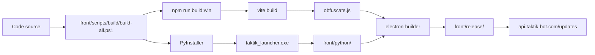
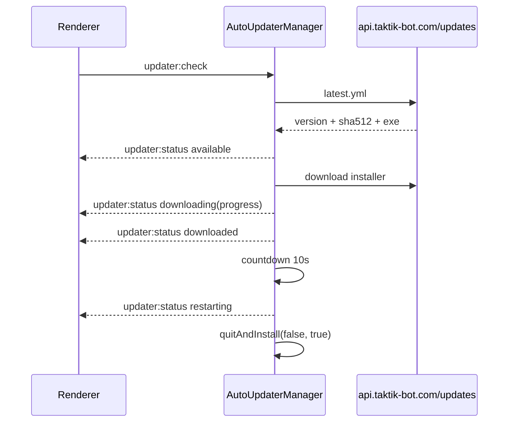

# Build, Packaging & Auto-Update Desktop

> **Périmètre : `[Transversal]`**
> Cette page relie le build Electron `[Front]`, le packaging du launcher Python `[Bot]`, et la distribution auto-update `[API/Front]`.

Le build Windows final assemble l'application Electron, le renderer React, les ressources natives, le launcher Python unique et les assets Android dans un installateur NSIS.

## Vue d'ensemble



## Scripts principaux

Source : `front/package.json`.

| Script | Rôle |
|---|---|
| `npm run dev` | Lance Vite + Electron en développement. |
| `npm run build` | Build Vite simple. |
| `npm run build:secure` | Build Vite + obfuscation. |
| `npm run build:win` | Build sécurisé + `electron-builder --win`. |
| `npm run build:win:fast` | Build Windows sans obfuscation. |
| `npm run build:all` | Build complet : launcher Python + Electron. |
| `npm run build:all:fast` | Build complet sans obfuscation Electron. |
| `npm run typecheck` | Vérification TypeScript. |
| `npm run lint` | ESLint. |

Commande release habituelle :

```powershell
cd <repo>\front
npm run build:all
```

## Packaging Python `[Bot]`

Le bot n'est pas packagé en un exécutable par bridge. Le script `build-all.ps1` compile un seul exécutable :

```text
bot/dist/taktik-bot/taktik_launcher.exe
front/python/taktik_launcher.exe
```

Ce launcher vient de `bot/bridges/launcher.py` et route vers les modules `bridges.*` selon le premier argument.

```text
taktik_launcher.exe desktop_bridge config.json
taktik_launcher.exe scraping_bridge config.json
taktik_launcher.exe tiktok_bridge config.json
```

Points critiques :

| Sujet | Détail |
|---|---|
| Registry Python | `bot/bridges/launcher.py::BRIDGE_MODULES` |
| Registry Electron | `front/electron/utils/paths.ts::PLATFORM_BRIDGES` |
| Hidden imports | `front/scripts/build/build-all.ps1` |
| Env subprocess | `buildPythonSpawnEnv()` injecte notamment `TAKTIK_DB_PATH` |
| SQLite | Le launcher doit utiliser la même base locale que l'app Electron |

Voir aussi [Bridge Launcher & Packaging](../bridges/launcher.md).

## Packaging Electron `[Front]`

La configuration `electron-builder` vit dans `front/package.json > build`.

| Champ | Valeur |
|---|---|
| `appId` | `com.taktik.desktop` |
| `productName` | `TAKTIK Bot` |
| Output | `front/release/` |
| Target Windows | `nsis` |
| Artifact | `TAKTIK-Bot-Setup-${version}.exe` |
| Hook | `front/scripts/build/afterPack.js` |
| NSIS include | `front/scripts/build/installer.nsh` |

Ressources embarquées :

| Source | Destination packagée |
|---|---|
| `front/python/` | `resources/python/` |
| `front/electron/assets/` | `resources/assets/` |
| `front/electron/assets/scrcpy/` | `resources/scrcpy/` |
| `front/public/icon.ico` | `resources/icon.ico` |
| `front/public/icon.png` | `resources/icon.png` |
| `better-sqlite3` natif | `resources/node_modules/better-sqlite3/` |

## Artefacts

Après `npm run build:all` :

```text
front/release/
├── latest.yml
├── TAKTIK-Bot-Setup-X.Y.Z.exe
├── TAKTIK-Bot-Setup-X.Y.Z.exe.blockmap
└── win-unpacked/
```

| Fichier | Rôle |
|---|---|
| `TAKTIK-Bot-Setup-X.Y.Z.exe` | Installateur utilisateur. |
| `latest.yml` | Feed `electron-updater`. |
| `.blockmap` | Delta update optionnel. |
| `win-unpacked/` | Debug local du package. |

## Auto-update

Fichier runtime : `front/electron/updater/auto-updater.ts`.

L'application utilise `electron-updater` avec provider générique :

```ts
autoUpdater.setFeedURL({
  provider: 'generic',
  url: 'https://api.taktik-bot.com/updates',
  useMultipleRangeRequest: false,
})
```

Paramètres actuels :

| Élément | Valeur |
|---|---|
| Auto download | `true` |
| Auto install on quit | `true` |
| Restart countdown | 10 secondes après téléchargement |
| Event renderer | `updater:status` |
| Dev mode | handlers no-op avec `registerUpdaterDevStubs()` |

### Flux



### Statuts

| Status | Sens |
|---|---|
| `checking` | Vérification en cours. |
| `available` | Nouvelle version disponible. |
| `not-available` | Aucune update. |
| `downloading` | Téléchargement en cours avec `progress`. |
| `downloaded` | Prête à installer. |
| `restarting` | Compte à rebours ou installation. |
| `error` | Erreur updater. |

## Publication

Script : `front/scripts/publish/publish-update.ps1`.

```powershell
cd <repo>\front
powershell -ExecutionPolicy Bypass -File scripts\publish\publish-update.ps1
```

Options utiles :

| Option | Rôle |
|---|---|
| `-Version "X.Y.Z"` | Met à jour `package.json` via `npm version`. |
| `-SkipBuild` | Publie un build existant. |
| `-SkipUpload` | Vérifie sans uploader. |
| `-SkipWebsite` | Ignore la mise à jour du site `taktik-bot`. |
| `-SshUser`, `-SshHost`, `-RemotePath` | Override destination SCP. |

Le script upload :

- `latest.yml` ;
- l'installer ;
- le `.blockmap` s'il existe ;
- `changelog.md` s'il existe.

## Vérifications

```powershell
curl https://api.taktik-bot.com/updates/latest.yml
curl https://api.taktik-bot.com/updates/version/current
curl https://api.taktik-bot.com/updates/changelog.json
```

## Points de vigilance

| Sujet | Risque | Prévention |
|---|---|---|
| Hidden import manquant | Bridge OK en dev mais absent du `.exe`. | Ajouter le module dans `build-all.ps1`. |
| Registry désynchronisé | Electron connaît un bridge absent du launcher, ou inversement. | Comparer `PLATFORM_BRIDGES` et `BRIDGE_MODULES`. |
| `better-sqlite3` natif | Crash au boot packagé. | Garder l'extraResource et reconstruire si Electron change. |
| `latest.yml` incohérent | Auto-update échoue. | Publier l'exe dont le nom correspond au feed. |
| Signature Windows | SmartScreen possible. | Prévoir Authenticode si distribution large. |
| Variables d'env | Fuite de secrets vers Python. | Utiliser `buildPythonSpawnEnv()`. |

## Pages liées

| Page | Pourquoi |
|---|---|
| [Bridge Launcher & Packaging](../bridges/launcher.md) | Détail du launcher Python unique. |
| [Managers, Sync & Updater](electron-managers-sync-updater.md) | Runtime updater et managers Electron. |
| [Electron Utils & Types](electron-utils-types.md) | Résolution dev/prod des bridges. |
| [Platform Bridge Handlers](platform-bridge-handlers.md) | Handlers qui spawnent les bridges. |
| [Etat actuel FastAPI](../../technical/api-current-state.md) | Endpoints `/updates`. |
