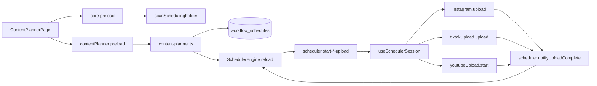
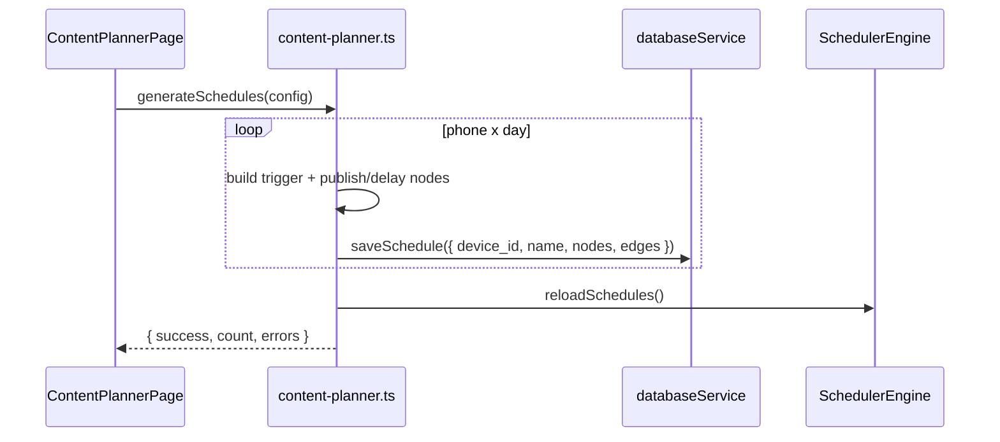
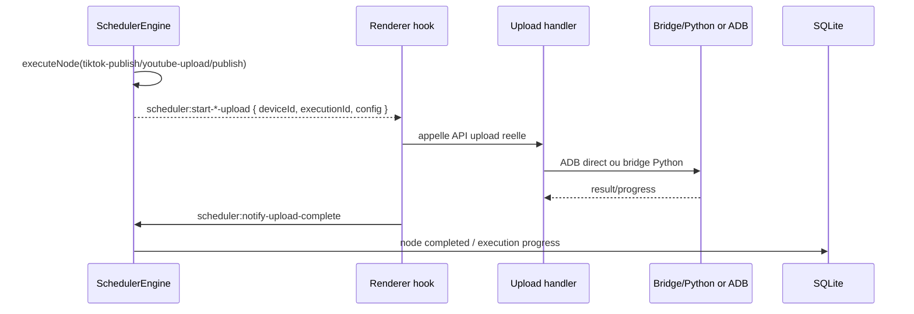

# Content Planner & Scheduler Publish Nodes

> **Perimetre : `[Front]`**
> Cette page documente le Content Planner desktop et son raccord avec le Scheduler. Le Content Planner ne publie pas directement : il genere des `workflow_schedules` contenant des nodes publish, puis le `SchedulerEngine` declenche les uploads au bon moment.

## Role

Le Content Planner sert a transformer un dossier de contenus organise par telephone et par jour en plannings Scheduler.

Structure attendue :

```text
scheduling/
+-- phone_1/
|   +-- schedule.csv
|   +-- day_01/
|   |   +-- vid_001.mp4
|   |   +-- vid_002.mp4
|   +-- day_02/
+-- phone_2/
    +-- schedule.csv
    +-- day_01/
```

Chaque `phone_N` est mappe a un `deviceId`. Chaque jour genere un schedule, et chaque slot du jour devient une chaine de nodes publish dans l'ordre de plateformes choisi.

## Fichiers concernes

| Couche | Fichier | Role |
|---|---|---|
| Page UI | `front/src/features/workspace/content-planner/ContentPlannerPage.tsx` | Scan dossier, mapping devices, horaires, plateformes, generation. |
| Preload | `front/electron/preload/app/core.ts` | `selectFolder`, `selectVideo`, `scanSchedulingFolder`. |
| Preload scheduler | `front/electron/preload/app/automation.ts` | `contentPlanner.generateSchedules`, events `scheduler:start-*-upload`. |
| Handler planner | `front/electron/handlers/scheduler/content-planner.ts` | Genere les graphes React Flow et les sauvegarde en SQLite. |
| Handler scheduler | `front/electron/handlers/scheduler/scheduler.ts` | CRUD schedules, start/stop, notifications de fin. |
| Engine | `front/electron/services/app/scheduler/engine/scheduler-engine.ts` | Execute les nodes, emet les events upload. |
| Hook runtime | `front/src/app/hooks/scheduler/useSchedulerSession.ts` | Recoit les events upload et appelle les APIs upload reelles. |
| Nodes UI | `front/src/features/workspace/scheduler/nodes/*` | `PublishNode`, `TikTokPublishNode`, `YouTubeUploadNode`. |
| Config nodes | `front/src/features/workspace/scheduler/configs/*` | `PublishConfig`, `TikTokPublishConfig`, `YouTubeUploadConfig`. |
| Tables SQLite | `workflow_schedules`, `schedule_executions`, `schedule_templates` | Schedules generes, executions et templates. |

## Vue d'ensemble



## Etapes UI

`ContentPlannerPage.tsx` guide l'utilisateur en quatre etapes.

| Etape | UI | Donnees produites |
|---|---|---|
| 1 | Select folder | `phones: PhoneScanResult[]` depuis `scanSchedulingFolder`. |
| 2 | Map devices | `deviceMapping: Record<phoneDir, deviceId>`. |
| 3 | Configure planning | `startDate`, 3 `slotTimes`, `platformOrder`, `interPlatformDelay`. |
| 4 | Preview & generate | Appel `contentPlanner.generateSchedules(...)`. |

Mode admin :

| Action | Role |
|---|---|
| `generateTestSchedule` | Cree un schedule de test pour un seul device, avec chaine courte TT/YT/IG. |
| `Launch Now` | Cree un schedule a l'heure courante puis appelle `scheduler.start(deviceId, scheduleId)`. |
| `selectVideo` | Permet de fournir un fichier video optionnel pour le test. |

## Types de donnees

### `PhoneSlot`

```ts
interface PhoneSlot {
  day: string
  slot: number
  filename: string
  description: string
  videoPath: string
}
```

### `GenerateSchedulesConfig`

```ts
interface GenerateSchedulesConfig {
  phones: PhoneScanResult[]
  deviceMapping: Record<string, string>
  startDate: string
  slotTimes: Array<{ center: string; varianceMinutes: number }>
  platformOrder: string[]
  interPlatformDelay: number
}
```

## Generation des schedules

`content-planner:generate-schedules` cree un schedule par `phone x day`.

Pour chaque jour :

1. trouver le `deviceId` associe au `phoneDir` ;
2. calculer la date avec `startDate + dayIndex` ;
3. trier les slots par numero ;
4. randomiser l'heure du premier slot autour de `slotTimes[slot - 1]` ;
5. creer un node `trigger` ;
6. ajouter les nodes publish dans l'ordre `platformOrder` ;
7. ajouter des nodes `delay` entre plateformes ;
8. ajouter un delay inter-slot avant les slots suivants ;
9. sauvegarder via `databaseService.saveSchedule(...)` ;
10. recharger `schedulerEngine.reloadSchedules()`.



## Nodes generes

| Plateforme | Node type | Config principale |
|---|---|---|
| TikTok | `tiktok-publish` | `videoPath`, `caption`, `hashtags`, `uploadType: "post"` |
| YouTube | `youtube-upload` | `videoPath`, `title`, `description`, `uploadType: "short"`, `visibility` |
| Instagram | `publish` | `publishType: "reel"`, `uploadType: "reel"`, `mediaPath`, `mediaType: "video"`, `caption`, `hashtags` |
| Delay | `delay` | `duration`, `unit: "minutes"` |
| Trigger | `trigger` | `triggerType: "time"`, `time`, `date`, `repeat: "once"` |

Les nodes UI correspondants existent dans :

| Node | Composant |
|---|---|
| `publish` | `nodes/instagram/PublishNode.tsx` |
| `tiktok-publish` | `nodes/tiktok/TikTokPublishNode.tsx` |
| `youtube-upload` | `nodes/youtube/YouTubeUploadNode.tsx` |

## Execution runtime

Le Content Planner ne lance pas les handlers upload. Il se contente de creer le graphe. L'execution arrive plus tard via `SchedulerEngine`.



Mapping runtime dans `useSchedulerSession.ts` :

| Event scheduler | API appelee |
|---|---|
| `scheduler:start-tiktok-upload` | `window.electronAPI.tiktokUpload.upload(...)` |
| `scheduler:start-youtube-upload` | `window.electronAPI.youtubeUpload.start(...)` |
| `scheduler:start-instagram-upload` | `window.electronAPI.instagram.upload(...)` |

Le scheduler attend `scheduler:notify-upload-complete` avant de passer au node suivant.

## Config panels manuels

Les memes node types peuvent etre ajoutes manuellement dans le Scheduler.

| Node type | Config component | Champs |
|---|---|---|
| `publish` | `PublishConfig.tsx` | `publishType`, `mediaPath`, `caption`. |
| `tiktok-publish` | `TikTokPublishConfig.tsx` | `videoPath/localPath`, `uploadType`, `hashtags`, `caption`. |
| `youtube-upload` | `YouTubeUploadConfig.tsx` | `videoPath`, `title`, `visibility`, `tags`, `description`. |

## Persistance

| Table | Utilisation |
|---|---|
| `workflow_schedules` | Un schedule par phone/day genere par le Content Planner. |
| `schedule_executions` | Une ligne par execution runtime du Scheduler. |
| `schedule_templates` | Non cree directement par le Content Planner, mais meme format nodes/edges. |

Le Content Planner sauvegarde `nodes` et `edges` au format JSON React Flow. L'engine relit ensuite ce graphe et fait un parcours depuis le node `trigger`.

## Points d'attention

| Sujet | Detail |
|---|---|
| Separation claire | Planner = generation de graphes ; Scheduler = execution ; Upload handlers = publication. |
| `videoPath` vs `localPath` | Le planner stocke souvent `videoPath`; `useSchedulerSession` convertit vers `localPath` pour TikTok/YouTube. |
| Instagram | Le node `publish` genere un Reel par defaut pour les batches. |
| Conditions | Les nodes `condition` existent dans le Scheduler, mais ne sont pas utilises par le Content Planner. |
| Dates | `startDate` est incrementee par index de `day_XX`, pas par date lue depuis le dossier. |
| Randomisation | `randomizeTime(center, varianceMinutes)` borne l'heure entre `00:00` et `23:59`. |
| Device mapping | Sans mapping `phoneDir -> deviceId`, aucun schedule n'est genere pour ce phone. |
| Runtime | Les uploads planifies passent par le renderer pour reutiliser les APIs existantes et les live panels. |

## Anomalie a surveiller

Dans `content-planner.ts`, la construction de `platformLabels` dans
`generate-schedules` s'appuie maintenant sur `enabledPlatforms` et produit les
labels `TT`, `YT`, `IG` selon les plateformes reellement activees.

Le mode test n'utilise pas ce meme bloc et construit son nom via `platformOrder`.

## Liens utiles

- [Scheduler & Sessions](../workflows/sessions.md)
- [Scheduler UI](scheduler-ui.md)
- [Upload Content](../workflows/upload-content.md)
- [Schema SQLite](../database/schema.md#workflow_schedules)
