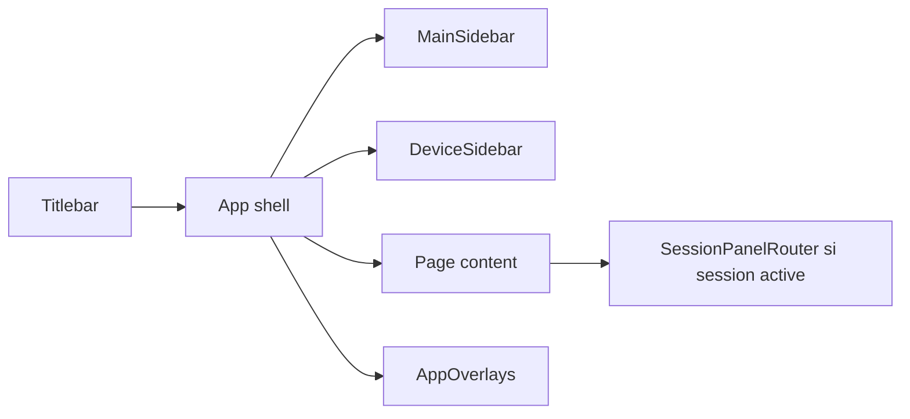

# Design System Desktop

## Objectif

Le design system de l'application desktop est défini dans `front/`. Il doit rester cohérent avec la documentation consolidee : même fond sombre, même accent violet, mêmes surfaces glass, même logique de sidebar et mêmes composants denses.

Cette page documente les conventions visuelles utilisées par l'app.

## Sources

| Fichier | Rôle |
|---|---|
| `front/tailwind.config.js` | tokens Tailwind, couleurs shadcn, radius, font |
| `front/src/styles/globals.css` | thèmes light/dark, fond app, glass utilities, scrollbars |
| `front/src/lib/theme/palette.ts` | palettes générées, presets, conversion HSL/hex |
| `front/src/ui/button.tsx` | variants de boutons |
| `front/src/ui/layout/card.tsx` | cartes standard et glass |
| `front/src/app/layout/desktop/*` | titlebar, sidebars, layout desktop |
| `front/src/app/layout/mobile/*` | adaptation mobile |

## Palette par défaut

### Dark mode

| Token | HSL | Hex approximatif | Usage |
|---|---|---:|---|
| `--background` | `214 52% 6%` | `#08101a` | fond principal |
| `--card` | `214 40% 9%` | `#0e1621` | cartes et panneaux |
| `--foreground` | `210 40% 98%` | `#f8fafc` | texte principal |
| `--primary` | `262 83% 58%` | `#8b5cf6` | accent violet |
| `--border` | `214 35% 14%` | `#172233` | bordures |
| cyan glow | custom | `#63ebda` | bordures/glow subtils |

### Light mode

| Token | HSL | Hex approximatif | Usage |
|---|---|---:|---|
| `--background` | `220 20% 97%` | `#f5f7fa` | fond clair |
| `--card` | `0 0% 100%` | `#ffffff` | cartes |
| `--foreground` | `222 28% 13%` | `#1a2033` | texte |
| `--primary` | `262 70% 47%` | `#7c3aed` | accent |

## Fond application

Le fond n'est pas un simple aplatissement de couleur. Il combine :

- un fond navy profond ;
- une ambiance cyan/teal discrète ;
- une ambiance violet très légère ;
- un glow de bordure global via `.app-glow-border`.

Dans `globals.css`, le fond est porté par `html::before`, ce qui évite les zones blanches quand des panels scrollent.

## Glass panels

Les surfaces utilisent des classes glass :

| Classe | Usage |
|---|---|
| `.glass` | panel translucide standard |
| `.glass-glow` | panel avec bordure cyan/violet plus visible |
| `.glass-modal` | modales fortes avec blur et ombre |
| `.glass-card` | cartes device / panneaux secondaires |
| `.glass-titlebar` | titlebar desktop |
| `.glass-backdrop` | backdrop modale |

Règle pratique : le glass doit aider à séparer les couches de l'application, pas devenir une décoration partout.

## Composants UI

### Buttons

`front/src/ui/button.tsx` expose ces variants :

| Variant | Usage |
|---|---|
| `default` | action principale |
| `destructive` | suppression / danger |
| `outline` | action secondaire encadrée |
| `secondary` | action discrète |
| `ghost` | icône ou action légère |
| `link` | navigation texte |
| `gradient` | action premium ou fortement mise en avant |
| `success` | confirmation positive |
| `glow` | action principale avec halo |

Les boutons sont `rounded-lg`, transitions courtes, focus ring, et tailles standardisées (`default`, `sm`, `lg`, `icon`).

### Cards

`front/src/ui/layout/card.tsx` expose :

| Variant | Style |
|---|---|
| `default` | `bg-card/70`, blur, bordure douce |
| `glass` | fond translucide, blur plus fort, ombre |

Les cards ont `rounded-xl`, bordures fines et hover subtil.

### Sidebar

La sidebar desktop suit une logique de densité :

- largeur normale autour de `w-56` ;
- mode collapsé `w-14` ;
- boutons icon + label ;
- état actif en `bg-primary/15`, `border-primary/30`, `text-primary` ;
- sections repliables pour Studio ;
- device list scrollable.

La documentation consolidee reprend cette idée : sidebar compacte, sections visibles, item actif violet.

## Layout

Structure desktop :

Règles :

- le contenu principal reste dense et scannable ;
- les workflows ont des tabs par catégorie ;
- les live panels remplacent le contenu quand une session active doit être suivie ;
- les overlays gèrent mirror, debug, agent, licence, device selection.

## Thèmes custom

Le module `front/src/lib/theme/palette.ts` permet de générer des palettes custom.

Slots :

| Slot | Usage |
|---|---|
| `accent` | couleur primaire |
| `background` | fond |
| `sidebar` | sidebar |
| `card` | surfaces |
| `foreground` | texte |

Les palettes sont stockées côté client via :

| Key | Usage |
|---|---|
| `taktik:customThemes` | thèmes sauvegardés |
| `taktik:activeThemeId` | thème actif |
| `taktik:customThemesChanged` | event de sync UI |

## Application a la documentation

`taktik-docs/index.html` est style pour suivre ces conventions :

- `#08101a` en fond ;
- sidebar glass ;
- contenu sombre ;
- tables en surfaces translucent ;
- code blocks navy/noir ;
- Mermaid dark ;
- accent violet/cyan ;
- font Inter ;
- radius `12px`.

## Règles de cohérence

Quand une nouvelle page ou UI est ajoutée :

- préférer des surfaces simples et denses ;
- éviter les pages marketing dans l'app métier ;
- utiliser les icônes Lucide côté React ;
- garder des titres courts et scannables ;
- éviter les palettes mono-couleur ;
- réserver les gradients/glow aux états utiles ;
- ne pas créer de gros blocs décoratifs qui masquent l'information ;
- documenter les flux complexes avec Mermaid.

## Liens liés

- [Application Desktop](./overview.md)
- [Handlers IPC Electron](./ipc-handlers.md)
- [Architecture globale](../architecture/overview.md)
- [Diagrammes de flux](../workflows/flow-diagrams.md)
