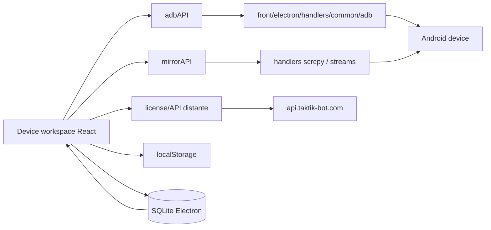
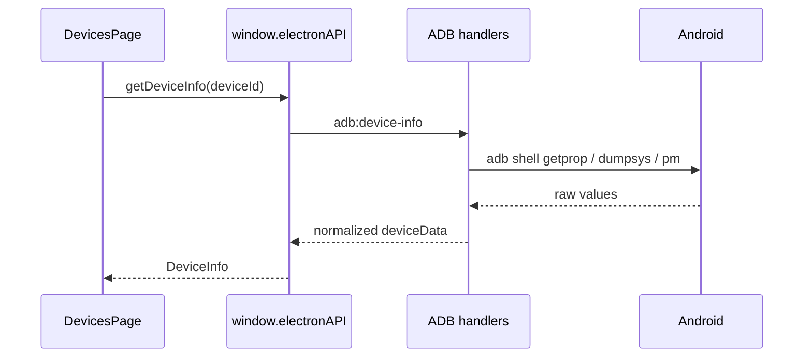

# Workspace Device

> **Perimetre : `[Front]`**
> Cette page documente `front/src/features/workspace/device/*` et les APIs preload Electron associees.

Le workspace device est le poste de controle par telephone : infos systeme, ADB, mirror, APK, batterie, Play Store, Wi-Fi ADB et quick actions.

> Note : la topologie reseau partagee (pools routeur/client, tests IP, leases scheduler) est documentee separement dans [Network Control Center](network-control-center.md). La presente page couvre surtout la lecture et le controle **par device**.

## Vue d'ensemble



## Arborescence

```text
front/src/features/workspace/device/
├── applications/
├── battery/
├── info/
├── management/
├── mirror/
├── network/
├── quick-actions/
└── update-control/
```

## Zones principales

| Zone | Role | APIs principales |
|---|---|---|
| `info/` | Fiche technique device : systeme, batterie, ecran, reseau, stockage, CPU. | `getDeviceInfo`, `batteryInfoFull`, `playStoreStatus` |
| `management/` | Gestion des devices autorises par licence et groupes UI. | API REST licence, `getDeviceGroups`, `saveDeviceGroups` |
| `applications/` | Versions Instagram/TikTok, APK, clones Instagram, selection package. | `installApk`, `installInstagram`, `installTiktok`, `scanClones` |
| `mirror/` | Mirroring scrcpy et panel integre. | `startMirror`, `startRawStream`, `stopMirror`, `onMirrorStopped` |
| `battery/` | Simulation batterie pour anti-detection. | `batterySpoofSimulate`, `batterySpoofReset`, `batteryInfoFull` |
| `update-control/` | Blocage Play Store et updates auto. | `playStoreDisable`, `playStoreBlockBackground` |
| `network/` | Infos reseau et speed test **par device**. | `getDeviceNetwork`, `runSpeedTest` |
| `quick-actions/` | Actions rapides exposees dans la page device. | ADB/preload selon action |

## Flux device info



`DevicesPage.tsx` recharge notamment :

| Donnee | Methode |
|---|---|
| Infos completes | `getDeviceInfo(deviceId)` |
| Proxy / capture status | `checkMitmproxy`, `checkFrida`, `getProxyStatus` |
| Batterie spoof | `batteryInfoFull(deviceId)` |
| Play Store | `playStoreStatus(deviceId)` |
| Scrcpy availability | `checkScrcpyInstalled()` |

## APIs ADB exposees

| Groupe | Methodes |
|---|---|
| Basic | `getDevices`, `getDeviceInfo` |
| Extended info | `getDeviceDetails`, `getDeviceBattery`, `getDeviceNetwork`, `getDeviceStorage`, `getDeviceApps` |
| Actions | `takeScreenshot`, `rebootDevice`, `executeAdbCommand` |
| Wi-Fi ADB | `getWifiDevices`, `wifiConnect`, `wifiPair`, `wifiDisconnect`, `wifiRemove`, `wifiScan`, `wifiEnable`, `wifiAutoReconnect` |
| Battery spoofing | `batterySpoofSet`, `batterySpoofReset`, `batterySpoofSimulate`, `batterySpoofStatus`, `batteryInfoFull` |
| Play Store | `playStoreStatus`, `playStoreDisable`, `playStoreEnable`, `playStoreBlockBackground`, `playStoreAllowBackground` |
| APK | `selectApkFile`, `installApk`, `scanClones` |
| Setup | `checkAdbStatus`, `installAdb`, `installKeyboard`, `getKeyboardStatus`, `fullDeviceSetup`, `diagnoseAtx` |

## Gestion licence devices

`DeviceManagement.tsx` appelle directement l'API distante pour la partie licence/devices.

| Donnee | Source |
|---|---|
| `max_devices` | Licence distante |
| `active_devices` | API licence |
| `is_admin` | API licence |
| Telephones actifs/inactifs | API licence |
| Workstations desktop | API licence + detection locale |
| Noms custom | `useDeviceGroups` local/SQLite |

## Groupes de devices

`useDeviceGroups.ts` maintient une config locale de groupes affiches dans l'UI.

| Element | Detail |
|---|---|
| Snapshot rapide | `localStorage` cle `taktik-device-groups` |
| Persistance | `window.electronAPI.saveDeviceGroups(config)` |
| Chargement initial | `window.electronAPI.getDeviceGroups()` |
| Sync renderer | event DOM `taktik-device-groups:sync` |
| Debounce DB | `SAVE_DEBOUNCE_MS = 500` |

## Applications, APK et clones

`DeviceApplicationsPage.tsx` gere :

- versions Instagram/TikTok installees ;
- APK recommandees ;
- APK custom ;
- scan de clones Instagram ;
- selection du package clone a injecter ensuite dans les workflows.

## Mirroring

Le mirroring repose sur `front/electron/preload/devices/mirror.ts` et scrcpy.

| Fonction | Channel |
|---|---|
| `startMirror(deviceId, options)` | `scrcpy:start` |
| `stopMirror(deviceId)` | `scrcpy:stop` |
| `getMirrorStatus(deviceId)` | `scrcpy:status` |
| `checkScrcpyInstalled()` | `scrcpy:check-installed` |
| `installScrcpy()` | `scrcpy:install` |
| `startMirrorStream(deviceId, options)` | `scrcpy:start-stream` |
| `startRawStream(deviceId, options)` | `scrcpy:start-raw-stream` |
| `stopRawStream(deviceId)` | `scrcpy:stop-raw-stream` |

Events :

| Event | Usage |
|---|---|
| `scrcpy:install-progress` | Progression installation scrcpy. |
| `scrcpy:stopped` | Met a jour l'etat `mirrorRunning`. |
| `scrcpy:error` | Affiche/trace une erreur mirroring. |
| `mirror-debug-log` | Logs debug stream. |
| `mirror-debug-stats` | Stats stream/websocket. |

Points importants a garder visibles :

- le panel integre garde `control=true` pour conserver touch et clavier natifs ;
- `MirrorPanel.tsx` protege les changements de device avec une session de connexion interne, une fermeture centralisee et un restart de stream plus prudent ;
- `WsScrcpyServer.ts` essaie d'utiliser l'`adb.exe` le plus proche du runtime scrcpy actif avant de retomber sur `platform-tools` ou le PATH ;
- la version de `scrcpy-server` poussee au device est deduite du runtime scrcpy trouve, afin d'eviter les mismatches client/server.

## TypeWriter / clavier ADB

`mirrorAPI.typewriter` expose le clavier ADB pour ecrire du texte de facon controlee.

| Methode | Role |
|---|---|
| `getStatus(deviceId)` | Verifie installation/activation. |
| `install(deviceId)` | Installe le clavier. |
| `activate(deviceId)` | Active le clavier. |
| `restore(deviceId)` | Restaure le clavier precedent. |
| `type(deviceId, text, options)` | Tape du texte avec delai/variation. |
| `clear(deviceId)` | Efface le champ courant. |

## Battery spoofing

`useDeviceBatterySpoof.ts` controle la simulation batterie.

| Etat | Role |
|---|---|
| `batteryRealLevel` | Niveau reel. |
| `batteryRealCharging` | Etat charge reel. |
| `batterySpoofEnabled` | Simulation active ou non. |
| `batterySpoofLevel` | Niveau simule courant. |
| `batterySpoofConfig` | Bornes et vitesse de simulation. |

## Play Store update control

`useDevicePlayStore.ts` evite que les mises a jour automatiques cassent les versions validees.

| Action | Methode |
|---|---|
| Lire statut | `playStoreStatus(deviceId)` |
| Desactiver Play Store | `playStoreDisable(deviceId)` |
| Reactiver Play Store | `playStoreEnable(deviceId)` |
| Bloquer background | `playStoreBlockBackground(deviceId)` |
| Autoriser background | `playStoreAllowBackground(deviceId)` |

## Wi-Fi ADB

| Methode | Role |
|---|---|
| `wifiScan()` | Decouvre les endpoints ADB reseau. |
| `wifiPair(ip, port, pairingCode)` | Pairing Android 11+. |
| `wifiConnect(ip, port, name?)` | Connexion ADB TCP. |
| `wifiEnable(deviceId, port?)` | Active TCP/IP depuis un device USB. |
| `wifiAutoReconnect()` | Reconnecte les devices connus. |
| `wifiDisconnect` / `wifiRemove` | Deconnecte ou oublie une entree. |

## Setup device

Les ecrans de setup guident l'utilisateur quand aucun telephone n'est disponible.

| Etape | Methodes possibles |
|---|---|
| Verifier ADB | `checkAdbStatus` |
| Installer ADB | `installAdb` |
| Installer clavier | `installKeyboard` |
| Verifier clavier | `getKeyboardStatus` |
| Verifier Instagram/TikTok | `checkInstagram`, `checkTiktok` |
| Telecharger APK | `downloadInstagram`, `downloadTiktok` |
| Installer APK | `installInstagram`, `installTiktok`, `installApk` |
| Setup complet | `fullDeviceSetup` |
| Diagnostic uiautomator2/ATX | `diagnoseAtx` |

## Pages liees

- [Network Control Center](network-control-center.md)
- [Tools, Debug & Compatibility](tools-debug.md)
- [Video Tools](video-tools.md)
- [ADB & Device Setup Handlers](adb-device-handlers.md)
