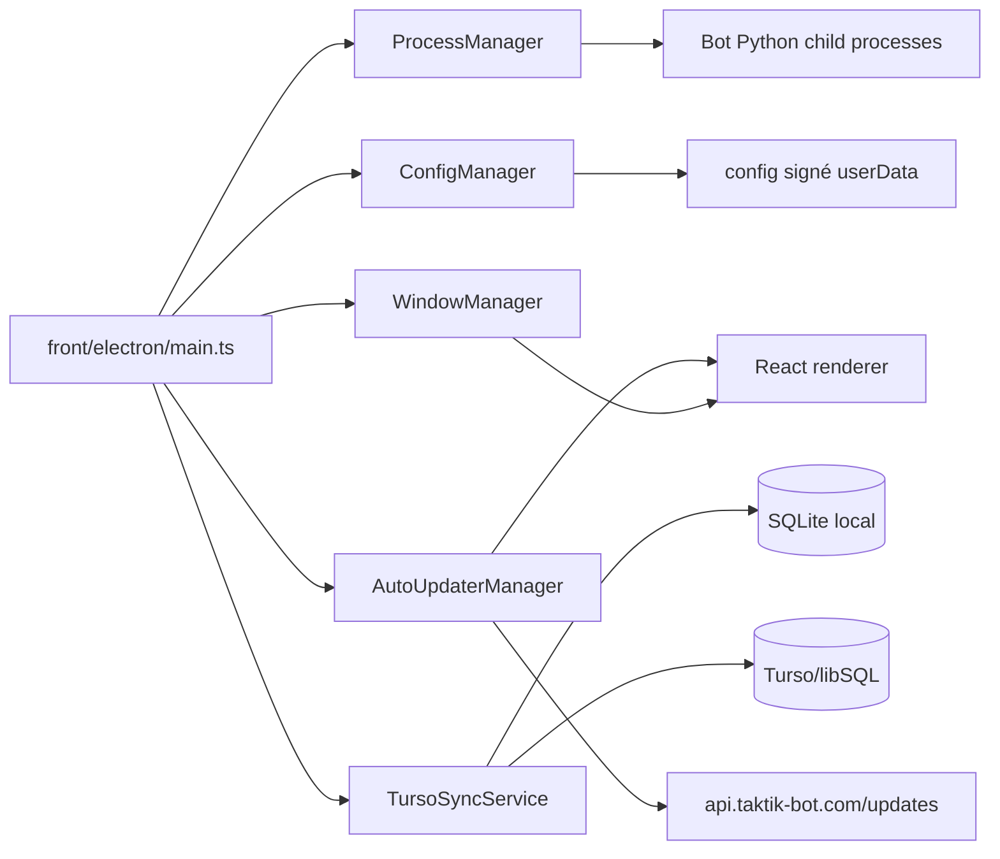
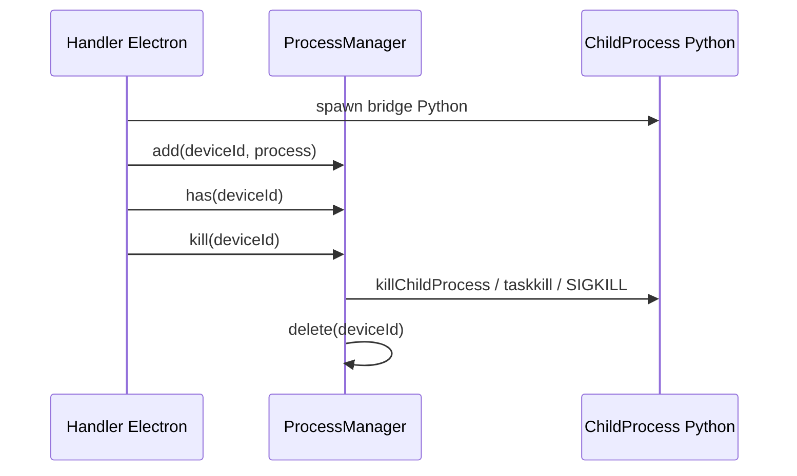
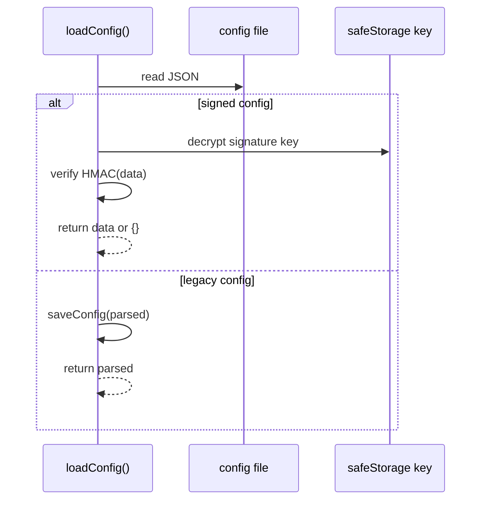
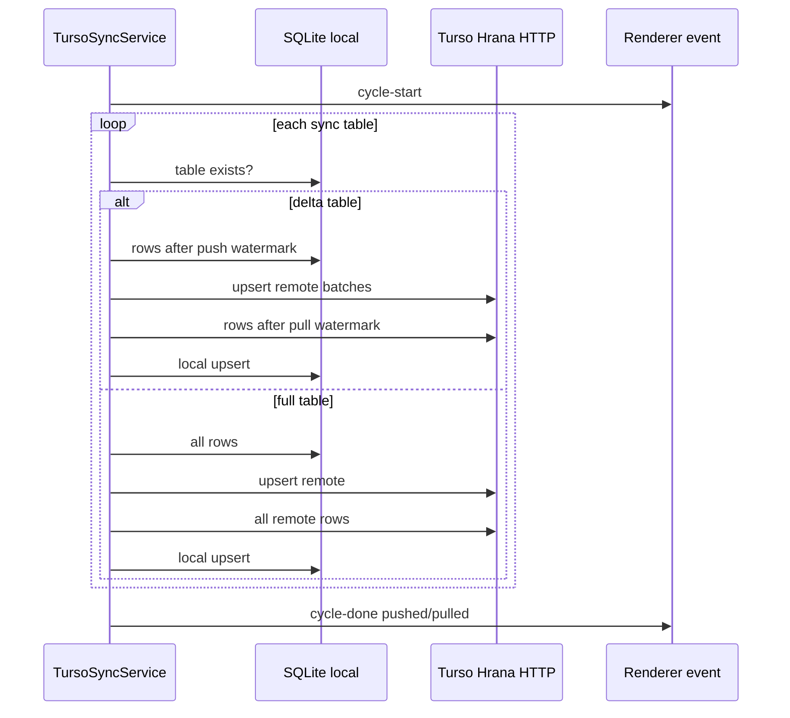
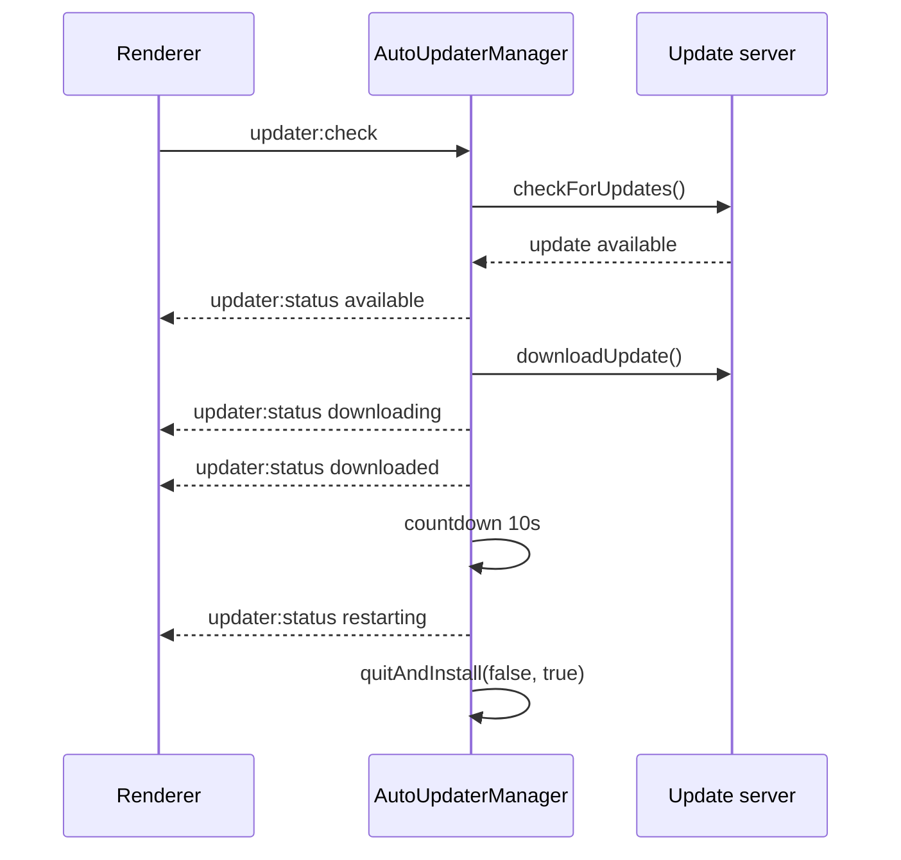

# Managers Electron, Sync & Updater

> **Périmètre : `[Front]`**
> Cette page documente la mécanique du process main Electron : `front/electron/managers/*`, `front/electron/sync/runtime/TursoSyncService.ts` et `front/electron/updater/auto-updater.ts`.

Ces modules ne sont pas des écrans React. Ils maintiennent l'infrastructure desktop : fenêtre principale, process enfants Python, configuration signée, synchronisation cloud et mises à jour automatiques.

## Vue d'ensemble



## Fichiers

| Fichier | Rôle |
|---|---|
| `front/electron/managers/process-manager.ts` | Registry de process enfants, kill individuel ou global. |
| `front/electron/managers/window-manager.ts` | Accès centralisé à la `BrowserWindow` principale et `webContents.send`. |
| `front/electron/managers/config-manager.ts` | Lecture/écriture d'une config JSON signée par HMAC. |
| `front/electron/sync/runtime/TursoSyncRuntime.ts` | Singleton runtime, start/stop du service et re-hydratation des medias tires. |
| `front/electron/sync/runtime/TursoSyncService.ts` | Orchestration sync SQLite local vers Turso via Hrana HTTP v2. |
| `front/electron/updater/auto-updater.ts` | Auto-update via `electron-updater` et serveur privé. |

## ProcessManager

`ProcessManager` encapsule une `Map<string, ChildProcess>`.

```ts
const manager = new ProcessManager("Instagram")
manager.add(deviceId, childProcess)
manager.kill(deviceId)
manager.killAll()
```

### API

| Méthode | Rôle |
|---|---|
| `add(id, process)` | Enregistre un child process. |
| `get(id)` | Retourne le process associé. |
| `has(id)` | Vérifie si un process existe. |
| `delete(id)` | Supprime l'entrée de la map. |
| `keys()` | Itère sur les ids. |
| `forEach(callback)` | Parcourt les process. |
| `clear()` | Vide la map. |
| `size` | Nombre de process suivis. |
| `kill(id)` | Tue l'arbre du process via `killChildProcess()` puis le retire. |
| `killAll()` | Tue chaque arbre de process via `killChildProcess()` puis vide la map. |

### Usage conceptuel



Le manager ne repose plus sur un simple `SIGTERM`. Il delegue au service `services/app/system/process/process-killer.ts`, qui tue l'arbre de process selon la plateforme.

## WindowManager

`WindowManager` garde une référence unique à la fenêtre principale.

| Méthode | Rôle |
|---|---|
| `setWindow(window)` | Enregistre ou nettoie la fenêtre courante. |
| `getWindow()` | Retourne `BrowserWindow | null`. |
| `send(channel, ...args)` | Envoie un event au renderer si la fenêtre existe et n'est pas détruite. |

Ce manager remplace le pattern fragile où chaque handler recevait `mainWindow` en paramètre.

```ts
windowManager.send("bot:message", { deviceId, type: "status", message })
```

### Pourquoi c'est important

| Problème évité | Explication |
|---|---|
| Fenêtre détruite | `send()` vérifie `!mainWindow.isDestroyed()`. |
| Couplage handlers/main | Les handlers peuvent importer le singleton. |
| Events live dispersés | Les bridges et services ont une sortie commune vers React. |

## ConfigManager

`config-manager.ts` sécurise la configuration persistante avec une signature HMAC.

### Stockage

| Élément | Détail |
|---|---|
| Config | Chemin retourné par `getConfigPath()` |
| Clé HMAC | `taktik-config-key.bin` dans `app.getPath('userData')` |
| Protection clé | `safeStorage.encryptString()` / `safeStorage.decryptString()` |
| Signature | HMAC SHA-256 |
| Format actuel | `{ data, signature, version: 1 }` |

### Flux de lecture



### Format

```json
{
  "data": {
    "openrouterApiKey": "...",
    "theme": "...",
    "settings": {}
  },
  "signature": "hmac-sha256-hex",
  "version": 1
}
```

### API

| Fonction | Rôle |
|---|---|
| `loadConfig()` | Charge la config, vérifie la signature, migre le legacy si besoin. |
| `saveConfig(config)` | Signe et écrit la config. |
| `isConfigValid()` | Vérifie l'intégrité du fichier. |

Si la signature échoue, la config retournée est `{}`. C'est volontaire : une config altérée ne doit pas être utilisée silencieusement.

## TursoSyncService

`TursoSyncService` synchronise une partie de SQLite local vers Turso/libSQL. Il utilise directement le protocole HTTP Hrana v2 via `fetch()`, sans dépendance externe.

### Objectif

Les IDs auto-incrémentés SQLite sont locaux. Deux desktops peuvent créer `profile_id = 1` ou `session_id = 1` indépendamment. La sync ne peut donc pas utiliser les PK locales comme vérité globale.

La stratégie repose sur :

| Stratégie | Tables | Résolution |
|---|---|---|
| Natural key | profils/comptes/posts | `username`, `instagram_post_id` |
| `sync_id` | events, DMs, décisions de filtrage, schedules | ID aléatoire 128-bit |
| Composite natural key | daily stats | `(account_id, date)` |

### Tables synchronisées

| Table | Type | Clé conflit | Mode |
|---|---|---|---|
| `instagram_profiles` | entité | `username` | upsert |
| `tiktok_profiles` | entité | `username` | upsert |
| `instagram_accounts` | entité | `username` | upsert full |
| `tiktok_accounts` | entité | `username` | upsert full |
| `instagram_posts` | entité | `instagram_post_id` | upsert |
| `interaction_history` | event | `sync_id` | append-only |
| `tiktok_interaction_history` | event | `sync_id` | append-only |
| `sent_dms` | event | `sync_id` | append-only |
| `filtered_profiles` | event | `sync_id` | append-only |
| `daily_stats` | agrégat | `(account_id, date)` | upsert |
| `tiktok_daily_stats` | agrégat | `(account_id, date)` | upsert |
| `workflow_schedules` | config mutable | `sync_id` | upsert |
| `profile_images` | fichier/base64 | `username` | upsert, batch réduit |
| `ai_screenshots` | fichier/base64 | `filename` | upsert, batch réduit |

Tables explicitement non synchronisées :

| Tables | Pourquoi |
|---|---|
| `sessions`, `tiktok_sessions` | état local/device-specific |
| `device_groups` | préférence UI locale |
| Discovery legacy | les anciennes tables de campagne Discovery sont retirees du schema actif neuf |
| `scraped_profiles`, `scraping_sessions` | historique scraping local volumineux |

### Cycle



### Watermarks

Le service stocke l'avancement dans `_sync_state` :

| Clé | Rôle |
|---|---|
| `push_<deltaCol>` | Dernière valeur locale poussée. |
| `push_<deltaCol>_nulls` | Marque les lignes NULL déjà poussées une fois. |
| `pull_<deltaCol>` | Dernière valeur distante tirée. |

Les lignes avec `deltaCol IS NULL` sont poussées au premier cycle pour éviter que SQLite les ignore avec `WHERE deltaCol > ?`.

### Local upsert

| Mode | SQL local |
|---|---|
| Append-only | `INSERT OR IGNORE` |
| Entités mutables | `INSERT ... ON CONFLICT(...) DO UPDATE SET ...` |

Pendant l'upsert local, les foreign keys sont temporairement désactivées. Raison : les lignes parentes peuvent arriver après les lignes enfants depuis un autre desktop.

### Lifecycle

| Méthode | Rôle |
|---|---|
| `start()` | Crée le schéma distant, lance un premier sync, démarre l'interval. |
| `stop()` | Stoppe l'interval. |
| `sync()` | Exécute un cycle manuel. |
| `getStatus()` | Retourne `isRunning`, `lastSyncAt`, `lastError`, `syncCount`. |
| `initTursoSyncService(db, config, onEvent)` | Initialise le singleton. |
| `getTursoSyncService()` | Retourne le singleton courant. |
| `destroyTursoSyncService()` | Stoppe et nettoie le singleton. |

Intervalle :

```ts
const SYNC_INTERVAL_MS = 5 * 60 * 1000
```

## AutoUpdaterManager

`auto-updater.ts` configure `electron-updater` avec un provider générique privé.

| Élément | Valeur |
|---|---|
| Serveur | `https://api.taktik-bot.com/updates` |
| Provider | `generic` |
| Auto download | `true` |
| Install on quit | `true` |
| Auto restart delay | `10` secondes |

### Events envoyés au renderer

Channel : `updater:status`

| Status | Payload |
|---|---|
| `checking` | vérification en cours |
| `available` | `version`, `releaseNotes` |
| `not-available` | `version` |
| `downloading` | `progress` |
| `downloaded` | `version`, `releaseNotes` |
| `restarting` | `version`, `restartIn` |
| `error` | `error` |

### Flux update



### IPC

| Handler | Méthode |
|---|---|
| `updater:check` | `checkForUpdates()` |
| `updater:download` | `downloadUpdate()` |
| `updater:install` | `quitAndInstall()` |
| `updater:get-version` | `app.getVersion()` |

En développement, `registerUpdaterDevStubs()` installe des handlers no-op pour éviter les erreurs `No handler registered`.

## Interactions avec le renderer

| Manager/service | Comment le renderer le voit |
|---|---|
| `WindowManager` | Events `bot:*`, `scheduler:*`, `updater:*`, `sync:*`, etc. |
| `ProcessManager` | Indirectement via start/stop/status des workflows. |
| `ConfigManager` | `window.electronAPI.getConfig/setConfig/deleteConfig`. |
| `TursoSyncService` | `window.electronAPI.sync.*` + contexte `TursoSyncContext`. |
| `AutoUpdaterManager` | `window.electronAPI.updater.*` + `updater:status`. |

## Points d'attention

| Sujet | Détail |
|---|---|
| Process cleanup | Toujours retirer le process de la map quand il se termine naturellement. |
| `SIGTERM` | `ProcessManager` ne garantit pas une terminaison immédiate; les handlers doivent gérer les sorties. |
| Window null | Tous les sends doivent passer par `WindowManager.send` ou vérifier la fenêtre. |
| Config tamper | Une signature invalide retourne une config vide. |
| Sync IDs | Les tables append-only doivent avoir un `sync_id` avant d'être synchronisées. |
| Foreign keys sync | Désactivation temporaire pendant pull local; à réserver au service sync. |
| Turso quota | L'intervalle 5 minutes limite les lectures/écritures cloud. |
| Updater dev | Utiliser les stubs en dev pour éviter les handlers manquants. |

## Couverture Complémentaire

| Zone | Page |
|---|---|
| Handlers qui instancient les `ProcessManager` | [Platform Bridge Handlers](platform-bridge-handlers.md), [Bridge Launcher & Packaging](../bridges/launcher.md) |
| `TursoSyncContext` renderer | [Sync cross-device](../architecture/sync-cross-device.md) |
| Build/publish update | [Build, Packaging & Auto-Update](build-update.md), [App Lifecycle](app-lifecycle.md) |
| Config keys réelles | [Preload API](preload-api.md), [AI Handlers](ai-handlers.md), [Analytics & Settings](settings-analytics.md) |

## Pages liées

- [Vue d'ensemble Electron](overview.md)
- [Preload API](preload-api.md)
- [Handlers IPC Electron](ipc-handlers.md)
- [Analytics & Settings](settings-analytics.md)
- [Base SQLite Electron](database.md)
- [Scheduler & Sessions](../workflows/sessions.md)
- [Build, Packaging & Auto-Update](build-update.md)
