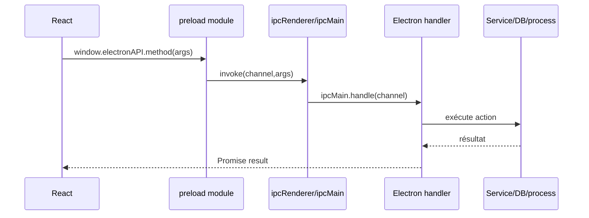

# Handlers IPC Electron

## Principe

Les handlers IPC sont la frontière entre le renderer React et le système local. Le renderer appelle `window.electronAPI`, le preload relaie via `ipcRenderer`, puis le main process exécute le handler.



## Organisation

```text
front/electron/handlers/
├── index.ts
├── common/
│   ├── adb/
│   ├── config/
│   ├── database/
│   ├── debug/
│   ├── device-setup/
│   ├── license/
│   ├── mirror-debug/
│   ├── scrcpy/
│   ├── security/
│   ├── storage/
│   ├── sync/
│   ├── system/
│   └── typewriter/
├── instagram/
│   ├── account/
│   ├── agent/
│   ├── automation/
│   ├── engagement/
│   ├── publish/
│   ├── scraping/
│   └── search/
├── tiktok/
├── threads/
├── gmail/
├── youtube/
├── scheduler/
├── ai/
└── compat/
```

`handlers/index.ts` exporte une fonction `register*Handlers()` par domaine. `main.ts` les appelle dans `registerHandlers()`.

## Handlers communs

| Domaine | Responsabilités |
|---|---|
| `common/adb` | liste devices, infos device, batterie, Wi-Fi, clones, APK Play Store |
| `common/database` | lecture/écriture SQLite côté Electron : comptes, sessions, analytics, scraping scores, graph, smart comment |
| `common/license` | login, licence, devices autorisés, limites licence |
| `common/scrcpy` | lancement scrcpy, stream intégré, raw stream, fenêtre miroir |
| `common/device-setup` | installation apps, clavier TAKTIK, diagnostics ADB |
| `common/security` | stockage sécurisé credentials |
| `common/system` | métriques système et bot |
| `common/typewriter` | saisie texte via clavier TAKTIK |
| `common/sync` | synchronisation Turso |

## Handlers plateformes

| Plateforme | Handlers | Bridges Python associés |
|---|---|---|
| Instagram | automation, account, scraping, DM, cold DM, smart comment, publish, target search, agent | `bot/bridges/instagram/*` |
| TikTok | workflow, account, upload | `bot/bridges/tiktok/*` |
| Threads | workflows target/feed | `bot/bridges/threads/workflows/dispatcher.py` (`threads_bridge`) |
| Gmail | login/logout/register/read OTP | `bot/bridges/gmail/account/account.py` (`gmail_account_bridge`) |
| YouTube | account + upload | `bot/bridges/youtube/*` |

## Process managers

`main.ts` crée un `ProcessManager` par famille :

| Manager | Process |
|---|---|
| `botProcesses` | sessions Instagram standard |
| `agentProcesses` | Taktik Agent |
| `scrcpyProcesses` | mirroring externe |
| `scrapingProcesses` | scraping Instagram |
| `dmProcesses` | DM/Cold DM |
| `tiktokProcesses` | workflows TikTok |
| `threadsProcesses` | workflows Threads |
| `accountProcesses` | compte Instagram |
| `tiktokAccountProcesses` | compte TikTok |
| `gmailAccountProcesses` | compte Gmail |
| `youtubeAccountProcesses` | compte YouTube |
| `youtubeUploadProcesses` | upload YouTube |

Chaque handler de workflow doit :

1. construire la config envoyée au bridge ;
2. lancer le process Python ;
3. relayer stdout/stderr vers le renderer ;
4. gérer stop/cleanup ;
5. retourner un statut cohérent au frontend.

## Sécurité

Le renderer n'a pas accès direct à Node :

| Sécurité | Valeur |
|---|---|
| `nodeIntegration` | `false` |
| `contextIsolation` | `true` |
| `webviewTag` | `false` |
| preload | unique entrée contrôlée |
| CSP | configurée dans `buildCspHeader()` |
| local files | protocoles restreints à des dossiers autorisés |

Protocoles custom :

| Protocole | Usage | Restriction |
|---|---|---|
| `local-file://` | médias générés, previews, vidéos | seulement `userData`, `Documents/taktik-desktop`, temp |
| `taktik-img://` | images profils et screenshots IA | filenames contrôlés dans AppData |

## Pattern pour ajouter un handler

1. Créer un fichier dans le domaine concerné.
2. Définir une fonction `registerXHandlers()`.
3. Utiliser `ipcMain.handle(channel, async (...) => ...)`.
4. Ajouter l'export dans `handlers/index.ts`.
5. Appeler la fonction dans `main.ts > registerHandlers()`.
6. Exposer la méthode côté preload si le renderer doit l'appeler.
7. Typer la méthode dans le module preload et dans `Window.electronAPI`.

Exemple :

```ts
import { ipcMain } from 'electron'

export function registerExampleHandlers() {
  ipcMain.handle('example:run', async (_event, payload) => {
    return { success: true, payload }
  })
}
```

## Liens liés

- [Application Desktop](./overview.md)
- [Communication IPC](../architecture/bridges-ipc.md)
- [Protocole IPC bot](../bridges/ipc-protocol.md)
- [Bridges Instagram](../bridges/instagram.md)
