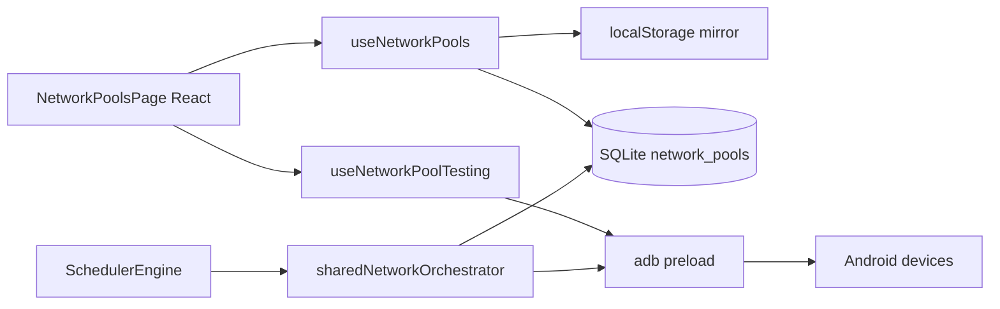

# Network Control Center

> **Perimetre : `[Front]`**
> Cette page documente la gestion des pools reseau partages dans `front/src/features/workspace/network/*`, leur persistence SQLite/localStorage, les sondes IP, les tests de reset et l'orchestrateur de lease utilise par le scheduler Electron.

Le Network Control Center sert a declarer une topologie de partage reseau entre un telephone routeur et un ou plusieurs telephones clients. Il ne remplace pas les workflows Instagram/TikTok : il stocke la topologie, expose des garde-fous et fournit les primitives reseau que le scheduler peut appliquer avant un run.

## Vue d'ensemble



## Fichiers principaux

| Fichier | Role |
|---|---|
| `front/src/features/workspace/network/pages/NetworkPoolsPage.tsx` | Page principale, drag and drop et resume global. |
| `front/src/features/workspace/network/components/NetworkPoolCard.tsx` | Edition d'un pool, policy reseau, router/client slots. |
| `front/src/features/workspace/network/components/NetworkPoolTestPanel.tsx` | Test mode: sondes, reset data, reset airplane, historique IP. |
| `front/src/features/workspace/network/components/NetworkGuideDialog.tsx` | Guide interactif FR/EN sur les modes routeur et les mises en garde. |
| `front/src/features/workspace/network/hooks/useNetworkPools.ts` | Etat renderer, persistence SQLite, miroir localStorage, sync multi-tabs. |
| `front/src/features/workspace/network/hooks/useNetworkPoolTesting.ts` | Chargement historique, resolution IP, toasts de tests. |
| `front/src/app/types/network.types.ts` | Typage partage reseau, policy, snapshots, historique et statuts IP. |
| `front/electron/database/repositories/app/network-pool/NetworkPoolRepository.ts` | Lecture/ecriture du JSON `network_pools` dans SQLite. |
| `front/electron/services/shared/network/orchestration/shared-network-orchestrator.ts` | Lease runtime appliquee avant certains nodes scheduler. |
| `front/electron/services/app/scheduler/engine/scheduler-engine.ts` | Detecte `sharedNetwork.groupId` et acquiert/libere un lease. |

## Modele de donnees

Chaque pool stocke :

| Champ | Sens |
|---|---|
| `routerDeviceId` | Device qui sert de routeur / modem. |
| `clientDeviceIds[]` | Devices qui utilisent ce partage. |
| `policy.routerMode` | `dedicated` ou `hybrid`. |
| `policy.clientAccessMode` | `single_active` ou `shared`. |
| `policy.resetMethod` | `data` ou `airplane`. |
| `policy.cooldownSeconds` | Cooldown declare entre resets/leases. |
| `policy.blockDuringPublish` | Intention metier: eviter les resets pendant un publish critique. |
| `policy.requireIpChange` | Intention metier: le reset doit idealement produire une nouvelle IP publique. |
| `policy.waitForClientsOnline` | Intention metier: ne pas considerer le pool pret tant que les clients requis ne sont pas revenus. |
| `policy.isolateIdleClients` | Les clients qui n'ont plus besoin du pool doivent etre remis hors reseau, typiquement via mode avion. |

Valeurs par defaut :

```ts
{
  connectionMode: "wifi_hotspot",
  routerMode: "dedicated",
  clientAccessMode: "single_active",
  resetMethod: "data",
  resetScope: "group",
  cooldownSeconds: 45,
  blockDuringPublish: true,
  requireIpChange: true,
  waitForClientsOnline: true,
  isolateIdleClients: true
}
```

## Persistence

La config vit a deux niveaux :

| Niveau | Usage |
|---|---|
| `localStorage` (`taktik-network-pools`) | Snapshot immediate pour l'UX locale et les refresh rapides. |
| SQLite (`network_pools`) | Source durable cote app Electron. |

`useNetworkPools()` :

1. charge SQLite au premier mount ;
2. garde un miroir localStorage ;
3. diffuse un event DOM `taktik-network-pools:sync` pour garder plusieurs renders alignes ;
4. debounce la sauvegarde SQLite (`500ms`).

Le repository SQLite stocke un JSON unique avec :

```ts
type NetworkPoolsConfig = {
  pools: NetworkPool[]
  unassignedDeviceIds: string[]
  poolOrder: string[]
  knownDevices?: Record<string, KnownNetworkDeviceInfo>
}
```

## Ce que la page permet aujourd'hui

### 1. Declarer la topologie

- drag and drop d'un device vers le slot routeur ;
- drag and drop d'un device vers la liste clients ;
- reorder des clients ;
- rename/couleur/repli d'un pool ;
- conservation des devices connus meme hors ligne.

### 2. Poser une policy explicite

La card de pool expose deja :

- mode routeur `Dedicated` vs `Hybrid` ;
- acces client `Single active` vs `Shared access` ;
- methode de reset `Mobile data` vs `Airplane mode` ;
- cooldown ;
- garde-fous `block publish`, `require IP change`, `wait clients`, `isolate idle clients`.

### 3. Verifier la realite reseau

Le test panel permet :

- `Sonder le pool` ;
- `Sonder le routeur` ;
- `Tester reset data` ;
- `Tester mode avion` ;
- visualiser l'historique IP de chaque device rattache au pool.

## Resolution IP et lecture des resultats

`useNetworkPoolTesting()` transforme les snapshots en un etat resolu par device :

| Etat | Signification |
|---|---|
| `publicIpSource = measured` | Le device a lui-meme resolu une IP publique. |
| `publicIpSource = inherited_router` | Le client n'a pas mesure son IP directement, mais son egress ressemble a un client hotspot et le routeur a une IP publique connue. |
| `publicIpSource = unavailable` | Rien de fiable a afficher pour l'instant. |

Statut de correspondance partagee :

| Statut | Sens |
|---|---|
| `verified_same` | Client et routeur ont mesure la meme IP publique. |
| `inherited_assumed` | Le client semble sortir via le routeur, mais sans mesure directe cote client. |
| `verified_mismatch` | Les IP publiques mesurees ne matchent pas. |
| `unknown` | Verification incomplte. |

Classification de sortie reseau :

| Egress mode | Heuristique |
|---|---|
| `mobile_direct` | Interface type `rmnet`, `ccmni`, `pdp`, `usb`. |
| `wifi_hotspot_client` | Interface `wlan0` + IP privee. |
| `unknown` | Rien de concluant. |

Le panneau affiche aussi un warning si le routeur lui-meme semble sortir via `wlan0` (`router_on_wifi_uplink`), car cela indique un host branche sur un autre Wi-Fi plutot que sur sa data mobile.

## Orchestrateur runtime: ce qui est vraiment enforce

Le point important pour eviter les malentendus : **tous les garde-fous ne sont pas encore executes partout**.

### Ce qui est deja enforce

`sharedNetworkOrchestrator` est utilise par `scheduler-engine.ts` quand un node d'action transporte un `sharedNetwork.groupId`.

Aujourd'hui, le lease s'applique pour les nodes scheduler de type action comme :

- `automation`
- `scraping`
- `unfollow`
- `dm`
- `tiktok-automation`
- `tiktok-publish`
- `youtube-upload`

Flux actuel :

1. le scheduler lit un `preferredPoolId` a partir du premier node qui declare `sharedNetwork.groupId` ;
2. juste avant le premier node action reseau-sensible, il appelle `acquireExecutionLease(...)` ;
3. a la fin de l'execution, il appelle `releaseExecutionLease(...)`.

### Regles enforcees aujourd'hui

| Regle | Effet runtime actuel |
|---|---|
| `routerMode = dedicated` | Si le device qui veut executer est le routeur, le lease est refuse. |
| `clientAccessMode = single_active` | Un seul lease actif par pool. |
| `isolateIdleClients = true` | Les clients freres sont remis en mode avion avant le run, puis le client qui vient de finir peut etre re-isole a la release. |
| Client choisi dans un pool `single_active` | Son mode avion est coupe puis Electron attend le retour Internet avant de continuer. |

### Ce qui reste declaratif aujourd'hui

Les champs suivants existent dans la policy, sont visibles en UI, et servent deja de cadre metier, mais leur enforcement n'est pas encore branche partout :

- `blockDuringPublish`
- `requireIpChange`
- `waitForClientsOnline`

Autrement dit :

- ils sont deja persistants et documentes ;
- ils ont du sens dans le test mode et dans la lecture ops ;
- ils prepareront les prochains branchages dans les workflows/orchestrateurs ;
- mais ils ne bloquent pas encore chaque workflow manuel par magie.

## Limite importante a documenter

Les workflows manuels ouverts directement depuis les pages Instagram/TikTok gardent leur propre `NetworkResetToggle`, mais **ils n'acquierent pas encore automatiquement un lease de pool partage**.

Donc aujourd'hui :

- le **scheduler** sait deja faire un vrai passage par l'orchestrateur partage ;
- le **manual run** sait encore surtout faire son reset reseau local au workflow ;
- la page Network sert deja de source de verite topologique et de banc de test pour les futures integrations.

## Tutoriel et guide utilisateur

Le control center expose deja deux couches d'aide :

| Aide | Role |
|---|---|
| `NetworkGuideDialog` | Guide interactif FR/EN sur dedicated, hybrid, verification IP et recommandations. |
| `PageTutorialButton` (`tutorialId = network`) | Tutoriel pas a pas de la page. |

## Recommandations de lecture

| Besoin | Page |
|---|---|
| Voir les workflows exposes dans l'app | [Features par plateforme](platform-features.md) |
| Comprendre le Live Center et l'etat reseau live | [Live Center](live-center.md) |
| Comprendre le scheduler | [Scheduler UI](scheduler-ui.md) |
| Comprendre le flux de publication | [Upload content](../workflows/upload-content.md) |
| Comprendre les types scheduler `sharedNetwork` | [Workflows end-to-end - Scheduler & sessions](../workflows/sessions.md) |

## Resume honnete

Le Network Control Center est deja :

- un editeur de topologie ;
- un stockage durable SQLite ;
- un banc de test reseau avec IP history ;
- une source de policy partagee ;
- un orchestrateur runtime reel pour certains runs scheduler.

Il n'est pas encore :

- un pilote universel branche automatiquement a tous les workflows manuels ;
- un juge absolu qui force deja tous les garde-fous declares dans chaque coin de l'app.
