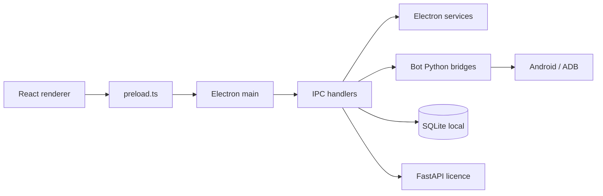
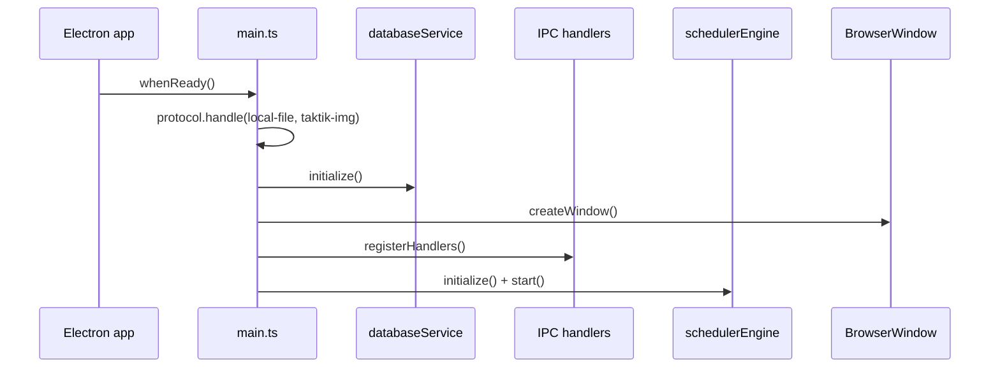
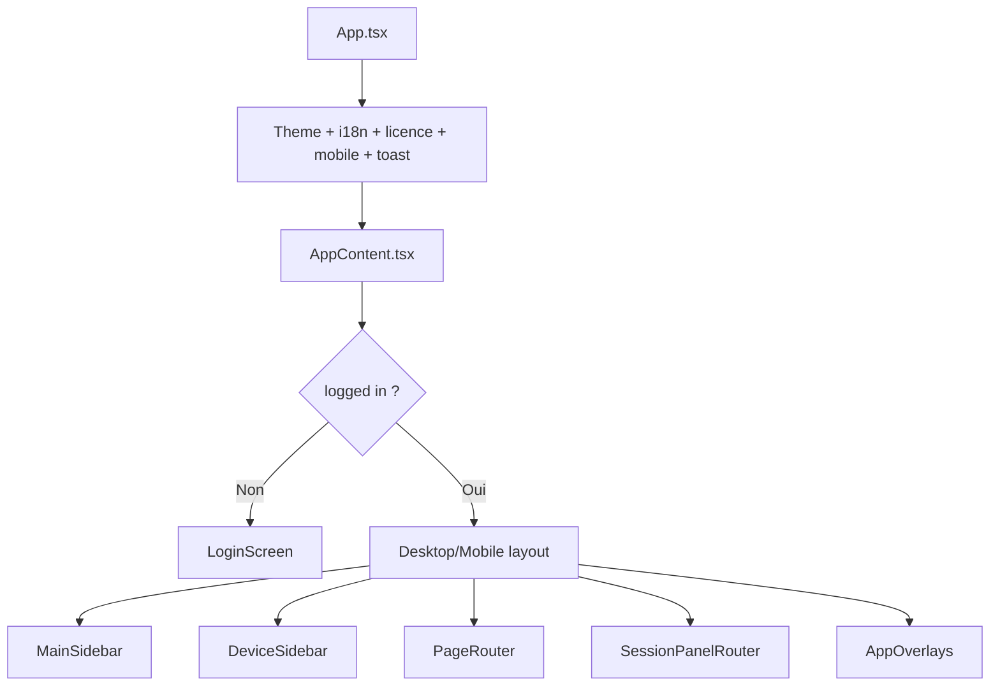

# Application Desktop Electron

> **Périmètre : `[Front]`**
> Cette page documente le dossier `front/` : Electron main, renderer React, handlers IPC, scheduler, database Electron et design system.

## Rôle

Le dossier `front/` contient l'application desktop TAKTIK. C'est l'interface utilisateur principale : elle authentifie l'utilisateur, gère les appareils Android, lance les bridges Python, affiche les live panels, pilote le scheduler et expose les outils de configuration.



## Stack

| Couche | Tech |
|---|---|
| App shell | Electron 28 |
| Renderer | React 18 + Vite |
| Langage | TypeScript |
| UI | Tailwind CSS + shadcn/ui/Radix |
| Icons | `lucide-react` |
| DB locale | `better-sqlite3` |
| Device | ADB, Scrcpy, `@yume-chan/*` |
| Graph scheduler | React Flow (`@xyflow/react`) |
| Vidéo | Remotion, ffmpeg |
| Updates | `electron-updater` |

## Arborescence

```text
front/
├── electron/              # process principal Electron
│   ├── main.ts            # fenêtre, CSP, protocoles, handlers, lifecycle
│   ├── preload.ts         # API sécurisée exposée au renderer
│   ├── handlers/          # IPC par domaine
│   ├── services/          # services main process
│   ├── database/          # SQLite Electron
│   ├── managers/          # process/window managers
│   ├── sync/              # Turso sync cross-device
│   └── updater/           # auto-update
├── src/                   # renderer React
│   ├── app/               # composition app, routing, layout, hooks globaux
│   ├── features/          # pages et composants métier
│   ├── lib/               # API, thème, i18n, licence, utils
│   ├── styles/            # globals.css, tutorial.css
│   └── ui/                # primitives UI réutilisables
├── scripts/               # build, packaging, obfuscation
├── public/                # assets publics
└── technical-docs/        # docs techniques front historiques
```

## Process Electron

`electron/main.ts` fait le bootstrap de l'app :

1. crée la fenêtre sans frame native ;
2. configure les protocoles `local-file://` et `taktik-img://` ;
3. initialise SQLite ;
4. restaure les images profil/AI depuis SQLite vers disque ;
5. applique la Content Security Policy ;
6. enregistre tous les handlers IPC ;
7. démarre le scheduler engine ;
8. tue les process enfants et ferme la DB à l'arrêt.



## Handlers IPC

Les handlers vivent dans `front/electron/handlers/` et sont exportés depuis `handlers/index.ts`.

| Domaine | Fichiers | Rôle |
|---|---|---|
| Common ADB | `common/adb/` | devices, batterie, Wi-Fi, clones, Play Store |
| Common DB | `common/database/` | comptes, sessions, analytics, scraping scores, graph, smart comments |
| License | `common/license/` | login/licence/devices avec FastAPI |
| Scrcpy | `common/scrcpy/` | mirroring externe et stream intégré |
| Device setup | `common/device-setup/` | diagnostics, apps, clavier TAKTIK |
| Security | `common/security/` | credentials et helpers sensibles |
| Instagram | `instagram/*` | automation, scraping, DM, publish, smart comment, account |
| TikTok | `tiktok/*` | workflows, account, upload |
| Threads | `threads/` | workflows Threads |
| Gmail | `gmail/` | login/logout/register/read OTP |
| YouTube | `youtube/` | account + upload |
| Scheduler | `scheduler/` | schedule graph, recorder, content planner |
| AI | `ai/` | provider, content, TTS |
| Compat | `compat/` | tests de compatibilité workflows/selectors |

## Preload

`electron/preload.ts` compose plusieurs modules preload dans un seul objet :

```ts
window.electronAPI
```

Domaines exposés :

- `coreAPI`
- `adbAPI`
- `mirrorAPI`
- `botAPI`
- `tiktokAPI`
- `threadsAPI`
- `gmailAPI`
- `youtubeAPI`
- `scrapingAPI`
- `automationAPI`
- `aiAPI`
- `dbAPI`
- `dmAPI`
- `instagramAPI`
- `licenseAPI`
- `smartCommentAPI`
- `compatAPI`
- `syncAPI`

Le renderer n'a pas `nodeIntegration`. Toute interaction système passe donc par `window.electronAPI` et des handlers `ipcMain.handle()`.

## Renderer React

Le renderer est structuré autour de `App.tsx` et `AppContent.tsx`.



Hooks centraux dans `AppContent` :

| Hook | Rôle |
|---|---|
| `useAuth` | login/logout et état utilisateur |
| `useLicenseManager` | licence, device selection, blocage |
| `useDevicePolling` | polling ADB et liste des devices |
| `useDeviceRegistration` | filtre devices selon licence |
| `useSessionState` | état live des sessions |
| `useInstagramSession` | parsing events Instagram |
| `useTikTokSession` | parsing events TikTok |
| `useThreadsSession` | events Threads |
| `useSchedulerSession` | sessions planifiées |
| `useGlobalAppEvents` | events globaux venant d'Electron |
| `useTursoSyncNotifier` | état sync cross-device |

## Routing UI

`src/app/routing/PageRouter.tsx` mappe `globalPage` et `devicePage` vers les pages.

Global pages :

| Page | Composant |
|---|---|
| `analytics` | `AnalyticsPage` |
| `sessions` | `SessionsPage` |
| `devices-management` | `DevicesManagementPage` |
| `settings` | `SettingsPage` |
| `scheduler-create` | `GlobalSchedulerCreatePage` |
| `scheduler-control` | `SchedulerControlPage` |
| `content-planner` | `ContentPlannerPage` - voir [Content Planner](content-planner.md) |
| `video-recorder` | `VideoRecorderPage` |
| `video-editor` | `VideoEditorPage` |

Device pages principales :

| Famille | Exemples |
|---|---|
| Device | info, applications, scheduler |
| Instagram automation | target, hashtag, post likers, feed, agent, unfollow |
| Instagram data | scraping, scraping history, target search, qualification IA sur profils scrapes |
| Instagram engagement | DM responses, cold DM, smart comment |
| Instagram publish | post, reel, story |
| TikTok | For You, target, hashtag, DM, cold DM, unfollow, scraping, upload |
| Threads | target, feed |
| Gmail | account, login, register, logout |
| YouTube | account, login, logout, upload |

## Live Panels

`SessionPanelRouter.tsx` choisit le panel en fonction de `sessionInfo.workflowType`.

| `workflowType` | Panel |
|---|---|
| `sync` | `SessionLivePanelSync` |
| `unfollow` | `SessionLivePanelUnfollow` |
| `tiktok` | `SessionLivePanelTikTok` |
| `tiktok_unfollow` | `SessionLivePanelTikTokUnfollow` |
| `coldDm` | `SessionLivePanelDM` |
| autre Instagram | `SessionLivePanel` |

Les panels consomment les events stdout JSON des bridges Python, puis affichent logs, compteurs, progression, profil courant, états scheduler et actions.

## Design System

Le style de l'app est défini principalement dans :

- `front/tailwind.config.js`
- `front/src/styles/globals.css`
- `front/src/lib/theme/palette.ts`
- `front/src/ui/*`

Palette par défaut sombre :

| Token | Valeur |
|---|---|
| background | `#08101a` |
| card | `#0e1621` |
| foreground | `#f8fafc` |
| primary | `#8B5CF6` |
| cyan glow | `#63ebda` |
| radius | `0.75rem` |

La documentation consolidee reprend maintenant cette direction visuelle : dark navy, glass panels, bordures cyan subtiles, accent violet, Inter, Mermaid dark.

## Build

Scripts principaux :

```powershell
cd front
npm run dev
npm run typecheck
npm run lint
npm run build
npm run build:all
npm run build:all:fast
```

Le build Windows passe par `electron-builder` avec packaging NSIS. Les ressources Python, assets Electron, scrcpy, icônes et dépendances natives `better-sqlite3` sont listées dans `package.json > build.extraResources`.

Le détail du build complet, du launcher Python packagé et du feed `electron-updater` est dans [Build, Packaging & Auto-Update](build-update.md).

## Liens liés

- [Architecture globale](../architecture/overview.md)
- [Communication IPC](../architecture/bridges-ipc.md)
- [Schéma SQLite](../database/schema.md)
- [Etat actuel FastAPI](../../technical/api-current-state.md)
- [Scheduler & Sessions](../workflows/sessions.md)
- [Build, Packaging & Auto-Update](build-update.md)
