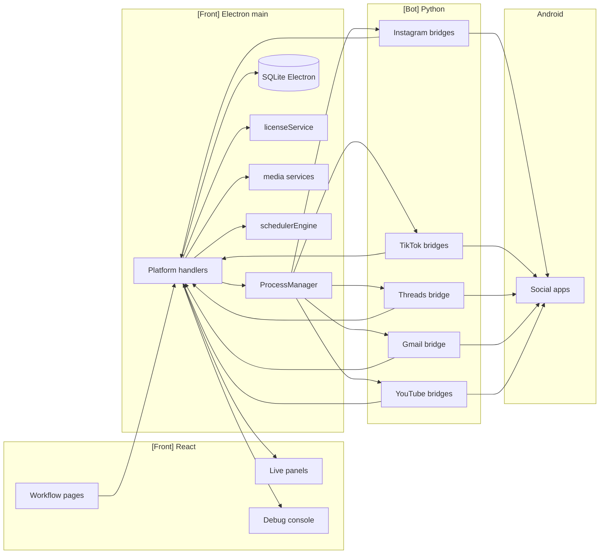
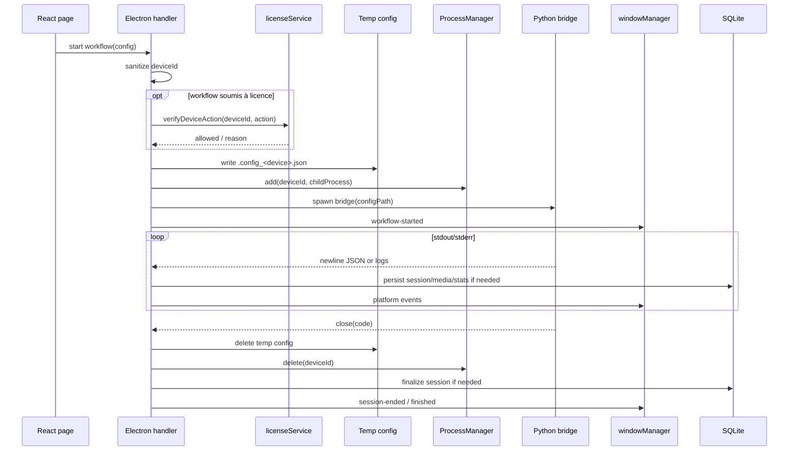

# Platform Bridge Handlers

> **Périmètre : `[Transversal]`**
> Cette page documente les handlers Electron qui lancent les bridges Python pour Instagram, TikTok, Threads, Gmail et YouTube. Le code handler est côté `[Front]`, l'automatisation Android réelle est côté `[Bot]`.

Les platform handlers sont le passage entre l'interface React et le moteur Python. Ils construisent une config JSON, spawnent le bon bridge, relaient stdout/stderr vers le renderer, mettent à jour SQLite et nettoient le process à la fin.

## Vue d'ensemble



## Fichiers principaux

| Famille | Handler Electron | Bridge Python |
|---|---|---|
| Instagram automation | `instagram/automation/bot.ts` | `bot/bridges/instagram/automation/desktop.py` (`desktop_bridge`) |
| Instagram agent | `instagram/agent/taktikAgent.ts` | bridge agent Instagram |
| Instagram account | `instagram/account/account.ts` | bridges account Instagram |
| Instagram scraping | `instagram/scraping/scraping.ts` | `bot/bridges/instagram/scraping/scraping.py` (`scraping_bridge`) |
| Instagram DM | `instagram/engagement/dm.ts` | bridge DM. Voir [DM & Cold DM end-to-end](../workflows/dm-cold-dm.md). |
| Instagram cold DM | `instagram/engagement/coldDm.ts` | `cold_dm_bridge`. Voir [DM & Cold DM end-to-end](../workflows/dm-cold-dm.md). |
| Instagram smart comment | `instagram/engagement/smart-comment.ts` | bridge smart comment. Voir [Smart Comment end-to-end](../workflows/smart-comment.md). |
| Instagram upload | `instagram/publish/instagram-upload.ts` | ADB direct, pas de bridge Python. Voir [Upload Content](../workflows/upload-content.md). |
| Media capture | `instagram/publish/media-capture.ts` | capture locale/Android |
| Target search | `instagram/search/targetSearch.ts` | recherche/DB locale, fiche profil, export CSV. Voir [Target Search Instagram](target-search.md). |
| TikTok workflows | `tiktok/tiktok.ts` | `bot/bridges/tiktok/workflows/dispatcher.py` (`tiktok_bridge`) |
| TikTok upload | `tiktok/upload.ts` | bridge upload TikTok. Voir [Upload Content](../workflows/upload-content.md). |
| TikTok account | `tiktok/account.ts` | bridge account TikTok |
| Threads | `threads/threads.ts` | `bot/bridges/threads/workflows/dispatcher.py` (`threads_bridge`) |
| Gmail account | `gmail/account.ts` | `bot/bridges/gmail/account/account.py` (`gmail_account_bridge`) |
| YouTube account | `youtube/account.ts` | bridges account YouTube |
| YouTube upload | `youtube/upload.ts` | `bot/bridges/youtube/publish/upload.py` (`youtube_upload_bridge`). Voir [Upload Content](../workflows/upload-content.md). |

Les exports sont centralisés dans `front/electron/handlers/index.ts`, puis enregistrés dans `main.ts`.

## Pattern commun



## Responsabilités du handler

| Responsabilité | Détail |
|---|---|
| Validation | Sanitize `deviceId`, vérifier fichiers, vérifier process déjà actif. |
| Licence | Appeler `licenseService.verifyDeviceAction()` pour les workflows protégés. |
| Config bridge | Enrichir la config UI avec clés IA, modèle vision, package clone, prompt, chemins. |
| Spawn | Utiliser `getSpawnArgs()` et `buildPythonSpawnEnv()` quand disponible. |
| Tracking process | Ajouter/supprimer dans le `ProcessManager` de la famille. |
| Events live | Relayer stdout JSON vers `windowManager.send(...)`. |
| Persistance | Créer/finaliser sessions, stocker stats, images, screenshots, erreurs. |
| Cleanup | Supprimer config temporaire, tuer process tree au stop, fermer l'app Android si nécessaire. |
| Scheduler | Marquer device busy/available. |

## Process managers

| Manager injecté depuis `main.ts` | Handlers |
|---|---|
| `botProcesses` | Instagram automation standard. |
| `agentProcesses` | Taktik Agent. |
| `scrapingProcesses` | Instagram scraping et qualification. |
| `dmProcesses` | DM/Cold DM. |
| `tiktokProcesses` | TikTok workflows. |
| `threadsProcesses` | Threads workflows. |
| `accountProcesses` | Instagram account tools. |
| `tiktokAccountProcesses` | TikTok account tools. |
| `gmailAccountProcesses` | Gmail account tools. |
| `youtubeAccountProcesses` | YouTube account tools. |
| `youtubeUploadProcesses` | YouTube upload. |

## Instagram automation

`registerBotHandlers()` expose les sessions Instagram classiques.

### Config

```ts
interface BotSessionConfig {
  deviceId: string
  workflowType:
    | 'target_followers'
    | 'target_following'
    | 'hashtags'
    | 'post_url'
    | 'notifications'
    | 'unfollow'
    | 'feed'
    | 'sync_following'
    | 'sync_followers_following'
  target: string
  limits: { maxProfiles: number; maxLikesPerProfile: number }
  probabilities: { like: number; follow: number; comment: number; watchStories: number; likeStories: number }
  filters: { minFollowers: number; maxFollowers: number; minPosts: number; maxFollowing: number }
  session: { durationMinutes: number; minDelay: number; maxDelay: number }
  language?: 'en' | 'fr'
  packageName?: string
  sync?: { mode: 'fast' | 'enriched' }
  ai?: {
    enabled: boolean
    smartComments: boolean
    profileAnalysis: boolean
    postAnalysis: boolean
    openrouterApiKey?: string
    visionModel?: string
  }
}
```

### Canaux

| Canal | Rôle |
|---|---|
| `bot:start-session` | Démarre `desktop_bridge`. |
| `bot:stop-session` | Tue le process et marque la session `STOPPED`. |
| `bot:session-status` | Vérifie si un device a un bot actif. |
| `bot:all-sessions` | Liste les devices actifs. |
| `bot:send-crash-report` | Envoie le dernier crash report stocké. |
| `bot:store-crash-data` | Stocke une erreur reçue du renderer/bridge. |

### Events renderer

| Event | Usage |
|---|---|
| `bot:workflow-started` | Ouvre le bon panneau live. |
| `bot:output` | Flux stdout brut ou lignes utiles. |
| `bot:stderr` | Logs stderr avec niveau détecté depuis Loguru. |
| `bot:message` | JSON bridge parsé. |
| `bot:session-ended` | Fermeture du panneau live / cleanup UI. |

### Persistance enrichie

Le handler ne se contente pas de relayer les messages :

| Message bridge | Effet Electron |
|---|---|
| `session_start` | Capture `session_id` dans `deviceSessionIds`. |
| `profile_captured` avec image base64 | Sauve l'image, remplace par `taktik-img://...`, met à jour SQLite. |
| `ai_profile_done` | Met à jour classification IA du profil. |
| `ai_screenshot_done` | Sauve screenshot post IA et l'insère en DB. |
| `ai_comment_ready` | Incrémente stats IA. |

En cas de crash silencieux, le handler synthétise un message `type: error`, conserve stdout/stderr récents, classe l'erreur (`PYTHON_IMPORT_ERROR`, `PROCESS_TIMEOUT`, etc.) et tente d'envoyer un crash report.

## Instagram scraping

`registerScrapingHandlers()` démarre `scraping_bridge`.

| Étape | Détail |
|---|---|
| Licence | `verifyDeviceAction(deviceId, 'scraping_session')`. |
| Préparation | Redémarre Instagram via `restartApp()`. |
| IA | Injecte clé OpenRouter, modèle vision et prompt de qualification. |
| Config | `.scraping_config_<device>.json`. |
| Process | `scrapingProcesses` + `scrapingPids`. |
| Media | Sauve `profile_captured.profile_pic_url` en `taktik-img://`. |
| DB safety net | Crée une ligne minimale si le profil n'est pas encore visible côté SQLite Electron. |

Types principaux :

| Champ | Valeurs |
|---|---|
| `type` | `target`, `hashtag`, `post_url` |
| `scrapeType` | `followers`, `following`, `posts`, `authors`, `likers` |
| `aiRescrapeMode` | `full`, `stats_only` |

## Instagram cold DM

`registerColdDmHandlers()` construit une liste de destinataires puis lance `cold_dm_bridge`.

Le détail complet du couple `DMResponses.tsx` / `ColdDM.tsx`, des events `dm:*`, de la table `sent_dms` et des différences entre DM replies et outreach est dans [DM & Cold DM end-to-end](../workflows/dm-cold-dm.md).

Sources de destinataires :

| `sourceType` | Source |
|---|---|
| `manual` | `manualUsernames`. |
| `file` | `importedUsernames`. |
| `scraped` | Profils d'une `scraping_sessions` via SQLite. |

Modes message :

| `messageMode` | Config transmise |
|---|---|
| `manual` | `messages`. |
| `ai` | `aiPrompt` + clé OpenRouter si disponible. |

Canaux :

| Canal | Rôle |
|---|---|
| `coldDm:start` | Démarre le bridge. |
| `coldDm:stop` | Tue le process. |
| `scraping:getSessionProfiles` | Récupère les profils d'une session de scraping. |

## TikTok workflows

`registerTikTokHandlers()` gère plusieurs workflows TikTok via `tiktok_bridge`.

Configs exposées :

| Interface | `workflowType` | Usage |
|---|---|---|
| `TikTokForYouConfig` | `for_you`, `hashtag`, `target`, `dm_read`, `dm_send` | Feed, hashtag, target et DM historiques. |
| `TikTokTargetConfig` | `search` | Recherche TikTok. |
| `TikTokFollowersConfig` | `followers` | Followers d'un ou plusieurs targets. |
| `TikTokDMReadConfig` | `dm_read` | Lecture conversations. |
| `TikTokDMSendConfig` | `dm_send` | Envoi messages. |

Le handler crée une session TikTok en SQLite via `databaseService.createTikTokSession()` et garde :

| Map | Usage |
|---|---|
| `deviceTikTokSessionIds` | Session DB par device. |
| `deviceTikTokStats` | Dernier snapshot stats pour stop/close. |

Events typiques :

| Event | Usage |
|---|---|
| `tiktok:workflow-started` | Panneau live TikTok. |
| `tiktok:output` | stdout brut. |
| `tiktok:message` | JSON bridge parsé. |
| `tiktok:stats` | Stats live. |
| `tiktok:session-ended` | Fin session. |

## Threads

`registerThreadsHandlers()` suit le même pattern que TikTok, mais avec une surface plus petite.

| Canal | Rôle |
|---|---|
| `threads:start-follow` | Lance `threads_bridge`. |
| `threads:stop` | Tue le workflow. |
| `threads:session-status` | Vérifie un device. |
| `threads:all-sessions` | Liste les devices actifs. |

Le handler convertit `minDelayMs/maxDelayMs` en secondes pour le bridge et garde la compatibilité avec `maxFollowsPerSession`.

Events :

| Event | Usage |
|---|---|
| `threads:workflow-started` | Démarrage live. |
| `threads:output` | stdout brut. |
| `threads:message` | JSON bridge. |
| `threads:stats` | Stats live. |
| `threads:action` | Action observée. |
| `threads:stderr` | Logs stderr. |
| `threads:session-ended` | Fin session. |
| `threads:error` | Erreur process. |

## Gmail et YouTube account tools

Les handlers account Gmail/YouTube servent surtout aux outils admin : login, logout, register, profil et OTP selon plateforme.

| Plateforme | Handler | Bridge |
|---|---|---|
| Gmail | `gmail/account.ts` | `gmail_account_bridge` |
| YouTube | `youtube/account.ts` | bridges account YouTube |

Ils suivent le même principe : config temporaire, spawn bridge account, events vers renderer, cleanup.

## YouTube upload

`registerYouTubeUploadHandlers()` lance `youtube_upload_bridge`.

### Config

```ts
interface YouTubeUploadConfig {
  deviceId: string
  localPath: string
  title?: string
  description?: string
  uploadType?: 'short' | 'video'
  visibility?: 'public' | 'unlisted' | 'private'
}
```

Canaux :

| Canal | Rôle |
|---|---|
| `youtube-upload:start` | Vérifie `deviceId`, fichier local, process actif, puis spawn. |
| `youtube-upload:stop` | Tue le process via `youtubeUploadProcesses.kill(deviceId)`. |

Events :

| Event | Usage |
|---|---|
| `youtube-upload:output` | JSON bridge ou log parsé. |
| `youtube-upload:finished` | Upload terminé ou process fermé. |

## Gestion des chemins et packaging

Tous les handlers qui spawnent Python doivent passer par :

| Helper | Rôle |
|---|---|
| `getPythonPath()` | Racine Python/bot selon dev/prod. |
| `getBridgePath(name)` | Résout le bridge script ou exe. |
| `getSpawnArgs(name, args)` | Commande + args compatibles dev/prod/launcher. |
| `buildPythonSpawnEnv()` | Variables Python UTF-8/PYTHONPATH. |

Cela évite de dupliquer la logique entre dev, build Electron et packaging PyInstaller.

## Stop et cleanup

| Action | Pattern |
|---|---|
| Stop manuel | `killProcessTree(pid, label)` ou `ProcessManager.kill(deviceId)`. |
| Fin naturelle | `process.on('close')` supprime config, delete manager, marque scheduler available. |
| App Android | `closeApp(deviceId, platform, label, packageName?)` quand pertinent. |
| Session DB | Marquer `STOPPED`, finaliser durée, persister stats. |
| Scheduler | `schedulerEngine.markDeviceBusy/Available`. |

## Front vs Bot

| Élément | Périmètre | Responsabilité |
|---|---|---|
| React workflow pages | `[Front]` | Construire config utilisateur. |
| Platform handlers | `[Front]` | Vérifier, enrichir, spawn, relayer, persister. |
| ProcessManager | `[Front]` | Lifecycle subprocess par device. |
| Bridges Python | `[Bot]` | Automatiser Android et émettre JSON stdout. |
| Actions/selectors/workflows Python | `[Bot]` | Logique métier et UI automation. |
| SQLite local | `[Transversal]` | Sessions, stats, profils, médias, schedules. |

## Points de vigilance

| Sujet | Risque |
|---|---|
| Config temporaire | Toujours supprimer au `close`; éviter d'écrire dans un dossier non prévu en production. |
| Base64 stdout | Ne pas broadcaster de gros payloads au renderer ; sauver en fichier/DB puis remplacer par URL. |
| Crash silencieux | Garder stdout/stderr récents pour produire une erreur utile. |
| `deviceId` | Sanitizer avant ADB/spawn/session maps. |
| Licence | Les nouveaux workflows payants doivent appeler `verifyDeviceAction()`. |
| Scheduler busy | Oublier `markDeviceAvailable()` bloque les planifications suivantes. |
| Events | Tout nouveau type stdout doit être documenté côté live panel/preload si consommé. |
| Process tree | Tuer seulement le process parent peut laisser Python/ADB vivants ; préférer `killProcessTree`. |

## Liens associés

| Page | Pourquoi |
|---|---|
| [`[Front] Handlers IPC Electron`](ipc-handlers.md) | Vue générale des handlers IPC. |
| [`[Front] App Lifecycle`](app-lifecycle.md) | Enregistrement des handlers et ProcessManagers. |
| [`[Transversal] Bridge Launcher & Packaging`](../bridges/launcher.md) | Résolution dev/prod des bridges. |
| [`[Front] Sessions UI`](sessions-ui.md) | Consommation des events live côté renderer. |
| [`[Transversal] Scheduler & Sessions`](../workflows/sessions.md) | Sessions DB, scheduler et runtime. |
| [`Bridges Instagram`](../bridges/instagram.md) | Côté Bot des bridges Instagram. |
| [`Bridges TikTok`](../bridges/tiktok.md) | Côté Bot des bridges TikTok. |
| [`[Bot] Bridges Gmail`](../bridges/gmail.md) | Côté Bot Gmail. |
| [`[Bot] Bridges YouTube`](../bridges/youtube.md) | Côté Bot YouTube. |
