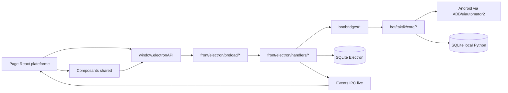
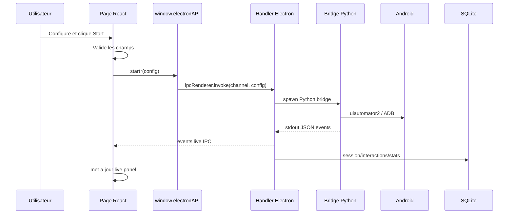

# Features par plateforme

> **Perimetre : `[Front]`**
> Cette page documente les ecrans React dans `front/src/features/platforms/*`. Elle explique comment chaque page construit une configuration, appelle `window.electronAPI`, recoit les events live, puis rejoint les handlers Electron, les bridges Python et SQLite.

Les pages plateforme sont la couche UI metier de l'application desktop. Elles ne pilotent jamais Android directement : elles collectent les parametres utilisateur, appellent le preload Electron, puis affichent l'etat de session renvoye par les handlers et les bridges.

## Vue d'ensemble



## Arborescence

```text
front/src/features/platforms/
+-- instagram/
|   +-- data/                 # comptes, scraping, target search
|   +-- session/              # live panels Instagram
|   +-- upload/               # upload post/reel
|   +-- workflows/            # automation, DM, smart comment, agent
+-- tiktok/
|   +-- data/                 # comptes, scraping, target search
|   +-- session/              # live panels TikTok
|   +-- upload/               # upload video
|   +-- workflows/            # automation, DM, unfollow, cold DM
+-- threads/
|   +-- pages/                # feed et target
|   +-- components/           # live panel Threads
+-- gmail/
|   +-- pages/                # login, logout, register
|   +-- components/           # profile + header
+-- youtube/
    +-- pages/                # login, logout, profile, upload
    +-- components/           # header
```

## Role des pages

| Plateforme | Role UI | Couche appelee | Bridge Python |
|---|---|---|---|
| Instagram | Automation, scraping, comptes, upload, DM, smart comment, agent | `botAPI`, `scrapingAPI`, `dmAPI`, `smartCommentAPI`, `instagramAPI`, `dbAPI` | `bot/bridges/instagram/*` |
| TikTok | Automation, scraping, comptes, upload, DM, unfollow | `tiktokAPI`, `dbAPI`, `aiAPI` | `bot/bridges/tiktok/*` |
| Threads | Feed/target automation MVP | `threadsAPI`, `aiAPI` | `bot/bridges/threads/*` |
| Gmail | Ajout/suppression/scan comptes Gmail Android | `gmailAPI` | `bot/bridges/gmail/*` |
| YouTube | Connexion compte et upload video/short | `youtubeAPI`, `gmailDb` | `bot/bridges/youtube/*` |

## Pattern commun

Chaque workflow UI suit presque toujours la meme sequence.



## Instagram

### Pages

| Zone | Fichiers | Usage |
|---|---|---|
| Workflows automation | `workflows/target/InstagramTarget.tsx`, `workflows/hashtag/InstagramHashtag.tsx`, `workflows/post-likers/InstagramPostLikers.tsx`, `workflows/feed/InstagramFeed.tsx`, `workflows/bot/Bot.tsx` | Construit une `BotSessionConfig` puis appelle `startBotSession`. |
| Cold DM | `workflows/cold-dm/ColdDM.tsx` | Charge les sources, messages, comptes, puis lance `startColdDM`. Voir [DM & Cold DM end-to-end](../workflows/dm-cold-dm.md). |
| DM responses | `workflows/dm-responses/DMResponses.tsx` | Lecture conversations, generation AI, envoi individuel ou batch. Voir [DM & Cold DM end-to-end](../workflows/dm-cold-dm.md). |
| Smart Comment | `workflows/smart-comment/SmartComment.tsx` | Scrape commentaires, genere reponses AI, persiste sessions/replies. Voir [Smart Comment end-to-end](../workflows/smart-comment.md). |
| Agent | `workflows/agent/TaktikAgent.tsx` | Lance une session agent via `startAgentSession`; le flux live est documente dans [Agent Panel](agent-panel.md). |
| Scraping | `data/scraping/Scraping.tsx`, `ScrapingHistory.tsx` | Lance scraping followers/following/post, affiche historique et exports. |
| Discovery legacy | Retire | Les pages `data/discovery/Discovery.tsx` et `DiscoveryQualification.tsx` ne sont plus actives. Des dossiers vides/traductions legacy peuvent rester ; la prospection passe par scraping avance, Target Search et qualification IA. |
| Target search | `data/target/TargetSearch.tsx`, `ProfileDetailSheet.tsx` | Recherche profils locaux, fiche detaillee, graph following et prefill workflows. Voir [Target Search Instagram](target-search.md). |
| Account | `data/account/AccountLogin.tsx`, `AccountRegister.tsx`, `AccountLogout.tsx`, `AccountProfile.tsx` | Gestion compte Instagram sur device. |
| Upload | `upload/post/UploadPost.tsx`, `UploadPostAI.tsx`, `upload/reel/UploadReel.tsx` | Le routeur expose aujourd'hui `UploadPostAIPage` pour `post`, `reel` et `story` via `uploadType`. `UploadPost.tsx` reste present comme implementation legacy/non routee, et `UploadReel.tsx` existe encore mais son bouton est desactive et ne lance pas d'IPC. Voir [Upload Content](../workflows/upload-content.md). |
| Live panels | `session/live-panel/*`, `session/scraping-panel/ScrapingLivePanel.tsx` | Affiche stats, logs, progression, fin de session. L'ancien panel Discovery n'est plus actif. |

### Automation classique

Les pages `Target`, `Hashtag`, `PostLikers` et `Feed` appellent le meme canal generique :

| Etape | Detail |
|---|---|
| Page | `front/src/features/platforms/instagram/workflows/*` |
| Preload | `front/electron/preload/platforms/instagram/bot.ts` |
| Invoke | `bot:start-session` |
| Stop | `bot:stop-session` |
| Events | `bot:output`, `bot:stderr`, `bot:message`, `bot:workflow-started`, `bot:session-ended` |
| Handler | `front/electron/handlers/instagram/automation/bot.ts` cote Electron |
| Bridge | `bot/bridges/instagram/automation/desktop.py` (`desktop_bridge`) et bridges specialises |
| Bot core | `bot/taktik/core/social_media/instagram/actions/*` |

Exemple de config construite par `InstagramTarget.tsx` :

```ts
{
  deviceId,
  workflowType: "target_followers" | "target_following",
  target: "account1,account2",
  limits: { maxProfiles, minLikesPerProfile, maxLikesPerProfile },
  probabilities: { like, follow, comment, watchStories, likeStories },
  filters: { minFollowers, maxFollowers, minPosts, maxFollowing },
  session: { durationMinutes, minDelay, maxDelay },
  comments: { customComments },
  ai: { enabled, smartComments, profileAnalysis, postAnalysis, openrouterApiKey },
  networkReset,
  packageName
}
```

### Scraping Instagram

| Element | Detail |
|---|---|
| Page | `data/scraping/Scraping.tsx` |
| Preload | `front/electron/preload/platforms/instagram/scraping.ts` |
| Start | `startScraping(config)` -> `scraping:start` |
| Stop | `stopScraping(deviceId)` -> `scraping:stop` |
| Events | `scraping:progress`, `scraping:profile`, `scraping:target-info`, `scraping:limited`, `scraping:skipped`, `scraping:completed`, `scraping:error` |
| Historique | `getScrapingHistory`, `getScrapingSessionProfiles`, `exportScrapingSession` |
| Tables | `scraping_sessions`, `scraped_profiles`, `instagram_profiles` |
| Bridge | `bot/bridges/instagram/scraping/scraping.py` (`scraping_bridge`) |
| Bot workflow | `bot/taktik/core/social_media/instagram/workflows/scraping/*` |

### Smart Comment

`SmartComment.tsx` est un workflow hybride : il utilise le device pour scraper/repondre, la base Electron pour persister la session, et les providers AI pour generer les reponses.

| Etape | API utilisee |
|---|---|
| Charger compte | `window.electronAPI.db.getAllAccounts`, `getAccountProfile` |
| Creer session | `window.electronAPI.db.smartComment.createSession` |
| Scraper | `window.electronAPI.smartComment.scrape` |
| Generer reponses | `window.electronAPI.aiContent.textCompletion` |
| Persister replies | `window.electronAPI.db.smartComment.createRepliesBatch` |
| Repondre | `window.electronAPI.smartComment.reply` |
| Stop | `window.electronAPI.smartComment.stop` |

Events principaux :

| Event | Usage UI |
|---|---|
| `onScrapeProgress` | Progression scraping commentaires. |
| `onPostContext` | Contexte du post courant. |
| `onCommentScraped` | Ajout d'un commentaire source. |
| `onReplyProgress` | Progression envoi reponses. |
| `onReplySent` / `onReplyFailed` | Mise a jour statut reply en DB. |
| `onReplyComplete` | Session terminee cote reply. |
| `onTargetProfile` | Profil cible visite. |
| `onScrapeStatus` | Statut libre affiche a l'utilisateur. |

### Cold DM et DM responses

| Page | Role | APIs |
|---|---|---|
| `ColdDM.tsx` | Outreach depuis scraping history ou usernames manuels | `db.getAllAccounts`, `getScrapingHistory`, `license.verifyDeviceAction`, `startColdDM`, `stopColdDm` |
| `DMResponses.tsx` | Lire conversations, generer reponses, envoyer DM | `readDMConversations`, `generateBulkAIResponses`, `sendDMMessage`, `sendBulkDM`, `stopDMReading`, `stopDMSending` |

Le flux complet UI -> preload -> handlers -> bridges -> SQLite est documente dans [DM & Cold DM end-to-end](../workflows/dm-cold-dm.md).

> Note quota/licence : le front peut encore appeler `license.verifyDeviceAction(deviceId, 'cold_dm')` avant Cold DM. Ce n'est pas un quota d'actions local par session ; c'est une verification de droit/licence cote desktop/API.

## TikTok

### Pages

| Zone | Fichiers | Usage |
|---|---|---|
| Automation | `workflows/followers/TikTokFollowers.tsx`, `for-you/TikTokForYou.tsx`, `hashtag/TikTokHashtag.tsx`, `target/TikTokTarget.tsx` | Lance les workflows TikTok via `tiktokAPI`. |
| DM | `workflows/dm/TikTokDM.tsx` | Lecture, generation AI, envoi DM. |
| Cold DM | `workflows/cold-dm/TikTokColdDM.tsx` | Outreach TikTok depuis profils/sources. |
| Unfollow | `workflows/unfollow/TikTokUnfollow.tsx` | Unfollow avec live panel dedie. |
| Scraping | `data/scraping/TikTokScraping.tsx`, `TikTokScrapingHistory.tsx` | Scraping profils TikTok. |
| Discovery legacy | Retire | L'ancien module Discovery TikTok n'est plus actif. Des dossiers vides/traductions legacy peuvent rester ; utiliser scraping TikTok et Target Search. |
| Target search | `data/target/TikTokTargetSearch.tsx` | Recherche dans les profils locaux TikTok. |
| Account | `data/account/*` | Login/register/logout/profile TikTok. |
| Upload | `upload/post/TikTokUploadPost.tsx` | Upload video TikTok. |
| Live panels | `session/live-panel/SessionLivePanelTikTok.tsx`, `session/unfollow-panel/*` | Stats et events live. |

### Automation TikTok

| Workflow UI | Methode preload | Channel |
|---|---|---|
| For You | `startTikTokForYou(config)` | `tiktok:start-foryou` |
| Target | `startTikTokTarget(config)` | `tiktok:start-target` |
| Followers | `startTikTokFollowers(config)` | `tiktok:start-followers` |
| Stop commun | `stopTikTok(deviceId, stats?)` | `tiktok:stop` |
| Status | `getTikTokSessionStatus(deviceId)` | `tiktok:session-status` |

Events live communs :

| Event | Role |
|---|---|
| `tiktok:output` / `tiktok:stderr` | Logs bruts. |
| `tiktok:message` | Messages JSON parses. |
| `tiktok:workflow-started` | Detection du workflow en cours. |
| `tiktok:stats` | Stats live. |
| `tiktok:video-info` | Video courante. |
| `tiktok:action` | Action effectuee. |
| `tiktok:session-ended` | Fin de session. |

### TikTok Followers

`TikTokFollowers.tsx` construit une config metier explicite :

```ts
{
  deviceId,
  workflowType: "followers",
  targets: targetAccounts,
  maxFollowers,
  postsPerProfile,
  maxLikesPerSession,
  maxFollowsPerSession,
  minWatchTime,
  maxWatchTime,
  likeProbability,
  favoriteProbability,
  followProbability,
  storyLikeProbability,
  minDelay,
  maxDelay,
  pauseAfterActions,
  pauseDurationMin,
  pauseDurationMax,
  includeFriends,
  networkReset
}
```

La page affiche aussi une contrainte produit importante : TikTok ne montre qu'un nombre limite de followers par profil, donc le workflow recommande plusieurs targets.

### TikTok DM

| Action | Methode |
|---|---|
| Lire conversations | `startTikTokDMRead(config)` |
| Envoyer messages | `startTikTokDMSend(config)` |
| Generer reponses AI | `generateBulkAIResponses(...)` |
| Events lecture | `onTikTokDMConversation`, `onTikTokDMProgress`, `onTikTokDMEnded`, `onTikTokDMError` |
| Events envoi | `onTikTokDMSent`, `onTikTokDMSendProgress`, `onTikTokDMSendEnded` |

### TikTok Upload

| Element | Detail |
|---|---|
| Page | `upload/post/TikTokUploadPost.tsx` |
| Preload | `tiktokUpload.upload(options)` |
| Channel | `tiktok:upload` |
| Events | `tiktok:upload-status`, `tiktok:upload-result`, `tiktok:upload-log` |
| Shared state | `features/shared/upload-tracking/*` |
| Bridge | `bot/bridges/tiktok/publish/publish.py` (`tiktok_publish_bridge`) |

Le flux transversal Instagram/TikTok/YouTube est documente dans [Upload Content](../workflows/upload-content.md).

## Threads

Threads est plus petit que Instagram/TikTok, mais suit deja les memes conventions UI.

| Page | Workflow | API |
|---|---|---|
| `ThreadsTarget.tsx` | Search & interact | `startThreadsFollow` |
| `ThreadsFeed.tsx` | Feed & interact | `startThreadsFollow` avec config feed |
| `ThreadsSessionLivePanel.tsx` | Stats/events | `onThreadsMessage`, `onThreadsSessionEnded` |

### Config target

```ts
{
  deviceId,
  workflowType: "follow",
  searchQuery,
  maxProfiles,
  maxLikesPerProfile,
  minDelayMs,
  maxDelayMs,
  actionProbabilities: { follow, like, repost, comment },
  filters: { minFollowers, maxFollowers },
  ai: { enabled, smartComments, profileAnalysis, postAnalysis, openrouterApiKey }
}
```

### Events

| Event | Usage |
|---|---|
| `threads:workflow-started` | Ouvre le live panel. |
| `threads:message` | Met a jour stats, profil courant, action, status, erreur. |
| `threads:stats` | Stats agregees si emises separement. |
| `threads:action` | Action faite sur un profil. |
| `threads:session-ended` | Passe le panel en etat termine. |

## Gmail

Gmail est utilise comme outil d'administration Android : ajout/suppression de compte Google, scan des comptes presents, lecture OTP.

| Page/composant | Role | API |
|---|---|---|
| `GmailLoginPage.tsx` | Ajoute un compte Gmail existant | `gmailAccount.login` |
| `GmailLogoutPage.tsx` | Supprime un compte Gmail du device | `gmailAccount.logout`, `gmailDb.deleteAccount` |
| `GmailRegisterPage.tsx` | Creation/ajout selon workflow disponible | `gmailAccount.*` |
| `GmailAccountProfile.tsx` | Scan et liste les comptes device | `gmailAccount.scanAccounts`, `gmailDb.getAccountsForDevice` |

Channels :

| Methode | Channel |
|---|---|
| `gmailAccount.login` | `gmail-account:login` |
| `gmailAccount.logout` | `gmail-account:logout` |
| `gmailAccount.readOtp` | `gmail-account:read-otp` |
| `gmailAccount.scanAccounts` | `gmail-account:scan-accounts` |
| `gmailAccount.stop` | `gmail-account:stop` |
| `gmailDb.getAccountsForDevice` | `db:get-gmail-accounts-for-device` |

Events :

| Event | Role |
|---|---|
| `gmail-account:output` | Logs structures, OTP trouve, comptes scannes. |
| `gmail-account:finished` | Fin du bridge Gmail. |

## YouTube

YouTube s'appuie sur les comptes Google disponibles sur le device et sur un workflow upload.

| Page | Role | API |
|---|---|---|
| `YouTubeLoginPage.tsx` | Connecte YouTube avec un compte Gmail existant | `gmailDb.getAccountsForDevice`, `youtubeAccount.login` |
| `YouTubeLogoutPage.tsx` | Deconnecte un compte YouTube | `youtubeAccount.logout` |
| `YouTubeAccountProfile.tsx` | Affiche les comptes Google utilisables | `gmailDb.getAccountsForDevice` |
| `YouTubeUploadPage.tsx` | Upload short ou video classique | `youtubeUpload.start`, `youtubeUpload.stop` |

### Upload YouTube

```ts
{
  deviceId,
  localPath,
  title,
  description,
  uploadType: "short" | "video",
  visibility: "public" | "unlisted" | "private"
}
```

| Element | Detail |
|---|---|
| Page | `front/src/features/platforms/youtube/pages/YouTubeUploadPage.tsx` |
| Preload | `front/electron/preload/platforms/youtube/youtube.ts` |
| Start | `youtubeUpload.start` -> `youtube-upload:start` |
| Stop | `youtubeUpload.stop` -> `youtube-upload:stop` |
| Events | `youtube-upload:output`, `youtube-upload:finished` |
| Shared state | `features/shared/upload-tracking/*` |
| Bridge | `bot/bridges/youtube/publish/upload.py` (`youtube_upload_bridge`) |
| Bot workflow | `bot/taktik/core/social_media/youtube/workflows/publish/upload_workflow.py` |

## Composants shared utilises

| Composant/hook | Dossier | Usage |
|---|---|---|
| `InstagramWorkflowHeader` | `features/shared/workflow` | Header start/stop Instagram. |
| `TikTokWorkflowHeader` | `features/shared/workflow` | Header start/stop TikTok. |
| `ThreadsWorkflowHeader` | `features/shared/workflow` | Header start/stop Threads. |
| `GmailWorkflowHeader` | `platforms/gmail/components` | Header Gmail. |
| `YouTubeWorkflowHeader` | `platforms/youtube/components` | Header YouTube. |
| `NetworkResetToggle` | `features/shared/workflow` | Ajoute `networkReset` a certaines configs. |
| `AiModeBar` | `features/shared/workflow` | Active les options AI dans Instagram/Threads. |
| `useOperationLog` | `features/shared/operation-log` | Normalise logs/status pour Gmail/YouTube/uploads. |
| `UploadStatusBanner` | `features/shared/upload-tracking` | Affiche progression upload multi-page. |
| `SessionPanel` | `features/shared/session` | Panel generique de session. |
| `ScrapingHistory*` | `features/shared/scraping-history` | Liste/export de scraping sessions. |
| `ColdDM*` | `features/shared/cold-dm` | Formulaires et resume Cold DM. |

## Navigation et pre-remplissage

Certaines pages communiquent entre elles sans passer par le main process.

| Source | Destination | Mecanisme |
|---|---|---|
| Target search Instagram | `InstagramTarget.tsx` | `sessionStorage.prefill_instagram_target` + event `prefill-instagram-targets`. |
| Target search TikTok | `TikTokFollowers.tsx` / Target | `sessionStorage.prefill_tiktok_target`. |
| Recording mobile | `InstagramTarget.tsx` | Events DOM `mobile-record:set-params`, `mobile-record:click-start`. |
| Upload pages | Page navigation | Store `features/shared/upload-tracking/uploadStore`. |

## Persistance

Les pages plateforme touchent SQLite principalement via les handlers Electron.

| Domaine UI | Tables principales |
|---|---|
| Instagram accounts/profiles | `accounts`, `instagram_profiles`, `interactions`, `daily_stats` |
| Instagram scraping | `scraping_sessions`, `scraped_profiles` |
| Instagram scraping/qualification | `scraping_sessions`, `scraped_profiles`, `instagram_profiles` |
| Smart comment | `smart_comment_sessions`, `smart_comment_replies` |
| DM / Cold DM | `sent_dms`, sessions/interactions selon workflow |
| TikTok accounts/profiles | `tiktok_accounts`, `tiktok_profiles`, `tiktok_interactions`, `tiktok_sessions` |
| TikTok scraping | tables TikTok scraping/profiles selon repository Electron |
| Gmail | `gmail_accounts` |
| Scheduler | `workflow_schedules`, `schedule_templates`, `schedule_executions` |

## Points d'attention

| Sujet | Detail |
|---|---|
| Separation Bot/Front | Ces pages sont `[Front]`. Les workflows reels Android vivent dans `bot/bridges/*` et `bot/taktik/core/*`. |
| Typage | Plusieurs configs sont encore `Record<string, unknown>` cote preload; les pages React sont souvent plus precises que l'API exposee. |
| Cleanup events | Tout `onX(callback)` doit etre nettoye dans le `return` du `useEffect`. |
| Session par device | La plupart des etats sont filtres par `deviceId`; oublier ce filtre melange les events entre telephones. |
| Clone package | Instagram peut ajouter `packageName` via `useClonePackage(deviceId)`. |
| Network reset | Les pages qui exposent `NetworkResetToggle` ajoutent `networkReset` seulement si active. |
| AI | Les pages verifient souvent `aiProvider.getRawKeys()` pour savoir si OpenRouter est configure. |
| Licence | Certaines pages verifient la licence avant lancement; ce n'est pas forcement un quota d'actions metier. |

## Couverture Complementaire

| Zone | Page |
|---|---|
| `front/src/features/workspace/device/` | [Workspace Device](device-workspace.md), [ADB & Device Setup Handlers](adb-device-handlers.md) |
| `front/src/features/workspace/analytics/` | [Analytics & Settings](settings-analytics.md) |
| `front/src/features/app/settings/` | [Analytics & Settings](settings-analytics.md), [AI Handlers](ai-handlers.md), [Auth, Licence & Device Access](auth-license-flow.md) |
| `front/electron/managers/` | [Managers, Sync & Updater](electron-managers-sync-updater.md) |
| `front/electron/sync/` | [Sync cross-device](../architecture/sync-cross-device.md), [Managers, Sync & Updater](electron-managers-sync-updater.md) |

## Pages liees

- [Preload API](preload-api.md)
- [Handlers IPC Electron](ipc-handlers.md)
- [Scheduler UI](scheduler-ui.md)
- [Scheduler & Sessions](../workflows/sessions.md)
- [Bridges Instagram](../bridges/instagram.md)
- [Bridges TikTok](../bridges/tiktok.md)
- [Vue d'ensemble Electron](overview.md)
