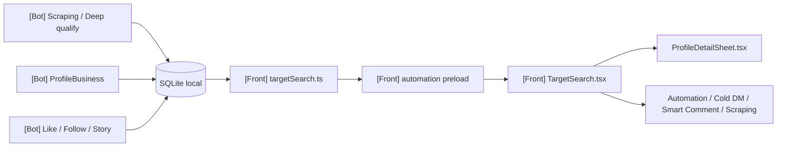
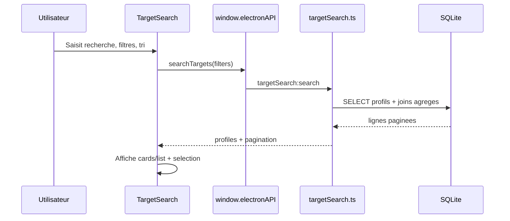
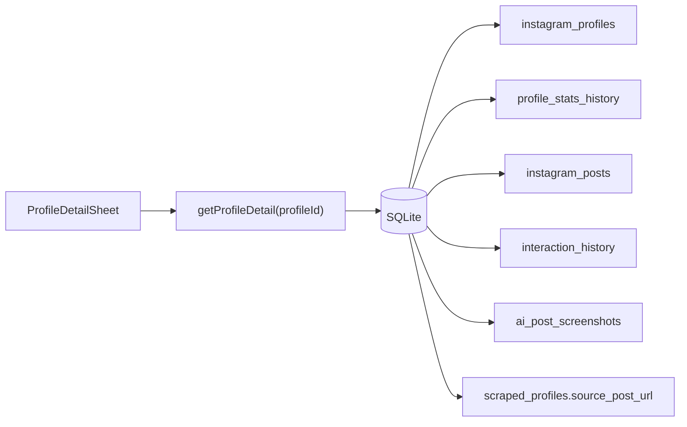
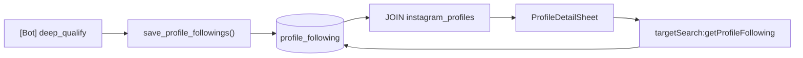

# Target Search Instagram

> **Perimetre : `[Transversal]`**
> Cette page documente la recherche locale de cibles Instagram dans l'application desktop. L'interface et les handlers sont cote `[Front]`, les donnees proviennent du SQLite partage et sont alimentees par les workflows `[Bot]` de scraping, qualification IA et interactions.

Target Search est le panneau qui transforme la base locale Instagram en outil d'exploitation : recherche de profils, filtres IA, selection de cibles, ouverture d'une fiche detaillee, puis envoi des usernames vers les workflows automation, cold DM, smart comment ou scraping account.

## Fichiers concernes

| Couche | Fichier | Role |
|---|---|---|
| React | `front/src/features/platforms/instagram/data/target/TargetSearch.tsx` | Page principale : filtres, pagination, selection, affichage cards/list. |
| React | `front/src/features/platforms/instagram/data/target/ProfileDetailSheet.tsx` | Fiche detaillee profil : posts, interactions, classification IA, graph following. |
| Preload | `front/electron/preload/app/automation.ts` | Expose les fonctions `window.electronAPI` vers le renderer. |
| Handler Electron | `front/electron/handlers/instagram/search/targetSearch.ts` | Requetes SQLite, pagination, export CSV, detail profil. |
| SQLite | `taktik-data.db` | Tables `instagram_profiles`, `scraped_profiles`, `interaction_history`, `profile_stats_history`, `instagram_posts`, `ai_post_screenshots`, `profile_following`. |
| Bot Python | `bot/taktik/core/social_media/instagram/workflows/scraping/*` | Alimente les profils, les sessions de scraping, les posts et les relations following. |
| Bot Python | `bot/taktik/core/social_media/instagram/actions/business/management/profile/*` | Extrait et persiste les donnees profil depuis Instagram. |

## Position dans l'application



La page ne lance pas Android directement. Elle lit la base locale, prepare une liste de usernames, puis pre-remplit d'autres pages de workflow.

## Flux de recherche



La recherche est paginee cote SQLite. Le renderer ne charge pas toute la base en memoire.

## API preload

`front/electron/preload/app/automation.ts` expose les fonctions suivantes :

| Fonction renderer | Canal IPC | Usage |
|---|---|---|
| `searchTargets(filters)` | `targetSearch:search` | Recherche paginee des profils locaux. |
| `exportTargets(filters)` | `targetSearch:export` | Exporte les resultats en CSV dans Downloads. |
| `getProfileDetail(profileId)` | `targetSearch:profileDetail` | Charge la fiche detaillee d'un profil. |
| `getTargetFilterOptions()` | `targetSearch:getFilterOptions` | Charge les sub-niches et pays disponibles. |
| `getProfileStats(usernames)` | `targetSearch:getProfileStats` | Calcule le total followers d'une liste de usernames. |
| `batchProfileIds(usernames)` | `targetSearch:batchProfileIds` | Convertit usernames connus en `profile_id`. |
| `getProfileFollowing(username)` | `targetSearch:getProfileFollowing` | Charge le graph following d'un profil. |

## Recherche principale

Le handler `targetSearch:search` construit dynamiquement une requete SQL autour de `instagram_profiles`.

### Tables lues

| Table | Usage |
|---|---|
| `instagram_profiles` | Source principale : username, bio, compteurs, IA, localisation, photo. |
| `scraped_profiles` | Meilleur score/analyse IA issu des sessions de scraping. |
| `interaction_history` | Detecte si le profil a deja ete like/follow/story watch. |
| `profile_stats_history` | Dernier snapshot enrichi : business, verified, category, url, photo distante. |

### Donnees retournees a la liste

| Champ UI | Source |
|---|---|
| `profileId`, `username`, `fullName`, `biography` | `instagram_profiles` |
| `followersCount`, `followingCount`, `postsCount` | `instagram_profiles` |
| `profilePicPath` | `instagram_profiles.profile_pic_path` |
| `aiNiche`, `aiSpecificNiche`, `aiScore`, `aiClassification` | `instagram_profiles` + fallback `scraped_profiles` |
| `aiGender`, `aiAgeGroup`, `aiProfession`, `aiProfessionTags` | `instagram_profiles` |
| `accountBasedIn`, `locationCity` | `instagram_profiles` |
| `hasLiked`, `hasFollowed`, `hasStoryWatched`, `hasInteracted` | agregats `interaction_history` |
| `latestStats` | dernier `profile_stats_history` |
| `canTarget` | calcule cote handler selon etat/eligibilite |

## Filtres

| Filtre UI | Parametre handler | Colonne/condition |
|---|---|---|
| Recherche texte | `usernameKeyword` | `username`, `full_name`, `biography` selon la requete. |
| Bio keywords | `biographyKeyword` | `biography LIKE ?`. |
| Notes | `notesKeyword` | `notes LIKE ?` dans l'export. |
| Followers min/max | `minFollowers`, `maxFollowers` | `followers_count BETWEEN`. |
| Bio obligatoire | `requireBio` | Bio non vide. |
| Exclure verified | `excludeVerified` | `is_verified` absent/faux. |
| Exclure private | `excludePrivate` | `is_private` absent/faux. |
| Business only | `onlyBusiness` | Dernier snapshot business. |
| Photo obligatoire | `hasPic` | `profile_pic_path` ou `profile_pic_url`. |
| Deja interagi | `onlyInteracted` | Existence LIKE/FOLLOW/STORY_WATCH. |
| Classe par IA | `onlyClassified` | Champs IA presents. |
| Niche | `niche` | `ai_niche`. |
| Sub-niche | `subNiche` | `ai_specific_niche`. |
| Pays | `country` | `account_based_in`. |
| Ville | `city` | `location_city`. |
| Genre | `gender` | `ai_gender`. |
| Age | `ageGroup` | `ai_age_group`. |
| Score IA minimum | `minAiScore` | score IA local ou scraping. |

## Tri et pagination

| Tri UI | Backend |
|---|---|
| Followers | `followersCount` |
| Following | `followingCount` |
| Posts | `postsCount` |
| Username | `username` |
| Plus recent / plus ancien | `createdAt` |
| Score IA | `aiScore` |

Le handler retourne :

```ts
{
  success: true,
  profiles,
  pagination: {
    currentPage,
    totalPages,
    totalItems,
    itemsPerPage,
    hasNextPage,
    hasPreviousPage
  }
}
```

## Fiche detaillee profil

`ProfileDetailSheet.tsx` charge les donnees uniquement a l'ouverture du panneau. Cela evite de ralentir la liste.



### Donnees de detail

| Bloc UI | Table | Detail |
|---|---|---|
| Identite profil | `instagram_profiles` | username, full name, bio, website, compteurs, flags private/verified. |
| Classification IA | `instagram_profiles.ai_classification` | JSON parse : niche, sub-niche, score, tags, resume, profession, villes, insights. |
| Snapshot stats | `profile_stats_history` | business, category, external URL, photo distante, date de mesure. |
| Posts recents | `instagram_posts` | 12 posts scrapés, media, caption, hashtags, likes/comments/views. |
| Historique interactions | `interaction_history` | 20 dernieres actions, type, date, succes, contenu. |
| Screenshots IA posts | `ai_post_screenshots` | screenshots et descriptions IA des posts analyses. |
| Source scraping | `scraped_profiles` | `source_post_url` et `scraped_at` pour les likers de post. |

## Graph following

Le graph following est alimente pendant les workflows de qualification profonde.



`profile_following` stocke les relations `profile_username` -> `following_username`. Quand le compte suivi existe aussi dans `instagram_profiles`, `following_id` permet a la fiche detaillee de naviguer vers ce profil sans recherche manuelle.

## Envoi vers les workflows

La page ne demarre pas directement une session. Elle ouvre un modal de destination, puis pre-remplit la page choisie avec des events renderer.

| Destination | Mecanisme |
|---|---|
| Target automation | `sessionStorage.prefill_instagram_target` + event `prefill-instagram-targets`. |
| Cold DM | Event `prefill-instagram-cold-dm`. |
| Smart Comment | Event `prefill-instagram-smart-comment` avec le premier username. |
| Scraping account | `sessionStorage.prefill_instagram_scraping_target` + event `prefill-instagram-scraping-targets`. |

Ce pattern garde Target Search comme outil de selection, pas comme orchestrateur de workflow.

## Export CSV

`targetSearch:export` reconstruit une requete proche de la recherche, puis ecrit un fichier :

```text
%USERPROFILE%/Downloads/target_search_YYYY-MM-DD.csv
```

Colonnes exportees :

| Colonne CSV | Source |
|---|---|
| `Username`, `Biography`, `Followers`, `Following`, `Posts`, `Private` | `instagram_profiles` |
| `Verified`, `Business`, `Category`, `External_URL` | dernier `profile_stats_history` |
| `Notes` | `instagram_profiles.notes` |

## Points de vigilance

| Sujet | Pourquoi c'est important |
|---|---|
| Schema SQLite | Les colonnes IA sont migrées dans Python et Electron. Toute nouvelle colonne de filtre doit etre ajoutee des deux cotes. |
| Performance | Garder les filtres et la pagination cote SQL. Eviter de charger tous les profils dans React. |
| JSON IA | `ai_classification`, `ai_profession_tags`, `hashtags`, `media_urls` doivent etre parses defensivement. |
| Tables optionnelles | `ai_post_screenshots` est lue avec fallback car certaines bases anciennes peuvent ne pas l'avoir encore. |
| Separation Bot/Front | Le Bot remplit la base, Electron l'explore. Target Search ne doit pas importer de logique Python. |
| Prefill workflows | Les events de prefill doivent rester synchronises avec les pages destination. |

## Liens utiles

- [Features par plateforme](platform-features.md)
- [Platform Bridge Handlers](platform-bridge-handlers.md)
- [Schema SQLite](../database/schema.md)
- [Scraping & qualification Instagram](../modules/instagram/scraping-workflows.md)
- [Workflows Instagram](../modules/instagram/workflows.md)
