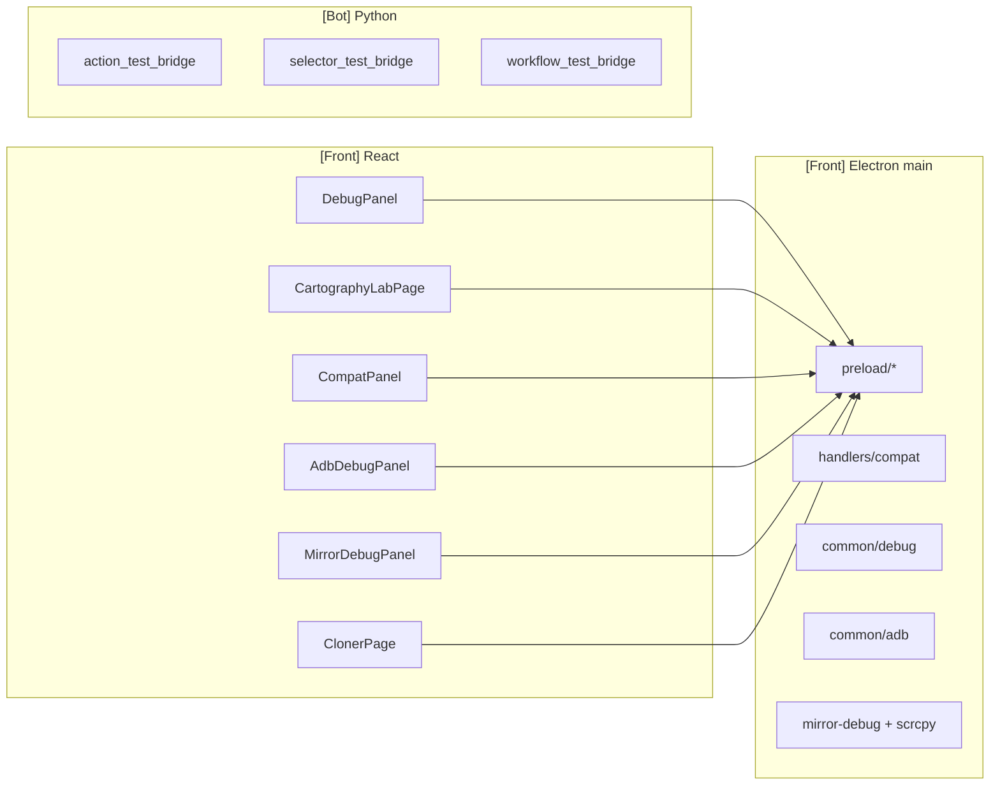

# Tools, Debug & Compatibility

> **Perimetre : `[Front]`**
> Cette page documente les outils React/Electron dans `front/src/features/tools/` et les handlers Electron associes.

Les outils avances servent a diagnostiquer une session, verifier les selectors apres une mise a jour Android, piloter ADB, inspecter le mirror scrcpy et lancer des tests de compatibilite.

## Vue d'ensemble

## Surfaces IPC utiles

| Preload | Handlers | Usage |
|---|---|---|
| `preload/app/core.ts` | `common/debug`, `common/system` | Logs, dump UI, screenshot, metriques systeme/bot. |
| `preload/devices/adb.ts` | `common/adb`, `device-setup` | Devices, Wi-Fi ADB, batterie, Play Store, APK. |
| `preload/devices/mirror.ts` | `common/scrcpy`, `common/mirror-debug` | Start/stop mirror et logs/stats du pipeline scrcpy. |
| `preload/tools/compat.ts` | `handlers/compat/compat.ts` | Versions apps, selector tests, workflow tests, action tests. |

## DebugPanel

`DebugPanel.tsx` est le panneau d'observation live.

| Zone | Source | Role |
|---|---|---|
| Logs Bot | `onBotOutput`, `onBotError`, `onBotStderr`, `onBotMessage` | Voir stdout/stderr/IPC des bridges Python. |
| Logs compte | `account.onOutput`, `account.onFinished` | Voir login/register/logout. |
| Metriques systeme | `getSystemMetrics()` | CPU, RAM, uptime. |
| Metriques Bot | `getBotMetrics()` | PIDs, memoire et CPU Python. |
| Tools rapides | `takeScreenshot`, `debugDumpUI`, `debugAnalyzeScreen`, `debugDetectProblems` | Captures et diagnostic ADB. |
| Stop session | `stopBotSession(deviceId)` | Arret manuel d'une session Bot. |

## Onglets du Debug Panel

| Onglet | Composant | Description |
|---|---|---|
| `logs` | `DebugPanel` interne | Console live avec filtres et export. |
| `analyzer` | `WorkflowAnalyzer` | Analyse conformite d'une session. |
| `mirror` | `MirrorDebugPanel` | Inspecte le pipeline scrcpy : WebSocket, video, control, erreurs. |
| `adb` | `AdbDebugPanel` | Diagnostique ADB USB/Wi-Fi et commandes utilitaires. |
| `compat` | `CompatPanel` | Verifie versions, selectors, workflow tests et rapports. |

## Cartography Lab

`CartographyLabPage` permet de lancer une action atomique isolee sur un device
reel depuis la page globale `test`. Les anciennes pages device Action Tester ont
ete supprimees.

| Plateforme | Bridge lance |
|---|---|
| Instagram | `action_test_bridge` |
| TikTok | `tiktok_action_test_bridge` |
| YouTube | `youtube_action_test_bridge` |

## CompatPanel

`CompatPanel.tsx` verifie si les versions installees correspondent aux versions cibles, puis lance des tests selectors ou workflows.

| Fonction | Usage |
|---|---|
| `compat:check-device` | Lire les versions installees via ADB. |
| `compat:test-selectors` | Lancer `selector_test_bridge`. |
| `compat:run-workflow-test` | Lancer `workflow_test_bridge`. |
| `compat:save-test-result` | Sauvegarder un rapport. |

## WorkflowAnalyzer

`WorkflowAnalyzer.tsx` enregistre les evenements live d'une session et calcule un score de conformite.

| Analyse | Ce qui est verifie |
|---|---|
| Duree | Duree reelle vs duree configuree. |
| Limites | Nombre de profils visites vs limites. |
| Probabilites | Ecart entre attendu et observe. |
| Delais | Respect du min/max entre actions. |
| Filtres | Interactions sur profils hors criteres. |

## MirrorDebugPanel

Fichier : `front/src/features/tools/debug/mirror/MirrorDebugPanel.tsx`

Ce panneau lit les logs et stats du pipeline mirror.

| Stat | Signification |
|---|---|
| `wsConnected` / `wsPort` / `wsClients` | Serveur WebSocket cote Electron. |
| `scrcpyRunning` | Process scrcpy actif. |
| `scrcpyServerPushed` | Serveur scrcpy pousse sur le device. |
| `videoSocketConnected` / `controlSocketConnected` | Connexions sockets scrcpy. |
| `codecReceived` / `codec` | Codec video negocie. |
| `resolution` | Resolution du flux. |
| `framesReceived` / `bytesReceived` | Volume de frames et donnees recues. |
| `lastError` | Derniere erreur pipeline. |

Les logs sont categorises : `scrcpy`, `websocket`, `video`, `adb`, `connection`.

Quand le mirror externe marche mais pas le panneau embedded, les lignes les plus utiles sont maintenant :

- `Resolved ADB path for embedded mirror`
- la version de `scrcpy-server` poussee sur le device
- le stderr brut du serveur scrcpy
- l'etat `videoSocketConnected` / `controlSocketConnected`

En pratique, le `MirrorDebugPanel` sert a separer :

- un souci de runtime scrcpy/ADB sur un poste ;
- un probleme de handshake embedded ;
- un vrai crash serveur cote Android.

## AdbDebugPanel

Fonctions principales :

| Action | API |
|---|---|
| Rafraichir devices USB/Wi-Fi | `getDevices()` |
| Scanner le reseau | `wifiScan()` |
| Connexion Wi-Fi | `wifiConnect(ip, port)` |
| Deconnexion Wi-Fi | `wifiDisconnect(ip, port)` |
| Restart ADB | `executeAdbCommand('', 'kill-server')` puis `start-server` |

## ClonerPage

`ClonerPage.tsx` est une UI Front qui parle a un backend HTTP externe pour la generation d'APK clonees, tout en utilisant ADB localement pour installer le resultat.

## Pages liees

- [Workspace Device](device-workspace.md)
- [Preload API](preload-api.md)
- [Handlers IPC Electron](ipc-handlers.md)
- [Framework de test compat](../compat/testing-framework.md)
