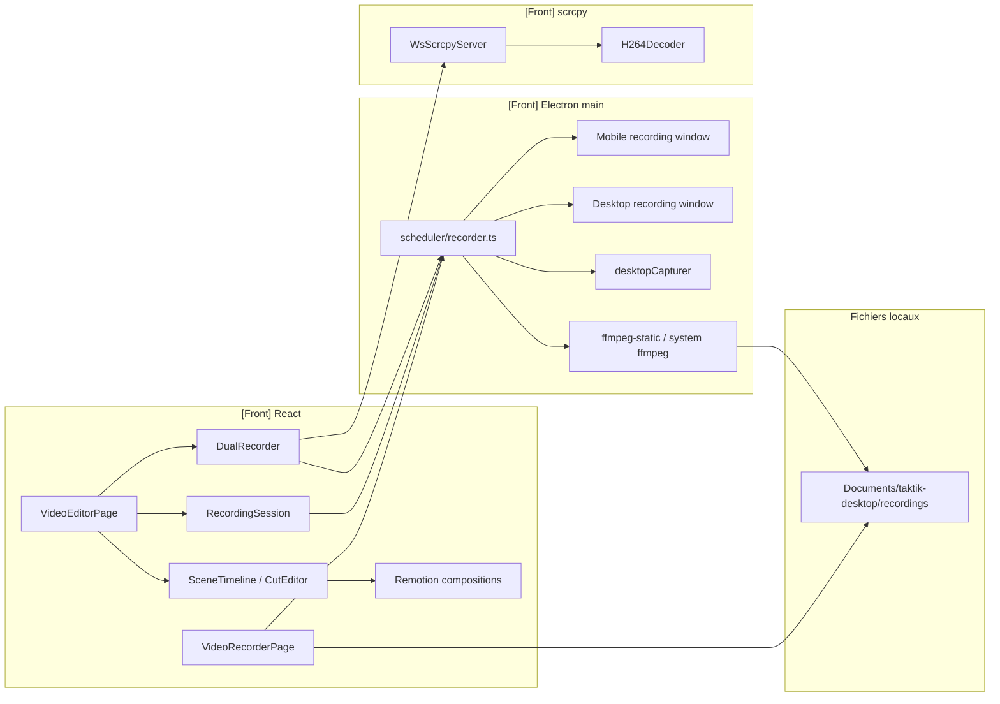
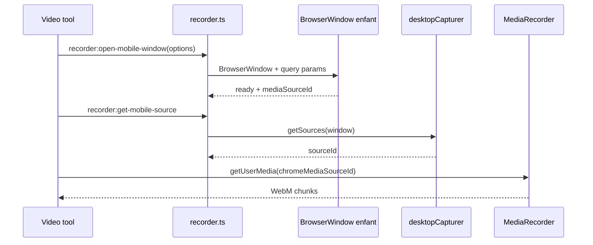
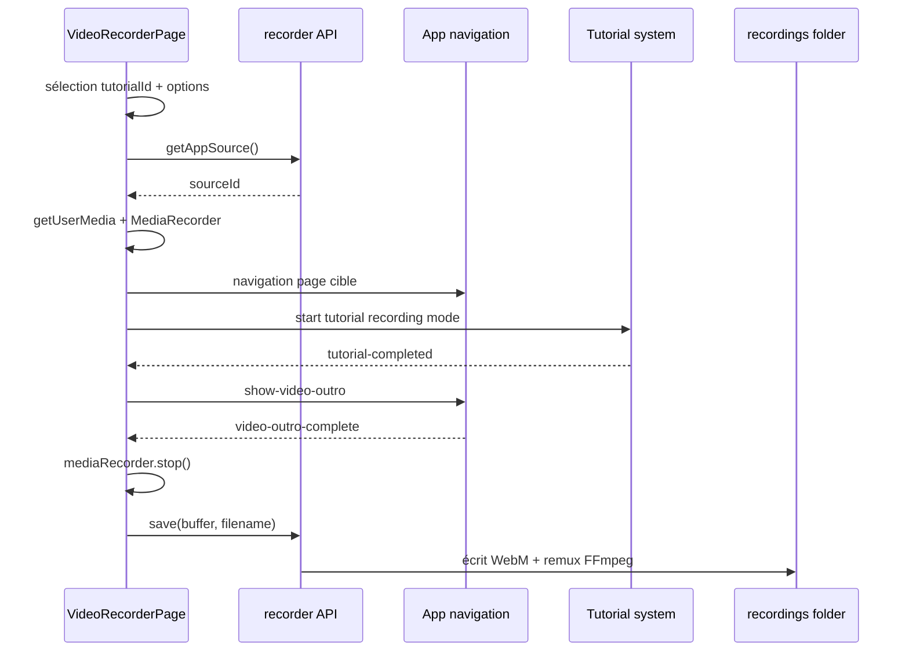
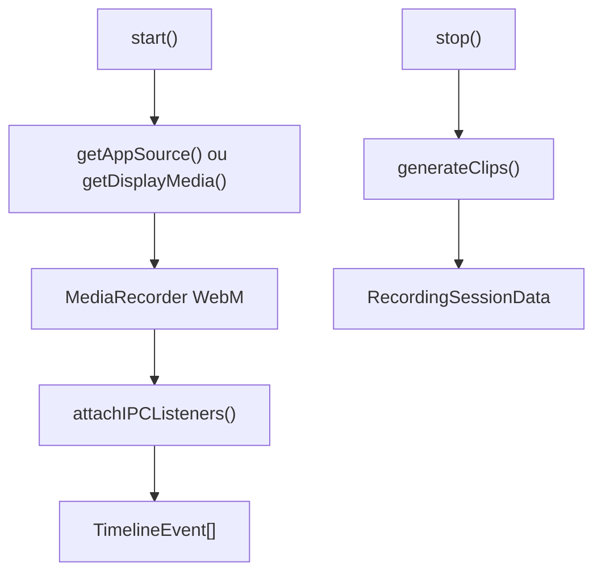
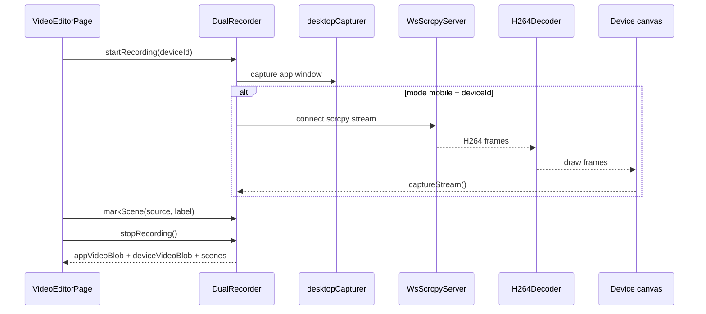

# Video Tools `[Front]`

Cette page documente les outils vidéo de l'application desktop : enregistrement de tutoriels, fenêtres de capture, montage assisté et capture dual-source app + device.

Le périmètre est majoritairement `[Front]` : React, Electron, `MediaRecorder`, `desktopCapturer`, WebSocket scrcpy et FFmpeg. Le `[Bot]` intervient seulement quand l'éditeur lance un workflow réel pour produire une démonstration.

## Vue D'ensemble



## Fichiers Principaux

| Fichier | Couche | Rôle |
|---|---|---|
| `front/src/features/tools/video/pages/VideoRecorderPage.tsx` | `[Front] React` | Enregistre des tutoriels guidés et recordings manuels. |
| `front/src/features/tools/editor/pages/VideoEditorPage.tsx` | `[Front] React` | Studio de capture, lancement workflow, timeline et montage. |
| `front/electron/handlers/scheduler/recorder.ts` | `[Front] Electron` | Fenêtres de capture, sources desktopCapturer, sauvegarde, FFmpeg. |
| `front/electron/preload/platforms/instagram/instagram.ts` | `[Front] Preload` | Expose `window.electronAPI.recorder`. |
| `front/src/features/tools/editor/services/RecordingSession.ts` | `[Front] service` | Recording simple + timeline d'événements IPC. |
| `front/src/features/tools/editor/services/DualRecorder.ts` | `[Front] service` | Capture simultanée UI app + écran device. |
| `front/src/features/tools/editor/services/AutoClipper.ts` | `[Front] service` | Génère des clips depuis une timeline. |
| `front/src/features/tools/editor/services/VideoAnalyzer.ts` | `[Front] service` | Analyse frames, activité, scènes statiques/loading. |
| `front/src/features/tools/editor/timeline/*` | `[Front] UI` | Timeline, scènes, éditeur de coupes. |
| `front/src/features/tools/editor/remotion/*` | `[Front] UI/render` | Compositions vidéo Remotion. |

## APIs Recorder

L'API renderer est exposée sous `window.electronAPI.recorder`.

| Méthode | IPC | Rôle |
|---|---|---|
| `getSources()` | `recorder:get-sources` | Liste fenêtres/écrans capturables. |
| `getAppSource()` | `recorder:get-app-source` | Source de la fenêtre mobile si ouverte, sinon écran. |
| `getMainWindowSource()` | `recorder:get-main-window-source` | Source de la fenêtre principale. |
| `save({ buffer, filename })` | `recorder:save` | Sauvegarde `.webm` ou `.json`, remux FFmpeg si vidéo. |
| `getPath()` | `recorder:get-path` | Chemin `Documents/taktik-desktop/recordings`. |
| `list()` | `recorder:list` | Liste `.webm` et `.json`. |
| `delete(filePath)` | `recorder:delete` | Supprime avec validation de chemin. |
| `readFile(filePath)` | `recorder:read-file` | Lit un recording pour l'éditeur. |
| `openFolder()` | `recorder:open-folder` | Ouvre le dossier recordings. |
| `mixAudio({ videoPath, audioTracks })` | `recorder:mix-audio` | Mixe voix off/audio avec FFmpeg. |
| `openMobileWindow(options)` | `recorder:open-mobile-window` | Crée une fenêtre 412x915 orientée mobile. |
| `getMobileSource()` | `recorder:get-mobile-source` | Retourne la source desktopCapturer mobile. |
| `captureMobileFrame()` | `recorder:capture-mobile-frame` | Capture JPEG preview de la fenêtre mobile. |
| `sendToMobile(command)` | `recorder:send-to-mobile` | Envoie une commande à la fenêtre mobile. |
| `openDesktopWindow(options)` | `recorder:open-desktop-window` | Crée une fenêtre 1920x1080 de capture desktop. |
| `getDesktopSource()` | `recorder:get-desktop-source` | Retourne la source desktopCapturer desktop. |
| `captureDesktopFrame()` | `recorder:capture-desktop-frame` | Capture JPEG preview desktop. |
| `sendToDesktop(command)` | `recorder:send-to-desktop` | Envoie une commande à la fenêtre desktop. |

## Fenêtres De Capture

`recorder.ts` gère deux fenêtres enfant, séparées de la fenêtre principale :

| Fenêtre | Titre | Taille par défaut | Usage |
|---|---|---:|---|
| Mobile | `TAKTIK Mobile Recording` | `412x915` | Captures verticales type tutoriel/app mobile. |
| Desktop | `TAKTIK Desktop Recording` | `1920x1080` | Captures paysage de l'application complète. |



Les fenêtres utilisent le même preload que l'application principale. Les modes sont activés par query params :

| Paramètre | Rôle |
|---|---|
| `mobileRecord=true` | Active le rendu mobile de capture. |
| `desktopRecord=true` | Active le rendu desktop de capture. |
| `workflow` | Workflow à préparer/lancer. |
| `deviceId` | Device cible. |
| `platform` | Plateforme cible. |
| `showLogin` | Permet de capturer l'écran login si besoin. |

## VideoRecorderPage

`VideoRecorderPage` est l'outil simple de production de tutoriels.

### Etat Global

La page stocke un état global dans `window.__taktikRecorder` pour survivre aux changements de page React pendant un tutoriel.

| Champ | Rôle |
|---|---|
| `mediaRecorder` | Instance `MediaRecorder` active. |
| `chunks` | Chunks WebM collectés. |
| `stream` | Flux desktop capture actif. |
| `tutorialId` | Tutoriel en cours. |
| `recordingStartTime` | Base temporelle pour les pistes audio. |
| `audioTracks` | Fichiers audio + timestamp de départ. |
| `pendingTutorialConfig` | Configuration à rejouer après navigation. |
| `pendingNavigation` | Page cible à ouvrir avant lancement tutoriel. |

### Tutoriels Disponibles

Les tutoriels sont groupés par domaine :

| Catégorie | Exemples |
|---|---|
| Publication | `upload-post`, `upload-post-ai`, `upload-reel`, `upload-story` |
| Messages | `dm-responses`, `dm-cold` |
| Automatisation | `bot-target`, `bot-hashtag`, `bot-post-likers`, `bot-feed` |
| Maintenance | `bot-unfollow` |
| Scraping | `scraping` |
| Tools | `app-tour`, `main`, `device`, `target-search`, `analytics`, `sessions` |

Chaque tutoriel est mappé vers une page via `TUTORIAL_PAGE_MAP`.

| Champ | Rôle |
|---|---|
| `needsDevice` | Indique si un device est obligatoire. |
| `devicePage` | Page device à ouvrir. |
| `globalPage` | Page globale à ouvrir. |

`PAGE_TO_SIDEBAR_SECTION` ouvre automatiquement la bonne section de sidebar avant le recording.

### Flux Tutoriel



## VideoEditorPage

`VideoEditorPage` est le studio avancé. Il combine :

| Zone | Rôle |
|---|---|
| Workflow launcher | Sélection Instagram/TikTok et workflow à démontrer. |
| Device selector | Détection ADB périodique via `getDevices()`. |
| Recording controls | Start/stop capture et mode mobile/desktop. |
| Bot logs | Ecoute `onBotOutput`, `onBotMessage`, `onBotError`, `onBotSessionEnded`. |
| Scene marking | Crée des scènes à partir des statuts workflow. |
| Montage | Timeline, scènes, coupes, import latest recording. |

Le studio peut lancer des workflows Instagram depuis la page pour produire une démo réelle. Dans ce cas, il envoie une config bot standard avec limites, probabilités, filtres, session et commentaires.

## RecordingSession

`RecordingSession` est une capture simple annotée par événements IPC.



### Evénements Timeline

| Type | Origine |
|---|---|
| `recording:start`, `recording:stop` | Service lui-même |
| `page:navigated` | Navigation manuelle ou app |
| `workflow:started`, `workflow:config` | Lancement workflow |
| `session:live`, `session:completed`, `session:error` | Session bot |
| `bot:action`, `bot:message`, `bot:stats` | IPC bot |
| `scraping:*` | Workflows scraping et qualification |
| `tiktok:*` | Workflows TikTok |
| `dm:*` | Messagerie |
| `custom` | Marqueur manuel |

Chaque événement peut porter `clipSuggestion` : `hook`, `config`, `live`, `action`, `highlight`, `result`, `error`.

## DualRecorder

`DualRecorder` capture deux sources synchronisées :

| Source | Capture |
|---|---|
| App UI | `desktopCapturer` + `MediaRecorder` |
| Device | H264 scrcpy WebSocket -> canvas -> `canvas.captureStream()` + `MediaRecorder` |

Modes :

| Mode | Comportement |
|---|---|
| `mobile` | Capture la fenêtre app + un flux device séparé si `deviceId` est fourni. |
| `desktop` | Capture la fenêtre complète, le miroir device visible est déjà inclus. |



### Scènes

Une scène contient :

| Champ | Rôle |
|---|---|
| `id` | Identifiant local `scene_N`. |
| `timestamp` | Début relatif au recording. |
| `endTimestamp` | Fin relative. |
| `source` | `app`, `device` ou `both`. |
| `label` | Nom affiché dans timeline. |
| `description` | Détail optionnel. |
| `pageName`, `pageCategory` | Contexte UI. |
| `thumbnail` | Capture optionnelle. |

## AutoClipper

`AutoClipper` extrait des clips à partir de `RecordingSessionData`.

| Paramètre | Défaut | Rôle |
|---|---:|---|
| `maxClips` | 8 | Nombre maximum de clips. |
| `minClipDurationMs` | 2000 | Durée minimale. |
| `maxClipDurationMs` | 8000 | Durée maximale. |
| `eventPaddingMs` | 2000 | Padding autour d'un événement. |
| `generateThumbnails` | `true` | Génère des miniatures. |
| `clipOrder` | hook, config, live, action, highlight, result | Ordre recommandé. |

Le découpage n'écrit pas de fichiers séparés dans le navigateur. Pour WebM, il crée des clips virtuels qui référencent la vidéo complète avec `startMs` et `endMs`; Remotion ou le renderer final coupe ensuite au bon moment.

## VideoAnalyzer

`VideoAnalyzer` analyse les frames côté navigateur via `<video>` + `<canvas>`.

| Phase | Description |
|---|---|
| `extracting` | Extrait des thumbnails à FPS réduit. |
| `analyzing` | Calcule luminosité, différence d'image, couleur dominante, blank screen. |
| `planning` | Score les segments et recommande keep/remove/speed_up. |
| `done` | Retourne `VideoAnalysis` ou `AutoEditPlan`. |

Types de segments :

| Type | Sens |
|---|---|
| `action` | Activité visible. |
| `static` | Peu de changement, candidat à accélérer/couper. |
| `transition` | Changement de page/scène. |
| `loading` | Ecran vide ou chargement. |
| `highlight` | Pic d'activité à conserver. |

## Sauvegarde Et FFmpeg

Tous les outputs sont stockés dans :

```text
Documents/taktik-desktop/recordings/
```

`recorder:save` :

1. Valide que le buffer n'est pas vide.
2. Crée le dossier recordings.
3. Ecrit les fichiers non vidéo directement.
4. Pour `.webm`, écrit d'abord `*_raw.webm`.
5. Lance FFmpeg en remux `-c copy` vers le fichier final.
6. Supprime le raw si le remux réussit.
7. En cas d'erreur FFmpeg, garde le fichier raw comme fallback.

`recorder:mix-audio` ajoute des pistes audio avec :

| Filtre | Rôle |
|---|---|
| `volume=0.8` | Niveau uniforme. |
| `adelay=startMs` | Décale chaque piste à son timestamp. |
| `amix` | Combine toutes les pistes. |
| `loudnorm` | Normalise la sortie. |
| `libopus` | Encode l'audio WebM. |

## Sécurité

Les opérations sensibles valident les chemins.

| Handler | Protection |
|---|---|
| `recorder:delete` | `securityService.validatePath(filePath, recordingsDir)` |
| `recorder:read-file` | Même validation avant lecture |

Le dossier autorisé est limité à `Documents/taktik-desktop/recordings`.

## Limites Connues

| Zone | Limite |
|---|---|
| Capture Windows | Une fenêtre hors écran peut être noire si DWM ne la compose pas. Le handler replace/focus certaines fenêtres avant capture. |
| WebM browser | Le découpage frame-perfect n'est pas fait directement dans le navigateur. |
| FFmpeg | Si `ffmpeg-static` n'est pas disponible, fallback sur `ffmpeg` système. |
| Device stream | Le mode dual dépend du flux scrcpy WebSocket et du décodage H264. |
| Etat global recorder | `window.__taktikRecorder` est pratique mais fragile si plusieurs recordings sont lancés en parallèle. |

## Relation Avec Les Autres Pages

| Sujet | Page liée |
|---|---|
| Upload media | [Upload Content](../workflows/upload-content.md) |
| Handlers ADB/device | [ADB & Device Handlers](adb-device-handlers.md) |
| Scrcpy/mirror | [Device Workspace](device-workspace.md), [Tools, Debug & Compatibility](tools-debug.md) |
| Scheduler/session | [Scheduler & Sessions](../workflows/sessions.md) |
| Bridges Python | [Bridge Launcher & Packaging](../bridges/launcher.md) |
