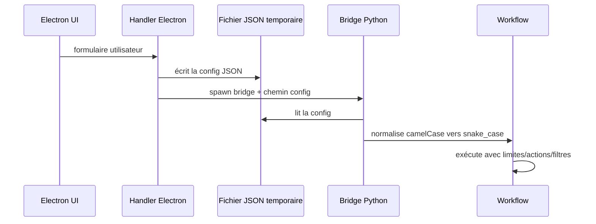

# Configuration

La configuration du bot est principalement construite côté Electron, puis transmise aux bridges Python sous forme de JSON.

Chaque bridge traduit ensuite cette config vers les dataclasses ou dictionnaires attendus par les workflows Python.

## Flux de configuration



## Conventions

| Côté | Convention |
|---|---|
| Electron | `camelCase` (`deviceId`, `maxProfiles`, `workflowType`) |
| Python | `snake_case` (`device_id`, `max_profiles`, `workflow_type`) |
| IPC stdout | JSON par ligne |
| SQLite | snake_case |

## Exemple Instagram interactif

Les sessions Instagram classiques passent par `desktop_bridge` (`bridges.instagram.automation.desktop`), `InstagramAutomation` et `WorkflowRunner`.

```json
{
  "deviceId": "127.0.0.1:5555",
  "session_settings": {
    "session_duration_minutes": 60,
    "total_profiles_limit": 100,
    "total_likes_limit": 80,
    "total_follows_limit": 20,
    "delay_between_actions": { "min": 5, "max": 15 }
  },
  "actions": [
    {
      "type": "interact_with_followers",
      "target_usernames": ["target_user1", "target_user2"],
      "max_interactions": 50,
      "probabilities": {
        "like_percentage": 70,
        "follow_percentage": 20,
        "comment_percentage": 5,
        "story_percentage": 10
      },
      "min_followers": 100,
      "max_followers": 10000,
      "min_posts": 5,
      "allow_private": false
    }
  ]
}
```

## Exemple Instagram scraping

Le scraping passe par `scraping_bridge` (`bridges.instagram.scraping.scraping`), qui mappe la config Electron vers `ScrapingWorkflow`.

```json
{
  "deviceId": "127.0.0.1:5555",
  "type": "target",
  "targetUsernames": ["competitor_account"],
  "scrapeType": "followers",
  "maxProfiles": 500,
  "sessionDurationMinutes": 60,
  "enrichProfiles": true,
  "saveToDb": true,
  "exportCsv": true,
  "deepQualify": true,
  "deepQualifyMaxFollowing": 30,
  "ai": {
    "enabled": true,
    "openrouterApiKey": "sk-or-...",
    "visionModel": "google/gemini-2.5-flash"
  }
}
```

Voir [Scraping & qualification](../modules/instagram/scraping-workflows.md).

## Exemple Threads

```json
{
  "deviceId": "127.0.0.1:5555",
  "workflowType": "follow",
  "searchQuery": "fitness coach",
  "maxProfiles": 20,
  "minDelaySeconds": 2,
  "maxDelaySeconds": 5,
  "maxLikesPerProfile": 2,
  "actionProbabilities": {
    "follow": 80,
    "like": 50,
    "repost": 0,
    "comment": 0
  },
  "filters": {
    "minFollowers": 100,
    "maxFollowers": 50000,
    "bioKeywordsInclude": ["coach"],
    "bioKeywordsExclude": ["crypto"]
  }
}
```

Voir [Module Threads](../modules/threads/overview.md).

## Sélecteurs UI

Les sélecteurs sont centralisés par plateforme :

| Plateforme | Emplacement |
|---|---|
| Instagram | `taktik/core/social_media/instagram/ui/selectors/` |
| TikTok | `taktik/core/social_media/tiktok/ui/selectors/` |
| Threads | `taktik/core/social_media/threads/ui/__init__.py` |
| YouTube | `taktik/core/social_media/youtube/ui/selectors/` |

Instagram et TikTok peuvent aussi utiliser des overrides YAML :

```text
taktik/core/compat/data/overrides/
+-- instagram.yaml
+-- tiktok.yaml
```

Voir [Versioned Selectors](../compat/versioned-selectors.md).

## Base SQLite

Chemin par défaut :

```text
%APPDATA%/taktik-desktop/taktik-data.db
```

Variable optionnelle :

| Variable | Description |
|---|---|
| `TAKTIK_DB_PATH` | Force le chemin de la base SQLite |

Voir [Vue d'ensemble SQLite](../database/overview.md).

## Variables d'environnement

| Variable | Description | Défaut |
|---|---|---|
| `TAKTIK_DB_PATH` | Chemin vers la base SQLite | `%APPDATA%/taktik-desktop/taktik-data.db` |
| `TAKTIK_LOG_LEVEL` | Niveau de log Python | `INFO` |
| `ADB_PATH` | Chemin vers `adb.exe` | auto-détection |

## Proxys

Les proxys sont configurés au niveau Android/émulateur, pas directement dans les actions Python.

Exemple de structure côté UI :

```json
{
  "proxy": {
    "host": "159.148.109.170",
    "port": 5772,
    "username": "user",
    "password": "pass",
    "type": "http"
  }
}
```

Voir [Gestion des proxys](../security/proxies.md).
