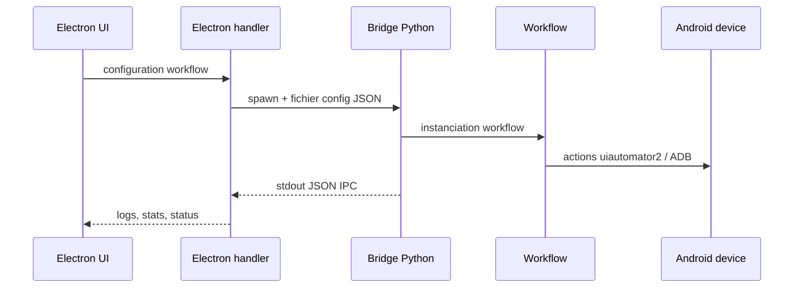

# Démarrage rapide

Cette page donne le chemin le plus court pour lancer la documentation et comprendre comment le bot s'exécute en local.

## Prérequis

| Outil | Version / détail |
|---|---|
| Python | 3.10+ |
| ADB | Android Platform Tools dans le `PATH` |
| Device Android | LDPlayer 9, émulateur Android ou appareil USB |
| Electron TAKTIK | Lance les bridges Python en fonctionnement normal |
| Node.js | Requis seulement pour servir la documentation consolidee `taktik-docs` |

## Lancer la documentation

Depuis le depot prive `taktik-docs` :

```powershell
cd <repo>\taktik-docs
yarn dev
```

Puis ouvrir :

```text
http://localhost:3000
```

## Installer les dépendances Python

```powershell
cd <repo>\bot
python -m venv venv
.\venv\Scripts\activate
pip install -r requirements.txt
```

Dépendances optionnelles média/vidéo :

```powershell
pip install -r requirements-media.txt
```

## Connecter un device

```powershell
adb devices
adb connect 127.0.0.1:5555
```

Vérifier uiautomator2 :

```powershell
python -c "import uiautomator2 as u2; d = u2.connect('127.0.0.1:5555'); print(d.info)"
```

## Lancement normal

En production desktop, l'utilisateur ne lance pas le bot Python manuellement.

Le flux normal est :



## Lancement manuel d'un bridge

Le launcher attend le nom du bridge suivi des arguments du bridge.

Exemple :

```powershell
cd <repo>\bot
python -m bridges.launcher scraping_bridge .\.scraping_config_C57S00000032140.json
```

Pour connaître les bridges disponibles, voir [Architecture des Bridges](../bridges/architecture.md).

## Lire ensuite

| Besoin | Page |
|---|---|
| Comprendre le guide | [Plan du guide technique](../guidebook-map.md) |
| Comprendre l'application | [Carte d'interaction](../architecture/application-map.md) |
| Comprendre la base locale | [Vue d'ensemble SQLite](../database/overview.md) |
| Comprendre Instagram | [Vue d'ensemble Instagram](../modules/instagram/overview.md) |
