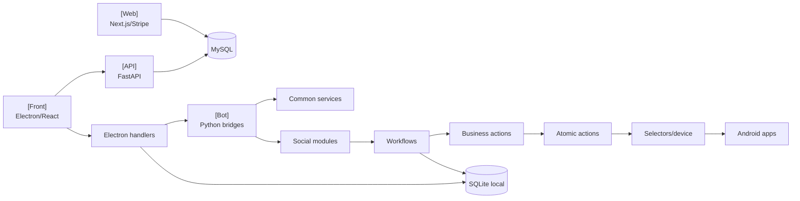

# Plan du guide technique

> **Perimetre : `[Transversal]`**
> Cette page sert de carte de navigation pour une grosse documentation monorepo.

La navigation est organisee par finalite :

1. comprendre ;
2. refactoriser ;
3. modifier un projet ;
4. suivre un workflow ;
5. auditer les donnees ;
6. extraire une vision produit.

## Parcours de lecture

| Profil | Lire dans cet ordre |
|---|---|
| Nouveau dev | `README.md` -> `documentation-strategy.md` -> `scope.md` -> `architecture/application-map.md` |
| Dev Front | `desktop/overview.md` -> `desktop/ipc-handlers.md` -> `desktop/preload-api.md` -> workflow concerne |
| Dev Bot | `core/shared.md` -> bridge plateforme -> module social -> actions/workflows |
| Dev API | `../technical/api-current-state.md` |
| Dev Web | `web/overview.md` -> Prisma/site -> API licence |
| Deep dive Instagram | `social-docs.md` -> `instagram/` |
| Deep dive TikTok | `social-docs.md` -> `tiktok/` |
| Refactor DB | `database/schema.md` -> `database/repositories.md` -> `desktop/electron-database-repositories.md` -> `refactor/refactor-readiness.md` |
| Refactor workflow | workflow end-to-end -> bridge -> module social -> actions business/atomic |
| Produit/marketing | `../marketing/feature-overview.md` -> `../marketing/responsible-extraction.md` |

## Carte des sections

| Section | Role |
|---|---|
| `0. Demarrer ici` | contexte, perimetre, roadmap, glossaire |
| `1. Cartes systeme` | architecture transverse et interactions |
| `2. Refactor & audit technique` | methodologie pour gros changements |
| `3. Base de donnees` | SQLite local, repositories, modeles |
| `4. Application Desktop` | Electron/React |
| `5. Bot Python` | core Python partage |
| `6. Bridges` | communication Electron <-> Bot |
| `7. Modules sociaux` | Instagram, TikTok, Threads, YouTube, Gmail |
| `8. Workflows end-to-end` | features completes entre Front/Bot/DB |
| `9. API distante` | FastAPI licences/devices/updates |
| `10. Site web` | Next.js/Prisma/Stripe |
| `11. Securite` | anti-detection, humain, proxies |
| `12. Produit` | inventaire fonctionnel et extraction marketing |
| `13. Annexes` | commandes, changelog, contribution |

## Entrees plateforme dediees

Quand il faut aller vite sur une seule plateforme, la doc principale peut etre complete mais trop large. Des parcours dedies existent dans `taktik-docs` :

| Plateforme | Point d'entree |
|---|---|
| Instagram | `instagram/` |
| TikTok | `tiktok/` |
| Threads | `threads/` |
| YouTube | `youtube/` |
| Gmail | `gmail/` |

## Carte des couches



## Comment documenter un nouveau dossier

1. Lister l'arborescence reelle.
2. Identifier les exports publics et classes principales.
3. Documenter le flux d'appel.
4. Lister configs, payloads et events.
5. Lister tables/repositories touches.
6. Relier la page au workflow end-to-end si besoin.
7. Ajouter la page dans `SUMMARY.md` et `_sidebar.md`.
8. Mettre a jour `governance/SOURCE_COVERAGE.md` si le niveau de couverture change.

## Etat de couverture

La couverture detaillee est maintenue dans :

```text
../governance/SOURCE_COVERAGE.md
../governance/DOCS_MAP.md
```

Si la couverture source reste a zero manquant utile, la restructuration de navigation peut avancer sans attendre une nouvelle page technique.
