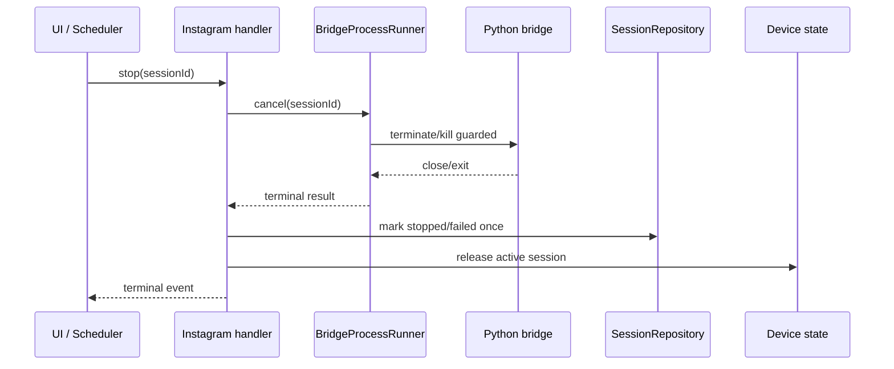
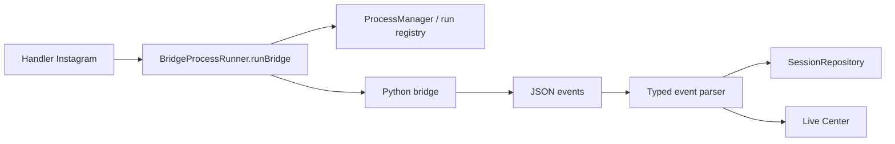

# Instagram - Plan de colmatage audit

  
Plan de correction

  
Cette page transforme l'audit en chantier controlable. Chaque point doit avoir un perimetre clair, une preuve de correction et un test anti-regression. L'objectif est simple : ne plus corriger un bug Instagram sans fermer proprement la cause architecturelle qui l'a rendu possible.

  
Avant d'attaquer un chantier, verifier la <a href="#/cartography-coverage">couverture de cartographie</a> : elle indique ce qui est deja prouve, ce qui reste a tracer, et les go/no-go.

> Le suivi transverse de `bot/taktik/core` est maintenant maintenu dans [Suivi refactor Bot core](bot-core-refactor-tracker.md). Cette page garde le plan de remediation Instagram.

## Ordre de correction

| Ordre | Priorite | Chantier | Pourquoi maintenant | Preuve attendue |
|---|---|---|---|---|
| 1 | P0 | Stop/cancel/session terminale | Un device ne doit jamais continuer a agir apres un stop. | Session terminale, process arrete, device libere, sidebar coherente. |
| 2 | P0 | Ownership SQLite et sync | Les bugs Turso viennent souvent d'un schema ou d'une ownership implicite. | Table ownership documentee, repository unique, diagnostic sync lisible. |
| 3 | P1 | SQL direct dans handlers | Les handlers doivent orchestrer, pas porter la persistence. | Plus de `db.prepare` metier dans les handlers Instagram cibles. |
| 4 | P1 | Process runner uniforme | Chaque bridge doit avoir le meme timeout, cleanup et cancel. | Handlers migres vers `BridgeProcessRunner` ou exception documentee. |
| 5 | P1 | Publish Instagram | C'est le workflow Android le plus sensible aux regressions UI. | State machine, selectors et media service separes ou exception assumee. |
| 6 | P2 | Events Live typed | Le Live Center ne peut etre fiable que si les events sont previsibles. | Contrat `InstagramBridgeEvent` et mapping Live par famille. |
| 7 | P2 | Bridges et debug partages | Eviter les modules Instagram qui portent du TikTok ou du debug transverse. | Code transverse deplace dans un module commun. |

## Definition de bug colmate

Un point est considere ferme seulement si ces cinq preuves existent :

1. Le bug initial est reproduit ou decrit avec un scenario concret.
2. La cause est rattachee a un fichier, une classe ou un contrat.
3. La correction ferme la cause, pas seulement le symptome visible.
4. Un test manuel ou automatise prouve le comportement attendu.
5. La documentation Instagram indique le chemin correct pour les futures features.

## P0-1 Stop, cancel et session terminale

### Symptome observe

- Sidebar ou panneau device indique encore `Session en cours` alors que le telephone est revenu a l'accueil.
- Scheduler stoppe cote UI mais le bridge continue a naviguer.
- Un workflow peut laisser un process Python actif ou une session non terminale apres crash, stop manuel ou fermeture UI.

### Zone a inspecter

| Zone | Fichiers |
|---|---|
| Handlers Instagram | `front/electron/handlers/instagram/automation/bot.ts`, `scraping/scraping.ts`, `engagement/coldDm.ts`, `engagement/dm.ts` |
| Runner process | `front/electron/services/bridge/BridgeProcessRunner.ts`, `front/electron/managers/process-manager.ts` |
| Sessions | `front/electron/database/repositories/session/SessionRepository.ts` |
| UI live | pages sessions, sidebar device, Live Center |

### Correction cible

### Regles a imposer

| Regle | Detail |
|---|---|
| Une session, un registre | Tout process bridge doit etre enregistre avec `sessionId`, `deviceId`, `workflow`, `startedAt`. |
| Etat terminal idempotent | `stopped`, `failed`, `completed` ne doivent etre ecrits qu'une fois, meme si stdout, close et cancel arrivent ensemble. |
| Stop cascade | Stop UI, stop scheduler, crash bridge et fermeture app passent par le meme cleanup. |
| Device release obligatoire | Le device ne peut rester marque actif que si un process associe est encore vivant. |

### Tests de validation

| Test | Attendu |
|---|---|
| Automation manuelle puis stop | Process mort, session `stopped`, sidebar liberee. |
| Scheduler Instagram puis stop | Aucun bridge ne continue apres le stop scheduler. |
| Bridge crash force | Session `failed`, logs visibles, device libere. |
| Reload app pendant session terminee | Pas de `Session en cours` fantome. |
| Deux stops rapides | Pas de double update incoherent. |

## P0-2 Ownership SQLite et sync Turso

### Symptome observe

- Une machine annonce une sync terminee mais des profils, sessions, analytics ou images sont absents.
- Une migration manque une colonne sur une autre machine.
- Electron et Python peuvent ecrire sur les memes donnees sans contrat clair.

### Correction cible

| Etape | Travail |
|---|---|
| Inventaire tables | Lister toutes les tables Instagram, leur owner, leur source, leur sync attendue. |
| Repository obligatoire | Toute ecriture Electron passe par un repository/service nomme. |
| Ownership Python | Les ecritures Python autorisees sont documentees table par table. |
| Diagnostic sync | Dans Settings > Database, afficher tables manquantes, colonnes manquantes, compte local vs cloud, fichiers associes. |
| Backfill | Prevoir une action de resync complete pour les machines deja peuplees. |

### Matrice attendue

| Table | Owner cible | Ecrit par | Lu par | Sync |
|---|---|---|---|---|
| `sessions` | Electron SessionRepository | Electron | Electron UI, Live | Oui |
| `scraping_sessions` | Electron SessionRepository | Electron, a clarifier si Python complete | Electron UI | Oui |
| `instagram_profiles` | ProfileRepository | Electron et/ou Python, a trancher | Recherche, scraping, automation | Oui |
| `interactions` | InteractionRepository | Bot/Python ou Electron selon workflow | Analytics, quotas | Oui |
| `ai_profile_analysis` | Repository dedie a creer | Electron | UI data, scoring | Oui |
| `profile_images` / media base64 | Media/profile repository | Electron ou sync fichiers | UI cartes compte/profil | Oui + fichiers |

### Tests de validation

| Test | Attendu |
|---|---|
| Base vide | Toutes les migrations passent. |
| Base ancienne peuplee | Aucun `no such column`, backfill possible. |
| Deuxieme PC | Meme nombre de lignes critiques apres sync complete. |
| Images profil | UI affiche image ou diagnostic explique pourquoi elle manque. |
| Analytics | Totaux locaux/cloud comparables dans la carte database. |

## P1-1 Sortir le SQL direct des handlers

### Cible prioritaire

| Handler | Action |
|---|---|
| `search/targetSearch.ts` | Creer `InstagramTargetSearchRepository` + service de filtres pur. |
| `scraping/scraping.ts` | Extraire les inserts/updates de profils et sessions dans repositories. |
| `engagement/coldDm.ts` | Extraire la selection recipients dans repository/service. |
| `automation/bot.ts` | Sortir les updates media/AI screenshot vers repository dedie. |

### Regle

Un handler IPC peut :

- valider un payload ;
- lancer un runner ;
- appeler un service/repository ;
- emettre des events UI.

Il ne doit pas porter une requete SQL metier, sauf exception documentee dans l'audit.

## P1-2 Runner process unique

Etat au 2026-06-02 : **82% avance cote front/Electron**.

Derniere mise a jour : les handlers Electron Taktik Agent et Cold DM ne portent
plus directement leurs bindings `stdout/stderr`, leur config temporaire ni leur
spawn bridge. Les responsabilites sont maintenant separees entre `bridge/`,
`launch/` et `runtime/` sous `front/electron/services/platforms/instagram/**`.

### Pattern cible

### Handlers a aligner

| Handler | Etat cible |
|---|---|
| `engagement/dm.ts` | Reference actuelle, deja proche du bon pattern. |
| `engagement/coldDm.ts` | Streams et launch externalises ; reste event terminal/stop a comparer au runner cible. |
| `scraping/scraping.ts` | Migrer progressivement, en gardant le live state. |
| `automation/bot.ts` | Extraire parsing events avant migration complete. |
| `agent/taktikAgent.ts` | Streams et launch externalises ; reste stop/lifecycle a rapprocher d'un service domaine complet. |

## P1-3 Publishing Instagram

Etat au 2026-06-02 : **90% avance cote front/Electron**.

Le compromis court terme retenu a ete "refactor interne sans migration" :
`instagram-upload.ts` reste l'exception Electron/ADB, mais la logique sensible
est sortie dans des services owners sous
`front/electron/services/platforms/instagram/publish/**`.

Services deja extraits :

| Module actuel | Responsabilite |
|---|---|
| `publish/selectors/InstagramPublishSelectors.ts` | Resource ids, textes FR/EN, fallbacks nommes et viewports de reference. |
| `publish/media/InstagramUploadMediaService.ts` | Resolution/validation fichiers, push device, scan MediaStore, content URI. |
| `publish/text/InstagramUploadCaptionService.ts` | Formatage caption/hashtags. |
| `publish/text/InstagramUploadCaptionEntryService.ts` | TypeWriter, saisie caption/hashtags, fermeture suggestions/clavier. |
| `publish/story/InstagramUploadStoryFlowService.ts` | Swipe camera story, galerie, selection media, partage story. |
| `publish/reel/InstagramUploadReelSelectionService.ts` | Onglet REEL, modale brouillon, selection video galerie. |
| `publish/carousel/InstagramUploadCarouselSelectionService.ts` | Multi-select et cercles de selection galerie. |
| `publish/creation/InstagramUploadCreationNavigationService.ts` | State machine bouton `+`, permissions apres clic, fallback top-left. |
| `publish/launch/InstagramUploadLaunchService.ts` | Restart initial Instagram et dismissal tolerant brouillon Reel. |
| `publish/navigation/InstagramUploadPublishNavigationService.ts` | Next/OK/caption/share adaptatifs. |
| `publish/completion/InstagramPublishCompletionService.ts` | Polling confirmation/erreur/timeout publish. |

Reste a faire pour fermer ce point :

| Reste | Preuve attendue |
|---|---|
| Test manuel post/reel/carousel/story | Les quatre flux publient ou echouent avec un message terminal clair. |
| Contrat events publish manuel/scheduler | Meme semantique `success/cancelled/error` et listeners nettoyes. |
| Tests unitaires sur services parsant des dumps | Creation/reel/carousel/navigation valident les fallbacks sans device reel. |
| Decision long terme Electron vs Bot | Exception documentee ou migration planifiee vers bridge Python. |

### Decision a prendre

| Option | Avantage | Risque |
|---|---|---|
| Garder Electron comme exception | Moins de regression immediate, workflow deja fonctionnel. | Gros fichier sensible, selectors disperses. |
| Migrer vers Bot Python | Cohesion avec les autres workflows Android. | Gros risque de regression publish. |
| Refactor interne sans migration | Bon compromis court terme, deja largement applique. | Il faut maintenir les garde-fous et tester sur device. |

### Refactor minimal recommande

| Module cible | Responsabilite |
|---|---|
| `InstagramUploadCreationNavigationService` | Ecrans creation, transitions bouton `+`, permissions et fallback top-left. |
| `InstagramPublishSelectors` | Resource ids, textes FR/EN, fallback UI dump. |
| `InstagramUploadMediaService` | Push media, media scan, verification galerie. |
| `InstagramPublishEvents` | Events Live communs manuel/scheduler. |

## P2 Events Live Instagram

### Probleme

Les workflows emettent aujourd'hui des events de formats differents : JSON stdout, logs stderr, regex, status libres. Le Live Center devient riche mais fragile si chaque workflow parle sa propre langue.

### Contrat cible

| Champ | Role |
|---|---|
| `platform` | Toujours `instagram`. |
| `workflow` | `automation`, `scraping`, `publishing`, `dm`, `cold_dm`. |
| `sessionId` | Cle de rattachement. |
| `deviceId` | Device concerne. |
| `stage` | Etape lisible pour le Live Center. |
| `status` | `running`, `waiting`, `blocked`, `completed`, `failed`, `stopped`. |
| `payload` | Donnees specifiques au workflow, typees. |
| `error` | Code + message si necessaire. |

## P2 Bridges et debug partages

### Regle

Un bridge Instagram doit rester un adaptateur Instagram. Si une fonction parle aussi de TikTok, ADB generique, debug multi-plateforme ou mirror, elle doit vivre dans un module partage.

### Cibles

| Sujet | Direction |
|---|---|
| `DebugBridge` multi-plateforme | Extraire vers debug commun. |
| Clone-aware package rewrite | Centraliser la logique ou documenter TS vs Python. |
| Permissions/dialogs communs | Garder dans shared Android helpers, pas dans handlers metier. |

## Chantiers architecture de fond

Ces sujets ne doivent pas bloquer les P0, mais ils doivent guider toutes les corrections qui arrivent. Si on corrige les bugs sans cette trajectoire, on risque de recoller des rustines dans le meme style que les anciennes.

| Chantier | Page | Decision attendue |
|---|---|---|
| POO + ORM | [Architecture cible POO et ORM](architecture-target-orm.md) | Choisir une trajectoire Data Mapper/Repository/Unit of Work sans big bang. |
| Selectors, pages et modales | [Audit selectors](selectors-audit-plan.md) | Transformer les selectors en contrat UI teste par dumps. |
| Performance bot | [Performance et humanisation](performance-humanization.md) | Mesurer dumps, waits, retries et remplacer les sleeps fixes critiques. |
| Humanisation | [Performance et humanisation](performance-humanization.md) | Centraliser rythme, pauses, scroll, typing et telemetry dans un moteur commun. |

### Regle d'arbitrage

Quand un correctif P0 touche une zone concernee par ces chantiers, on ne migre pas tout. On applique seulement la petite decision compatible avec la cible :

- pas de nouveau SQL direct ;
- pas de nouveau selector inline ;
- pas de nouveau `sleep` fixe si un wait conditionnel est possible ;
- pas de nouveau process bridge hors registre ;
- pas de nouveau mixin sans raison claire.

## Checklist avant de corriger une feature Instagram

| Question | Oui attendu |
|---|---|
| Le workflow manuel et scheduler utilisent-ils le meme payload ? | Oui |
| Le stop libere-t-il process, session et device ? | Oui |
| Les ecritures DB passent-elles par repository/service ? | Oui |
| Les events live sont-ils documentes ? | Oui |
| Les selectors sont-ils dans un module maintenable ? | Oui |
| Le comportement clone/app package est-il explicite ? | Oui |
| La sync d'une base deja peuplee est-elle prise en compte ? | Oui |

## Prochaine verification conseillee

Commencer par le P0-1. C'est le bug le plus dangereux parce qu'il peut provoquer des actions Android alors que l'utilisateur pense avoir stoppe le workflow. Tant que ce point n'est pas ferme, chaque autre refactor peut masquer le probleme au lieu de le supprimer.
