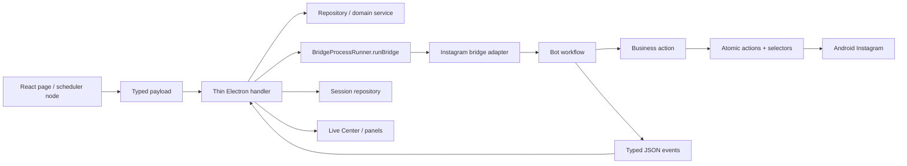

# Instagram - Audit qualite et refactor

  
Audit technique

  
Cette page note les risques observes dans l'architecture Instagram actuelle. Elle ne sert pas a juger le code : elle sert a eviter les regressions, a identifier les refactors utiles, et a garder une trajectoire claire quand on ajoute une feature.

  
Pour passer de l'audit aux corrections, ouvrir le <a href="#/audit-remediation-plan">plan de colmatage Instagram</a>.

> Le suivi transverse de `bot/taktik/core` est maintenant maintenu dans [Suivi refactor Bot core](bot-core-refactor-tracker.md). Cette page garde le contexte Instagram et les risques plateforme-specifiques.

## Synthese courte

| Priorite | Sujet | Risque | Direction |
|---|---|---|---|
| P0 | Stop/cancel/session terminale | Device qui continue apres stop, sidebar bloquee en "session en cours". | Contrat unique de session + cleanup par handler. |
| P0 | Ownership SQLite | Electron et Python ecrivent parfois les memes tables. | Propriete par table et repositories explicites. |
| P1 | SQL direct dans handlers | Sync/Turso, migrations et tests fragiles. | Repositories/services de lecture/ecriture. |
| P1 | Handlers process heterogenes | Chaque handler parse stdout/stderr et nettoie differemment. | Migrer vers `runBridge` / `BridgeProcessRunner`. |
| P1 | Publish ADB direct cote Electron | Gros fichier sensible, logique Android hors Bot. | Documenter comme exception ou extraire service state machine. |
| P1 | Selectors/pages/modales | UI Instagram fragile, texte FR/EN disperse, popups bloquantes incompletes. | Catalogue selectors + registry pages/modales + tests dump. |
| P1 | Performance bot | Trop d'appels UI dump/xpath/sleep fixes peuvent ralentir les runs. | Instrumenter, batcher les detections, remplacer les sleeps par waits conditionnels. |
| P2 | Bridges trop metier | Logique dispatch, DB, AI ou navigation dispersee. | Bridge = adapter, workflow Bot = metier Android. |
| P2 | Events live heterogenes | Live Center incomplet ou incoherent selon workflow. | Schema d'events par famille. |
| P2 | POO/ORM cible | Mix POO, mixins, fonctions et SQL direct difficile a raisonner. | Roadmap Data Mapper/Unit of Work inspiree Symfony/Doctrine. |
| P2 | Humanisation | Delais humains presents mais disperses et peu observables. | Moteur de comportement central, profils d'action, telemetry et garde-fous. |

## Etat chantier au 2026-06-03

> Estimation vivante, a recalculer apres chaque famille de commits importante.
> Le pourcentage mesure le chantier `audit qualite/refacto` front + Electron
> deja securise par code, docs et garde-fous. Il ne remplace pas les tests
> manuels reels sur device.

| Niveau | Avancement estime | Etat |
|---|---:|---|
| P0 Stop/cancel/session terminale | 97% | Instagram automation/scraping, Account, Cold DM, Smart Comment, Taktik Agent, Persona Analysis, YouTube/Gmail/TikTok Account, Threads automation et TikTok workflow lifecycle sont tres avances, avec contrats anti-regression. Reste validation manuelle multi-workflow et quelques familles annexes/outils. |
| P0 Ownership SQLite/sync | 72% | Beaucoup de handlers passent par repositories/services et `database:contracts` protege les boundaries. Reste ownership table-par-table Bot/Python vs Electron et diagnostics sync complets. |
| P1 SQL direct handlers | 80% | `targetSearch`, scraping, DB commun, scheduler, analytics/profiling, sessions/interactions/stats, storage media cleanup, configuration locale device/network et plusieurs routes TikTok ont ete nettoyes. Cote Electron, Cold DM ne remappe plus les profils scraping dans le handler, Target Search n'ecrit plus l'export CSV depuis l'IPC, `storage:*` delegue usage disque + cleanup DB a un service owner, `device-groups`/`network-*` passent par des services app, `analytics.ts` delegue a `AnalyticsProfilingService` et `sessions.ts` delegue a `SessionDatabaseService`. Reste des zones ponctuelles comme AI media/diagnostics et exceptions documentees. |
| P1 Process runner uniforme | 99% | TikTok workflow, TikTok Account, scraping Instagram et automation Instagram sont largement externalises. Cote Electron, Account, Persona Analysis, Taktik Agent, Cold DM, Smart Comment, DM Responses, Threads automation et debug commun sont maintenant des facades IPC deleguant events/launch/runtime/workflow selon leur famille. Reste surtout `compat.ts`/Lab et la decision long terme runner unique vs exceptions documentees. |
| P1 Publish Instagram | 92% | Le handler est devenu une orchestration courte : selectors, media, caption, story, reel, carousel, creation, launch, navigation, events et media-capture ont des services owners. Reste test manuel post/reel/carousel/story et decision long terme "exception Electron" vs bridge Python. |
| P1 Selectors/pages/modales | 55% | Les selectors publish Electron sont centralises et le Lab cartographie progresse. Reste audit complet des autres surfaces Instagram/TikTok et nettoyage des allowlists. |
| P1 Performance bot | 35% | Le Lab commence a remonter des timings et selector traces. Reste instrumentation runtime exploitable et remplacement progressif des sleeps fixes critiques. |
| P2 Events Live typed | 58% | Scheduler/TikTok et plusieurs events Instagram ont des contrats centraux. Reste schema `InstagramBridgeEvent` commun par famille. |
| P2 Bridges/debug partages | 45% | Un autre chantier Bot reorganise compat/bridges. Reste audit complet des modules transverses et suppression des shims legacy. |
| P2 POO/ORM cible | 18% | Les repositories et services preparent le terrain, mais l'ORM/Data Mapper n'est pas encore implemente. |
| P2 Humanisation | 22% | Les specs et la cartographie posent la trajectoire premium. Reste moteur runtime central et telemetry comportementale. |

Estimation globale actuelle : environ **95%** du chantier front/Electron
`audit qualite/refacto` est traite. Les P0 sont majoritairement colmates, mais
pas encore "fermes" tant que les validations manuelles et l'ownership DB
table-par-table ne sont pas termines.

## Constats par zone

### `automation/bot.ts`

Points positifs :

- verifie licence et sanitize device ;
- capture `session_start` pour le stop manuel ;
- gere crash silencieux avec `error_code` et crash report ;
- bufferise stdout pour eviter de casser les gros JSON base64 ;
- persiste AI stats et images de profil en asynchrone.

Risques :

| Constat | Pourquoi c'est fragile |
|---|---|
| Handler tres large | Il orchestre process, sessions, images, AI, taxonomy, crash report, logs et Live Center. |
| SQL direct ponctuel | Exemples : update screenshot path et insert AI post screenshot via `db.prepare`. |
| Event contract implicite | Les events sont traites au fil de l'eau (`profile_captured`, `ai_profile_done`, `current_post`) sans schema central. |
| Cleanup par handler | Le stop est robuste ici, mais pas forcement identique aux autres workflows Instagram. |

Direction :

1. Extraire `InstagramAutomationEventService` pour normaliser les events stdout.
2. Deplacer les requetes AI screenshot dans `ProfileRepository` ou un repository `AiMediaRepository`.
3. Declarer un type `InstagramBridgeEvent` partage cote Electron.
4. Reutiliser ce cleanup comme reference pour les autres handlers.

### `scraping/scraping.ts`

Points positifs :

- redaction des payloads image dans les logs ;
- live state par device pour survivre aux remounts UI ;
- support AI, taxonomy, geo enrichment, profile images ;
- gestion des skips/dedup et progression scraping.

Risques :

| Constat | Pourquoi c'est fragile |
|---|---|
| Beaucoup de SQL direct | Le handler lit/ecrit `instagram_profiles`, `scraping_sessions`, `scraped_profiles` directement. |
| Fallback DB dans le handler | Le safety-net insert de profil corrige une race, mais melange orchestration et persistence. |
| Double persistence Python/Electron | `ScrapingWorkflow` persiste aussi via ses mixins. |
| Log parsing + JSON parsing | Certaines infos viennent de stdout JSON, d'autres de regex sur stderr/logs. |

Direction :

1. Extraire `InstagramScrapingRepository` ou enrichir `SessionRepository` + `ProfileRepository`.
2. Documenter officiellement qui cree/complete `scraping_sessions`.
3. Remplacer les regex stderr par events JSON quand le Bot peut les emettre.
4. Garder le safety-net, mais l'encapsuler dans un service nomme.

### `search/targetSearch.ts`

Risques :

| Constat | Pourquoi c'est fragile |
|---|---|
| Requetes discovery complexes dans le handler | Difficile a tester, a migrer et a synchroniser. |
| Logique de filtres proche de l'UI | Les criteres peuvent diverger entre recherche, scheduler et automation. |
| Pas de repository dedie visible | La lecture cible devrait appartenir a un service data. |

Direction :

1. Creer `InstagramTargetSearchRepository`.
2. Extraire les filtres dans un service pur testable.
3. Reutiliser ce service dans scheduler et Live Center si besoin.

### `engagement/dm.ts`

Points positifs :

- utilise `runBridge`, donc parsing JSON, timeout et cleanup sont centralises ;
- separe read/send/bulk avec callbacks explicites ;
- modele plus proche du pattern cible.

Risques :

| Constat | Pourquoi c'est fragile |
|---|---|
| Bulk send gere son propre cancel state | Correct mais a aligner avec le reste des sessions. |
| Events DM specifiques | Ils ne passent pas toujours par le contrat global session/live. |

Direction :

1. Utiliser `dm.ts` comme reference pour migrer les autres handlers vers `runBridge`.
2. Brancher les etats DM au meme contrat Live Center si les DM deviennent planifiables.

### `engagement/coldDm.ts`

Risques :

| Constat | Pourquoi c'est fragile |
|---|---|
| SQL direct pour recipients | La selection depuis scraping session contourne les repositories. |
| Process map local | `activeColdDmProcesses` vit hors `ProcessManager` global. |
| Bridge porte AI + navigation + dedup | Beaucoup de responsabilites dans `cold_dm_bridge.py`. |

Direction :

1. Extraire la selection recipients dans repository/service.
2. Migrer vers `runBridge` avec `ProcessManager`.
3. Aligner dedup avec `SentDMService` et documenter la table source.

### `publish/instagram-upload.ts`

Points positifs :

- le handler est maintenant une orchestration IPC courte ;
- la completion publish vit dans `InstagramPublishCompletionService` ;
- les selectors/resource ids/textes/fallback points vivent dans
  `InstagramPublishSelectors` ;
- les services owners portent les sous-flux `launch`, `creation`, `story`,
  `reel`, `carousel`, `navigation`, `media`, `text`, `dialogs`, `ui` ;
- la validation media se fait avant `startUpload`, pour eviter un runtime actif
  si le payload est invalide.

Risques :

| Constat | Pourquoi c'est fragile |
|---|---|
| Android pilote cote Electron | Exception forte au pattern ou le Bot controle Android. |
| Exception directe ADB | Le handler ne spawn pas de bridge Python, donc il reste un cas a tester manuellement plus souvent. |
| Duplication clone-aware | `rid()` TypeScript duplique l'idee de `CloneAwareDeviceProxy` Python. |
| Validation device obligatoire | Les flux post/reel/carousel/story doivent etre rejoues sur device apres chaque refactor de service. |

Direction :

1. Assumer officiellement cette exception ou migrer publish vers un bridge Python.
2. Ajouter un contrat d'events publish identique pour manuel/scheduler.
3. Couvrir les services publish par tests unitaires la ou les dumps XML suffisent.
4. Garder `instagram-upload.ts` en facade : aucun selector, tap adaptatif,
   parser UI, media scan ou TypeWriter ne doit revenir dans ce handler.

### Bot Python Instagram

Points positifs :

- architecture modulaire claire : atomic actions, business actions, workflows, selectors, detectors ;
- `BaseAction` compose les mixins Android communs ;
- `BaseBusinessAction` centralise atomic actions, selectors, extractors et stats ;
- `ModernInstagramActions` donne une facade de compatibilite.

Risques :

| Constat | Pourquoi c'est fragile |
|---|---|
| Mixins nombreux | Le chemin d'appel peut devenir difficile a suivre sans diagramme. |
| `InstagramActions` deprecie mais present | Risque de nouveaux usages par erreur. |
| `DesktopBridge` reste legacy | Il consomme helpers communs mais n'herite pas comme les bridges plus recents. |
| DB helpers dans workflows | `DatabaseHelpers`, scraping persistence et post persistence posent une question d'ownership DB. |
| DebugBridge detecte aussi TikTok | Dans une doc Instagram-only, c'est un signal de transversal place au mauvais endroit. |

Direction :

1. Ajouter une règle : tout nouveau workflow doit pointer vers sa classe business et ses mixins dans [Carte classes](class-map.md).
2. Interdire les nouveaux imports de `InstagramActions` sauf compat documentee.
3. Clarifier quelles ecritures DB restent autorisees cote Python.
4. Sortir les fonctions debug multi-plateformes vers un bridge/debug commun.

## Redondances et patterns concurrents

| Redondance | Exemples | Effet |
|---|---|---|
| Process spawning | `spawnBridgeProcess` manuel vs `runBridge` | Cleanup et timeout differents selon workflow. |
| SQLite access | repositories vs `db.prepare` dans handlers vs DB helpers Python | Sync et migrations difficiles a raisonner. |
| Clone package rewrite | `rid()` TypeScript vs `CloneAwareDeviceProxy` Python | Deux implementations a maintenir. |
| Event parsing | stdout JSON, stderr JSON, regex logs | Live Center fragile. |
| DM navigation | `dm_bridge.py`, `cold_dm_bridge.py`, business messaging | Duplication potentielle des selectors et fallback. |

## Pattern cible Instagram

## Refactor progressif recommande

Le suivi vivant du chantier `bot/taktik/core` est maintenant centralise dans [Suivi refactor Bot core](bot-core-refactor-tracker.md).

1. Normaliser les events Instagram dans un type commun.
2. Migrer `coldDm.ts` puis `scraping.ts` vers `runBridge` quand c'est possible.
3. Extraire les requetes de `targetSearch.ts` dans un repository.
4. Extraire les requetes restantes de `automation/bot.ts` et `scraping.ts`.
5. Documenter l'ownership DB Python/Electron table par table.
6. Decider le statut de `instagram-upload.ts` : exception assumee ou migration vers Bot.
7. Ajouter un diagnostic "active sessions vs active processes" pour tuer les sessions fantomes.
8. Auditer selectors, pages, modales et recherches texte dans [Audit selectors](selectors-audit-plan.md).
9. Poser la trajectoire POO/ORM dans [Architecture cible POO et ORM](architecture-target-orm.md).
10. Instrumenter performance et humanisation dans [Performance et humanisation](performance-humanization.md).

## Definition of Done architecture

Une feature Instagram n'est pas terminee si elle ajoute :

- une table sans migration/sync documentee ;
- une requete SQL brute dans un handler sans justification ;
- un workflow scheduler qui contourne le chemin manuel ;
- un process Python sans stop/cancel clair ;
- un event live non documente ;
- un selector cache dans un handler alors qu'il devrait etre dans `ui/selectors` ;
- une logique clone/package dupliquee sans raison.

## Anti-regression obligatoire

| Check | Attendu |
|---|---|
| Run manuel | Demarre, progresse, termine, session terminale. |
| Scheduler | Meme payload et memes events que le manuel quand applicable. |
| Stop/cancel | Process tue ou workflow stoppe, device libere, app fermee si attendu. |
| Crash bridge | Session `failed` ou `stopped`, logs visibles, pas de process zombie. |
| Live Center | Account, device, workflow, action courante, payload et erreur visibles. |
| DB | Base vide et base deja peuplee passent les migrations. |
| Sync | Tables et fichiers critiques visibles dans diagnostics. |
| Network | Dedicated/hybrid respecte si le workflow depend d'un pool. |
| Clone app | `packageName` applique aux selectors/resource ids. |
| Langue/app version | Selectors FR/EN ou fallback documente. |
