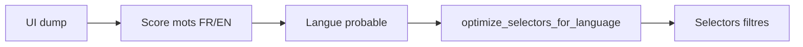

# Instagram - Selectors, detectors et compat

## Role

Les selectors Instagram sont la couche qui traduit une intention metier en elements UI Android. C'est une couche critique : une mise a jour Instagram peut casser un selector et donc plusieurs workflows.

Chemin principal :

```text
bot/taktik/core/social_media/instagram/ui/
  selectors/
  detectors/
  extractors.py
  language.py
  watchdog.py
```

## Arborescence selectors

| Fichier | Responsabilite |
|---|---|
| `auth.py` | Login, password, 2FA, erreurs auth. |
| `content.py` | Creation de contenu, post/reel/story. |
| `debug.py` | Selectors utiles aux outils debug. |
| `detection.py` | Detection home, profile, post, reel, erreurs, rate limits. |
| `dm.py` | Inbox, conversations, input et boutons DM. |
| `feed.py` | Posts feed, auteurs, like, sponsored, reels. |
| `followers_list.py` | Indicateurs listes followers/following. |
| `hashtag.py` | Header hashtag, auteur reel. |
| `navigation.py` | Tabs, back, close, boutons principaux. |
| `notification.py` | Activity tab, items, types. |
| `popup.py` | Dialogs, confirmations, suggestions, rate limit. |
| `post.py` | Grid, single post, likers, comments, reels. |
| `problematic_page.py` | Patterns de pages ou popups problematiques. |
| `profile.py` | Username, counts, bio, avatar, tabs, links. |
| `scroll.py` | Load more, fin de liste. |
| `story.py` | Story ring, viewer, like, next. |
| `text_input.py` | Comment, caption, search, DM, bio. |
| `unfollow.py` | Following button, confirm, sort. |

## Format attendu

Le pattern historique est une dataclass ou classe de selectors exposee via singleton :

```python
class ProfileSelectors:
    username_selectors = [
        '//*[@resource-id="..."]',
        '//*[contains(@text, "@")]',
    ]

PROFILE_SELECTORS = ProfileSelectors()
```

Regles :

- nommer par intention, pas par coordonnee ;
- garder les fallbacks du plus stable au plus fragile ;
- isoler les variantes langue/version ;
- eviter de mettre des selectors directement dans les workflows ;
- documenter les coordonnees fixes si on n'a pas mieux.

## Detection langue

Instagram peut etre en FR/EN selon device/account. La detection langue sert a filtrer les selectors inutiles et reduire les faux positifs.

Flux :



Quand un selector texte est ajoute, penser aux variantes FR/EN si l'ecran peut changer de langue.

## Detectors

Les detectors doivent servir a repondre a des questions d'etat :

| Detector | Question |
|---|---|
| Home/profile/post screen | Sommes-nous sur le bon ecran ? |
| Problematic page | Une popup ou page bloquante est-elle presente ? |
| Scroll end | La liste est-elle terminee ? |
| Rate limit | Instagram a-t-il bloque ou limite l'action ? |

Un workflow robuste detecte l'ecran avant de cliquer aveuglement.

### Regle surface avant libelle

Un detecteur d'ecran doit matcher une preuve forte de surface, pas seulement un
texte ou un fragment d'ID partage. Exemple observe sur Instagram `410.0.0.53.71`
via Cartography Lab : le feed contient `row_feed_profile_header` pour l'auteur
d'un post, ce qui ne doit pas etre confondu avec le header d'une page profil.

Pour `home/feed`, preferer un signal neutre comme
`feed_tab` avec `selected="true"` avant les variantes de langue `Accueil`/`Home`.
Pour `profile`, exiger un vrai indicateur de surface profil
(`profile_header_container`, `row_profile_header`, `profile_header_full_name`, etc.)
et eviter les motifs generiques comme `action_bar_title`, `Follow` ou `Suivre`.

## Debug selector

Quand un selector casse :

1. generer screenshot + UI dump depuis debug panel ;
2. verifier la version Instagram et la langue ;
3. chercher le selector dans `ui/selectors/*` ;
4. ajouter fallback au bon fichier ;
5. relancer un test selector si possible ;
6. verifier le workflow qui consomme ce selector.

Artefacts utiles :

```text
C:\Users\kevin\AppData\Local\Temp\taktik_debug\*.png
C:\Users\kevin\AppData\Local\Temp\taktik_debug\*.xml
```

## Anti-regression selectors

| Check | Attendu |
|---|---|
| FR/EN | Le selector fonctionne dans les deux langues si l'ecran existe dans les deux. |
| Version app | Le selector reste compatible avec la version cible. |
| Fallback | Le premier selector stable est prioritaire. |
| Workflow | Le workflow ne duplique pas le selector. |
| Debug | Le dump/screenshot du bug est conserve le temps de valider. |

## A ne pas faire

- ajouter un XPath directement dans un handler Electron ;
- ajouter un XPath directement dans une page React ;
- corriger un workflow par `sleep` si le probleme est un selector ;
- supprimer un fallback sans verifier les autres versions/langues ;
- confondre selector et strategie metier.
