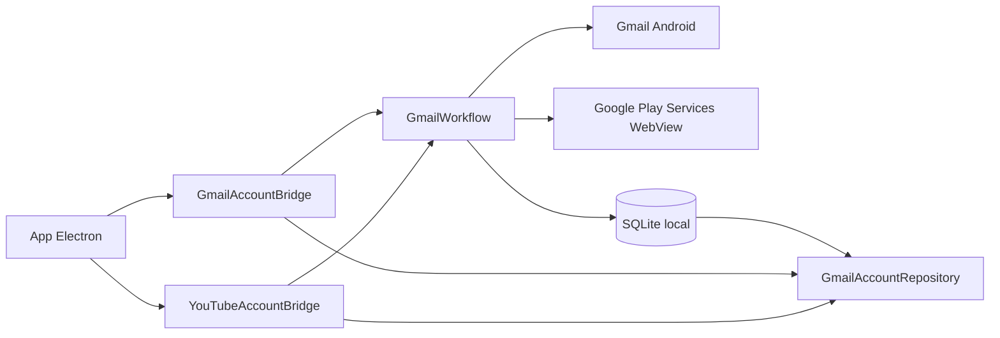
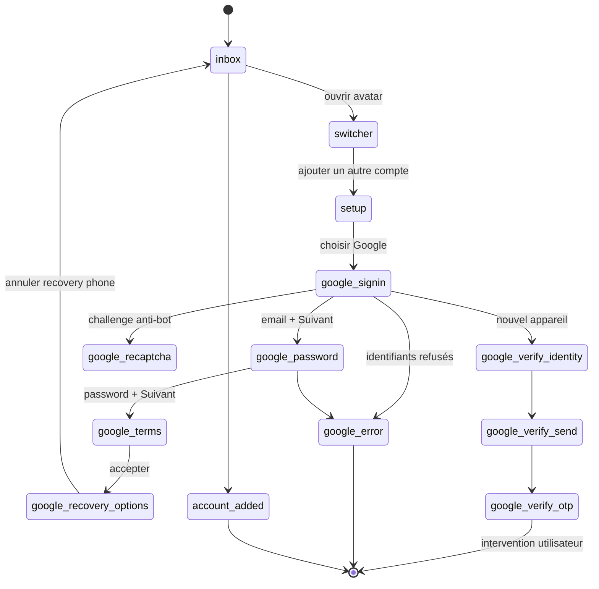
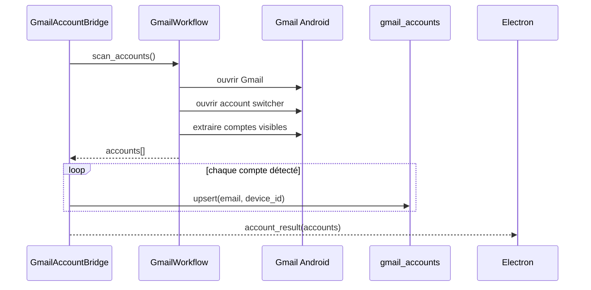
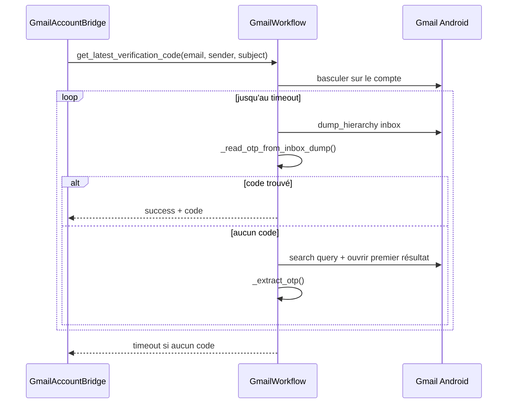

# Module Gmail — Vue d'ensemble

> **Périmètre : `[Bot]`**
> Cette page documente le workflow Python Gmail dans `bot/taktik/core/app/email/gmail/`. Les écrans Electron qui déclenchent login/OTP/scan sont traités dans la documentation `[Front]`.

Le module Gmail pilote l'application Android `com.google.android.gm` pour gérer les comptes Google présents sur un device et lire les codes OTP reçus par e-mail. Il sert surtout de brique transverse pour les workflows de signup, de vérification et de publication YouTube.

Il n'est pas un module social complet comme Instagram ou TikTok: c'est un utilitaire d'identité Google, appelé par les bridges et par d'autres workflows.

## Emplacement

```text
taktik/core/app/email/gmail/
├── __init__.py
├── workflows/
│   ├── __init__.py
│   └── account.py         # machine d'état Gmail/Google + lecture OTP
└── ui/
    ├── __init__.py
    └── selectors.py       # sélecteurs Gmail et Google Sign-In
```

## Rôle dans l'application



Le bridge est responsable du transport IPC et de la persistance locale. `GmailWorkflow` reste concentré sur l'automatisation Android: ouverture de Gmail, navigation dans le switcher de comptes, sign-in Google, scan des comptes et extraction d'OTP.

## Responsabilités

| Couche | Fichier | Responsabilité |
|---|---|---|
| Bridge | `bot/bridges/gmail/account/account.py` (`gmail_account_bridge`) | Lit la config JSON, connecte le device, route `workflowType`, persiste les comptes et emet `account_result`. |
| Workflow | `taktik/core/app/email/gmail/workflows/account.py` | Automatisation Gmail/Google Sign-In, switch de compte, scan et extraction OTP. |
| Selectors | `taktik/core/app/email/gmail/ui/selectors.py` | Dataclasses pour Gmail switcher, setup, Google Sign-In, recovery, inbox et reCAPTCHA. |
| Repository | `GmailAccountRepository` | Écrit/relit la table SQLite `gmail_accounts`. |
| Consommateurs | YouTube, TikTok signup, workflows d'auth | Réutilisent Gmail comme source de compte Google ou boîte OTP. |

## Contrats d'entrée bridge

### Login

```json
{
  "workflowType": "login",
  "deviceId": "DEVICE_ID",
  "email": "user@gmail.com",
  "password": "password"
}
```

### Logout

```json
{
  "workflowType": "logout",
  "deviceId": "DEVICE_ID",
  "email": "user@gmail.com"
}
```

### Read OTP

```json
{
  "workflowType": "read_otp",
  "deviceId": "DEVICE_ID",
  "email": "user@gmail.com",
  "senderFilter": "TikTok",
  "subjectFilter": "verification",
  "timeout": 120
}
```

### Scan accounts

```json
{
  "workflowType": "scan_accounts",
  "deviceId": "DEVICE_ID"
}
```

## Événements émis vers Electron

| Type | Émetteur | Payload principal |
|---|---|---|
| `status` | `GmailAccountBridge` | `status`, `message` |
| `log` | bridge + workflow | `level`, `message` |
| `error` | bridge | `message` |
| `account_result` | `GmailAccountBridge` | `success`, `workflow`, `email`, `message`, `error_type`, `code?`, `accounts?` |

`read_otp` ajoute `code` en cas de succès. `scan_accounts` ajoute `accounts`.

## API publique

| Méthode | Rôle | Retour |
|---|---|---|
| `ensure_account_added(email, password)` | Vérifie que le compte Google est présent dans Gmail, sinon lance l'ajout via le flux Google Sign-In. | `{success, message, error_type}` |
| `get_latest_verification_code(email, sender_filter=None, subject_filter=None, timeout=120)` | Bascule sur le compte, surveille la boîte de réception et extrait un code à 6 chiffres. | `{success, code, message, error_type}` |
| `scan_accounts()` | Liste les comptes visibles dans Gmail avec l'état actif. | `{success, accounts, message}` |

Le workflow retourne toujours des dictionnaires sérialisables. Les erreurs métier sont exprimées via `success=false` et `error_type`, afin que le bridge puisse envoyer un `account_result` propre au front.

Les comptes retournés par `scan_accounts()` suivent ce format:

```json
{
  "name": "Kevin",
  "email": "kevin@example.com",
  "is_active": true
}
```

## Machine d'état d'ajout de compte

`ensure_account_added()` utilise une boucle limitée par `_MAX_ACCOUNT_ITERATIONS = 25`. À chaque tour, `_detect_add_account_screen()` fait un seul `dump_hierarchy()` puis classe l'écran courant.



États détectés:

| État | Description |
|---|---|
| `inbox` | Gmail est ouvert sur une boîte de réception ou un écran Gmail stable. |
| `switcher` | Overlay de changement de compte ouvert. |
| `setup` | Écran Gmail "Configurer votre adresse e-mail". |
| `google_signin` | WebView Google avec saisie de l'e-mail. |
| `google_password` | WebView Google avec saisie du mot de passe. |
| `google_terms` | Conditions Google à accepter. |
| `google_verify_identity` | Challenge "confirmez qu'il s'agit bien de vous". |
| `google_verify_send` | Confirmation d'envoi du code sur l'adresse de récupération. |
| `google_verify_otp` | Google attend un code manuel. |
| `google_recovery_options` | Options de récupération téléphone/e-mail, généralement ignorées. |
| `google_recaptcha` | reCAPTCHA détecté, parfois impossible à automatiser complètement. |
| `google_error` | Identifiants refusés ou blocage Google. |
| `google_loading` | Google Play Services visible mais contenu pas encore chargé. |
| `unknown` | Aucun état fiable détecté. |

## Décisions d'automatisation

| Situation | Comportement |
|---|---|
| Compte déjà présent dans Gmail | `ensure_account_added()` retourne succès sans refaire le sign-in. |
| Compte visible dans le switcher mais inactif | Le workflow tente de le sélectionner. |
| Écran Google Sign-In stable | Saisie email/password puis bouton suivant. |
| WebView partiellement inaccessible | Tap par coordonnées calibrées, puis saisie clavier. |
| Challenge reCAPTCHA | Détection explicite; l'automatisation tente le checkbox si possible mais peut bloquer. |
| Google demande un code de récupération | Retourne un état d'attente/intervention plutôt que simuler un code inexistant. |
| Logout Gmail | Pas automatisé complètement; le bridge ouvre les paramètres Android et nettoie la DB locale. |

## Particularité WebView Google

La connexion Google est rendue dans un WebView appartenant à `com.google.android.gms`. Selon les versions, les champs `identifierId`, `Passwd` ou `password` sont accessibles; sinon le workflow tombe sur un tap par coordonnées calibrées avec `_WEBVIEW_INPUT_Y_RATIO = 0.395`.

Le bouton `Suivant` est hors WebView et reste accessible par XPath. C'est pour ça que le workflow mélange:

| Action | Technique |
|---|---|
| Saisie e-mail/password | XPath si possible, sinon coordonnées |
| Bouton Suivant | XPath texte/package |
| reCAPTCHA checkbox | coordonnées réelles depuis bounds XML ou ratio fallback |
| OTP Google recovery | retourne `awaiting_verification_code` au front |

## Scan des comptes

`scan_accounts()` ouvre Gmail, tente d'accéder au switcher de comptes, lit les lignes visibles et retourne les e-mails détectés.



La base locale n'est pas source de vérité; elle sert de cache d'affichage et de liaison avec le device.

## Lecture OTP

`get_latest_verification_code()` applique une stratégie en deux temps:

1. lecture rapide du `dump_hierarchy()` de l'inbox, sans ouvrir d'e-mail;
2. fallback avec recherche Gmail, ouverture du premier résultat et extraction dans le message.



Les patterns reconnus ciblent les codes à 6 chiffres:

```text
\b(\d{6})\b
code: 123456
code is 123456
code est 123456
```

## Types d'erreurs fréquents

| `error_type` | Signification |
|---|---|
| `missing_credentials` | Email ou password absent côté bridge ou workflow. |
| `account_not_found` | Le compte demandé n'est pas visible dans Gmail. |
| `timeout` | Aucun OTP trouvé avant `timeout`. |
| `google_error` | Google refuse ou bloque le sign-in. |
| `recaptcha_required` | reCAPTCHA détecté et non résolu automatiquement. |
| `awaiting_verification_code` | Google attend un code externe ou une intervention utilisateur. |
| `unknown_screen` | L'écran courant ne matche aucun état fiable. |

La liste exacte peut évoluer avec `workflows/account.py`; la règle de documentation est de conserver ici les erreurs que le front doit savoir interpréter.

## Sélecteurs

Tous les sélecteurs sont centralisés dans `selectors.py` sous forme de dataclasses importées comme singletons.

| Singleton | Zone couverte |
|---|---|
| `GMAIL_SWITCHER_SELECTORS` | Avatar, overlay compte, e-mail courant, lignes de comptes, bouton ajouter, fermeture. |
| `GMAIL_SETUP_SELECTORS` | Écran "Configurer votre adresse e-mail" et choix fournisseur Google. |
| `GOOGLE_SIGNIN_SELECTORS` | Boutons `Suivant`, `J'accepte`, `Continuer`, erreurs de login. |
| `GOOGLE_VERIFY_SELECTORS` | Challenge identité, réception du code, bouton envoyer, confirmation. |
| `GOOGLE_RECOVERY_SELECTORS` | Options de récupération Google, annuler/enregistrer. |
| `GMAIL_INBOX_SELECTORS` | Recherche Gmail, liste de conversations, premier résultat, corps de message. |
| `GOOGLE_RECAPTCHA_SELECTORS` | Checkbox reCAPTCHA et bouton suivant. |

## Persistance SQLite

La table `gmail_accounts` est manipulée via `GmailAccountRepository`.

```text
taktik/core/database/repositories/accounts/gmail_account_repository.py
```

Le repository expose notamment:

| Méthode | Usage |
|---|---|
| `upsert(email, device_id)` | Enregistre ou met à jour le compte lié au device. |
| `delete(email)` | Supprime le compte côté base locale. |
| `list_by_device(device_id)` | Récupère les comptes connus pour un device. |

La source de vérité d'exécution reste le device Android. La base sert à mémoriser les comptes vus/ajoutés pour l'interface desktop et les workflows suivants.

## Lien avec YouTube et TikTok

| Consommateur | Usage Gmail |
|---|---|
| YouTube account | Ajoute ou vérifie le compte Google avant l'ouverture de YouTube. |
| YouTube upload | Réutilise le compte déjà présent sur Android; pas de login YouTube séparé dans l'upload. |
| TikTok register / vérification | Peut lire un OTP reçu par e-mail. |
| Sessions desktop | Peut afficher les comptes disponibles via `gmail_accounts`. |

## Limites connues

| Sujet | Statut |
|---|---|
| Logout automatique | Pas terminé: ouverture des paramètres Android + suppression locale. |
| WebView Google | Très dépendant de la version Google Play Services et des challenges de sécurité. |
| OTP | Optimisé pour codes à 6 chiffres; les formats spécifiques peuvent nécessiter des patterns additionnels. |
| IPC workflow | `GmailWorkflow` utilise encore certains mécanismes IPC/logs plus couplés que YouTube; le bridge reste la frontière officielle. |
| Quotas | Pas de quota local dans le module Gmail. Les restrictions produit/licence sont externes. |

## Bridges concernés

| Bridge | Responsabilité |
|---|---|
| `bridges/gmail/account/account.py` (`gmail_account_bridge`) | Ajout, scan, suppression logique et lecture OTP Gmail. |
| `bridges/youtube/account/account.py` (`youtube_account_bridge`) | Ajout d'un compte Google pour les publications YouTube. |
| `bridges/youtube/publish/upload.py` (`youtube_upload_bridge`) | Utilise le compte Google deja present pour publier. |

Voir aussi:

- [Bridge Gmail](../../bridges/gmail.md)
- [Bridge YouTube](../../bridges/youtube.md)
- [Module YouTube](../youtube/overview.md)
