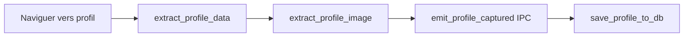
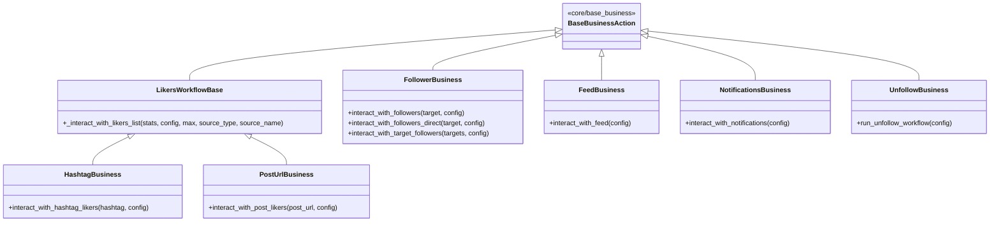
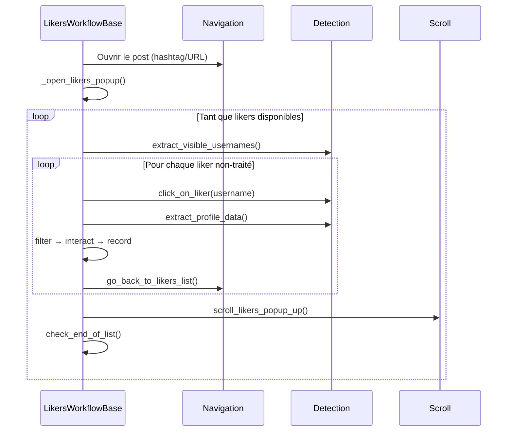
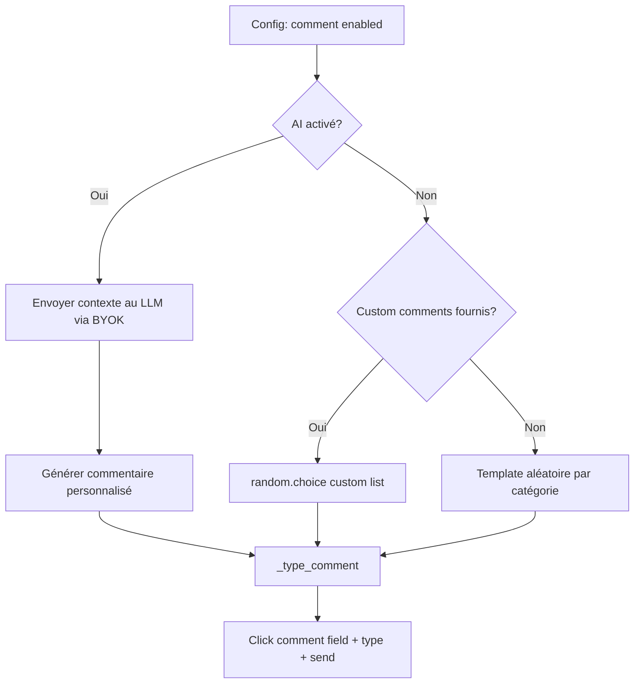

# Actions Business Instagram

## Vue d'ensemble

La couche business contient toute la **logique métier** : workflows d'acquisition, filtrage de profils, gestion de contenu, et actions réutilisables (like, comment, story). Tous les modules héritent directement ou indirectement de `BaseBusinessAction` (documenté dans `atomic-actions.md`).

---

## Arborescence complète

```
business/
├── __init__.py              ← Barrel: 9 classes exportées
│
├── actions/                 ← Actions réutilisables
│   ├── __init__.py          ← Exports: LikeBusiness, StoryBusiness, CommentBusiness
│   ├── like/
│   │   ├── orchestration.py ← LikeOrchestration (like_profile_posts, like_current_post)
│   │   └── post_navigation.py ← PostNavigationMixin (scroll entre posts)
│   ├── comment/
│   │   ├── action.py        ← CommentAction (comment_on_post, AI + templates)
│   │   └── templates.py     ← Templates par catégorie + helpers
│   └── story.py             ← StoryBusiness (view_profile_stories)
│
├── management/              ← Gestion données & filtrage
│   ├── __init__.py          ← Exports: ProfileBusiness, ContentBusiness, FilteringBusiness
│   ├── profile/
│   │   ├── extraction.py    ← ProfileBusiness (get_complete_profile_info, extract + image + persist)
│   │   └── persistence.py   ← Persistance DB (save_profile_to_db)
│   ├── content/
│   │   ├── extraction.py    ← ContentBusiness (extract_post_metadata, detect_post_type)
│   │   └── navigation.py    ← Navigation contenu (posts grid, reels)
│   └── filtering.py         ← FilteringBusiness (apply_comprehensive_filter, scoring)
│
├── system/                  ← Configuration
│   ├── __init__.py          ← Exports: ConfigBusiness
│   └── config.py            ← ConfigBusiness (API endpoints, default delays, app package)
│
├── common/                  ← Utilitaires partagés
│   ├── __init__.py
│   └── workflow_defaults.py ← Configs par défaut pour chaque workflow
│
└── workflows/               ← Workflows d'acquisition
    ├── __init__.py          ← Exports: 6 workflows
    ├── common/
    │   ├── likers_base.py   ← LikersWorkflowBase (boucle likers popup partagée)
    │   └── followers_tracker.py ← FollowersTracker (diagnostic navigation)
    ├── followers/           ← Le plus complexe (3 variantes + mixins)
    ├── hashtag/             ← Interaction via likers d'un hashtag
    ├── post_url/            ← Interaction via likers d'un post URL
    ├── feed/                ← Interaction depuis le home feed
    ├── notifications/       ← Interaction depuis l'onglet activité
    ├── unfollow/            ← Nettoyage de la following list
    └── messaging/           ← Envoi de DMs
```

> Etat courant verifie : l'ancien `common/database_helpers.py` a ete supprime.
> Le state DB partage vit maintenant sous `bot/taktik/core/database/`, notamment
> `instagram_workflow_state.py`, `instagram_hashtag_posts.py` et
> `instagram_follow_graph.py`.

---

## `actions/` — Actions réutilisables

### LikeBusiness (`like/orchestration.py`)

Orchestre les likes sur les posts d'un profil.

| Méthode | Description |
|---------|-------------|
| `like_profile_posts(username, max_likes, navigate_to_profile, config, profile_data)` | Like N posts d'un profil (navigation + scroll grid) |
| `like_current_post(config)` | Like le post actuellement affiché |
| `_scroll_to_next_post()` | Scroll vers le post suivant dans le grid |

Utilise `PostNavigationMixin` pour la navigation entre posts et `ProblematicPageDetector` pour détecter les pages cassées.

### CommentBusiness (`comment/action.py`)

| Méthode | Description |
|---------|-------------|
| `comment_on_post(comment_text, template_category, custom_comments, config, username)` | Poste un commentaire (texte custom, template, ou AI) |
| `_type_comment(text)` | Saisie du texte avec fallback chain (selector patchable par compat) |

**Sources du texte** (par priorité) :
1. `comment_text` passé explicitement
2. `custom_comments` — liste fournie par l'utilisateur → `random.choice()`
3. Template par catégorie via `get_random_comment(templates, category)`
4. Commentaire AI si activé dans la config

**Templates** (`templates.py`) : dictionnaire par catégorie (`generic`, `positive`, `question`, `emoji`). Helpers : `get_random_comment()`, `validate_comment()`, `add_custom_template()`.

### StoryBusiness (`story.py`)

| Méthode | Description |
|---------|-------------|
| `view_profile_stories(username, max_stories, config)` | Navigate → détecte stories → view + like optionnel |

**Config par défaut** :
```python
{
    'max_stories_per_profile': 5,
    'view_duration_range': (2, 6),
    'like_probability': 0.3,
    'skip_viewed_stories': True
}
```

---

## `management/` — Gestion données

### ProfileBusiness (`profile/extraction.py`)

Pipeline complet d'extraction de profil :



| Méthode | Description |
|---------|-------------|
| `get_complete_profile_info(username)` | Pipeline complet : navigation → extraction données + image → IPC → DB |
| `extract_and_save_profile()` | Extraction depuis le profil actuellement affiché |
| `save_profile_to_db(profile_data)` | Persistance SQLite via `get_db_service()` |

### ContentBusiness (`content/`)

| Module | Méthodes clés |
|--------|---------------|
| `extraction.py` | `extract_post_metadata()`, `detect_post_type()` (photo/video/carousel/reel), `extract_caption()` |
| `navigation.py` | `navigate_to_first_post()`, `open_grid_post(index)`, `scroll_through_posts()` |

### FilteringBusiness (`filtering.py`)

Filtrage multicritère avec score de qualité.

```python
class FilteringBusiness(BaseBusinessAction):
    def apply_comprehensive_filter(self, profile_info, criteria) -> dict:
        """Retourne {suitable, score, reasons, category, filter_details, username}"""
```

**Pipeline de filtrage** (3 couches séquentielles) :
1. **`_apply_basic_filters`** — followers min/max, posts min/max, privé, vérifié
2. **`_apply_advanced_filters`** — ratio followers/following, business, langue bio
3. **`_apply_content_filters`** — activité récente, qualité du profil

**Score** : commence à 100, chaque filtre peut le réduire. `suitable = True` si score > 0 et aucun filtre bloquant.

| Helper | Description |
|--------|-------------|
| `create_profile_filter(criteria)` | Factory → retourne une closure `profile_filter(profile_info)` |

---

## `system/` — Configuration

### ConfigBusiness (`config.py`)

Centralise la configuration de l'automatisation.

| Méthode | Description |
|---------|-------------|
| `get_api_endpoints()` | URLs API configurées |
| `get_instagram_config()` | Package app, deep link base, delays par défaut |
| `get_automation_config()` | Max retries, screenshot on error, human behavior |
| `validate_configuration()` | Vérifie la cohérence de la config |

**Config par défaut** :
```python
{
    'api': {'base_url': 'https://api.taktik-bot.com', 'timeout': 30, 'retry_attempts': 3},
    'instagram': {
        'app_package': get_active_package(),  # Supporte clones
        'default_delays': {
            'navigation': (1, 3), 'scroll': (0.5, 1.5), 'interaction': (2, 5),
            'post_load': (1, 2), 'story_load': (0.5, 1)
        }
    },
    'automation': {'max_retries': 3, 'screenshot_on_error': True, 'human_like_behavior': True}
}
```

---

## `common/` — Utilitaires partagés

### DatabaseHelpers

Classe statique pour les opérations DB communes à tous les workflows.

| Méthode | Description |
|---------|-------------|
| `record_individual_actions(username, action_type, count, account_id, session_id)` | Enregistre N actions individuelles en DB |
| `is_profile_already_processed(username, account_id, hours_limit=1440)` | Vérifie si un profil a été traité dans les dernières X heures |

### Workflow Defaults (`workflow_defaults.py`)

Configs centralisées par workflow. Chaque workflow fait `self.default_config = {**DEFAULTS}`.

| Constante | Clés spécifiques |
|-----------|------------------|
| `_INTERACTION_DEFAULTS` | `max_interactions: 20`, `like_percentage: 80`, `follow_percentage: 15`, `comment_percentage: 5`, `story_watch_percentage: 10` |
| `FOLLOWERS_DEFAULTS` | `max_followers_to_extract: 50`, `like_probability: 0.8`, `follow_probability: 0.2`, `max_likes_per_profile: 4` |
| `HASHTAG_DEFAULTS` | `max_posts_to_analyze: 20`, `min_likes: 100`, `max_likes: 50000` |
| `POST_URL_DEFAULTS` | `like_percentage: 70`, `min_likes_per_profile: 2` |
| `FEED_DEFAULTS` | `max_posts_to_check: 30`, `like_percentage: 100`, `follow_percentage: 0`, `like_posts_directly: True` |
| `NOTIFICATIONS_DEFAULTS` | `notification_types: ['likes', 'follows', 'comments']` |
| `UNFOLLOW_DEFAULTS` | `max_unfollows: 20`, `unfollow_delay_range: (30, 60)`, `unfollow_mode: 'non-followers'`, `min_days_since_follow: 3` |

> **Note** : `FOLLOWERS_DEFAULTS` utilise des probabilités `0.0-1.0`, les autres utilisent des pourcentages `0-100`. `ConfigParsingMixin` dans `BaseBusinessAction` gère les deux formats.

---

## `workflows/` — Workflows d'acquisition

### Hiérarchie des classes



### `LikersWorkflowBase` (`common/likers_base.py`)

Base commune pour **HashtagBusiness** et **PostUrlBusiness** — évite ~300 lignes de code dupliqué.



**Méthode clé** : `_interact_with_likers_list(stats, effective_config, max_interactions, source_type, source_name)`

### FollowerBusiness (`followers/`)

Le workflow le plus complexe — 3 variantes + 6 mixins.

```
followers/
├── workflow.py              ← FollowerBusiness (compose 3 workflows + 3 mixins)
├── mixins/
│   ├── navigation.py        ← FollowerNavigationMixin (navigation dans la followers list)
│   ├── checkpoints.py       ← FollowerCheckpointsMixin (sauvegarde/reprise de progression)
│   └── extraction.py        ← FollowerExtractionMixin (extraction usernames visibles)
└── workflows/
    ├── legacy.py            ← FollowerLegacyWorkflowMixin (interact_with_followers — liste pre-scrapée)
    ├── multi_target.py      ← FollowerMultiTargetWorkflowMixin (interact_with_target_followers — multi-sources)
    └── direct/              ← Workflow principal (recommandé)
        ├── __init__.py      ← FollowerDirectWorkflowMixin (facade)
        ├── main_loop.py     ← Boucle principale (scroll + extract + process)
        ├── profile_processing.py ← Traitement profil individuel
        └── navigation_helpers.py ← Helpers navigation followers list
```

**3 variantes** :

| Méthode | Description | Navigation |
|---------|-------------|------------|
| `interact_with_followers_direct(target, config)` | Clic direct dans la liste → profil → interact → back | 100% clics naturels (recommandé) |
| `interact_with_followers(target, config)` | Liste pre-scrapée → deeplink vers chaque profil | Deeplinks (legacy) |
| `interact_with_target_followers(targets, config)` | Multi-cibles → extraction + déduplique → interact | Deeplinks multi-source |

**Flux du workflow direct** :

1. Naviguer vers le profil target
2. Ouvrir la liste des followers
3. **Boucle** :
   - Extraire usernames visibles
   - Pour chaque username non-traité :
     - Cliquer pour ouvrir le profil
     - Extraire les données
     - Appliquer les filtres (`FilteringBusiness`)
     - Si accepté : `_perform_interactions_on_profile()`
     - Retourner à la liste
   - Scroller la liste
   - Vérifier fin de liste
4. Fin quand limites atteintes ou liste épuisée

**Checkpoints** : les progressions sont sauvegardées dans `%APPDATA%/taktik-desktop/temp/checkpoints/` pour permettre la reprise après arrêt.

**FollowersTracker** (`common/followers_tracker.py`) : diagnostic des problèmes de navigation (boucles infinies, retours en début de liste). Génère des logs JSONL dans `%APPDATA%/taktik-desktop/logs/followers_tracking/`.

### HashtagBusiness (`hashtag/`)

```
hashtag/
├── workflow.py              ← HashtagBusiness (compose 2 mixins + LikersWorkflowBase)
└── mixins/
    ├── post_finder.py       ← HashtagPostFinderMixin (trouver des posts avec N likes dans range)
    ├── post_detection.py    ← Détection type de post (photo/reel/carousel)
    └── extractors.py        ← HashtagExtractorsMixin (extraction données hashtag)
```

| Méthode | Description |
|---------|-------------|
| `interact_with_hashtag_likers(hashtag, config)` | Navigate → trouve posts valides → ouvre likers → `_interact_with_likers_list()` |

**Config spécifique** : `min_likes`, `max_likes` (filtrage des posts), `max_posts_to_analyze`

### PostUrlBusiness (`post_url/`)

```
post_url/
├── workflow.py              ← PostUrlBusiness (compose 2 mixins + LikersWorkflowBase)
└── mixins/
    ├── url_handling.py      ← PostUrlHandlingMixin (parsing URL, deeplink navigation)
    └── extractors.py        ← PostUrlExtractorsMixin (extraction données post)
```

| Méthode | Description |
|---------|-------------|
| `interact_with_post_likers(post_url, config)` | Ouvre post via deeplink → ouvre likers → `_interact_with_likers_list()` |

Navigation 100% naturelle par clics (pas de deeplinks pour chaque profil).

### FeedBusiness (`feed/`)

```
feed/
├── workflow.py              ← FeedBusiness (compose 2 mixins + BaseBusinessAction)
├── post_actions.py          ← FeedPostActionsMixin (like, comment, detect, scroll)
└── user_interactions.py     ← FeedUserInteractionsMixin (navigate to author, interact, DB)
```

| Méthode | Description |
|---------|-------------|
| `interact_with_feed(config)` | Scroll le feed → pour chaque post : like direct et/ou visiter l'auteur |

**Modes** (configurables) :
- `like_posts_directly: True` — like les posts sans visiter le profil
- `interact_with_post_author: True` — naviguer vers l'auteur pour interactions complètes
- `interact_with_post_likers: True` — ouvrir les likers du post
- `skip_reels`, `skip_ads` — filtrage du type de contenu

### NotificationsBusiness (`notifications/`)

```
notifications/
├── workflow.py              ← NotificationsBusiness (compose 2 mixins + BaseBusinessAction)
├── extraction.py            ← NotificationExtractionMixin (navigate activity tab, extract users)
└── interactions.py          ← NotificationInteractionsMixin (interact + retour activity tab)
```

| Méthode | Description |
|---------|-------------|
| `interact_with_notifications(config)` | Onglet activité → extraire users → visiter chaque profil → interact → retour |

**Config** : `notification_types: ['likes', 'follows', 'comments']` — filtre les types de notifications à traiter.

### UnfollowBusiness (`unfollow/`)

```
unfollow/
├── workflow.py              ← UnfollowBusiness (compose 4 mixins + BaseBusinessAction)
└── mixins/
    ├── decision.py          ← UnfollowDecisionMixin (should_unfollow, whitelist/blacklist)
    ├── actions.py           ← UnfollowActionsMixin (perform_unfollow, confirm)
    ├── sync_following.py    ← SyncFollowingMixin (sync liste following depuis l'app)
    └── sync_followers.py    ← SyncFollowersMixin (sync liste followers depuis l'app)
```

| Méthode | Description |
|---------|-------------|
| `run_unfollow_workflow(config)` | Ouvre following list → sync → filtre → unfollow un par un |

**Modes d'unfollow** (`unfollow_mode`) :

| Mode | Description |
|------|-------------|
| `non-followers` | Unfollow les comptes qui ne follow pas en retour |
| `mutual` | Unfollow les mutuels (follow réciproque) |
| `oldest` | Unfollow par ordre chronologique (plus anciens d'abord) |
| `all` | Unfollow tout (sauf whitelist) |

**Protections** : `skip_verified`, `skip_business`, `min_days_since_follow`, `whitelist[]`, `blacklist[]`

**Sync** : les mixins `SyncFollowingMixin` et `SyncFollowersMixin` synchronisent les listes followers/following depuis l'app vers la DB locale pour permettre le calcul des non-followers.

### MessagingBusiness (`messaging/workflow.py`)

| Méthode | Description |
|---------|-------------|
| `send_dm_from_profile(message)` | Envoie un DM depuis la page profil courante |

Hérite de `BaseAction` (pas `BaseBusinessAction`) — module léger pour l'envoi de DMs dans le contexte des workflows.

---

## Méthode unifiée d'interaction

La méthode `_perform_interactions_on_profile()` (dans `BaseBusinessAction.InteractionEngineMixin`) centralise toute la logique d'interaction sur un profil déjà navigué :

```python
def _perform_interactions_on_profile(self, username, config, profile_data):
    """
    NE fait PAS: navigation, filtrage, stats_manager.increment (callers gèrent).
    """
    results = {"liked": 0, "followed": False, "story_viewed": False, "commented": False}
    
    # 1. Like posts (probabilité configurable)
    if self._should_like(config):
        results["liked"] = self._like_user_posts(count=config.max_likes_per_profile)
    
    # 2. Follow (probabilité configurable)
    if self._should_follow(config):
        results["followed"] = self._follow_user()
    
    # 3. View stories
    if self._should_view_stories(config):
        results["story_viewed"] = self._view_stories_on_current_profile(username, ...)
    
    # 4. Comment (optionnel AI)
    if self._should_comment(config):
        results["commented"] = self._post_comment(username, config)
    
    return results
```

Utilisée par : `FollowerBusiness`, `LikersWorkflowBase` (→ Hashtag, PostUrl), `NotificationsBusiness`, `FeedBusiness`.

---

## Commentaires AI

Le module `comment/action.py` supporte les commentaires générés par IA :



---

## Sélecteurs centralisés

Tous les workflows utilisent des sélecteurs centralisés depuis `ui/selectors/` (dataclasses Python). Le système de compatibilité versionnée peut patcher ces sélecteurs au démarrage via YAML overrides (voir doc compat).

| Workflow | Selectors utilisés |
|----------|--------------------|
| Feed | `FEED_SELECTORS` |
| Unfollow | `UNFOLLOW_SELECTORS` |
| Notifications | `NOTIFICATION_SELECTORS` |
| Hashtag / PostUrl | `HASHTAG_SELECTORS` |
| Followers | `FOLLOWERS_LIST_SELECTORS`, `NAVIGATION_SELECTORS` |
| Comment | `POST_SELECTORS`, `TEXT_INPUT_SELECTORS` |
| All | `PROFILE_SELECTORS`, `BUTTON_SELECTORS`, `DETECTION_SELECTORS` |
