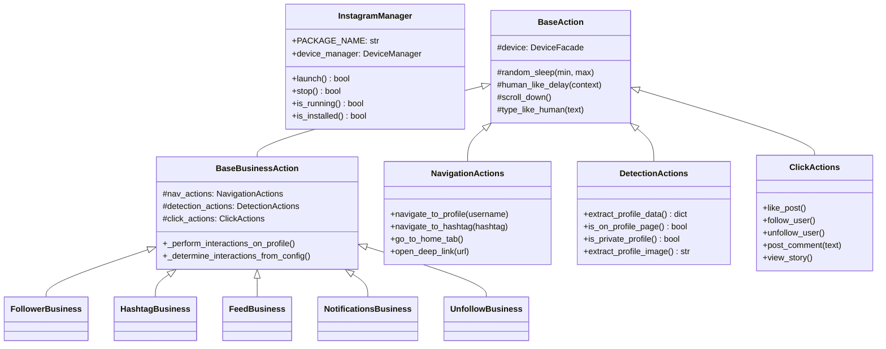
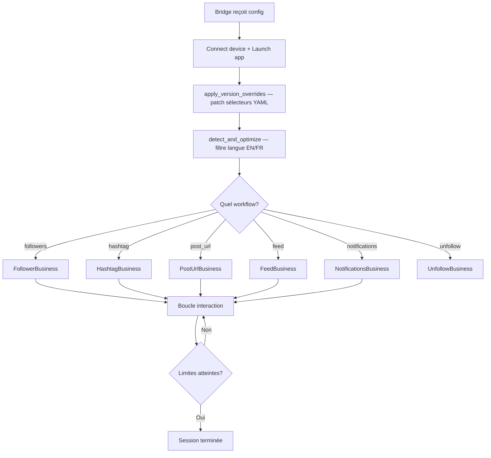

# Module Instagram — Vue d'ensemble

## Structure complète

```
taktik/core/social_media/instagram/
│
├── actions/                 ← Couche actions (doc: atomic-actions.md, business-actions.md)
│   ├── atomic/              ← Actions UI unitaires (5 sous-packages: navigation, detection, interaction, scroll, text)
│   ├── business/            ← Logique métier (actions, management, workflows, system, common)
│   ├── core/                ← Classes de base (BaseAction, BaseBusinessAction, DeviceFacade, HumanBehavior, IPC, Stats)
│   └── compatibility/       ← Facade legacy (ModernInstagramActions, CLI adapter)
│
├── auth/                    ← Authentification (doc: auth.md)
│   ├── login/               ← Connexion Instagram (4 mixins: screen_detection, credentials, result_detection, popups)
│   ├── logout/              ← Déconnexion (navigation UI: profil → options → logout → confirm)
│   ├── signup/              ← Création de compte (étapes initiales: phone/email)
│   └── session/             ← SessionManager (save/load/delete/cleanup, expiration 30 jours)
│
├── ui/                      ← Interface utilisateur (doc: selectors.md)
│   ├── selectors/           ← 18 fichiers de sélecteurs XPath (dataclasses avec fallback)
│   ├── extractors.py        ← InstagramUIExtractors (likes, comments, usernames)
│   ├── language.py          ← Détection langue (EN/FR) + optimisation sélecteurs
│   ├── watchdog.py          ← WorkflowWatchdog (daemon thread anti-blocage)
│   └── detectors/           ← ProblematicPageDetector, ScrollEndDetector
│
├── utils/                   ← Utilitaires
│   ├── helpers.py           ← random_delay(), format_duration()
│   ├── log_config.py        ← setup_logger(), InterceptHandler (loguru bridge)
│   ├── input/               ← validators.py (username, hashtag, URL, post_id, comment), keyboard.py (shim → shared)
│   ├── media/               ← screenshot.py (take, save, take_and_save)
│   └── filtering/           ← ⚠️ DÉPRÉCIÉ → voir actions/business/management/filtering.py
│
├── core/                    ← InstagramManager (launch, stop, is_running, is_installed)
├── models/                  ← Dataclasses: Post, User, Story
├── test/                    ← Tests
│
└── workflows/               ← Orchestration haut-niveau (appelé par les bridges)
    ├── core/                ← InstagramAutomation, WorkflowRunner
    ├── management/          ← SessionManager, WorkflowConfigBuilder, LoginWorkflow, config (DM, content)
    ├── helpers/             ← WorkflowHelpers, UIHelpers
    ├── common/              ← Helpers partagés entre workflows
    ├── scraping/            ← Scraping de followers/following/hashtags/posts + qualification
    ├── cold_dm/             ← DMs à froid
    └── post_scraping/       ← Scraping de posts
```

---

## Diagramme de classes principal



---

## Flux principal



---

## Workflows disponibles

| Workflow | Classe | Emplacement | Description |
|----------|--------|-------------|-------------|
| **Followers** | `FollowerBusiness` | `actions/business/workflows/followers/` | Visite les followers d'un target, filtre, interagit (3 variantes) |
| **Hashtag** | `HashtagBusiness` | `actions/business/workflows/hashtag/` | Ouvre un hashtag, trouve des posts, interagit avec les likers |
| **Post URL** | `PostUrlBusiness` | `actions/business/workflows/post_url/` | Ouvre un post via deeplink, interagit avec les likers |
| **Feed** | `FeedBusiness` | `actions/business/workflows/feed/` | Scroll le feed, like/comment les posts |
| **Notifications** | `NotificationsBusiness` | `actions/business/workflows/notifications/` | Interagit avec les profils dans les notifications |
| **Unfollow** | `UnfollowBusiness` | `actions/business/workflows/unfollow/` | Unfollow smart (4 modes: non-followers, mutual, oldest, all) |
| **Cold DM** | `ColdDMWorkflow` | `workflows/cold_dm/` | Envoie des DMs à des profils ciblés (legacy standalone) |
| **DM Outreach** | `DMOutreachWorkflow` | `workflows/management/dm/` | Envoi massif de DM avec templates, A/B testing et follow optionnel |
| **DM Auto Reply** | `DMAutoReplyWorkflow` | `workflows/management/dm/` | Réponses automatiques aux DM via OpenRouter |
| **Smart Comment** | `smart_comment_bridge` | `bridges/instagram/engagement/smart_comment.py` | Scrape les commentaires d'un post, qualifie les prospects et génère/répond avec IA |
| **Content** | `ContentWorkflow` | `workflows/management/content/` | Publication de posts, stories et reels |
| **Scraping** | `ScrapingWorkflow` | `workflows/scraping/` | Scrape followers/following, likers/commenters de posts ou hashtags |
| **Post Scraping** | `PostScrapingWorkflow` | `workflows/post_scraping/` | Scrape les stats, likers, commentaires et profils enrichis d'un post |

---

## Modules secondaires

### `core/manager.py` — InstagramManager

Hérite de `SocialMediaBase`. Gère le cycle de vie de l'app Instagram.

| Méthode | Description |
|---------|-------------|
| `launch()` | Vérifie installation → lance via ADB |
| `stop()` | Arrête le package Instagram |
| `is_running()` | Vérifie si Instagram est l'app au premier plan |
| `is_installed()` | Vérifie si le package est installé |

**Package** : `com.instagram.android` / **Activity** : `InstagramMainActivity`

### `models/` — Dataclasses

3 dataclasses avec `to_dict()` :

| Classe | Champs principaux |
|--------|-------------------|
| `Post` | id, username, caption, like_count, comment_count, is_video, is_carousel, media_urls |
| `User` | username, full_name, biography, followers_count, following_count, posts_count, is_private, is_verified |
| `Story` | id, username, timestamp, media_url, media_type, duration, mentions, hashtags |

### `utils/` — Utilitaires

| Module | Exports | Description |
|--------|---------|-------------|
| `helpers.py` | `random_delay()`, `format_duration()` | Fonctions utilitaires légères |
| `log_config.py` | `setup_logger()`, `InterceptHandler` | Config loguru + bridge stdlib logging |
| `input/validators.py` | `validate_username()`, `validate_hashtag()`, `validate_url()`, `validate_post_id()`, `validate_comment()` | Validation des entrées (regex) |
| `input/keyboard.py` | *(shim)* | Re-export depuis `core/shared/input/taktik_keyboard` |
| `media/screenshot.py` | `take_screenshot()`, `save_screenshot()`, `take_and_save_screenshot()` | Capture d'écran debug |

---

## Versions supportées

| Version Instagram | Statut | Notes |
|-------------------|--------|-------|
| 410.0.0.53.71 | **Baseline** (target) | Tous sélecteurs validés |
| 417.0.0.54.77 | Supportée via overrides | 10 sélecteurs patchés (YAML) |

> ⚠️ La version target ne doit JAMAIS être changée sans validation complète via le framework compat.

---

## Pages de documentation associées

| Page | Contenu |
|------|---------|
| [Infrastructure & Actions Atomiques](atomic-actions.md) | `actions/core/` + `actions/atomic/` + `actions/compatibility/` |
| [Actions Business](business-actions.md) | `actions/business/` (workflows, management, actions, system, common) |
| [UI — Sélecteurs, Extractors, Détecteurs](selectors.md) | `ui/` complet (selectors, extractors, language, watchdog, detectors) |
| [Authentification](auth.md) | `auth/` (login, logout, signup, session) |
| [Filtrage des profils](filtering.md) | `FilteringBusiness` (3 couches, scoring) |
| [Workflows haut niveau](workflows.md) | `workflows/` (automation, runner, scraping, post scraping, DM, content) |
| [Scraping & qualification](scraping-workflows.md) | `workflows/scraping/`, `workflows/post_scraping/` |
