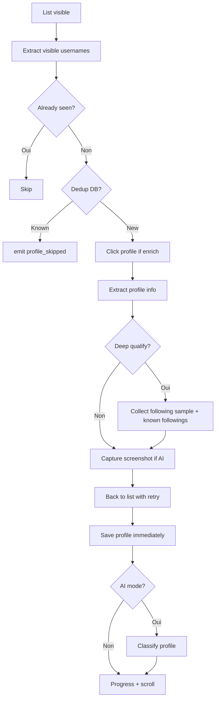
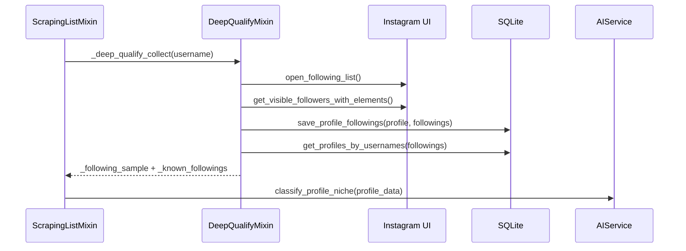

# Scraping Instagram

Cette page documente les sous-packages de scraping du module Instagram :

- `workflows/scraping/`
- `workflows/post_scraping/`

Ces workflows extraient des profils, commentaires et donnees d'engagement sans passer par les workflows d'interaction classiques (`FollowerBusiness`, `HashtagBusiness`, etc.).

> Note 2026-05-24 : l'ancien workflow `workflows/discovery/` et son `discovery_bridge` ont ete supprimes. La strategie produit converge vers scraping cible + Deep Qualify + qualification IA + Taktik Agent.

## Vue d'ensemble

| Workflow | Emplacement | Objectif |
|---|---|---|
| Scraping generique | `workflows/scraping/` | Scraper des profils depuis targets, hashtags ou posts |
| Post scraping | `workflows/post_scraping/` | Scraper un post precis : stats, likers, commentaires, profils enrichis |

## `workflows/scraping/`

`ScrapingWorkflow` est l'orchestrateur principal pour l'extraction de profils.

Structure :

```text
scraping/
+-- scraping_workflow.py      # Orchestrateur
+-- list_scraping.py          # Moteur de scraping de listes
+-- list_strategy.py          # Strategy Pattern followers/likers/commenters
+-- post_scraping_helpers.py  # Helpers posts, reels, likers/commenters
+-- deep_qualify.py           # Following sample + cross-reference DB
+-- persistence.py            # SQLite, CSV, sessions, stats
```

### Initialisation

`ScrapingWorkflow.__init__()` recoit un `DeviceManager` et une config normalisee par `scraping_bridge`.

Il initialise :

| Attribut | Role |
|---|---|
| `nav_actions` | Navigation profiles, hashtags, post URLs |
| `detection_actions` | Detection listes, loading, suggestions |
| `scroll_actions` | Scroll listes et vues |
| `profile_manager` | Extraction enrichie de profil |
| `ui_extractors` | Extraction likes, usernames, compteurs |
| `_ai_service` | Client OpenRouter si `ai_mode` et `openrouter_api_key` sont actifs |
| `scraped_profiles` | Resultats en memoire avant export/persistence |

## Modes de scraping

### Target

Scrape les followers, following ou profils engages sur le premier post d'un ou plusieurs targets.

```json
{
  "type": "target",
  "target_usernames": ["brand_a", "brand_b"],
  "scrape_type": "followers",
  "max_profiles": 500,
  "enrich_profiles": true,
  "save_to_db": true,
  "export_csv": true
}
```

Valeurs utiles de `scrape_type` :

| Valeur | Effet |
|---|---|
| `followers` | Ouvre la liste followers du target |
| `following` | Ouvre la liste following du target |
| `posts` | Ouvre le premier post et scrape likers/commenters selon config |

### Hashtag

Scrape des profils depuis les posts d'un hashtag.

```json
{
  "type": "hashtag",
  "hashtags": ["fitness", "running"],
  "max_profiles": 300,
  "max_posts": 50,
  "scrape_likers": true,
  "scrape_commenters": false,
  "enrich_profiles": true
}
```

Flux :

1. naviguer vers le hashtag ;
2. ouvrir un post non encore traite ;
3. recuperer l'URL du post pour la dedup ;
4. scraper les likers si `scrape_likers` ;
5. scraper les commenters si `scrape_commenters` ;
6. revenir a la grille et passer au post suivant.

### Post URL

Scrape un ou plusieurs posts directs.

```json
{
  "type": "post_url",
  "post_urls": ["https://www.instagram.com/p/ABC123/"],
  "scrape_likers": true,
  "scrape_commenters": true,
  "max_profiles": 200,
  "enrich_profiles": true
}
```

Pour les likers, le workflow distingue les posts classiques et les Reels. Pour les commenters, il reutilise la strategie commenters de `_scrape_list()`.

## Moteur `_scrape_list()`

`ScrapingListMixin._scrape_list()` est le moteur commun pour followers, following, likers et commenters.



Responsabilites du moteur :

| Fonction | Detail |
|---|---|
| Dedup runtime | `seen_usernames` evite les doublons pendant la session |
| Dedup DB | `rescrape_after_days` controle le skip des profils deja connus |
| Enrichissement | Visite profil + `ProfileBusiness.get_complete_profile_info(enrich=True)` |
| Recovery | Back retry jusqu'a retrouver la liste cible |
| Scroll end | `ScrollEndDetector`, suggestions, loading spinner, footer "And X others" |
| Persistence | Sauvegarde immediate + lien session/profil |
| AI | Screenshot profile + classification OpenRouter |

## Strategy Pattern

`ListScrapingStrategy` encapsule les differences UI entre listes.

| Callable | Role |
|---|---|
| `get_visible()` | Retourne les profils visibles sous forme `{username, element}` |
| `is_on_list()` | Confirme que le bot est revenu sur la bonne liste |
| `scroll_down()` | Scroll d'une page |
| `check_load_more()` | Clique "See more" si present |
| `is_end_reached()` | Detecte un footer de fin de liste |
| `is_loading()` | Detecte un spinner |
| `is_in_suggestions()` | Detecte la section suggestions |

Strategies concretes :

| Strategie | Factory | Sources |
|---|---|---|
| Followers-style | `make_followers_strategy()` | followers, following, likers |
| Commenters | `make_commenters_strategy()` | popup commentaires |

### Commenters

Les usernames des commenters sont extraits par scan des `android.widget.Button`.

Discriminateur actuel :

- bouton username : `content-desc == ""`
- bouton action (`Reply`, `Like`, `Follow`, `Translate`, etc.) : `content-desc` non vide
- validation username : `^[a-zA-Z0-9._]{1,30}$`
- blacklist des libelles d'action en anglais/francais

Cette strategie permet de cliquer le username, enrichir le profil, puis revenir a la popup commentaires avec le meme moteur que les likers.

## Dedup et rescrape

`rescrape_after_days` controle la politique de re-scraping.

| Valeur | Comportement |
|---|---|
| absent / `None` | Skip tous les profils deja connus en DB |
| `0` | Dedup DB desactive, toujours re-scraper |
| `N > 0` | Skip seulement les profils crees il y a moins de `N` jours |

En mode IA, `ai_rescrape_mode` affine le comportement :

| Valeur | Effet |
|---|---|
| `full` | Refaire screenshot + IA meme si le profil existait |
| `stats_only` | Mettre a jour les stats mais eviter l'appel IA pour les profils preexistants |

## Deep qualify

`DeepQualifyMixin` enrichit le contexte IA quand `deep_qualify=True` et `enrich_profiles=True`.

Pipeline :

1. le bot est deja sur la page du profil ;
2. il verifie la presence de `profile_header_container` ;
3. il ouvre la liste following ;
4. il collecte jusqu'a `deep_qualify_max_following` usernames ;
5. il revient au profil ;
6. il persiste les relations dans `profile_following` via `save_profile_followings()` ;
7. si le mode AI est actif, il classe les usernames pas encore classfies via `_classify_new_followings()` — appel LLM texte (claude haiku), resultat stocke dans les colonnes `niche_category`, `niche`, `gender`, `classified_at` ;
8. il cherche ces usernames en batch dans SQLite ;
9. il ajoute deux champs techniques au profil :
   - `_following_sample`
   - `_known_followings`

Exemple de contexte ajoute :

```json
{
  "_following_sample": ["creator_a", "studio_b", "coach_c"],
  "_known_followings": [
    {
      "username": "studio_b",
      "niche_category": "art_creativity",
      "niche": "Videography & Cinematography",
      "cities": "Paris",
      "profession": "Director",
      "tags": ["short film", "editing"]
    }
  ]
}
```

Ce contexte est transmis a `AIService.classify_profile_niche()` pour aider le modele a inferer centres d'interet, reseau professionnel, localisation et communaute.

### Graphe social `profile_following`

Depuis la nouvelle version Deep qualify, le sampling following n'est plus seulement un contexte temporaire pour l'IA : il alimente aussi la table SQLite `profile_following`.



| Donnee | Destination | Utilisation |
|---|---|---|
| Followings visibles | `profile_following.following_username` | Construire le graphe social local. |
| Profil source | `profile_following.profile_username` + `profile_id` si connu | Relier la relation au profil scrape. |
| Session scraping | `profile_following.session_id` | Tracer la session qui a decouvert la relation. |
| Comptes deja connus | `_known_followings` | Ajouter niche, profession, ville et tags au prompt IA. |

`profile_following` est ensuite relu cote Electron par Target Search / fiche detaillee pour afficher le graph following et naviguer vers les profils connus.

## AI qualification

L'IA est activee par la config du bridge :

```json
{
  "ai": {
    "enabled": true,
    "profileAnalysis": true,
    "niche": "fitness",
    "qualificationPrompt": "",
    "openrouterApiKey": "sk-or-...",
    "visionModel": "google/gemini-2.5-flash"
  },
  "aiRescrapeMode": "full"
}
```

Deux chemins existent dans `_qualify_profile_ai()` :

| Chemin | Condition | Methode |
|---|---|---|
| Vision | Screenshot disponible | `AIService.classify_profile_niche()` |
| Texte fallback | Pas de screenshot + `ai_qualification_prompt` | `AIService.text_completion()` |

Le mode vision retourne une classification de niche, un resume, des villes, une profession et des tags. Le mode texte retourne un score de qualification `0-10`, un bool `qualified` et une raison.

Evenements IPC emis par `AIService` :

| Evenement | Moment |
|---|---|
| `ai_profile_analyzing` | Debut analyse profil |
| `ai_profile_analyzed` | Classification terminee |
| `ai_error` | Erreur OpenRouter ou parsing |

## Persistence

`ScrapingPersistenceMixin` gere SQLite, CSV et sessions.

| Methode | Role |
|---|---|
| `_create_scraping_session()` | Cree une session scraping locale |
| `_save_profile_immediately()` | Sauvegarde chaque profil des sa capture |
| `_update_scraped_profile_ai()` | Sauvegarde qualification/analyse IA dans la table de jonction |
| `_save_followings_to_db()` | Sauvegarde les edges Deep qualify dans `profile_following` |
| `_save_to_database()` | Passe finale pour sauver les profils manques |
| `_export_to_csv()` | Export dans `exports/scraping_<type>_<timestamp>.csv` |
| `_complete_scraping_session()` | Cloture la session avec total, CSV et erreur eventuelle |
| `_display_final_stats()` | Resume console par source |

Donnees profile persistantes :

| Champ | Source |
|---|---|
| `username` | Liste visible |
| `followers_count`, `following_count`, `posts_count` | Enrichissement profil |
| `is_private`, `is_verified`, `is_business` | Enrichissement profil |
| `biography`, `full_name`, `business_category`, `website` | Enrichissement profil |
| `linked_accounts` | JSON serialise |
| `account_based_in`, `date_joined` | Enrichissement avance |
| `source_type`, `source_name`, `source_post_url` | Contexte scraping/session |

Donnees graphe social persistantes :

| Champ | Source |
|---|---|
| `profile_username` | Profil actuellement enrichi par Deep qualify |
| `profile_id` | `get_or_create_profile()` si le profil source existe/est cree |
| `following_username` | Liste following visible collectee rapidement |
| `following_id` | Backfill ou resolution immediate si le compte suivi est connu |
| `session_id` | `_scraping_id` de la session en cours |
| `discovered_at` | Timestamp SQLite |

## `workflows/post_scraping/`

`PostScrapingWorkflow` analyse un post precis, plus profondement que le mode `post_url` du scraping generique.

Structure :

```text
post_scraping/
+-- post_scraping_workflow.py  # Orchestrateur
+-- engagement_scraping.py     # Likers, comments, replies, sort
+-- post_persistence.py        # Enrichment, DB save, summary
+-- post_scraping_models.py    # PostStats, CommentData, ScrapedProfile
+-- SELECTORS.md               # Notes de selecteurs dediees au post scraping
```

Pipeline :

1. naviguer vers `post_url` ;
2. extraire `PostStats` : auteur, likes, comments, shares, saves, caption ;
3. scraper les likers si `scrape_likers` ;
4. scraper les comments/replies si `scrape_comments` ;
5. enrichir les profils si `enrich_profiles` ;
6. sauvegarder en SQLite ;
7. afficher le resume.

Config :

```json
{
  "post_url": "https://www.instagram.com/p/ABC123/",
  "scrape_likers": true,
  "scrape_comments": true,
  "max_likers": 50,
  "max_comments": 100,
  "enrich_profiles": true,
  "max_profiles_to_enrich": 30,
  "comment_sort": "most_recent"
}
```

## Bridge associe

`bridges/instagram/scraping/scraping.py` (`scraping_bridge`) recoit la config Electron en camelCase et construit la config snake_case de `ScrapingWorkflow`.

Mapping important :

| Electron | Python |
|---|---|
| `sessionDurationMinutes` | `session_duration_minutes` |
| `maxProfiles` | `max_profiles` |
| `exportCsv` | `export_csv` |
| `saveToDb` | `save_to_db` |
| `enrichProfiles` | `enrich_profiles` |
| `rescrapeAfterDays` | `rescrape_after_days` |
| `deepQualify` | `deep_qualify` |
| `deepQualifyMaxFollowing` | `deep_qualify_max_following` |
| `targetUsernames` | `target_usernames` |
| `scrapeType` | `scrape_type` |
| `scrapeHashtagLikers` | `scrape_likers` |
| `scrapeHashtagCommenters` | `scrape_commenters` |
| `postUrls` | `post_urls` |
| `scrapePostUrlLikers` | `scrape_likers` |
| `scrapePostUrlCommenters` | `scrape_commenters` |
| `ai.openrouterApiKey` | `openrouter_api_key` |
| `ai.visionModel` | `vision_model` |
| `aiRescrapeMode` | `ai_rescrape_mode` |

## Points d'attention

- `enrich_profiles=True` ralentit fortement le scraping, car chaque profil est ouvert.
- `deep_qualify=True` ne fonctionne utilement que si `enrich_profiles=True`.
- `deep_qualify=True` alimente `profile_following`; verifier la doc DB si le schema evolue.
- Les screenshots IA sont supprimes apres classification.
- Les commenters n'ont pas de section suggestions ; leur strategy desactive ces heuristiques.
- La dedup par post utilise `source_post_url` pour eviter de retraiter le meme post lors des runs suivants.
- L'ancien `DiscoveryWorkflowV2` a ete retire ; ne plus ajouter de dependance au `discovery_bridge`.
