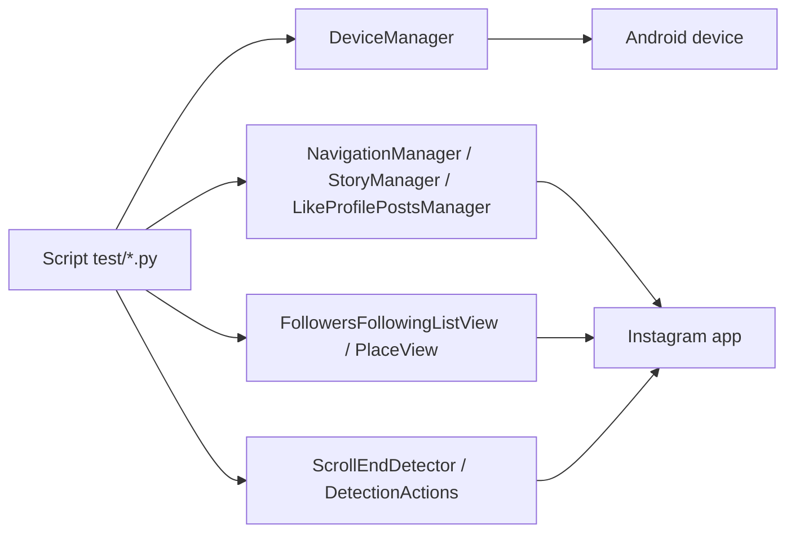
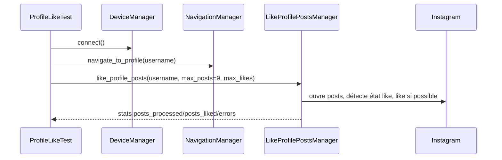

# Tests Instagram `[Bot]`

Cette page documente les scripts de test locaux sous `bot/taktik/core/social_media/instagram/test/`.

Ces scripts ne sont pas des tests unitaires isolés : ce sont des tests d'intégration manuels/assistés qui pilotent un vrai device Android via ADB/uiautomator2 et Instagram installé.

## Arborescence

```text
bot/taktik/core/social_media/instagram/test/
├── README.md
├── story/
│   ├── test_story_viewer.py
│   └── test_story_count_detection.py
├── like/
│   └── test_profile_likes.py
├── follow/
│   └── test_profile_follow.py
└── navigation/
    ├── followers/test_navigate_to_followers.py
    ├── following/test_navigate_to_following.py
    └── place/
        ├── test_navigate_to_place.py
        └── test_place_post_likes.py
```

## Pré-requis

| Pré-requis | Détail |
|---|---|
| Device Android | Connecté via ADB ou émulateur. |
| Instagram | Installé, ouvert au moins une fois, compte connecté. |
| ADB/uiautomator2 | Fonctionnels sur le device cible. |
| Projet Python | Dépendances installées, lancement depuis `bot/` recommandé. |
| Etat UI | Certains tests supposent qu'Instagram peut être navigué sans popup bloquante. |

## Vue D'ensemble



Les scripts ajoutent eux-mêmes le root du projet dans `sys.path` via `Path(__file__).resolve().parents[...]`. Ils peuvent donc être lancés directement, mais le lancement depuis le dossier `bot/` reste le plus stable.

## Scripts

### Stories

| Script | Commande | Rôle |
|---|---|---|
| `story/test_story_viewer.py` | `python taktik/core/social_media/instagram/test/story/test_story_viewer.py <profile>` | Navigue vers un profil, détecte les stories, lance le visionnage avec probabilité forcée à 100%. |
| `story/test_story_count_detection.py` | `python -m taktik.core.social_media.instagram.test.story.test_story_count_detection --device <deviceId>` | Test assisté : l'utilisateur ouvre une story, le script capture screenshot/dump UI et teste `DetectionActions.get_story_count_from_viewer()`. |

`test_story_viewer.py` utilise :

| Composant | Rôle |
|---|---|
| `DeviceManager` | Connexion device. |
| `NavigationManager` | Navigation vers le profil. |
| `StoryManager` | Détection et visionnage stories. |

`test_story_count_detection.py` écrit des artefacts de debug dans `debug_ui/story_test/`.

### Likes Profil

| Script | Commande | Rôle |
|---|---|---|
| `like/test_profile_likes.py` | `python taktik/core/social_media/instagram/test/like/test_profile_likes.py <username> [max_likes]` | Navigue vers un profil et lance `LikeProfilePostsManager.like_profile_posts()`. |

Flux :



Le test crée un `MockAutomation` minimal pour fournir `nav_actions` au manager de likes.

### Follow Profil

| Script | Commande | Rôle |
|---|---|---|
| `follow/test_profile_follow.py` | `python taktik/core/social_media/instagram/test/follow/test_profile_follow.py <username>` | Navigue vers un profil, vérifie s'il est déjà suivi, tente le follow. |

Composants :

| Composant | Rôle |
|---|---|
| `NavigationManager` | Deep link / navigation profil. |
| `FollowerInteractionManager` | Logique de follow. |
| Selecteurs locaux | Vérification `Following`, `Suivi`, etc. |

Le script manipule un vrai profil : il faut choisir un compte de test ou un profil où le follow est acceptable.

### Navigation Followers

| Script | Commande | Rôle |
|---|---|---|
| `navigation/followers/test_navigate_to_followers.py` | `python taktik/core/social_media/instagram/test/navigation/followers/test_navigate_to_followers.py <username> [max_followers_to_check]` | Navigue vers un profil, ouvre la liste followers, teste pagination/scroll et extraction. |

Composants :

| Composant | Rôle |
|---|---|
| `NavigationManager` | Profil puis liste followers. |
| `FollowersFollowingListView` | Lecture des lignes visibles et scroll. |
| `ScrollEndDetector` | Détection bouton “Voir plus” et fin de liste. |
| `SessionManager` | Config de session courte pour contexte test. |

### Navigation Following

| Script | Commande | Rôle |
|---|---|---|
| `navigation/following/test_navigate_to_following.py` | `python taktik/core/social_media/instagram/test/navigation/following/test_navigate_to_following.py <username> [max_following_to_check]` | Même logique que followers, mais pour les abonnements/following. |

Le script vérifie explicitement la page following via des selectors texte/resource-id avant de continuer.

### Navigation Place

| Script | Commande | Rôle |
|---|---|---|
| `navigation/place/test_navigate_to_place.py` | `python taktik/core/social_media/instagram/test/navigation/place/test_navigate_to_place.py "<place_name>" [max_posts]` | Recherche un lieu, ouvre l'onglet Places, sélectionne un lieu, navigue dans les posts Top/Recent. |
| `navigation/place/test_place_post_likes.py` | `python taktik/core/social_media/instagram/test/navigation/place/test_place_post_likes.py "<place_name>" [max_interactions]` | Ouvre un lieu, collecte des posts, ouvre un post, ouvre la liste des likes et interagit avec les likers. |

`test_navigate_to_place.py` couvre :

1. navigation vers Search ;
2. recherche du lieu ;
3. clic suggestion ;
4. onglet Places ;
5. premier résultat ;
6. Top posts ;
7. Recent posts ;
8. détection/itération de posts.

`test_place_post_likes.py` va plus loin et utilise `LikeProfilePostsManager` avec un mock automation.

## Configuration De Test

Les scripts créent des configs minimales en dur :

| Champ | Exemple |
|---|---|
| `session_duration_minutes` | 10, 30 ou 60 selon le test. |
| `max_likes` | 10 ou `max_interactions`. |
| `max_follows` | 5. |
| `max_stories_to_watch` | 10. |
| `min_watch_time` / `max_watch_time` | 2 à 8 secondes. |

Ces valeurs ne doivent pas être confondues avec les limites de production. Elles servent à borner les scripts pour éviter les boucles longues.

## Logs Et Artefacts

| Élément | Description |
|---|---|
| Marqueur `[TEST]` | Présent dans les logs métier pour distinguer le test. |
| `loguru` | Plusieurs scripts configurent stdout avec niveau `DEBUG`. |
| Screenshot/dump UI | `test_story_count_detection.py` écrit dans `debug_ui/story_test/`. |
| Résumé final | La plupart des scripts affichent succès/échec à la fin. |

## Relation Avec Les Modules Documentés

| Test | Modules exercés |
|---|---|
| Stories | [Actions Business](business-actions.md), [UI](selectors.md) |
| Likes profil | [Infrastructure & Actions Atomiques](atomic-actions.md), [Actions Business](business-actions.md) |
| Follow profil | [Actions Business](business-actions.md), [Filtrage](filtering.md) selon contexte |
| Followers/following | [Scraping & qualification](scraping-workflows.md), [UI](selectors.md) |
| Places | [Workflows haut niveau](workflows.md), [UI](selectors.md) |

## Points De Vigilance

| Sujet | Détail |
|---|---|
| Effets réels | Les tests peuvent liker/follow/interagir sur un vrai compte Instagram. |
| Imports historiques | Certains scripts importent d'anciens chemins (`core.session_manager`, `actions.core.device`) ; ils servent de tests de compatibilité autant que de smoke tests. |
| Etat du compte | Les popups, challenge login, version APK ou langue peuvent changer le résultat. |
| Données SQLite | Certains scripts importent `db_service`, mais l'objectif principal reste le test UI/device. |
| Non CI | Ces scripts ne sont pas faits pour tourner en CI sans device Android instrumenté. |
