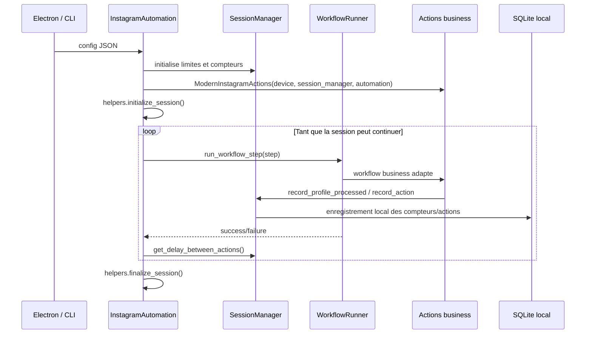

# Workflows Instagram haut niveau

Cette page documente le package `bot/taktik/core/social_media/instagram/workflows/`.

Il ne faut pas le confondre avec `actions/business/workflows/` :

| Couche | Emplacement | Role |
|---|---|---|
| Actions business | `actions/business/workflows/` | Workflows d'interaction reutilisables par `ModernInstagramActions` : followers, hashtag, feed, notifications, unfollow, messaging |
| Workflows haut niveau | `workflows/` | Orchestration CLI/bridge : session globale, execution de steps, scraping, publication, DM outreach/auto-reply |

Le package `workflows/` est donc la couche qui connecte la configuration recue depuis Electron/CLI aux actions Instagram, a la base locale, aux messages IPC et aux limites de session.

## Arborescence

```text
workflows/
+-- core/
|   +-- automation.py          # InstagramAutomation
|   +-- workflow_runner.py     # Dispatch des steps de config
+-- management/
|   +-- config/config.py       # WorkflowConfigBuilder, ActionProbabilities, FilterCriteria
|   +-- session/session.py     # SessionManager runtime
|   +-- login/login_workflow.py
|   +-- logout/logout_workflow.py
|   +-- signup/signup_workflow.py
|   +-- content/               # Publication post/story/reel
|   +-- dm/                    # Outreach DM et auto-reply LLM
+-- scraping/                  # Scraping profils depuis targets/hashtags/posts + qualification
+-- post_scraping/             # Scraping complet d'un post precis
+-- cold_dm/                   # Ancien workflow cold DM standalone
+-- common/                    # Detection/navigation/session helpers purs
+-- helpers/                   # Helpers lies a InstagramAutomation
```

## Flux principal



## `core/`

### `InstagramAutomation`

`InstagramAutomation` est l'orchestrateur de session interactive.

Responsabilites principales :

| Zone | Detail |
|---|---|
| Device | Recoit un `device_manager`, expose `self.device` |
| Session | Cree `SessionManager(config)`, met a jour la config avec `update_session_manager_config()` |
| Actions | Instancie `ModernInstagramActions` puis expose les facades utiles (`profile_business`, `like_business`, `follower_business`, etc.) |
| Stats | Maintient `likes`, `follows`, `unfollows`, `comments`, `interactions`, `skipped`, `stories_viewed`, `stories_liked` |
| Compte actif | Detecte le profil courant via `get_profile_info(..., save_to_db=True)` et cree/recupere l'account local |
| Execution | Lit `config.steps` ou `config.actions`, puis delegue chaque step a `WorkflowRunner` |
| Finalisation | Cree, met a jour et finalise les sessions via `WorkflowHelpers` |

Methodes clefs :

| Methode | Role |
|---|---|
| `load_config(config_path)` | Charge un JSON et propage la config au `SessionManager` |
| `run_workflow()` | Boucle principale de session |
| `interact_with_followers(...)` | Point d'entree followers/following, avec mode direct par defaut |
| `like_profile_posts(...)` | Facade vers `LikeBusiness.like_profile_posts()` |
| `get_profile_info(...)` | Extraction profil + resolution de l'account local actif |
| `_create_workflow_session()` / `_update_workflow_session()` | Delegation aux helpers de persistance |

### `WorkflowRunner`

`WorkflowRunner` transforme un step de config en appel concret.

Types de steps supportes :

| `type` | Handler | Implementation appelee |
|---|---|---|
| `initialize` | inline | No-op de demarrage |
| `interact_with_followers` | `_run_target_workflow()` | `automation.interact_with_followers()` |
| `hashtag` | `_run_hashtag_workflow()` | `actions.hashtag_business.interact_with_hashtag_likers()` |
| `post_url` | `_run_post_url_workflow()` | `actions.post_url_business.interact_with_post_likers()` |
| `place` | `_run_place_workflow_handler()` | Navigation lieu + likers via `UIHelpers` |
| `notifications` | `_run_notifications_workflow()` | `NotificationsBusiness.interact_with_notifications()` |
| `unfollow` | `_run_unfollow_workflow()` | Sync following + scrape non-followers + unfollow |
| `sync_following` | `_run_sync_following_workflow()` | Sync following + non-followers, IPC `sync_complete` |
| `sync_followers_following` | `_run_sync_followers_following_workflow()` | Sync following puis followers, IPC `sync_step` |
| `scrape_non_followers` | `_run_scrape_non_followers_workflow()` | Scraping autonome non-followers |
| `feed` | `_run_feed_workflow()` | `FeedBusiness.interact_with_feed()` |

Les handlers construisent une config normalisee, appellent la couche business, puis agregent les compteurs dans `automation.stats`.

## `management/`

### Configuration

`WorkflowConfigBuilder` centralise la transformation des steps de config en dictionnaires compatibles avec les workflows business.

| Classe | Champs / role |
|---|---|
| `ActionProbabilities` | Convertit `like_percentage`, `follow_percentage`, `comment_percentage`, `story_percentage` en probabilites `0.0-1.0` |
| `FilterCriteria` | Normalise `min_followers`, `max_followers`, `min_posts`, `max_following`, `allow_private`, `max_followers_following_ratio` |
| `WorkflowConfigBuilder` | Produit les configs `build_interaction_config()`, `build_hashtag_config()`, `build_post_url_config()`, `build_place_config()` |

Exemple de step :

```json
{
  "type": "interact_with_followers",
  "target_usernames": ["brand_a", "brand_b"],
  "max_interactions": 40,
  "probabilities": {
    "like_percentage": 70,
    "follow_percentage": 15,
    "comment_percentage": 5,
    "story_percentage": 10
  },
  "min_followers": 100,
  "max_followers": 20000,
  "comment_settings": {
    "custom_comments": ["Super contenu", "Tres inspirant"]
  }
}
```

### Session runtime

`management/session/session.py` contient le `SessionManager` utilise par `InstagramAutomation`.

Il gere :

| Fonction | Detail |
|---|---|
| Limites temporelles | `session_settings.session_duration_minutes` |
| Limites globales | `total_profiles_limit`, `total_follows_limit`, `total_likes_limit` |
| Compteurs | `profiles_processed`, `likes`, `follows`, `comments`, `stories_watched` |
| Phases | `start_scraping_phase()`, `end_scraping_phase()`, `start_interaction_phase()` |
| Delais | `delay_between_actions.min/max` |
| Limites locales | `SessionManager.should_continue()` applique les limites de durée/profils/actions configurées dans la session |

> Note : il existe aussi `auth/session/session_manager.py`, dedie aux sessions de login sauvegardees. Les deux classes s'appellent `SessionManager`, mais elles n'ont pas le meme role.

### Login, logout, signup

Les wrappers `LoginWorkflow`, `LogoutWorkflow` et `SignupWorkflow` orchestrent les managers du package `auth/`.

`LoginWorkflow.execute()` gere notamment :

1. plusieurs tentatives (`max_retries`) ;
2. l'utilisation optionnelle d'une session sauvegardee ;
3. la sauvegarde de session apres succes ;
4. l'arret immediat sur 2FA, credentials invalides ou suspicious login.

### Content

`ContentWorkflow` publie du contenu depuis un fichier local pousse sur le device.

Methodes publiques :

| Methode | Role |
|---|---|
| `post_single_photo(image_path, caption, location, hashtags)` | Cree et publie un post photo |
| `post_reel(video_path, caption, hashtags)` | Cree et publie un Reel |
| `post_story(image_path, duration)` | Cree et publie une Story |
| `post_multiple_photos(image_paths, captions, delay_between_posts)` | Publication sequentielle avec delai |

Les interactions UI concretes sont dans `content_ui_helpers.py` : ouverture creation, choix type post/reel/story, push media, galerie, caption, location, publish.

### DM management

Deux workflows modernes vivent dans `management/dm/`.

| Workflow | Fichiers | Role |
|---|---|---|
| `DMOutreachWorkflow` | `outreach_workflow.py`, `outreach_actions.py`, `outreach_models.py` | Envoi massif de DM avec templates, variants A/B, follow optionnel, skip conversations existantes |
| `DMAutoReplyWorkflow` | `auto_reply_workflow.py`, `dm_navigation.py`, `llm_integration.py`, `reply_actions.py`, `auto_reply_models.py` | Lecture inbox, filtrage, generation LLM via OpenRouter, reponse avec delai humain |

`DMAutoReplyWorkflow` expose une version `run_async()` et une facade synchrone `run()` qui utilise `asyncio.run()`.

## `scraping/`

`ScrapingWorkflow` extrait des profils sans interaction sociale.

Modes supportes :

| `config.type` | Source | Details |
|---|---|---|
| `target` | Followers/following d'un ou plusieurs comptes | `target_usernames`, `scrape_type: followers/following/posts` |
| `hashtag` | Posts d'un hashtag | Scrape auteurs, likers et/ou commenters selon config |
| `post_url` | Post precis | Scrape likers/commenters du post |

Structure interne :

| Fichier | Role |
|---|---|
| `scraping_workflow.py` | Orchestrateur, creation session, routing par type |
| `list_strategy.py` | Strategy Pattern pour listes followers/likers/commenters |
| `list_scraping.py` | Moteur `_scrape_list()` : dedup, scroll, enrichissement on-the-fly |
| `post_scraping_helpers.py` | Ouverture posts, detection reels, extraction likers/commenters |
| `deep_qualify.py` | Qualification approfondie/AI quand activee |
| `persistence.py` | Export CSV, sauvegarde DB, sessions, stats |

Options importantes :

| Option | Role |
|---|---|
| `max_profiles` | Limite totale demandee |
| `session_duration_minutes` | Limite temporelle |
| `enrich_profiles` | Visite chaque profil pour completer bio/category/stats |
| `ai_mode` + `openrouter_api_key` | Active qualification IA avec screenshots/vision si disponible |
| `export_csv` | Exporte les resultats en CSV |
| `save_to_db` | Persiste les profils dans SQLite local |

## `post_scraping/`

`PostScrapingWorkflow` se concentre sur un post Instagram precis.

Pipeline :

1. `navigate_to_post_url(post_url)` ;
2. extraction des stats (`PostStats`) : auteur, likes, comments, shares, saves, caption ;
3. scraping optionnel des likers ;
4. scraping optionnel des commentaires et reponses ;
5. enrichissement optionnel des profils ;
6. sauvegarde en SQLite local ;
7. resume final.

Dataclasses :

| Dataclass | Role |
|---|---|
| `PostStats` | Metadonnees et compteurs du post |
| `CommentData` | Commentaire, auteur, reponses, horodatage |
| `ScrapedProfile` | Profil extrait/enrichi depuis les engagements |

Config principale :

```json
{
  "post_url": "https://www.instagram.com/p/ABC123/",
  "scrape_likers": true,
  "scrape_comments": true,
  "max_likers": 50,
  "max_comments": 100,
  "enrich_profiles": true,
  "max_profiles_to_enrich": 30,
  "comment_sort": "most_recent"
}
```

## Prospection avancee

L'ancien package `workflows/discovery/`, `DiscoveryWorkflowV2` et
`discovery_bridge.py` ne sont plus presents dans le code. Ne pas les recreer.

La prospection avancee passe maintenant par :

| Besoin | Chemin actuel |
|---|---|
| Scraper targets, hashtags, likers/commenters | `workflows/scraping/` |
| Scraper un post en profondeur | `workflows/post_scraping/` |
| Qualifier et scorer les profils scrapes | `deep_qualify.py`, `ScrapedProfileRepository`, `ScrapingQualificationService` |

## `cold_dm/`

`ColdDMWorkflow` est un workflow standalone plus ancien pour envoyer des DM depuis une liste de recipients.

Il supporte :

| Option | Role |
|---|---|
| `recipients` | Liste des usernames |
| `message_mode` | `manual` ou `ai` |
| `messages` | Templates manuels choisis aleatoirement |
| `ai_prompt` | Prompt utilise en mode `ai` par ce workflow legacy ; le message reste un placeholder local dans `cold_dm_workflow.py`. |
| `max_dms` | Limite de messages |
| `delay_min` / `delay_max` | Delai entre DMs |
| `skip_private` / `skip_verified` | Filtres avant envoi |

Pour les nouveaux cas d'usage d'outreach, preferer le bridge actif
`bridges/instagram/engagement/runtime/cold_dm/` ou
`management/dm/DMOutreachWorkflow`, plus structures et plus complets. Le bridge
runtime utilise `bridges/instagram/engagement/runtime/cold_dm/ai.py` pour
generer les messages via OpenRouter quand `messageMode` vaut `ai` et qu'une cle
OpenRouter est fournie.

## `common/` et `helpers/`

### `common/`

Fonctions pures ou quasi-pures partagees par les workflows autonomes :

| Fichier | Fonctions |
|---|---|
| `detection.py` | `is_reel_post()`, `is_in_post_view()`, `is_likers_popup_open()`, `is_comments_view_open()` |
| `post_navigation.py` | `open_first_post_of_profile()`, `open_likers_list()`, `get_post_url_from_share()` |
| `session.py` | `should_continue_session(start_time, session_duration_minutes)` |

### `helpers/`

Helpers attaches a `InstagramAutomation` :

| Classe | Role |
|---|---|
| `WorkflowHelpers` | Signal handlers, init/finalisation session, creation/update session DB, affichage stats |
| `UIHelpers` | Operations UI utilisees par certains handlers legacy/place : detection post/reel, likes popup, scroll, interaction likers |

## Points d'attention

- `WorkflowRunner` couvre des steps interactifs et quelques workflows one-shot (`sync_following`, `sync_followers_following`, `scrape_non_followers`) qui emettent directement des messages JSON IPC sur stdout.
- `SessionManager.record_action()` met maintenant uniquement a jour les compteurs locaux de session. Il n'appelle plus `record_action_usage()` et ne consomme plus de quota distant.
- Plusieurs modules ont ete refactores en mixins avec re-export des dataclasses pour conserver la retrocompatibilite des imports.
- Les workflows de scraping n'utilisent pas tous `InstagramAutomation`; certains instancient directement `DeviceManager`, `NavigationActions`, `ScrollActions`, `ProfileBusiness` et `InstagramUIExtractors`.
- Les noms `workflow` recouvrent deux niveaux : orchestration applicative dans `workflows/`, logique metier reutilisable dans `actions/business/workflows/`.
