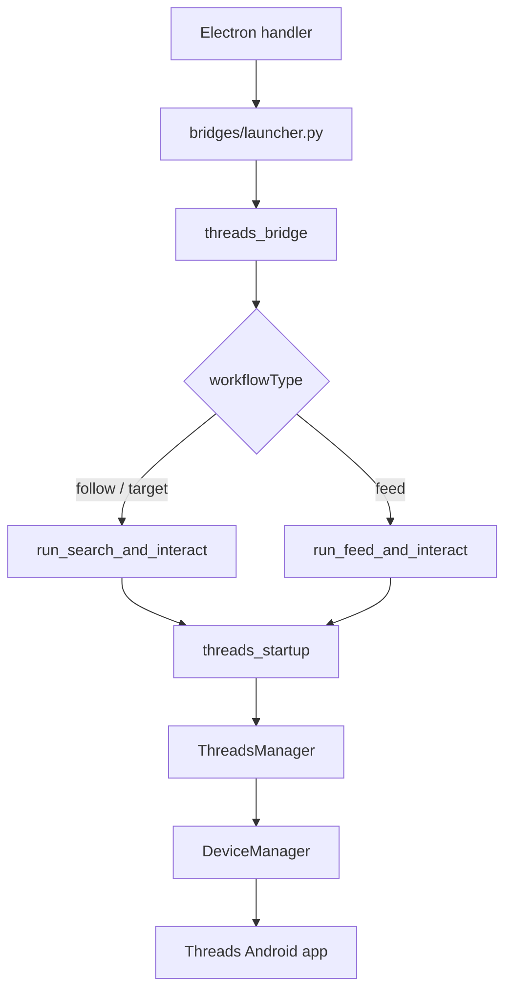
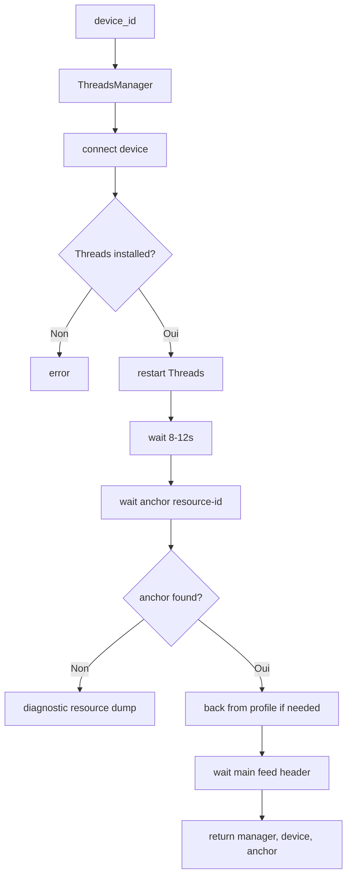
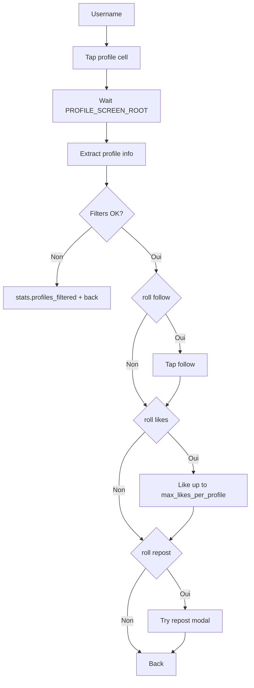

# Module Threads

Le module Threads automatise l'application Meta Threads (`com.instagram.barcelona`).

Il est volontairement plus compact que le module Instagram : pas encore de couche `actions/atomic/` complete, mais un manager, une couche UI centralisee, deux workflows MVP et un bridge dedie.

## Position dans l'application



## Arborescence

```text
taktik/core/social_media/threads/
+-- __init__.py
+-- core/
|   +-- manager.py              # ThreadsManager
+-- ui/
|   +-- __init__.py             # Constantes resource-id et textes localises
+-- workflows/
    +-- __init__.py             # Exports publics
    +-- _common.py              # threads_startup()
    +-- search_and_interact.py  # Recherche + interaction profils
    +-- feed_and_interact.py    # Feed + interaction auteurs
```

Bridge associe :

```text
bridges/threads/
+-- base.py            # ThreadsBridgeBase + helpers IPC
+-- workflows/dispatcher.py  # threads_bridge dispatcher
```

## Exports publics

`taktik/core/social_media/threads/__init__.py` expose :

| Export | Role |
|---|---|
| `ThreadsManager` | Lifecycle app Threads |
| `THREADS_PACKAGE` | `com.instagram.barcelona` |
| `THREADS_MAIN_ACTIVITY` | Activite principale Threads connue |

`workflows/__init__.py` expose :

| Export | Role |
|---|---|
| `ActionProbabilities` | Probabilites follow/like/repost/comment |
| `ProfileFilters` | Filtres followers + bio include/exclude |
| `InteractStats` | Stats communes aux workflows |
| `SearchInteractConfig` | Config du workflow search |
| `FeedInteractConfig` | Config du workflow feed |
| `run_search_and_interact()` | Recherche puis interactions profils |
| `run_feed_and_interact()` | Feed puis interactions auteurs |

## `ThreadsManager`

`ThreadsManager` herite de `SocialMediaBase` et utilise le `DeviceManager` partage.

| Methode | Role |
|---|---|
| `is_installed()` | Verifie `com.instagram.barcelona` |
| `is_running()` | Compare `device.app_current()["package"]` |
| `launch()` | Lance Threads via `monkey -p com.instagram.barcelona ...` puis fallback `launch_app()` |
| `stop()` | Force stop du package |
| `restart()` | Stop + pause + launch |
| `login()` | Stub non implemente |
| `logout()` | Stub non implemente |

Pourquoi `monkey` est privilegie :

- les builds recents de Threads peuvent rediriger un `am start -n ...BarcelonaMainActivity` vers une activity Play Store / AssetBrowser ;
- `monkey` laisse Android resoudre l'entree launcher exportee correcte ;
- un timeout de 30 secondes evite les blocages sur device lent/offline.

## UI et selecteurs

`threads/ui/__init__.py` centralise les resource-ids et textes localises captures depuis des dumps reels.

Sections principales :

| Section | Exemples |
|---|---|
| Package | `THREADS_PACKAGE`, `THREADS_MAIN_ACTIVITY` |
| Bottom tabs | `TAB_MAIN_FEED`, `TAB_MESSAGING`, `TAB_CREATE`, `TAB_ACTIVITY`, `TAB_PROFILE`, `TABS_BOTTOM_BAR` |
| Search loupe | `FEED_SEARCH_LOUPE_FRACTION` |
| Main feed | `MAIN_FEED_SCREEN`, `MAIN_FEED_MENU_BUTTON`, `FEED_POST_LIKE`, `FEED_POST_REPOST` |
| Search | `SEARCH_BAR`, `SEARCH_TEXT_FIELD`, `TYPEAHEAD_KEYWORD_ROW` |
| SERP | `SERP_MENU_BUTTON`, `SERP_LAZY_COLUMN`, `SERP_LAZY_ROW`, `RELATED_PROFILES_TAB_TEXTS` |
| Profile | `PROFILE_SCREEN_ROOT`, `PROFILE_FULL_NAME`, `PROFILE_FOLLOW_BUTTON`, `PROFILE_BIO_TEXT`, `PROFILE_BIO_FOLLOWER_COUNT` |
| Locale text | `FOLLOW_BUTTON_TEXTS`, `FOLLOWING_BUTTON_TEXTS`, `REPOST_CONFIRM_TEXTS` |

Point important : les builds Threads recents n'exposent pas de tab Search dans la bottom bar. La recherche se fait via une loupe top-right du header `MainFeedScreen`, parfois sans resource-id ni content-desc. Le workflow combine donc :

1. ancien `TAB_SEARCH` si present ;
2. content-desc localises (`Search`, `Rechercher`, etc.) ;
3. detection positionnelle sur la ligne du hamburger ;
4. fallback coordonnees relatives `FEED_SEARCH_LOUPE_FRACTION`.

## Startup commun

`workflows/_common.py::threads_startup()` evite la duplication entre search et feed.



Ancres par defaut :

| Ancre | Ecran |
|---|---|
| `TABS_BOTTOM_BAR` | App prete sur navigation principale |
| `MAIN_FEED_SCREEN` | Feed principal |
| `SEARCH_BAR` | Ecran recherche |
| `PROFILE_SCREEN_ROOT` | Profil |
| `SERP_MENU_BUTTON` | Resultats de recherche |

En cas d'echec, `_diagnose_missing_anchor()` log le package/activity courant et jusqu'a 40 resource-ids visibles.

## Workflow Search & Interact

Entry point : `run_search_and_interact(config, callbacks...)`

Objectif :

1. demarrer Threads ;
2. ouvrir la recherche ;
3. saisir `search_query` ;
4. basculer sur `Related profiles` quand disponible ;
5. parcourir les profils ;
6. ouvrir chaque profil ;
7. extraire bio/followers ;
8. filtrer ;
9. appliquer follow / like / repost selon probabilites ;
10. remonter stats et events via callbacks.

Config :

```json
{
  "device_id": "DEVICE_ID",
  "search_query": "fitness coach",
  "max_profiles": 10,
  "min_delay_seconds": 2.0,
  "max_delay_seconds": 5.0,
  "max_likes_per_profile": 2,
  "actions": {
    "follow": 80,
    "like": 50,
    "repost": 0,
    "comment": 0
  },
  "filters": {
    "min_followers": 0,
    "max_followers": 10000000,
    "bio_keywords_include": [],
    "bio_keywords_exclude": []
  }
}
```

Dataclasses :

| Dataclass | Champs principaux |
|---|---|
| `ActionProbabilities` | `follow`, `like`, `repost`, `comment` en `0-100` |
| `ProfileFilters` | `min_followers`, `max_followers`, `bio_keywords_include`, `bio_keywords_exclude` |
| `SearchInteractConfig` | Device, query, max, delays, likes/profile, actions, filters |
| `InteractStats` | Visits, filtered, private, follows, likes, reposts, replies, errors |

Le champ `comment` est present pour le futur smart-comment Threads, mais le workflow log seulement un hook non cable pour l'instant.

## Workflow Feed & Interact

Entry point : `run_feed_and_interact(config, callbacks...)`

Objectif :

1. demarrer Threads ;
2. assurer l'onglet Home feed ;
3. collecter les usernames auteurs visibles ;
4. ouvrir leur profil ;
5. reutiliser le pipeline `_visit_and_act()` du workflow search ;
6. scroller le feed jusqu'a `max_profiles` ou fin de profils frais.

Config :

```json
{
  "device_id": "DEVICE_ID",
  "max_profiles": 10,
  "min_delay_seconds": 2.0,
  "max_delay_seconds": 5.0,
  "max_likes_per_profile": 2,
  "actions": {
    "follow": 80,
    "like": 50,
    "repost": 0,
    "comment": 0
  },
  "filters": {
    "min_followers": 0,
    "max_followers": 10000000,
    "bio_keywords_include": [],
    "bio_keywords_exclude": []
  }
}
```

`feed_and_interact.py` reutilise les helpers privés de `search_and_interact.py` par duck typing :

- `_visit_and_act()`
- `_sleep_jitter()`
- `_roll()`
- `_wait_resource()`
- `_leave_profile()`

Cela evite une abstraction prematuree, mais si le module grandit il faudra probablement extraire ces helpers dans `workflows/profile_interaction.py`.

## Pipeline profil commun



Extraction profil :

| Donnee | Selecteur |
|---|---|
| Full name | `PROFILE_FULL_NAME` |
| Bio | `PROFILE_BIO_TEXT` |
| Followers | `PROFILE_BIO_FOLLOWER_COUNT` |
| Already following | texte du `PROFILE_FOLLOW_BUTTON` dans `FOLLOWING_BUTTON_TEXTS` |

## Bridge Threads

`threads_bridge` lit une config JSON et route selon `workflowType` via `bridges/threads/workflows/dispatcher.py`.

| `workflowType` | Handler | Workflow |
|---|---|---|
| `follow` | `_run_follow()` | `run_search_and_interact()` |
| `target` | `_run_follow()` | alias legacy |
| `feed` | `_run_feed()` | `run_feed_and_interact()` |

Config Electron typique :

```json
{
  "deviceId": "DEVICE_ID",
  "workflowType": "follow",
  "searchQuery": "fitness coach",
  "maxProfiles": 10,
  "minDelaySeconds": 2,
  "maxDelaySeconds": 5,
  "maxLikesPerProfile": 2,
  "actionProbabilities": {
    "follow": 80,
    "like": 50,
    "repost": 0,
    "comment": 0
  },
  "filters": {
    "minFollowers": 0,
    "maxFollowers": 10000000,
    "bioKeywordsInclude": [],
    "bioKeywordsExclude": []
  }
}
```

Mapping bridge :

| Electron | Dataclass |
|---|---|
| `deviceId` | `device_id` |
| `searchQuery` | `search_query` |
| `maxProfiles` ou `maxFollows` | `max_profiles` |
| `minDelaySeconds` | `min_delay_seconds` |
| `maxDelaySeconds` | `max_delay_seconds` |
| `maxLikesPerProfile` | `max_likes_per_profile` |
| `actionProbabilities.follow` | `ActionProbabilities.follow` |
| `filters.minFollowers` | `ProfileFilters.min_followers` |

Back-compat : si `searchQuery` est absent, `_run_follow()` accepte `targets[0]` ou `targetAccounts[0]`.

## IPC

`bridges/threads/base.py` ajoute des helpers IPC specifiques Threads au socle commun.

| Helper | Message |
|---|---|
| `send_threads_stats()` | `threads_stats` |
| `send_threads_action(action, username, details)` | `threads_action` |
| `send_threads_profile_visit(username, followers, is_private)` | `threads_profile_visit` |
| `send_follow_event()` | `follow_event` |
| `send_unfollow_event()` | `unfollow_event` |
| `send_status()` | `status` |
| `send_error()` | `error` |
| `send_log()` | `log` |

Les workflows ne connaissent pas l'IPC. Ils exposent des callbacks :

| Callback | Utilise par le bridge pour |
|---|---|
| `on_log(level, message)` | forward `send_log` |
| `on_stats(stats)` | forward `send_threads_stats` |
| `on_profile_visit(info)` | forward `send_threads_profile_visit` |
| `on_action(action, username, details)` | forward `send_threads_action` |

Cette separation garde les workflows testables sans Electron.

## Differences avec Instagram

| Sujet | Instagram | Threads |
|---|---|---|
| Architecture actions | `actions/core`, `atomic`, `business`, `compatibility` | Pas encore de couche actions atomiques dediee |
| Selecteurs | Dataclasses par domaine | Constantes centralisees dans `ui/__init__.py` |
| Workflows | Tres nombreux, business + applicatifs | Deux workflows MVP |
| Auth | Login/logout/signup UI | Stubs non implementes |
| Persistence | SQLite largement utilisee | Stats IPC en memoire, pas de persistence dediee |
| Bridge | Plusieurs bridges Instagram | Un dispatcher `threads_bridge` |

## Limites connues

- Pas encore d'actions atomiques Threads (`actions/` est vide).
- Pas de login/logout UI Threads.
- Comment/smart-comment non cable dans les workflows Threads.
- Repost est best-effort : le modal de confirmation doit encore etre capture proprement.
- Les selecteurs Threads dependent fortement des builds Android recents ; il faut capturer de nouveaux dumps quand Meta change l'UI.

## Extension conseillee

Si Threads prend plus d'ampleur, l'ordre logique est :

1. extraire le pipeline profil commun dans un module dedie ;
2. creer une couche `actions/atomic/` Threads pour navigation, detection, interaction, scroll ;
3. ajouter une persistence SQLite pour profils visites/actions ;
4. connecter le smart-comment via taktik-agent ;
5. ajouter des tests device pour search, feed et repost modal.
