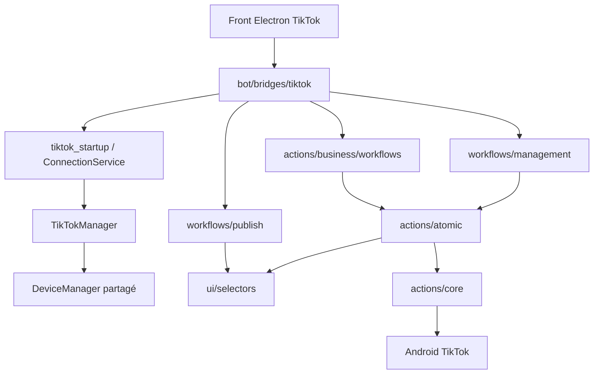
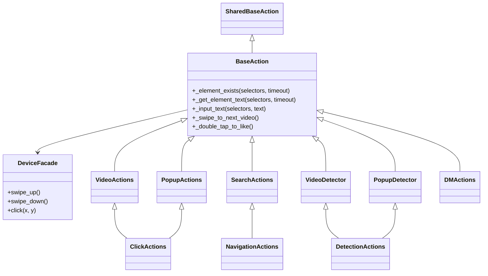
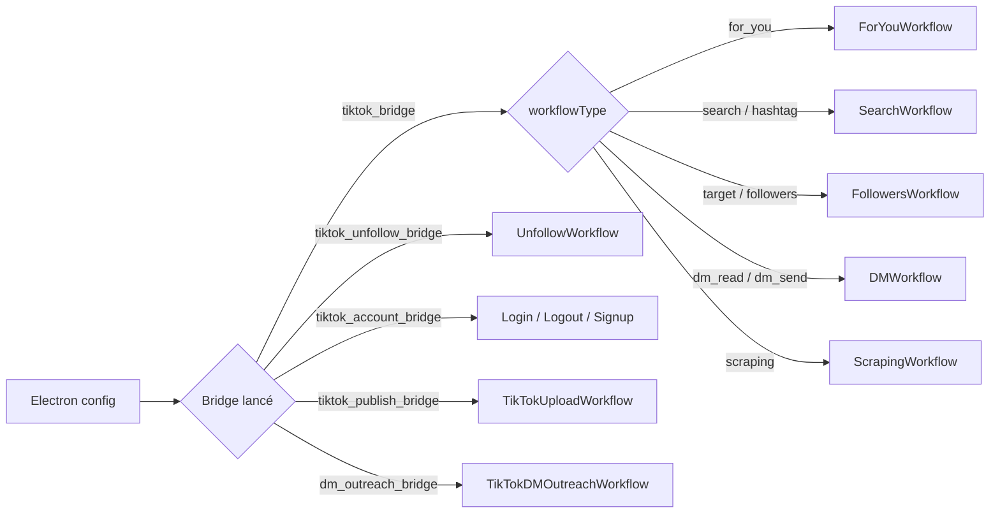
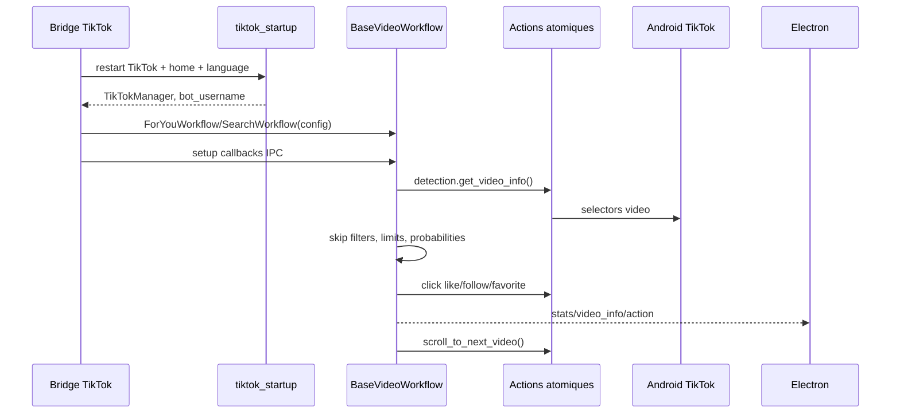

# Module TikTok — Vue d'ensemble

> **Périmètre : `[Bot]`**
> Cette page couvre le code Python situé dans `bot/taktik/core/social_media/tiktok/`. Les fichiers Electron qui déclenchent ces workflows sont seulement cités comme consommateurs ; leur détail vit dans les pages `[Front]`.

Le module TikTok contient la logique métier Android pour automatiser TikTok : lancement de l'application, actions atomiques, workflows vidéo, scraping, DMs, gestion de compte et publication.

Il est consommé par les bridges TikTok documentés dans [Bridges TikTok](../../bridges/tiktok.md).

## Lecture Rapide

| Question | Réponse |
|---|---|
| Qui lance TikTok ? | Les bridges Python de `bot/bridges/tiktok/`, eux-mêmes spawnés par Electron. |
| Qui contrôle Android ? | `TikTokManager` + `DeviceManager` + actions uiautomator2. |
| Où sont les workflows métier ? | `actions/business/workflows/` pour automation, `workflows/management/` pour compte, `workflows/publish/` pour upload. |
| Où sont les gestes atomiques ? | `actions/atomic/` et `actions/core/`. |
| Où sont les sélecteurs ? | `ui/selectors/`, optimisés par `ui/language.py`. |
| Où est la persistance ? | SQLite local via repositories/services, surtout followers, scraping et DMs envoyés. |

## Carte Globale



## Structure Réelle

```text
taktik/core/social_media/tiktok/
├── __init__.py
├── core/
│   └── manager.py
├── actions/
│   ├── core/
│   │   ├── base_action.py
│   │   ├── device_facade.py
│   │   └── utils.py
│   ├── atomic/
│   │   ├── navigation_actions.py
│   │   ├── search_actions.py
│   │   ├── click_actions.py
│   │   ├── video_actions.py
│   │   ├── video_detector.py
│   │   ├── detection_actions.py
│   │   ├── popup_actions.py
│   │   ├── popup_detector.py
│   │   ├── scroll_actions.py
│   │   └── dm_actions.py
│   └── business/
│       ├── actions/
│       │   └── profile_actions.py
│       └── workflows/
│           ├── _internal/
│           ├── for_you/
│           ├── search/
│           ├── followers/
│           ├── scraping/
│           ├── dm/
│           └── unfollow/
├── workflows/
│   ├── management/
│   │   ├── login/
│   │   ├── logout/
│   │   └── signup/
│   └── publish/
│       └── upload_workflow.py
└── ui/
    ├── language.py
    ├── selectors/
    └── detectors/
```

## Séparation Bot / Front

| Couche | Dossier | Responsabilité |
|---|---|---|
| `[Front]` UI | `front/src/features/platforms/tiktok/` | Formulaires, boutons, pages, affichage live. |
| `[Front]` orchestration Electron | `front/electron/handlers/` et process managers | Spawn du bridge Python, passage de config, lecture stdout JSON. |
| `[Bot]` bridge | `bot/bridges/tiktok/` | Validation config, startup device/app, conversion Front -> dataclasses, callbacks IPC. |
| `[Bot]` métier | `bot/taktik/core/social_media/tiktok/` | Actions Android, selectors, workflows, extraction, publication. |
| `[Transversal]` données | SQLite local | Sessions, profils scrapés, interactions, DMs envoyés. |

## Deux Familles De Workflows

Le module contient deux couches de workflows :

| Couche | Emplacement | Rôle |
|---|---|---|
| Workflows business automation | `actions/business/workflows/` | For You, Search, Followers, Scraping, DM, Unfollow. |
| Workflows management/publish | `workflows/management/`, `workflows/publish/` | Login, logout, signup, upload TikTok. |

Cette séparation est importante : les workflows sous `actions/business/workflows/` sont construits autour des actions atomiques TikTok, tandis que `workflows/management/` et `workflows/publish/` sont pilotés par des bridges dédiés (`tiktok_account_bridge`, `tiktok_publish_bridge`).

## `TikTokManager`

`core/manager.py` définit `TikTokManager`, responsable du cycle de vie app TikTok.

| Élément | Détail |
|---|---|
| Base | Hérite de `SocialMediaBase`. |
| Device | Utilise `DeviceManager` historique du module Instagram comme primitive Android partagée. |
| Packages supportés | `com.zhiliaoapp.musically`, `com.ss.android.ugc.trill`, `com.ss.android.ugc.aweme`. |
| Activity | `com.ss.android.ugc.aweme.splash.SplashActivity`. |
| Détection package | `_resolve_package()` teste les packages connus et cache le premier installé. |

### API Principale

| Méthode/propriété | Rôle |
|---|---|
| `package_name` | Retourne le package TikTok détecté ou le défaut. |
| `is_installed()` | Vérifie si une variante TikTok est installée. |
| `is_running()` | Connecte le device et compare l'app foreground aux packages connus. |
| `launch()` | Lance le package détecté. |
| `stop()` | Stoppe le package détecté ou tous les packages connus en fallback. |
| `restart()` | Force-stop + relance propre via `device.app_start(..., stop=True)`. |

## Couche Actions



## Workflows Disponibles

| Workflow | Emplacement | Bridge | Description |
|---|---|---|---|
| For You | `actions/business/workflows/for_you/` | `tiktok_bridge` -> route `workflows/automation/for_you.py` | Scroll feed For You, watch, like, follow, favorite. |
| Search / Hashtag | `actions/business/workflows/search/` | `tiktok_bridge` -> route `workflows/automation/search.py` | Recherche puis traitement de vidéos. |
| Followers | `actions/business/workflows/followers/` | `tiktok_bridge` -> route `workflows/automation/followers.py` | Visite followers de targets et interagit avec leurs profils. |
| Scraping | `actions/business/workflows/scraping/` | `tiktok_bridge` ou `tiktok_scraping_bridge` | Extraction profils target/hashtag avec enrichissement. |
| DM | `actions/business/workflows/dm/` | `tiktok_bridge` -> routes `workflows/engagement/dm_read.py` et `dm_send.py` | Lecture/envoi conversations. |
| DM Outreach | `actions/business/workflows/dm/outreach.py` | `dm_outreach_bridge` | Cold DM cible, avec IPC et dedup SQLite injectes par le bridge. |
| Unfollow | `actions/business/workflows/unfollow/` | `tiktok_unfollow_bridge` -> `bridges.tiktok.automation.unfollow` | Unfollow avec protection amis. |
| Login | `workflows/management/login/` | `tiktok_account_bridge` | Surface routee mais automation non operationnelle : `TikTokLoginWorkflow.execute()` retourne `not_implemented`. |
| Logout | `workflows/management/logout/` | `tiktok_account_bridge` | Déconnexion TikTok. |
| Signup | `workflows/management/signup/` | `tiktok_account_bridge` | Création compte TikTok. |
| Upload | `workflows/publish/upload_workflow.py` | `tiktok_publish_bridge` | Publication média TikTok. |

## Routage De Haut Niveau



Le dispatcher principal ne couvre pas tous les cas. Les flows account, publish, unfollow et cold DM ont des entrypoints dédiés, car leur config, leur mode de lecture et leur cycle de vie diffèrent des workflows vidéo.

## Flux D'un Workflow Vidéo



## Données Et Persistance

| Zone | Tables/services touchés | Usage |
|---|---|---|
| Profil bot TikTok | `get_or_create_tiktok_account()` | Identifie le compte qui automatise. |
| Followers workflow | `create_tiktok_session()`, `end_tiktok_session()`, `has_tiktok_interaction()`, `check_tiktok_recent_interaction()` | Session, anti-doublon, stats finales. |
| Scraping | `SessionRepository`, `TikTokRepository.save_scraped_profile()` | Session de scraping et profils extraits. |
| Cold DM outreach | `SentDMService.check_already_sent()`, `SentDMService.record()` injectes par le bridge | Deduplication des DMs par compte/recipient/platform. |
| Publish/account | Pas de persistence métier directe dans le workflow | Résultat renvoyé via IPC. |

## Langue Et Sélecteurs

`ui/language.py` détecte la langue de l'app depuis les textes/content-desc visibles sur l'écran Home/For You. Ensuite `detect_and_optimize(device)` peut filtrer les sélecteurs localisés dans les dataclasses de `ui/selectors/`.

Cela réduit les faux positifs lorsque TikTok est en français, anglais ou autre langue.

## Particularités TikTok

| Sujet | Détail |
|---|---|
| UI vidéo-first | Les workflows dominants scrollent verticalement des vidéos plein écran. |
| Resource IDs courts | TikTok utilise beaucoup d'IDs cryptiques (`mkq`, `f57`, `hi1`, etc.). |
| Variantes package | Le code supporte Musical.ly, Trill et Aweme. |
| Détection vidéo | Les infos viennent du texte ou du `content-desc` selon la variante. |
| Swipe adapté | `DeviceFacade.swipe_up()` swipe côté gauche pour éviter les boutons like/comment/share. |
| Callbacks bridge | Les workflows business restent testables sans Electron ; les bridges injectent les callbacks IPC. |

## Limites Connues À Garder Visibles

| Sujet | État |
|---|---|
| Login TikTok | `TikTokLoginWorkflow` existe mais retourne `not_implemented` tant que les dumps UI complets ne sont pas collectés. |
| Cold DM outreach | La logique metier vit maintenant dans `actions/business/workflows/dm/outreach.py`; le bridge garde le stdout JSON et l'injection de dedup SQLite. |
| Sélecteurs TikTok | Les resource IDs changent souvent ; chaque ajout doit être centralisé dans `ui/selectors/` avec fallback texte/content-desc. |
| Package clones/régions | Les account/publish bridges savent patcher les selectors via package override ; les workflows vidéo passent surtout par `TikTokManager` et `detect_and_optimize()`. |
