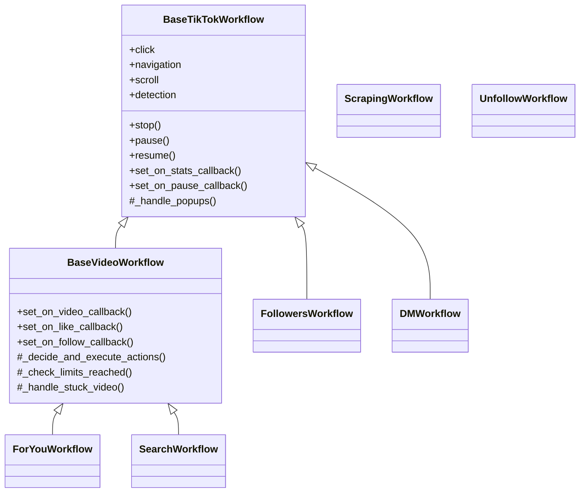
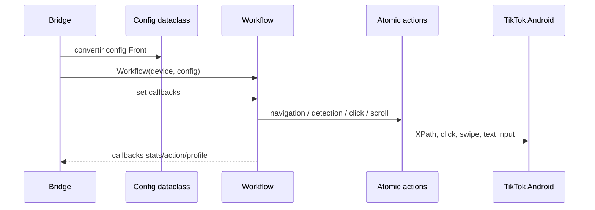
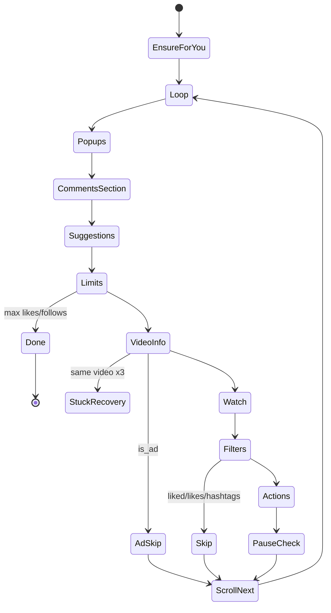
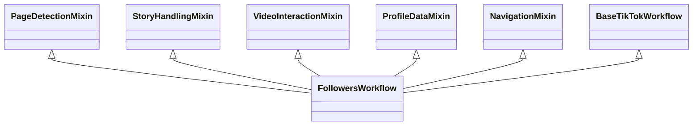
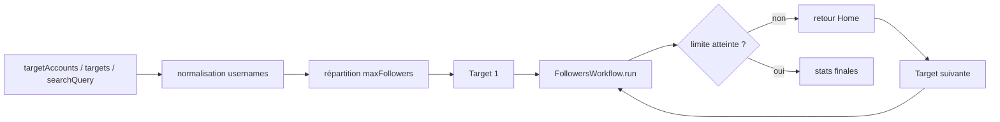
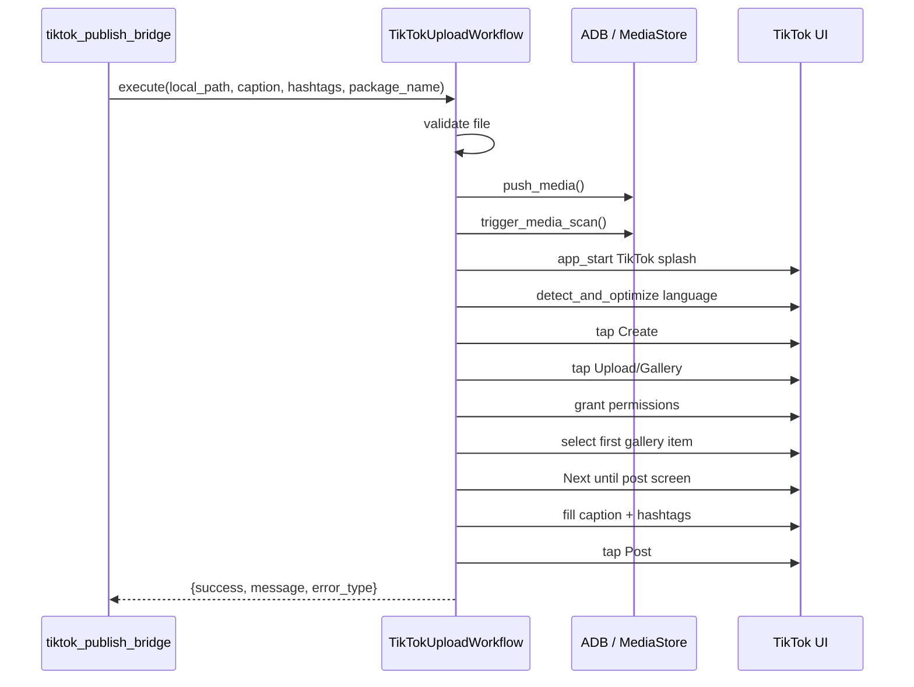

# Workflows TikTok

> **Périmètre : `[Bot]`**
> Cette page décrit les classes Python métier du module TikTok. Pour le lancement depuis Electron et les messages stdout JSON, voir [Bridges TikTok](../../bridges/tiktok.md) et [Workflows TikTok — Vue opérationnelle](../../workflows/tiktok.md).

Cette page documente les workflows métier du module `taktik/core/social_media/tiktok/`.

## Organisation

```text
tiktok/
├── actions/business/workflows/
│   ├── _internal/
│   ├── for_you/
│   ├── search/
│   ├── followers/
│   ├── scraping/
│   ├── dm/
│   └── unfollow/
└── workflows/
    ├── management/
    │   ├── login/
    │   ├── logout/
    │   └── signup/
    └── publish/
        └── upload_workflow.py
```

## Hiérarchie Business



`ScrapingWorkflow` et `UnfollowWorkflow` sont volontairement plus standalone : ils évitent les dépendances IPC et exposent leurs callbacks pour que les bridges branchent progression, stats et persistance.

## Contrat Commun Des Workflows

| Élément | Pattern |
|---|---|
| Lifecycle | `stop()`, `pause()`, `resume()` quand le workflow hérite de `BaseTikTokWorkflow`. |
| Stats | Dataclass avec `to_dict()` ; le bridge transforme ensuite en event IPC. |
| Popups | `PopupHandler.close_all()` via `_handle_popups()` sur les workflows hérités. |
| Actions atomiques | `click`, `navigation`, `scroll`, `detection` injectées par la base. |
| Config | Dataclass par workflow (`ForYouConfig`, `SearchConfig`, etc.). |
| IPC | Pas dans les workflows business purs ; les callbacks sont branchés par le bridge. |



## `_internal`

| Fichier | Rôle |
|---|---|
| `base_workflow.py` | Actions atomiques partagées, lifecycle stop/pause/resume, callbacks stats/pause, popups. |
| `base_video_workflow.py` | Base ForYou/Search : callbacks vidéo, like/follow/favorite, limites, stuck-video recovery. |
| `models.py` | `VideoWorkflowStats`. |
| `popup_handler.py` | Fermeture centralisée des popups. |
| `feed_interruptions.py` | Gestion suggestions/commentaires/interruptions du feed For You. |
| `profile_extractor.py` | Extraction profil depuis l'écran courant pour scraping. |

### `VideoWorkflowStats`

| Champ | Rôle |
|---|---|
| `videos_watched` | Vidéos vues. |
| `videos_liked` | Likes vidéo. |
| `users_followed` | Follows. |
| `videos_favorited` | Favoris. |
| `videos_skipped` | Vidéos ignorées par filtres. |
| `ads_skipped` | Publicités ignorées. |
| `popups_closed` | Popups fermées. |
| `suggestions_handled` | Suggestions/interruption gérées. |
| `errors` | Erreurs. |
| `elapsed_seconds`, `elapsed_formatted` | Temps calculé dans `to_dict()`. |

## For You

Emplacement : `actions/business/workflows/for_you/`.

`ForYouWorkflow(FeedInterruptionsMixin, BaseVideoWorkflow)` automatise le feed For You.

### Config `ForYouConfig`

| Champ | Défaut | Rôle |
|---|---:|---|
| `max_videos` | `50` | Nombre de vidéos à traiter. |
| `min_watch_time` / `max_watch_time` | `2.0` / `8.0` | Temps de visionnage. |
| `like_probability` | `0.3` | Probabilité de like. |
| `follow_probability` | `0.1` | Probabilité de follow. |
| `favorite_probability` | `0.05` | Probabilité de favori. |
| `min_likes` / `max_likes` | `None` | Filtre popularité. |
| `required_hashtags` | `[]` | Hashtags requis. |
| `excluded_hashtags` | `[]` | Hashtags exclus. |
| `max_likes_per_session` | `50` | Limite likes. |
| `max_follows_per_session` | `20` | Limite follows. |
| `pause_after_actions` | `10` | Pause après N actions. |
| `pause_duration_min/max` | `30.0` / `60.0` | Durée pause. |
| `skip_already_liked` | `True` | Ignore vidéos déjà likées. |
| `skip_ads` | `True` | Ignore pubs. |
| `follow_back_suggestions` | `False` | Si `False`, rejette les suggestions follow-back. |

### Flux



### Mapping Bridge -> Config

| Front JSON | Dataclass | Transformation |
|---|---|---|
| `maxVideos` | `max_videos` | valeur directe, défaut `50`. |
| `minWatchTime`, `maxWatchTime` | `min_watch_time`, `max_watch_time` | secondes. |
| `likeProbability`, `followProbability`, `favoriteProbability` | probabilités | division par `100.0`. |
| `requiredHashtags`, `excludedHashtags` | listes hashtags | valeur directe. |
| `minLikes`, `maxLikes` | filtres likes | valeur directe ou `None`. |
| `maxLikesPerSession`, `maxFollowsPerSession` | limites | valeur directe. |
| `skipAlreadyLiked`, `skipAds`, `followBackSuggestions` | booléens | valeur directe. |
| `pauseAfterActions`, `pauseDurationMin`, `pauseDurationMax` | pauses | valeur directe. |

## Search / Hashtag

Emplacement : `actions/business/workflows/search/`.

`SearchWorkflow(BaseVideoWorkflow)` recherche une query, ouvre l'onglet Videos, ouvre la première vidéo, puis traite le feed de résultats.

### Config `SearchConfig`

| Champ | Défaut | Rôle |
|---|---:|---|
| `search_query` | `""` | Requête obligatoire. |
| `max_videos` | `50` | Vidéos à traiter. |
| `min_watch_time` / `max_watch_time` | `2.0` / `8.0` | Watch time. |
| `like_probability` | `0.3` | Like. |
| `follow_probability` | `0.1` | Follow. |
| `favorite_probability` | `0.05` | Favori. |
| `min_likes` / `max_likes` | `None` | Filtres likes. |
| `max_likes_per_session` | `50` | Limite likes. |
| `max_follows_per_session` | `20` | Limite follows. |
| `skip_already_liked` | `True` | Ignore déjà liké. |
| `skip_ads` | `True` | Ignore pubs. |

### Mapping Bridge -> Config

| Front JSON | Dataclass | Transformation |
|---|---|---|
| `searchQuery` | `search_query` | requis en legacy / fallback. |
| `hashtags` | série de `search_query` | optionnel pour `workflowType="hashtag"` ; chaque hashtag est traité séquentiellement. |
| `maxVideos` | `max_videos` | valeur directe. |
| `likeProbability`, `followProbability`, `favoriteProbability` | probabilités | division par `100.0`. |
| `minLikes`, `maxLikes` | filtres likes | valeur directe. |
| `skipAlreadyLiked`, `skipAds` | protections | valeur directe. |

`workflowType="hashtag"` utilise aussi `SearchWorkflow` : le bridge ne crée pas de workflow hashtag séparé, il lance une ou plusieurs recherches vidéo avec les queries reçues (`hashtags[]`, fallback `searchQuery`).

## Followers

Emplacement : `actions/business/workflows/followers/`.

`FollowersWorkflow` est composé par mixins.



### Mixins

| Mixin | Rôle |
|---|---|
| `PageDetectionMixin` | Détecte vidéo, profil, story, liste followers. |
| `StoryHandlingMixin` | Gère les stories ouvertes accidentellement, like story si configuré. |
| `VideoInteractionMixin` | Interactions avec posts du profil : watch, like, favorite, follow. |
| `ProfileDataMixin` | Extraction et sauvegarde des données profil. |
| `NavigationMixin` | Navigation vers liste followers, retour sécurisé, recovery. |

### Config `FollowersConfig`

| Champ | Défaut | Rôle |
|---|---:|---|
| `search_query` | `""` | Username cible. |
| `max_followers` | `50` | Profils à visiter. |
| `posts_per_profile` | `2` | Posts à ouvrir par profil. |
| `min_watch_time` / `max_watch_time` | `5.0` / `15.0` | Watch time par post. |
| `like_probability` | `0.7` | Like post. |
| `comment_probability` | `0.1` | Commentaire. |
| `share_probability` | `0.05` | Share. |
| `favorite_probability` | `0.3` | Favori. |
| `follow_probability` | `0.5` | Follow profil. |
| `story_like_probability` | `0.5` | Like story si rencontrée. |
| `max_likes_per_session` | `50` | Limite likes. |
| `max_follows_per_session` | `30` | Limite follows. |
| `max_comments_per_session` | `10` | Limite comments. |
| `include_friends` | `False` | Inclure `Friends`/`Following`. |
| `skip_private_accounts` | `False` | Skip privés. |
| `max_consecutive_known_usernames` | `150` | Nombre d'usernames connus distincts et consecutifs avant de conclure que la target n'a plus de nouveaux profils accessibles. |

### Persistance

Le workflow utilise `get_local_database()` :

- `get_or_create_tiktok_account(bot_username)`,
- `create_tiktok_session(...)`,
- `check_tiktok_recent_interaction(username, account_id, hours=168)`,
- `has_tiktok_interaction(account_id, username)`,
- `end_tiktok_session(...)`.

Le bridge peut aussi agréger et relayer les stats via `followers_stats`.

### Stop policy usernames connus

`FollowersWorkflow` utilise `taktik/core/social_media/tiktok/services/followers/stop_policy.py`
pour raisonner en usernames distincts rencontres plutot qu'en nombre de scrolls.

| Signal | Sens |
|---|---|
| `new_usernames_seen` | Username encore inconnu dans la session et pas marque comme deja traite. |
| `known_usernames_seen` | Username deja traite dans la session, deja vu en DB, deja interacte ou ignore comme `Friends`/`Following`. |
| `consecutive_known_usernames` | Serie courante d'usernames connus ; reset des qu'un nouveau username eligible est vu. |
| `completion_reason="max_consecutive_known_usernames"` | La target courante est consideree epuisee selon le seuil configure. |

### Flux Multi-Target



Le bridge garde des limites globales (`remaining_likes`, `remaining_follows`) entre targets. Chaque cible reçoit un `FollowersConfig` propre avec sa part de `maxFollowers`.

## Scraping

Emplacement : `actions/business/workflows/scraping/`.

`ScrapingWorkflow` extrait des profils sans interaction.

### Config `ScrapingConfig`

| Champ | Défaut | Rôle |
|---|---:|---|
| `scrape_type` | `target` | `target` ou `hashtag`. |
| `target_usernames` | `[]` | Comptes sources. |
| `target_scrape_type` | `followers` | `followers` ou `following`. |
| `hashtag` | `""` | Hashtag source. |
| `max_profiles` | `500` | Profils à extraire. |
| `max_videos` | `50` | Vidéos à parcourir pour hashtag. |
| `enrich_profiles` | `True` | Ouvre les profils pour enrichir. |
| `max_profiles_to_enrich` | `50` | Limite d'enrichissement. |

### Callbacks

| Setter | Signature | Rôle |
|---|---|---|
| `set_on_status_callback(cb)` | `(status, message)` | Status UI. |
| `set_on_progress_callback(cb)` | `(scraped, total, current)` | Progression. |
| `set_on_profile_callback(cb)` | `(profile)` | Profil extrait. |
| `set_on_save_profile_callback(cb)` | `(profile)` | Persistance DB côté bridge. |
| `set_on_error_callback(cb)` | `(message)` | Erreur. |

### Modes

| Mode | Source | Navigation | Données extraites |
|---|---|---|---|
| `scrape_type="target"` | `target_usernames` | Profil cible -> followers/following | Username, display name, puis enrichissement optionnel. |
| `scrape_type="hashtag"` | `hashtag` | Search `#hashtag` -> vidéos | Auteurs de vidéos, sans enrichissement systématique. |

L'enrichissement ouvre le profil puis appelle `extract_profile_from_screen()` pour remplir followers, following, likes, posts, bio, website, privé/vérifié.

## DM

Emplacement : `actions/business/workflows/dm/`.

`DMWorkflow(BaseTikTokWorkflow)` encapsule `DMActions`.

### Config `DMConfig`

| Champ | Défaut | Rôle |
|---|---:|---|
| `max_conversations` | `20` | Nombre de conversations à lire. |
| `skip_notifications` | `True` | Ignore New followers/Activity/System. |
| `skip_groups` | `False` | Ignore groupes. |
| `only_unread` | `False` | Seulement non-lus. |
| `delay_between_conversations` | `1.0` | Délai lecture/envoi. |
| `delay_after_send` | `0.5` | Délai après send. |
| `mark_as_read` | `True` | Intention de marquer lu. |
| `close_sticker_suggestions` | `True` | Ferme suggestions stickers. |

### Méthodes

| Méthode | Rôle |
|---|---|
| `read_conversations()` | Lit au moins `max_conversations` si possible en scrollant. |
| `send_message(conversation_name, message)` | Ouvre une conversation et envoie. |
| `send_bulk_messages(messages)` | Envoie plusieurs messages. |
| `get_stats()` | Retourne `DMStats`. |

### Données Conversation

`ConversationData.to_dict()` renvoie :

| Champ | Rôle |
|---|---|
| `name` | Nom conversation / utilisateur. |
| `is_group`, `member_count` | Détection groupe. |
| `messages` | Messages texte/stickers visibles. |
| `last_message`, `timestamp` | Métadonnées depuis la liste Inbox. |
| `unread_count` | Nombre non lu si disponible. |
| `can_reply` | Indicateur côté workflow. |

## Unfollow

Emplacement : `actions/business/workflows/unfollow/`.

`UnfollowWorkflow` est une classe standalone sans IPC.

### Config `UnfollowConfig`

| Champ | Défaut | Rôle |
|---|---:|---|
| `max_unfollows` | `20` | Limite. |
| `include_friends` | `False` | Autorise unfollow des mutuals/Friends. |
| `min_delay` / `max_delay` | `1.0` / `3.0` | Délai humain. |
| `max_scroll_attempts` | `10` | Fin si plus de boutons. |

### Callbacks

| Setter | Rôle |
|---|---|
| `set_on_unfollow_callback(cb)` | Événement unfollow. |
| `set_on_skip_callback(cb)` | Skip Friends. |
| `set_on_stats_callback(cb)` | Stats. |

## Management

Emplacement : `workflows/management/`.

| Workflow | Classe | État |
|---|---|---|
| Login | `TikTokLoginWorkflow` | Présent mais automation marquée `not_implemented` tant que les dumps UI complets ne sont pas collectés. |
| Logout | `TikTokLogoutWorkflow` | Déconnexion depuis le bridge account. |
| Signup | `TikTokSignupWorkflow` | Creation compte, utilisee par `tiktok_account_bridge` (`bridges.tiktok.account.account`). |

Point important : `TikTokLoginWorkflow` utilise maintenant le contexte notifier
injecte via `create_workflow_notifier_context`, mais son execution fonctionnelle
reste volontairement bloquee par un retour `error_type="not_implemented"`.

### Signup : États Principaux

| État détecté | Action |
|---|---|
| `gdpr_popup` | Clique `Got it`, puis continue si l'inscription est terminée. |
| `birthday_gate` | Clique le lien inscription. |
| `signup_popup` | Choisit téléphone/email. |
| `birthday_signup` | Règle jour/mois/année via pickers avec feedback live. |
| `phone_email` | Remplit email ou téléphone, sélection pays si demandé. |
| `otp` | Récupère OTP Gmail si possible, SMS non automatisé. |
| `password` | Saisit ou génère un mot de passe valide. |
| `nickname` | Saisit le nickname ou skip. |

## Publish

Emplacement : `workflows/publish/upload_workflow.py`.

`TikTokUploadWorkflow` publie un fichier local sur TikTok.

### Flux



### Dépendances

| Service | Rôle |
|---|---|
| `push_media()` | Copie le média vers `/sdcard/DCIM/Camera/`. |
| `trigger_media_scan()` / `scan_wait_for()` | Rend le média visible dans la galerie Android. |
| `PermissionHandler` | Gère les dialogs Android de permission. |
| `PUBLISH_SELECTORS` | Sélecteurs TikTok de publication. |
| `detect_and_optimize()` | Optimise les sélecteurs selon langue app. |
| `publish_caption.py` | Normalise caption/hashtags et limite TikTok a 5 hashtags. |
| `services/runtime/app_control.py` | Lance et force-stop les packages TikTok via ADB sans exposer les commandes dans le workflow. |
| `services/runtime/package_resolver.py` | Detecte le package TikTok installe quand le bridge n'en impose pas un. |
| `publish_dialogs.py` | Gere permissions Android, popup RGPD/post-publish et confirmation de publication. |
| `publish_navigation.py` | Orchestre les taps Create/Upload, l'ouverture galerie, la selection media et le passage au post screen. |
| `publish_screen_detector.py` | Detecte Home, galerie, camera create, post screen et video editor. |
| `publish_text_input.py` | Gere clear/type caption via Taktik Keyboard puis fallback ADB ASCII. |
| `publish_touch_fallbacks.py` | Isole les taps par coordonnees utilises uniquement en dernier recours. |
| `publish_progress.py` | Lit et filtre le badge de progression TikTok pendant l'upload. |
| `publish_commit.py` | Machine d'etat reutilisable pour attendre la fin de publication. |
| `publish_upload_picker.py` | Lit le dump XML et tape le bouton Upload/Gallery visible par bounds. |
| `publish_hashtag_suggestions.py` | Lit le dump XML et tape la meilleure suggestion de hashtag visible. |
| `ui/xpath.py` | Primitives XPath reutilisables (`find_element`, `tap_element`, `to_lxml`). |
| `ui/detectors/keyboard.py` | Detection et fermeture centralisees du clavier/system overlay. |

Le workflow doit rester l'orchestrateur. Les selectors Android, textes localises,
normalisations de caption, detection package, attente de publication, detection
clavier, navigation publish, saisie texte caption, controle ADB d'application, taps par coordonnees, taps par dump XML et primitives XPath ne doivent pas
etre recodees dans `upload_workflow.py`.

### Frontiere SOLID du publish workflow

- `upload_workflow.py` orchestre les etapes haut niveau : media push, ouverture TikTok, navigation, caption, post, cleanup.
- `publish_caption.py` possede la normalisation caption/hashtags.
- `services/runtime/app_control.py` possede les commandes ADB de lifecycle applicatif (`monkey`, `am start`, `force-stop`).
- `publish_dialogs.py` possede les permissions, popups et confirmations specifiques au publish.
- `publish_navigation.py` possede la navigation publish : Create, Upload, ensure galerie, selection premier media et Next jusqu'au post screen.
- `publish_screen_detector.py` possede les detections d'ecran TikTok publish.
- `publish_text_input.py` possede le clear/type caption via Taktik Keyboard et le fallback `adb input text`.
- `publish_touch_fallbacks.py` possede les coordonnees de secours documentees et testees, uniquement apres echec des selectors/dumps.
- `publish_progress.py` possede la lecture du badge de progression et le parsing de pourcentage.
- `publish_commit.py` possede la boucle d'attente post-publication via callbacks, pour rester testable sans appareil.
- `publish_upload_picker.py` possede l'heuristique de selection du bouton Upload depuis les bounds XML.
- `publish_hashtag_suggestions.py` possede l'heuristique de selection d'une suggestion hashtag depuis les bounds XML.
- `ui/detectors/keyboard.py` possede la detection/fermeture clavier sans tapper la preview.
- `ui/selectors/publish.py` reste la seule source pour selectors, textes Android et marqueurs XML TikTok publish.

## Événements Émis Indirectement

Les workflows business ne parlent pas à Electron directement, mais les callbacks branchés par les bridges produisent ces familles d'events :

| Workflow | Events principaux |
|---|---|
| For You / Search | `video_info`, `action`, `stats`, `pause`, `status`. |
| Followers | `target_switch`, `workflow_start`, `followers_stats`, `action`, `pause`, `status`. |
| Scraping | `scraping_progress`, `scraping_profile`, `scraping_completed`, `status`. |
| DM read/send | `dm_conversation`, `dm_progress`, `dm_stats`, `dm_sent`, `status`. |
| Unfollow | `unfollow_event`, `unfollow_stats`, `status`. |
| Account | `account_result`, `status`, `log`. |
| Publish | `upload_result`, `status`, `log`. |
