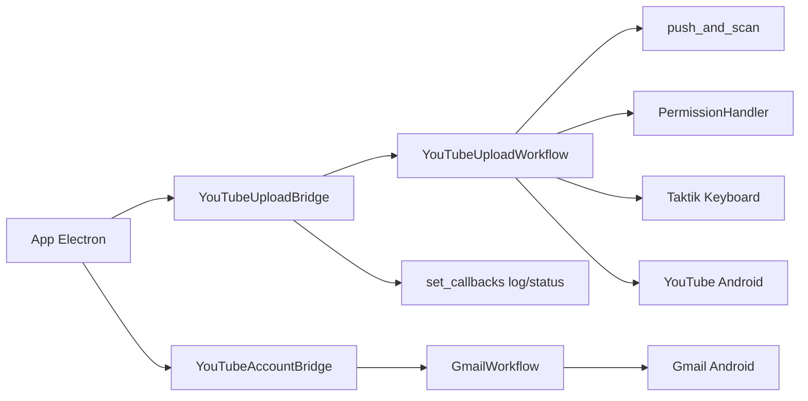
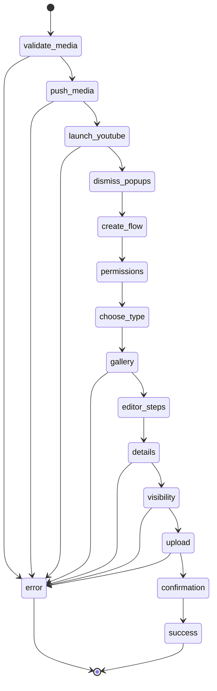
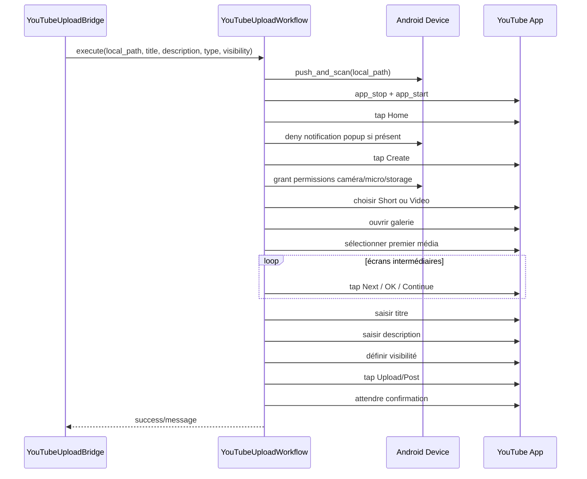
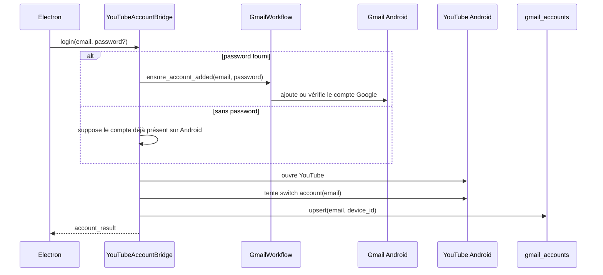

# Module YouTube — Vue d'ensemble

> **Périmètre : `[Bot]`**
> Cette page documente le code Python du module YouTube dans `bot/taktik/core/social_media/youtube/`. L'interface Electron qui déclenche ces opérations est documentée côté `[Front]` dans les pages desktop.

Le module YouTube pilote `com.google.android.youtube` pour publier une vidéo ou un Short depuis un fichier local. La gestion des comptes Google est déléguée au module Gmail et aux bridges YouTube.

Le module est volontairement compact: il contient surtout un workflow d'upload robuste et une grande dataclass de sélecteurs adaptée aux variantes de l'UI YouTube.

## Emplacement

```text
taktik/core/social_media/youtube/
├── __init__.py
├── ui/
│   └── selectors/
│       ├── __init__.py
│       └── upload.py              # UPLOAD_SELECTORS, YOUTUBE_PACKAGE
└── workflows/
    └── publish/
        ├── __init__.py
        └── upload_workflow.py     # YouTubeUploadWorkflow
```

## Rôle dans l'application



Le bridge gère IPC, validation des arguments et retour frontend. Le workflow gère uniquement l'automatisation Android.

## Responsabilités

| Couche | Fichier | Responsabilité |
|---|---|---|
| Bridge upload | `bot/bridges/youtube/publish/upload.py` (`youtube_upload_bridge`) | Lit la config JSON, connecte le device, configure SQLite, injecte les callbacks IPC et retourne `upload_result`. |
| Bridge compte | `bot/bridges/youtube/account/account.py` (`youtube_account_bridge`) | Prepare le compte Google via Gmail puis ouvre YouTube et tente de basculer sur le compte cible. |
| Workflow Bot | `taktik/core/social_media/youtube/workflows/publish/upload_workflow.py` | Automatise l'UI Android YouTube, sans dépendance directe à Electron. |
| Selectors Bot | `taktik/core/social_media/youtube/ui/selectors/upload.py` | Centralise les XPath/resource-id pour Home, Create, Galerie, Details, Visibility et Upload. |
| Core partagé | `taktik/core/shared/*` | Copie média, permissions Android, wait/tap helpers et Taktik Keyboard. |
| Persistance | `GmailAccountRepository` | Le compte YouTube est un compte Google; il est mémorisé dans `gmail_accounts`. |

## Contrat d'entrée bridge

Le workflow n'est normalement pas appelé directement par Electron. Electron lance un bridge Python avec un fichier de config.

```json
{
  "workflowType": "upload_post",
  "deviceId": "DEVICE_ID",
  "localPath": "C:/absolute/path/video.mp4",
  "title": "Titre de la vidéo",
  "description": "Description optionnelle",
  "uploadType": "short",
  "visibility": "public"
}
```

| Champ | Obligatoire | Valeurs | Notes |
|---|---:|---|---|
| `workflowType` | Oui | `upload_post` | Dispatche par le front vers `youtube_upload_bridge`. |
| `deviceId` | Oui | serial ADB | Utilisé par `ConnectionService`. |
| `localPath` | Oui | chemin fichier local | Le bridge vérifie `os.path.isfile()` avant l'automatisation. |
| `title` | Non | string | Saisi sur l'écran Details avec Taktik Keyboard puis fallback. |
| `description` | Non | string | Ouvre l'éditeur description si renseignée. |
| `uploadType` | Non | `short`, `video` | Défaut `short`. |
| `visibility` | Non | `public`, `unlisted`, `private` | Défaut `public`. |

## Événements émis vers Electron

| Type | Émetteur | Moment | Payload principal |
|---|---|---|---|
| `status` | bridge + workflow via callback | Connexion, push média, lancement YouTube, upload, succès/erreur | `status`, `message` |
| `log` | bridge + workflow via callback | Diagnostic, fallback selector, exception détaillée | `level`, `message` |
| `error` | bridge | Validation config, device indisponible, DB impossible | `message` |
| `upload_result` | `youtube_upload_bridge` | Fin d'upload | `success`, `workflow`, `upload_type`, `message`, `error_type` |

Le workflow lui-même retourne un dictionnaire Python. La transformation en événement IPC est faite uniquement dans le bridge.

## API du workflow

```python
workflow = YouTubeUploadWorkflow(device, device_id)
result = workflow.execute(
    local_path="C:/videos/demo.mp4",
    title="Mon Short",
    description="Description",
    upload_type="short",      # "short" ou "video"
    visibility="public",      # "public", "unlisted" ou "private"
)
```

Retour:

```json
{
  "success": true,
  "message": "Short uploaded successfully"
}
```

En cas d'erreur, le workflow retourne `{success: false, message, error_type?}` sans lever l'exception vers le bridge.

## Machine d'état opérationnelle



Cette machine n'existe pas comme enum dans le code; c'est la lecture opérationnelle du flux `execute()`. Elle aide à comprendre les points de reprise et les messages `status`.

## Découplage IPC

`upload_workflow.py` n'importe pas directement `bridges.common.ipc`. Le bridge injecte les callbacks avant l'exécution.

```python
from taktik.core.social_media.youtube.workflows.publish.upload_workflow import (
    YouTubeUploadWorkflow,
    set_callbacks,
)

set_callbacks(log=send_log, status=send_status)
```

Cela garde le workflow testable en usage direct: sans callback, les logs partent seulement vers `loguru`.

## Séquence d'upload



## Étapes internes

| Étape | Code | Notes |
|---|---|---|
| Push média | `push_and_scan()` | Copie dans `/sdcard/DCIM/Camera/` avec préfixe `YT`, puis media scan. |
| Relance YouTube | `app_stop()` + `app_start()` | Évite de reprendre un écran instable. |
| Permissions | `PermissionHandler` | Gère dialogues système Android 9+ et Android 10+. |
| Sélection type | `tab_short` / `tab_video` | `upload_type` contrôle la branche. |
| Galerie | `add_from_gallery`, `gallery_first_item` | Le premier élément est supposé être le média fraîchement poussé. |
| Navigation | `next_button` jusqu'à `title_input` | Jusqu'à 6 rounds pour couvrir les variantes YouTube. |
| Titre/description | `type_with_taktik_keyboard()` | Fallback `set_text()` ou `send_keys()` si nécessaire. |
| Visibilité | `detail_row_visibility`, `visibility_row` | YouTube expose parfois les options sans texte, donc sélection positionnelle. |
| Confirmation | `upload_done` | Snackbar, message de processing ou lien "Voir la vidéo". |

## Dépendances core utilisées

| Helper | Origine | Usage dans YouTube |
|---|---|---|
| `push_and_scan()` | `taktik.core.shared.media` | Copie le fichier dans le stockage Android puis force l'indexation MediaStore. |
| `PermissionHandler` | `taktik.core.shared.device.permissions` | Grant caméra, micro, stockage et fichiers après les écrans qui déclenchent des prompts Android. |
| `wait_for_any()` | `taktik.core.shared.device.wait` | Attend une famille de XPath en gardant les logs détaillés. |
| `try_tap()` | `taktik.core.shared.device.wait` | Tap robuste avec fallback entre plusieurs selectors. |
| `type_with_taktik_keyboard()` | `taktik.core.shared.input.keyboard` | Saisie fiable des textes avec caractères spéciaux. |
| `clear_text_with_taktik_keyboard()` | `taktik.core.shared.input.keyboard` | Nettoyage du champ titre avant saisie. |

## Sélecteurs YouTube

`UploadSelectors` regroupe tous les XPath nécessaires à l'upload.

| Champ | Usage |
|---|---|
| `home_tab` | Revenir sur l'accueil YouTube. |
| `notification_cancel` | Fermer le dialogue in-app de notifications. |
| `create_button` | Bouton `+` / `Create` de la bottom nav. |
| `tab_short`, `tab_video` | Choix du type de publication. |
| `add_from_gallery` | Entrée galerie, avec variantes Android/YouTube/Samsung. |
| `gallery_first_item` | Premier média visible dans la galerie. |
| `next_button` | Transitions galerie, trim, editor, détails. |
| `title_input` | Champ titre ou caption. |
| `detail_row_description`, `description_edittext` | Ouverture et saisie de la description. |
| `detail_row_visibility` | Ligne de visibilité dans l'écran détails. |
| `visibility_row` | Options `public`, `unlisted`, `private`. |
| `upload_button` | Bouton final `Upload`, `Post`, `Publier`, `Mettre en ligne`. |
| `upload_done` | Confirmation ou état de processing. |

Les listes sont ordonnées du plus spécifique au plus générique: resource-id confirmé, content-desc, texte, puis fallback positionnel.

## Familles de selectors

| Famille | Champs | Pourquoi c'est séparé |
|---|---|---|
| Navigation | `home_tab`, `create_button`, `next_button` | Ces boutons existent dans plusieurs écrans et changent de resource-id selon version YouTube. |
| Permissions/popups | `notification_cancel` + `PermissionHandler` | YouTube mélange prompts système Android et dialogues in-app. |
| Media picker | `tab_short`, `tab_video`, `add_from_gallery`, `gallery_first_item` | Le chemin Short et le chemin Video ne partagent pas toujours les mêmes écrans. |
| Details | `title_input`, `detail_row_description`, `description_edittext` | La description est souvent dans un sous-écran plein écran. |
| Visibility | `detail_row_visibility`, `visibility_screen_indicator`, `visibility_row`, `visibility_back_button` | Certaines lignes YouTube sont détectées par position plus que par texte. |
| Confirmation | `upload_button`, `upload_done` | Le bouton final peut s'appeler `Upload`, `Post`, `Publier` ou `Mettre en ligne`. |

## Compte Google et lien Gmail

YouTube ne gère pas un compte local indépendant. Le bridge compte applique cette règle :



Le repository utilisé est `GmailAccountRepository`, même quand l'opération vient de YouTube. C'est volontaire: la source réelle est le compte Google Android.

## Points de vigilance

| Sujet | Détail |
|---|---|
| UI YouTube variable | Les écrans diffèrent fortement entre Short camera, upload classique et device Samsung/Nokia. |
| Visibilité | Certaines options ne donnent ni `text` ni `content-desc`; le workflow utilise des positions dans le `ScrollView`. |
| Permissions | Elles peuvent apparaître après `Create`, après le choix Short, ou après `Add from gallery`. |
| Clavier | Le workflow utilise Taktik Keyboard pour éviter les problèmes de caractères et de focus. |
| Confirmation | L'absence de snackbar ne veut pas forcément dire échec: YouTube peut continuer le traitement en arrière-plan. |
| Logout YouTube | Le bridge ouvre les paramètres Android; la suppression complète nécessite confirmation utilisateur. |
| `bridges/youtube/workflows/dispatcher.py` | Dispatcher historique incomplet: `watch_feed` et `search` renvoient encore "not implemented". Les flux actifs passent par les bridges spécialisés. |
| Quotas | Le module YouTube Bot ne contient pas de quota local d'actions. Toute limite produit/licence éventuelle est extérieure à ce workflow. |

`watch_feed` et `search` ne doivent donc pas etre documentes comme des workflows
YouTube disponibles. Ils restent des TODO dans le dispatcher legacy
`bridges/youtube/workflows/dispatcher.py`; les chemins actifs passent par
`youtube_account_bridge`, `youtube_upload_bridge` et `youtube_action_test_bridge`.

## Bridges concernés

| Bridge | Rôle |
|---|---|
| `bridges/youtube/publish/upload.py` (`youtube_upload_bridge`) | Lance `YouTubeUploadWorkflow.execute()` et transmet logs/status au front. |
| `bridges/youtube/account/account.py` (`youtube_account_bridge`) | Ajoute ou verifie le compte Google via Gmail. |
| `bridges/youtube/diagnostics/action_test.py` (`youtube_action_test_bridge`) | Outil de test/debug des actions et selecteurs YouTube. |

Voir aussi:

- [Bridge YouTube](../../bridges/youtube.md)
- [Module Gmail](../gmail/overview.md)
- [Services communs des bridges](../../bridges/common-services.md)
