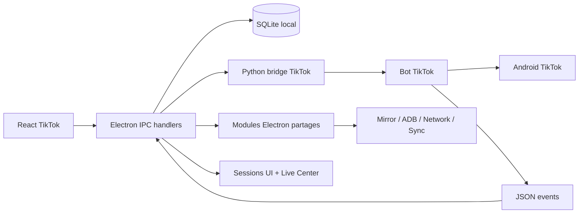

# TikTok - Documentation Bot + Electron

Cette Docsify est la documentation de travail TikTok. Elle rassemble le chemin complet TikTok : UI Electron, handlers IPC, bridge Python, Bot TikTok, upload/publish, scraping, DM, scheduler, Live Center, network pools, SQLite et sync.

Elle duplique volontairement certains modules partages. Quand on travaille TikTok, on veut voir les dependances TikTok dans leur contexte, meme si le code est partage avec Instagram ou d'autres plateformes.

## Regle d'utilisation

Avant de developper une feature TikTok non triviale, lire dans cet ordre :

1. [Architecture TikTok](architecture.md)
2. [Runtime Electron](electron-runtime.md)
3. [Runtime Bot Python](bot-runtime.md)
4. [Bridges TikTok](bridges.md)
5. [Selectors et compat](selectors.md)
6. [Workflows TikTok](workflows.md)
7. [Scheduler, sessions et Live](scheduler-sessions-live.md)
8. [Contrats donnees et sync](data-contracts.md)
9. [Modules partages a reutiliser](shared-modules.md)
10. [Debug et compatibilite](debug-compat.md)
11. [Audit qualite et refactor](quality-audit.md)
12. [Template feature](feature-spec-template.md)

Ce flux devient notre garde-fou contre les regressions : publish qui ne suit pas l'upload reel, scheduler qui stoppe mal, session stale, SQL dans un handler, selectors non versionnes, ou sync qui annonce fini mais laisse des donnees manquantes.

## Carte rapide

## Parcours rapides

| Besoin | Lire |
|---|---|
| Comprendre le chemin end-to-end | [Architecture TikTok](architecture.md) |
| Modifier le front ou un handler | [Runtime Electron](electron-runtime.md) |
| Modifier selectors/actions/workflows | [Runtime Bot Python](bot-runtime.md) |
| Corriger un selector | [Selectors et compat](selectors.md) |
| Comprendre les bridges | [Bridges TikTok](bridges.md) |
| Suivre manuel/scheduler/live | [Scheduler, sessions et Live](scheduler-sessions-live.md) |
| Ajouter une table ou un champ | [Contrats donnees et sync](data-contracts.md) |
| Savoir quoi reutiliser | [Modules partages](shared-modules.md) |
| Diagnostiquer dump/mirror/compat | [Debug et compatibilite](debug-compat.md) |
| Chercher de la dette ou un refactor | [Audit qualite](quality-audit.md) |
| Preparer une nouvelle feature | [Template feature](feature-spec-template.md) |

## Chantiers transverses

- [Suivi refactor Bot core](bot-core-refactor-tracker.md)

## Pages de synthese conservees

- [Bot, bridges et UI](bot-and-bridges.md)
- [Workflows, publish et Live](workflows-and-live.md)
- [Reseau, IP et safety](network-and-safety.md)
- [Donnees, sync et debug](data-and-debug.md)

## Principe d'autonomie

Cette docsify doit rester lisible seule. Si une page TikTok a besoin d'un concept transversal, on le resume ici dans le contexte TikTok au lieu de forcer un aller-retour vers la doc principale.
