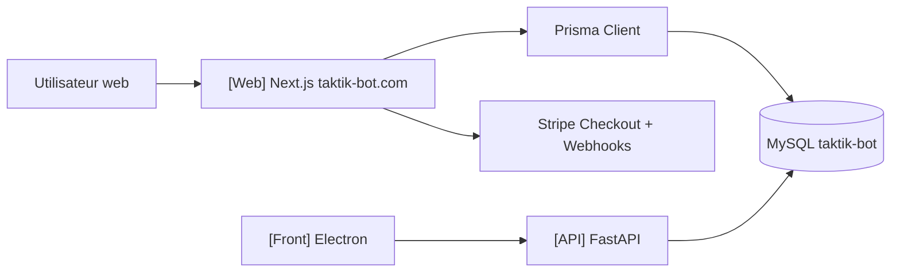
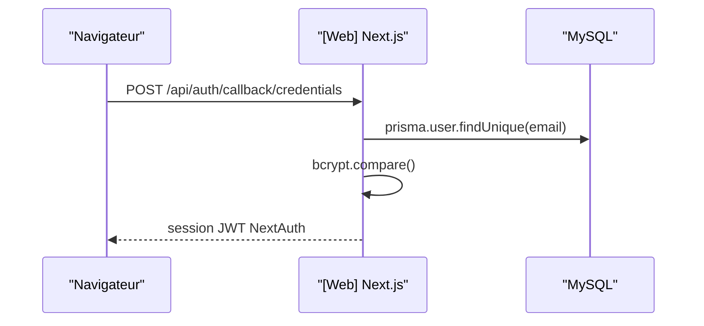
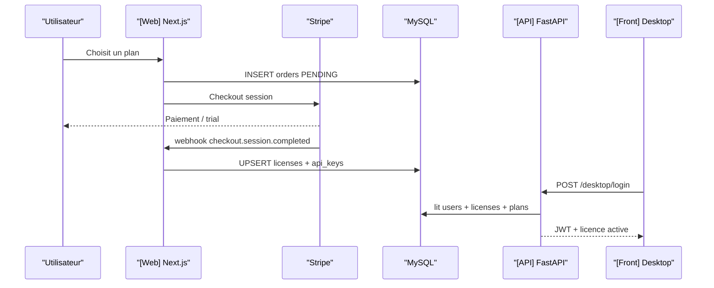
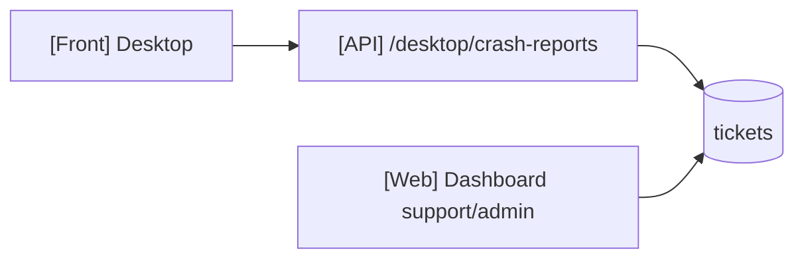

# [Web] Site Next.js taktik-bot.com

## Perimetre

Cette page documente le projet `taktik-bot/`, le site commercial TAKTIK.

Son role dans le monorepo :

- vitrine marketing multilingue ;
- authentification utilisateur ;
- dashboard client ;
- gestion des licences et plans ;
- paiement Stripe ;
- webhooks Stripe ;
- support/tickets ;
- blog/docs publiques ;
- administration ;
- source de verite MySQL consommee aussi par `taktik-api/`.



## Stack

| Element | Tech |
|---|---|
| Framework | Next.js 15 App Router |
| Runtime UI | React 19 |
| Auth | NextAuth v4 + Prisma Adapter + Credentials |
| ORM | Prisma 5 |
| DB | MySQL |
| Paiement | Stripe |
| UI | Tailwind, Radix, composants locaux |
| i18n | `next-intl`, `messages/*.json` |
| Email | Nodemailer/services email |
| Analytics | Google Analytics / Search Console |
| Tests | Vitest |

Scripts principaux dans `package.json` :

| Commande | Role |
|---|---|
| `npm run dev` | `next dev --turbopack` |
| `npm run build` | build Next avec memoire Node augmentee |
| `npm run start` | serveur Next production |
| `npm run lint` | ESLint |
| `npm run test` | Vitest |
| `npm run prisma:seed` | seed Prisma |
| `npm run seed:plans` | seed plans de licence |

## Structure principale

| Chemin | Role |
|---|---|
| `prisma/schema.prisma` | schema MySQL source |
| `src/app/[locale]/` | pages publiques et dashboard localises |
| `src/app/api/` | routes API Next.js |
| `src/lib/auth/` | NextAuth, guards, roles |
| `src/lib/stripe/` | Stripe checkout, webhooks, prix |
| `src/services/license/` | creation/validation licence, API keys |
| `src/services/checkout/` | orchestration checkout |
| `src/lib/blog/` | blog/posts/translations |
| `src/lib/analytics/` | stats admin, GA, Search Console |
| `messages/` | traductions FR/EN |
| `docs/` | documentation interne du site |

## Relation avec les autres projets

| Projet | Interaction |
|---|---|
| `taktik-api/` | lit/ecrit la base MySQL du site pour login desktop, licences, devices, tickets, Turso |
| `front/` | utilise l'API FastAPI pour auth/licence ; pas d'appel direct obligatoire au site |
| `bot/` | ne depend pas directement du site ; il recoit les droits via Electron/API |
| `taktik-bot/` | possede Prisma et les flux Stripe qui creent/maintiennent les licences |

## Base MySQL source

Le schema Prisma contient les familles suivantes :

| Famille | Tables |
|---|---|
| Auth NextAuth | `users`, `accounts`, `sessions`, `verification_tokens` |
| Blog/docs | `posts`, `post_translations`, `categories`, `category_post`, `tags`, `tag_post`, `comments` |
| Contact | `contact_messages`, `contact_replies` |
| Licences | `license_plans`, `licenses`, `license_devices`, `license_usage` |
| Paiements | `orders` |
| API keys | `api_keys`, `api_key_usage` |
| Support | `tickets`, `ticket_messages`, `ticket_attachments` |
| Discord | `discord_verifications` |
| App metrics | `app_metrics` |
| Admin/system | `system_settings`, `admin_messages`, `notifications`, `email_logs`, `audit_logs` |
| Growth | `sponsored_invitations`, `trial_campaigns`, `leads`, `lead_actions` |
| Sync | `turso_sync_configs` |

Ces tables ne sont pas le SQLite local. Elles sont la base serveur du site et de l'API distante.

## Auth web

Fichier cle :

```text
taktik-bot/src/lib/auth/auth-options.ts
```

NextAuth utilise :

- `PrismaAdapter(prisma)` ;
- `CredentialsProvider` email/password ;
- verification bcrypt ;
- session strategy JWT ;
- `maxAge` de 30 jours ;
- role utilisateur ajoute a la session.



## Licences et Stripe

Fichier cle :

```text
taktik-bot/src/lib/stripe/stripe-license.ts
```

Fonctions majeures :

| Fonction | Role |
|---|---|
| `syncLicensePlanWithStripe()` | cree/met a jour produit et prix Stripe pour un plan |
| `syncAllLicensePlansWithStripe()` | synchronise tous les plans actifs |
| `createLicenseCheckoutSession()` | cree une commande locale + session Stripe Checkout |
| `handleStripeWebhook()` | route les events Stripe vers les handlers internes |
| `handleCheckoutSessionCompleted()` | cree/met a jour licence, role client, API key, email |
| `handleInvoicePaymentSucceeded()` | renouvelle/reactive une licence |
| `handleInvoicePaymentFailed()` | suspend une licence |
| `handleSubscriptionUpdated()` | met a jour plan/status/trial |
| `handleSubscriptionDeleted()` | expire une licence |



## API routes Next.js

Le site expose beaucoup de routes `src/app/api/**/route.ts`.

| Famille | Exemples | Role |
|---|---|---|
| Auth | `/api/auth/[...nextauth]`, `/api/auth/register`, `/api/auth/forgot-password`, `/api/auth/reset-password`, `/api/auth/verify` | comptes web |
| Checkout | `/api/checkout/create-session`, `/api/checkout/create-dynamic-session`, `/api/checkout/verify-session` | paiement Stripe |
| Webhooks | `/api/webhooks/stripe` | source de verite abonnement/licence |
| Licences | `/api/licenses`, `/api/licenses/validate`, `/api/license-plans`, `/api/license-plans/sync-stripe` | plans et licences web |
| Bot/API keys | `/api/bot/status`, `/api/bot/api-key`, `/api/bot/regenerate-api-key`, `/api/validate-api-key` | compat bot/API key |
| User dashboard | `/api/user/license`, `/api/user/api-keys`, `/api/user/invoices`, `/api/user/tickets` | espace client |
| Admin | `/api/admin/*` | licences, users, tickets, metrics, maintenance, emails |
| Blog | `/api/blog/posts`, `/api/blog/categories`, `/api/blog/tags`, `/api/blog/comments` | contenu |
| Contact/support | `/api/contact`, `/api/contact/[id]/reply` | contact public |
| Trial/growth | `/api/trial/*` | campagnes trial |
| Analytics | `/api/analytics/google-analytics`, `/api/analytics/search-console` | stats admin |
| System | `/api/maintenance-status`, `/api/revalidate`, `/api/docs` | support site |

## Flux support/crash

Les tickets peuvent venir :

- du site web via les pages support ;
- de l'API FastAPI quand le desktop envoie un crash report.



## Distinction Web / API

| Sujet | Responsable |
|---|---|
| Creation compte web | `[Web]` |
| Session dashboard | `[Web]` |
| Stripe checkout/webhooks | `[Web]` |
| Creation/renouvellement/suspension licence | `[Web]` |
| Login desktop JWT 7 jours | `[API]` |
| Verification device Android | `[API]` |
| Updates Electron/APKs | `[API]` |
| Execution workflow Android | `[Bot]` lance par `[Front]` |
| Donnees d'automation | SQLite local |

## Points d'attention

| Zone | Note |
|---|---|
| MySQL partagee | Le site est proprietaire du schema Prisma ; l'API FastAPI lit/ecrit certaines tables directement. |
| `maxActionsPerDay` | Encore present dans les plans/licences/API keys, mais l'automation active est maintenant locale cote SQLite. |
| Stripe | Les licences payantes suivent les webhooks Stripe ; ne pas expirer manuellement une licence payante depuis l'API FastAPI. |
| API keys | Le site genere des API keys liees aux licences ; le desktop moderne utilise surtout JWT + API FastAPI. |
| Docs publiques | Le dossier `taktik-bot/docs/` documente le site lui-meme ; la documentation technique transverse canonique vit dans `taktik-docs`. |

## Lecture croisee

| Pour comprendre | Lire aussi |
|---|---|
| Login desktop | `../../technical/api-current-state.md` |
| Licence/device desktop | `../../technical/api-current-state.md` |
| SQLite local | `database/schema.md` |
| Flux Electron -> Bot | `bridges/architecture.md` |
| Sync Turso | `architecture/sync-cross-device.md` |
